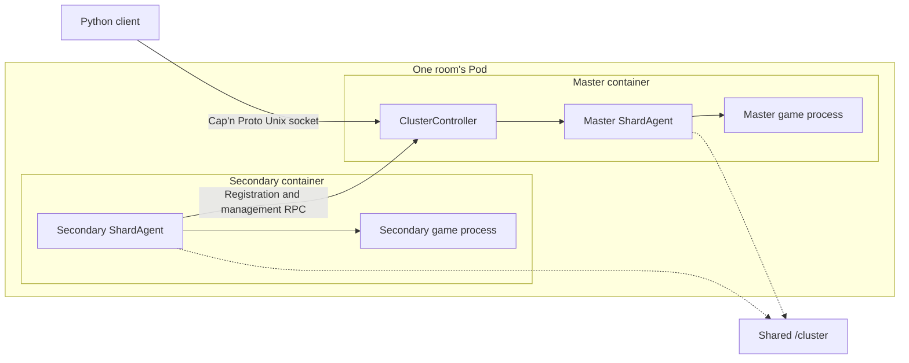
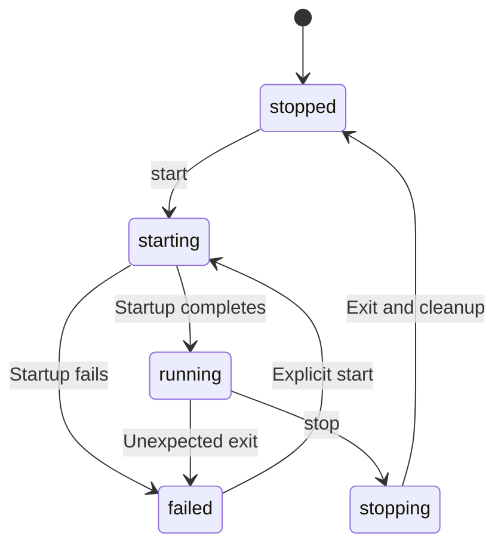
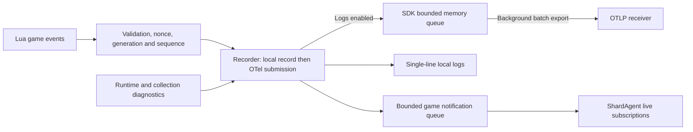

# Don't Starve Together Dedicated Server

[](https://steamcommunity.com/groups/lst99)
[](https://discord.gg/4N3aeNsFt8)

English | [简体中文](README.zh-Hans.md)

Deploy and manage Don't Starve Together (DST) servers with Podman, systemd, and a Python SDK.
Each room runs in one Pod, with a long-lived Agent container managing each shard's game process.
The master container coordinates the cluster.
The default image is `quay.io/wh2099/dst-server:latest`; use `:beta` for the test channel.

- **Deploy**: generate game configuration and Quadlet units for forests, caves, and shared Mods.
- **Manage**: query players and worlds, save, roll back, restart, and administer games through local RPC.
- **Record**: collect game events as needed, using local logs or OTLP Logs export.

## Contents

Start with [Quick start](#quick-start), then jump to the task you need.
Both languages include the complete module documentation.

| Module | Common tasks |
| --- | --- |
| [Configuration and deployment](#configuration-and-deployment) | [Directory layout](#directory-layout) · [Ports](#shards-and-ports) · [World settings](#world-settings) · [Configuration SDK](#configuration-sdk) · [Permissions](#container-users-and-directory-permissions) · [DNS](#container-dns) |
| [Unified CLI](#unified-cli) | Room creation, configuration, templates, selection, and JSON output |
| [Routine maintenance](#routine-maintenance) | Image updates, console and logs, schedules, and maintenance tasks |
| [Runtime](#runtime) | [Components and communication](#components-and-communication) · [Lifecycle](#lifecycle-and-failure-recovery) · [Save confirmation](#saving-and-world-reloads) · [Timeouts](#default-timeouts) |
| [RPC and game SDK](#rpc-and-game-sdk) | [Connection example](#connecting-to-a-cluster) · [Shared requests](#shared-requests-and-validation) · [API index](#api-index) · [Emoji and Emote](#emoji-and-emote-enums) |
| [Saves and exports](#saves-and-exports) | [File reference](#save-files) · [Snapshots and rollback](#snapshot-queries-and-rollback-by-day) · [Exports and R2](#exports-and-r2-uploads) |
| [Mod management](#mod-management) | [Native updates](#native-mod-updates) · [Downloads and activation](#declaring-downloads-and-activation) |
| [Telemetry and historical logs](#telemetry-and-historical-logs) | [Collection scope](#collection-scope) · [OTLP](#otlp-configuration) · [Delivery](#in-memory-delivery) · [Log boundaries](#log-boundaries) · [Netdata](#netdata-deployment-and-queries) · [Troubleshooting](#telemetry-troubleshooting) |
| [Utilities](#utilities) | Klei services, player path encoding, Lua annotations |
| [Development and validation](#development-and-validation) | [Module boundaries](#module-boundaries), dependencies, check commands, source index |

## Quick Start

You need Linux, Podman with Quadlet support, systemd, and [uv](https://docs.astral.sh/uv/getting-started/installation/).
The project requires Python `>=3.14.7`.
Mod updater cleanup relies on the [Python 3.14.7 process-wait fix](https://github.com/python/cpython/pull/154171).
The host CLI manages system services; run deployment commands as root on the server, including over SSH.

1. Install the package with host management support and create a token on the [Klei server page](https://accounts.klei.com/account/game/servers?game=DontStarveTogether).

   ```shell
   uv tool install --python 3.14 'dst-server[host]'
   export DST_SERVER_CLUSTER_TOKEN='replace-with-cluster-token'
   dst-server --help
   ```

2. Create one room, choosing its template independently of its number.

   ```shell
   dst-server template list
   dst-server room create 299 --template forge --max-players 9 \
     --volume-idmap 'uids=0-1000-1;gids=0-1000-1'
   ```

   This creates `/srv/dst/299` and its Quadlet units without starting the room or overwriting existing files.
   Use `--token-file /run/secrets/dst_cluster_token` to read a token file instead of the environment variable.
   The default volume mapping is unset; the explicit rootful mapping above lets container UID `1000` use root-owned files.
   Use `pure_survival` for a forest-and-caves room or any other name from `template list`.

3. Start the room and inspect its logs.

   ```shell
   dst-server room start 299
   dst-server room status 299
   dst-server logs --room 299 --lines 100 --follow
   ```

   Startup checks the image, prepares Mods, generates missing worlds, and waits for game readiness.
   Use `--no-wait` to submit a start without waiting, or `room wait 299` to wait separately.
   Rooms created this way use local journald logs; the LST fleet preset additionally configures Netdata export.

From a checkout, use `uv run --extra host dst-server ...` or `uv run --extra host python -m dst_server ...`.
Both installed entry points expose the same CLI; no subcommand displays help.
See [permissions](#container-users-and-directory-permissions) for rootless generation with the SDK.

### Unified CLI

| Command | Purpose |
| --- | --- |
| `room` | Create, inspect, edit, start, stop, restart, wait, and diagnose rooms. |
| `template`, `deployment` | Inspect or apply gameplay templates, create the LST fleet, and install automation units. |
| `schedule`, `maintenance` | Opening hours, idle recycling, and in-service countdown restarts. |
| `announce`, `player`, `world`, `mod` | Announcements, players and permissions, saves and worlds, and Mod configuration. |
| `console`, `logs`, `rpc` | Lua evaluation, retained journal logs, method discovery, direct calls, and live subscriptions. |
| `scripts` | Build and verify managed native script bundles. |
| `agent`, `annotations`, `completion` | Container process entry points, Lua annotations, and shell completion output. |

The default directories are `/srv/dst` and `/etc/containers/systemd`.
Override them with `--cluster-root` / `--quadlet-dir` or `DST_SERVER_CLUSTER_ROOT` / `DST_SERVER_QUADLET_DIR`.
Place global options before the command:

```shell
dst-server --cluster-root /srv/dst --quadlet-dir /etc/containers/systemd --json room list
dst-server room stop 000-029,060-069,299
dst-server room edit 000-029,060-069 --max-players 9
dst-server room edit 299 --set '/cluster/settings/cluster_description="Friday games"'
dst-server room start 000-029,060-069,299
dst-server room show 299 --field /cluster/settings/max_players
dst-server room schema
dst-server announce 'Maintenance starts in eight minutes.' --room 299
dst-server world snapshots --room 299 --limit 10
dst-server world save --room 299
```

`room` commands take positional room numbers; other groups use `--room`.
Selections accept comma-separated numbers, inclusive ranges, `--template`, or explicit `--all` where supported.
`room list` discovers three-digit room directories containing `cluster.ini`; operations require a target selection.
Batch operations report each room independently and return a nonzero exit status if any room fails.
Non-terminal stdout defaults to compact single-line JSON; `--json` also selects it in a terminal.
Continuous streams emit one JSON object per record.
Logs and diagnostics go to stderr, with embedded newlines escaped in non-terminal output.
`room edit --set` accepts JSON Pointer assignments with JSON values, and `--unset` removes an explicit setting.
`room edit`, `template apply`, `mod enable/disable/set`, and `schedule set` require stopped rooms.
Management policy changes follow the same rule.
Run `room stop` before editing and `room start` explicitly afterward.
Changing world-generation settings does not replace an existing world; `world regenerate` does.

### LST Fleet Layout

The LST deployment preset contains 116 rooms: `000–099` and `200–215`.

```shell
dst-server deployment lst --room 000,030,209 \
  --volume-idmap 'uids=0-1000-1;gids=0-1000-1'
dst-server room stop 299
dst-server template apply forge --room 299
dst-server room start 299
```

Use `deployment lst --all` for all preset rooms; creation refuses existing rooms.
Daily windows use host local time: 白饭 10:00–18:00, 晚宴 18:00–00:00, and 夜饮 00:00–08:00.

| Gameplay | Always open | 白饭 | 晚宴 | 夜饮 |
| --- | --- | --- | --- | --- |
| Pure survival | `000–015` | `016–019` | `020–027` | `028–029` |
| Pure endless | `030–045` | `046–049` | `050–057` | `058–059` |
| Semi-vanilla survival | `060–065` | `066` | `067–068` | `069` |
| Semi-vanilla endless | `070–085` | `086–089` | `090–097` | `098–099` |

All special rooms are always open:

| Room numbers | Gameplay |
| --- | --- |
| `200–204` | AFK skin drops |
| `205` | Adventure |
| `206` | Gorge |
| `207–209` | Forge |
| `210–212` | Island Adventure |
| `213–215` | Hamlet |

Generic templates support any slot in `000–299`, including `lights_out_survival` and `lights_out_endless`.
Existing rooms are read directly from their native files.
Template application explicitly replaces gameplay, world, and Mod configuration.
It retains the room number, name, description, password, token, shared key, and deployment settings.
Templates never update existing rooms automatically.
Core generation and maintenance code ships in the package and is callable through the async SDK.

## Configuration and Deployment

Game configuration and Quadlet units jointly define directories, shards, and networking.
Keep them consistent when making changes.

### Directory Layout

Each cluster uses one host directory, mounted as `/cluster` in every shard container.
The game is installed at `/install` inside the image.

```text
cluster/
├── .dst-control.json  (optional)
├── cluster.ini
├── cluster_token.txt
├── adminlist.txt / blocklist.txt / whitelist.txt
├── mods/
│   ├── dedicated_server_mods_setup.lua
│   ├── modsettings.lua
│   └── ugc/
├── forest/
│   ├── server.ini
│   ├── worldgenoverride.lua
│   ├── modoverrides.lua
│   └── save/
└── cave/
    └── Same shard files as forest
```

| File or path | Contents |
| --- | --- |
| `cluster.ini` | Cluster name, access restrictions, player count, gameplay, and shard connections. |
| `cluster_token.txt` | Klei dedicated server token. |
| The three permission lists | Administrators, bans, and whitelist entries, one identifier per line. |
| `<shard>/server.ini` | Shard identity, player and Steam query ports, and player save path encoding. |
| `<shard>/worldgenoverride.lua` | World generation and world setting overrides. |
| `<shard>/leveldataoverride.lua` | Optional full level baseline, required for event worlds. |
| `<shard>/modoverrides.lua` | Mods enabled on the shard and their options. |
| `<shard>/save/` | World and player snapshots plus supporting data; see [Save files](#save-files). |
| `mods/` | Shared download list, Mod content, and cache; see [Mod management](#mod-management). |
| `.dst-control.json` | Room policy (`template`, `schedule`, `recycle`, `paused`) and the latest activity checkpoint; no game or deployment configuration. |
| `.dst-server.sock` | Cluster RPC socket, created at runtime. |
| `.dst-operation.lock` | One short-lived host operation lock; its empty file remains after unlocking. |
| `<shard>/dst_server_driver.json` | Per-process Lua startup parameters, including the nonce and telemetry settings. |

Native INI/Lua files and Quadlet units, including systemd drop-ins, are the configuration sources.
There is no additional persisted room definition.
Without `.dst-control.json`, a room has no schedule or automatic recycling.
Startup reads existing files and prepares Mods; it does not regenerate game configuration.
`cluster.ini`, `cluster_token.txt`, and each enabled shard's `server.ini` must exist, with exactly one master shard.
Only subdirectories containing `server.ini` are enabled shards.
Removing a shard preserves its directory, other configuration, and saves; adding it again can reuse the saves.
Configuration and shard directories cannot be symlinks.
Preparation creates missing permission lists and Mod support files.

Agents retain the latest player activity in memory, independently of telemetry export.
The host recycling timer stores a room-level `activity` checkpoint in `.dst-control.json`.
It contains the current shard session IDs and `last_active_at`.
Recycling compares wall-clock time with this checkpoint, including time while services are stopped.
Normal and abnormal shutdowns use the same rule; an abrupt exit can lose activity since the previous timer check.
Missing checkpoints or changed worlds receive a new full retention period.

### Shards and Ports

Shards in the same Pod share a network namespace.
Multi-shard deployments must meet these requirements at runtime:

- Enable `shard_enabled` and use the same nonempty `cluster_key` and `master_port` across all shards.
- Explicitly declare `is_master` in every `server.ini`.
  Secondaries also need a name and reachable `master_ip`, which can be inherited from cluster settings.
- Deployments within one Pod usually use `master_ip = 127.0.0.1`.
- When assigning shard IDs explicitly, use `1` for the master and unique IDs starting at `2` for secondaries.
- `master_port` and every shard's `server_port` and `master_server_port` must not conflict.

| Port allocation | Rule |
| --- | --- |
| Host range | `30000–32999`, with one ten-port slot per room. |
| Room slots | Any template supports `000–299`; the LST fleet preset covers `000–099` and `200–215`. |
| Shard count | Up to four shards per room; only UDP ports actually used are published. |
| Player connections | `-external_port` advertises the mapped host port; the container still listens on the internal port from `server.ini`. |

Rooms running at the same time must use different slots.
When changing the shard set, master identity, or published ports, regenerate the configuration and Quadlet units.
Then recreate the Pod.

In `cluster.ini`, `[NETWORK]` controls the name and access restrictions.
`[GAMEPLAY]` controls player count, PVP, and pausing when empty.
See [ClusterSettings / ShardSettings](src/dst_server/configuration/models.py) for all fields, ranges, and defaults.
The SDK defaults to `encode_user_path=True` and always writes its current value to `server.ini`.
It preserves an explicit `False`.
With existing saves, changing this value also requires updating the [player directories](#player-path-encoding).

### World Settings

`worldgenoverride.lua` requires `override_enabled = true` to take effect.
For a standard forest:

```lua
return {
    override_enabled = true,
    worldgen_preset = "SURVIVAL_TOGETHER",
    settings_preset = "SURVIVAL_TOGETHER",
    overrides = {},
}
```

| World | Settings |
| --- | --- |
| Caves | Set both presets to `DST_CAVE`. |
| Endless | Keep `game_mode = survival`, with the forest `ENDLESS` preset and corresponding cave overrides. |
| Forge / Gorge | `lavaarena` / `quagmire` also require full `leveldataoverride.lua` data, included in the built-in event presets. |

Prefer composing the [built-in configuration presets](src/dst_server/configuration/presets.py).
`leveldataoverride.lua` supplies the level baseline, then `worldgenoverride.lua` applies overrides.
Changing generation settings does not rebuild an existing map.
Game saves can also rewrite settings, so stop the games before editing.

### Configuration SDK

`ClusterConfig`, `ClusterSettings`, `ShardConfig`, and `ShardSettings` are available from `dst_server.configuration`.
`ClusterConfig` reads, validates, and saves a complete configuration tree; `RoomPreset` combines configuration fragments.
`dst_server.deployment.QuadletApplication` derives Pod and container units from that configuration.
Generate matching port mappings and startup arguments with `for_cluster(..., allocation=RoomPortAllocation(...))`.
`.replace()` only updates the supplied fields.
Typed world options follow the pinned game source; beta-only options require a compatible game version.
Only explicitly set world overrides are written.
This example generates an endless forest-and-caves configuration in a new directory:

```python
import os
from pathlib import Path

from pydantic import SecretStr

from dst_server.configuration.presets import ENDLESS, FOREST_CAVES, compose

config = compose(FOREST_CAVES, ENDLESS).build(
    token=SecretStr(os.environ["DST_SERVER_CLUSTER_TOKEN"]),
)
config.save(Path("cluster"))
```

Room creation has three layers:

- **Define:** build a `ClusterConfig`, then `Room(number=..., cluster=...)`.
  `presets.lst.fleet_room(...)` supplies an LST room definition.
- **Write files offline:** `room.save(directory, quadlet_dir=...)` uses explicit absolute paths.
  `RoomStore(root, quadlet_dir).save(room)` places it in `root/NNN`.
- **Manage a deployment:** `Host.create(room)` rejects existing rooms.
  `Host.edit(room)` requires a stopped room and handles deployment changes.

Custom `Room` definitions use slots `000–299` and have no telemetry export by default.
LST definitions consistently include their preset telemetry settings; customize `room.deployment.environment` before saving.
Offline saves preserve game progress and permission lists, but reject changes to shard names or master roles.
Use `Host.edit()` for those changes.
For a batch, construct all definitions before writing, so invalid room numbers fail before any files are created:

```python
from dst_server.rooms import Room, RoomStore

store = RoomStore(Path("/srv/dst"), Path("/etc/containers/systemd"))
rooms = [Room(number=number, cluster=config) for number in (0, 1)]
for room in rooms:
    store.save(room)
```

Building a configuration, `load()`, and `files()` allow an omitted `cluster_key`.
They do not generate a key or write to disk.
`save(path)` reuses the target directory's existing shared key.
If none can be reused, it generates a key and writes it to `cluster.ini`.
New directories receive different keys, repeated saves preserve the same directory's key, and explicit keys are still honored.
This also applies to single-shard rooms.

`dst_server.rooms.Room` is an in-memory view of native game configuration, deployment settings, and operational policy.
`RoomStore.load(number)` reads the files on each call, including changes written by the game.
Saving a `Room` applies its complete definition, including schedule and recycling policy.
To change an existing room, load it first and edit that definition; offline saves require readable existing game configuration.
Use `room edit` or `dst_server.host.Host.edit()` to validate and write configuration after stopping the room.
Every edit requires a stopped room, including policy changes; editing never starts or stops services.
The SDK parses supported declarative Lua without executing scripts.
Configuration edits reject unsupported dynamic Lua.
Startup and schedule controls (`show`, `pause`, `resume`, and `run`) do not require parsing world Lua.
Writing a changed native file normalizes its formatting and removes that file's original comments.
Generated Quadlet base units belong to the SDK and are regenerated when deployment settings change.
Put local systemd customizations in drop-ins; edits reject changes to fields that a drop-in still overrides.
Saves and unrelated game files are left untouched.
Files are replaced individually, without a transaction spanning the configuration tree.
Permission lists and saves remain separate live files and are preserved by room edits.

[ClusterClient](#connecting-to-a-cluster) exposes the read-only `read_configuration()`.
It returns `ClusterConfig` directly or raises a validation error.
Persistent configuration changes use host operations.

### Container Users and Directory Permissions

The image runs as `steam`, with UID and GID `1000`.
The generator does not select mappings based on the calling user; `volume_idmap` and `userns` both default to `None`.

| Deployment | Generator argument | Generated setting and effect |
| --- | --- | --- |
| Rootless | `--userns 'keep-id:uid=1000,gid=1000'` | Writes `UserNS` under `[Pod]` in the `.pod`, mapping the deployment user to container `1000:1000`. |
| Rootful | `--volume-idmap 'uids=0-1000-1;gids=0-1000-1'` | Uses idmap on each `.container` volume; host files remain `root:root` and appear as `1000:1000` in the container. |

The host CLI's service operations use the system manager.
For rootless deployment, generate files with the packaged SDK as the regular deployment user, then use `systemctl --user`:

```python
import os
from pathlib import Path

from pydantic import SecretStr

from dst_server.presets.lst import fleet_room

fleet_room(
    0,
    token=SecretStr(os.environ["DST_SERVER_CLUSTER_TOKEN"]),
    userns="keep-id:uid=1000,gid=1000",
).save(
    Path.home() / ".local/share/dst/000",
    quadlet_dir=Path.home() / ".config/containers/systemd",
)
```

```shell
systemctl --user daemon-reload
systemctl --user start dst-000-pod.service
journalctl --user -u dst-000-forest.service -f
```

For rootful deployment, follow [Quick start](#quick-start).
The kernel and data filesystem must support [idmapped mounts](https://docs.podman.io/en/latest/markdown/podman-run.1.html#volume-v-source-volume-host-dir-container-dir-options) when using `volume_idmap`.
The deployment user must own the cluster directory, with group and other-user writes disabled to pass RPC socket checks.
Mapping changes require recreating the Pod.

### Container DNS

Rootful Podman can use the [DNS policy](deploy/containers/podman-dns.json) to forward default-network queries to the host's systemd-resolved.
The `127.0.0.53` stub must work; if the host uses DNS over TLS, containers reuse its upstream policy.
This affects every container on the default network.

Generate a candidate configuration on the target host, preserving its network identity and addresses:

```shell
podman network inspect podman |
  jaq --slurpfile dns deploy/containers/podman-dns.json \
    '.[0] | del(.containers) | . + $dns[0]'
```

1. Back up the network configuration and save the games.
   Stop every container on the network, including infra and non-DST containers.
2. Confirm that the candidate changes only DNS fields.
   Install it as `/etc/containers/networks/podman.json` with mode `0644`.
3. Restart affected Pods and services, then verify DNS inside the containers.

The policy file cannot be installed directly as a complete network configuration.
Restarting only the games or running `podman network reload` does not fully apply the change.

[Back to contents](#contents)

## Routine Maintenance

```shell
dst-server room status 299
dst-server room diagnose 299
dst-server world save --room 299
dst-server room restart 299
dst-server room stop 299
```

Host service shutdown, container restarts, and SDK `stop()` do not implicitly confirm a save.
When a current snapshot is required, wait for `world save` or the SDK's [cluster `save()`](#saving-and-world-reloads).
SDK `restart()` confirms a save when all shards are ready before performing a full game restart.

### Player Announcements

[`dst_server.announcements`](src/dst_server/announcements.py) owns fixed repeats, changing countdowns, and maintenance templates.
`Repeat` submits fixed text once; Lua calls the native `c_announce` with `interval`.
Lua sets the native task's finite repeat limit to `count`.
One announcement is `count=1`.
Each world has one periodic announcement slot; a new repeat replaces the previous repeat.
One-shot announcements, including those sent by `Countdown`, do not cancel an existing repeat.
`Countdown` uses a monotonic SDK clock and updates `{remaining}` seconds, rounded `{minutes}`, or `{when}` per notice.
Native fixed repeats use game simulation time; SDK countdowns continue against elapsed time when the simulation pauses.
Custom named parameters are allowed; attribute access, indexing, conversions, and format specifications are rejected.

```python
from dst_server.announcements import Countdown, Repeat, Template, maintenance


async def notify(cluster):
    await cluster.announce(Repeat(message="Welcome to the room.", count=3, interval=30))
    await cluster.announce(
        Countdown(
            template="{destination} opens in {remaining} seconds.",
            delay=60,
            interval=10,
            parameters={"destination": "The next room"},
        )
    )
    await cluster.restart(notice=maintenance(Template.RESTART, estimated_duration=600))
```

The default templates cover shutdown, restart, Mod updates, deployment, and scheduled closing.
They accept the countdown delay, repetition interval, estimated interruption duration, and room/shard subject.
Scheduled closing also accepts the next opening time.
Built-in messages are Chinese; supply a custom `Countdown` to change wording or language.
In-service SDK lifecycle operations default to a 60-second countdown, repeated every 30 seconds.
The default interruption estimate is five minutes where applicable.
Empty rooms skip the in-service lifecycle countdown.
Host `room start`, `room stop`, and `room restart` directly manage systemd services without a countdown.
`notice=None` explicitly skips notification and waiting; it does not skip the requested update or restart.
Announcements do not confirm saved progress.

```shell
dst-server announce 'Welcome!' --room 299 --count 3 --interval 30
dst-server announce '{destination} opens in {remaining} seconds.' --room 299 \
  --countdown 60 --interval 10 --parameter destination=Lobby
dst-server maintenance restart --room 299 --delay 2m --estimated-duration 10m
dst-server room stop 299
```

### Image Updates

- `:latest` follows the stable channel; use `--image quay.io/wh2099/dst-server:beta` when creating a beta room.
- `Pull=always` checks the registry on container start; `TimeoutStartSec=1800` allows 30 minutes for startup.
- Existing rooms: run `room stop`, edit `/deployment/image` with `room edit --set`, then run `room start`.
- Host `room restart` recreates containers and applies their image/environment settings.
- RPC `restart()` restarts every game process, checks shared Mods, and reactivates shard resources inside the existing containers.

The large game installation has its own cached layer, keyed by game version and channel.
SDK changes reuse this layer.
In the image workflow, `force_build` builds even when that game version is already published.
`no_cache` disables cached layer reuse for a build.
Select both to rebuild an already published version without cache.
The image workflow publishes images; it does not deploy rooms.
Run `room restart 299` to recreate containers and pull their configured images.
For configuration changes, run `room stop`, edit the stopped room, and run `room start`.
`maintenance restart` only restarts games inside the existing containers, so it does not apply a new image.
Only the current `main` commit can build and publish.
GitHub's native concurrency cancels earlier runs of this workflow on the same ref when a new run starts.
Rerunning an old commit can therefore interrupt a run for a newer commit.
Other refs are skipped, and HEAD checks reject superseded commits before building and publishing.
Version tags are `:<version>` for stable images and `:beta-<version>` for beta images.

### Console and Logs

`console` evaluates Lua through the room's Agent RPC and defaults to the master shard:

```shell
dst-server console 'TheWorld.state.cycles + 1' --room 299
dst-server console 'print("hello"); return 1, nil, true' --room 299
dst-server console --file commands.lua --room 299
printf '%s\n' 'return TheWorld.state.cycles + 1' | dst-server console --room 299
dst-server console --room 299 --interactive
dst-server console --room 299 --interactive --follow
```

A single call returns captured print output, typed textual return values, and any compile or runtime error, then exits.
Lua is executed once; compilation can distinguish expressions from statements without retrying a failed execution.
Interactive mode requires one room; add `--shard NAME` to target a secondary and `--follow` to display background logs.
Use Ctrl+D to close the prompt; Ctrl+C clears an input line.
Lua execution remains a trusted administrative operation and does not imply save confirmation.

```shell
dst-server logs --room 299 --lines 100
dst-server logs --room 299 --since yesterday --until now
dst-server --json logs --room 299 --cursor 's=...' --direction forward
dst-server logs --room 299 --follow
```

Quadlet explicitly uses `LogDriver=journald`.
Historical queries work while rooms are stopped, their configuration is damaged, or their shards have been removed.
Room and shard identities come from the fixed deployment names, including previous runs and retained host boots.
Available history depends on journal retention.
`--follow` reads history and then new records through one reader; the default history is 100 records.
Finite `--json` queries return a page with `records`, `next_cursor`, `has_more`, and bounded diagnostics.
The default direction is `backward` (newest first); `forward` reads oldest first.
Human-readable output displays each page chronologically; JSON preserves the requested direction.
Use `next_cursor` with the same direction and filters to continue, replacing `since` with the cursor if it was set.
`cursor` and `since` are mutually exclusive native starting positions.
For bounded ranges, paginate forward and retain `until`.
Clearing `since` on a backward query removes its lower bound.
An unavailable cursor raises `JournalCursorError` instead of silently continuing at another record.
No cursor can recover records already removed by retention.

The SDK exposes `Host.journal()`, `Host.follow_journal()`, and `Host.telemetry()` for one room or a sequence of rooms.
They do not load room files, contact systemd, or open Cluster RPC.
`shard=` accepts the original shard directory name, including a deleted shard's name.
`Host.log_units()` exposes the corresponding historical unit selection.
Whole-room follow resolves unit patterns at startup; a shard created later requires a new subscription.
An explicit shard selection can wait for that unit's first records.
Use the native `JournalLogs` and `NetdataLogs` readers from `dst_server.logs` for custom unit names or service identities.

```python
import asyncio

from dst_server.host import Host
from dst_server.logs import JournalQuery


async def main():
    host = Host()
    page = await host.journal(299, JournalQuery(limit=50))
    print(page.model_dump_json())
    if page.has_more:
        older = await host.journal(299, JournalQuery(cursor=page.next_cursor, limit=50))
        print(older.model_dump_json())

    async with host.follow_journal(299, shard="forest") as stream:
        async for record in stream:
            print(record.message)
            break
    print(stream.diagnostics)


asyncio.run(main())
```

SDK follow defaults to zero initial records and always reads forward.
Set `JournalQuery(direction="forward", limit=100)` for initial history.
With a cursor, follow reads all retained subsequent records; its initial-history limit does not discard backlog.
An unavailable follow cursor is detected when the reader produces its first record or exits.
Leaving the follow context closes and reaps its child process, including cancellation and exceptions.
`JournalRecord.fields` preserves all original metadata, repeated values, and binary arrays.
Its `message`, `unit`, `timestamp`, and `cursor` are derived views; decoding for display does not change the raw fields.
Both readers default to 4 MiB per record and 64 MiB per finite response; constructor options adjust these limits.
Follow has a per-record limit without a lifetime byte limit.
Diagnostics retain their last 64 KiB and expose `diagnostics_truncated`.
Warnings are retained even when a successful query returns no records.
RPC subscriptions remain live-only; Netdata queries cover separately exported structured events.

### Schedules and Maintenance Tasks

```shell
dst-server room stop 299
dst-server schedule set 09:00-12:00 22:00-05:00 --room 299
dst-server room start 299
dst-server schedule show --room 299
dst-server schedule pause --room 299
dst-server schedule resume --room 299
dst-server deployment install
systemctl enable --now dst-room-schedule.timer
```

Daily windows use host local time and may cross midnight.
`schedule set` requires a stopped room; `show`, `pause`, `resume`, and `run` remain available while rooms run.
Manual `room stop` pauses automatic management so the timer cannot reopen a room during maintenance.
Manual `room start`, `room restart`, and `schedule resume` resume automatic management.
`pause` suspends scheduled transitions and idle recycling; activity observation can continue for a running room.
`--always` removes scheduled windows; `schedule run` performs one check.
Scheduled closing announces once per minute during the preceding eight minutes.
Manually repeating `schedule run` within the same minute can repeat the announcement.
The installed timer checks each minute and chains idle recycling after each schedule check, including partial failures.
Recycling checks each room independently.
Busy rooms are skipped; regeneration still requires the expected world and an empty room.
`deployment install` writes the packaged systemd units; enabling the timer is a separate deployment action.
[Packaged unit templates](src/dst_server/host/systemd) are the only source for automation service configuration.
Installed services run `python -m dst_server schedule run` and `python -m dst_server maintenance recycle`.
The installer records the current Python executable, cluster root, and Quadlet directory in these commands.
Room creation stores template, opening-window, and recycling policy in `.dst-control.json`.
Automation reads this per-room policy; rooms without it have no scheduled windows and recycling disabled.
Run `deployment install` again after changing the Python environment or deployment paths, then enable the timer.

```shell
dst-server maintenance recycle --dry-run
dst-server maintenance restart --room 299 --delay 8m --estimated-duration 10m
```

`maintenance restart` calls the running SDK service once per room and returns per-room results.
The service owns the countdown and game restart; rooms must already have a reachable service.
Use `room restart` when containers themselves need restarting.

The recycling thresholds are based on the world's current game day:

| Game day | Retain since the latest observed activity |
| --- | --- |
| 1–8 | 6 hours |
| 9–30 | 24 hours |
| 31–70 | 36 hours |
| 71–280 | 72 hours |
| 281+ | 168 hours |

A reset requires the elapsed time to exceed the limit, all shards ready, and no players present.

## Runtime

Cluster control, shard supervision, and game processes each have their own lifecycle.

### Components and Communication



| Component | Responsibility and source |
| --- | --- |
| [daemon](src/dst_server/cluster/daemon.py) | Runs management services, registration connections, and systemd notifications. |
| [Controller](src/dst_server/cluster/controller.py) | Tracks expected shards and coordinates shared preparation and cluster operations. |
| [Mods](src/dst_server/mods/__init__.py) | Prepares shared Mod files, runs the native updater, and tracks outdated reports for one room's maintenance. |
| [Agent](src/dst_server/cluster/agent.py) | Owns one shard's process resources, consumes logs, lifecycle records, and events, and handles telemetry. |
| [Supervisor](src/dst_server/runtime/supervisor.py) | Starts, stops, and explicitly restarts game processes; reports unexpected failures. |
| [Server](src/dst_server/runtime/server.py) | Manages one DST subprocess and its communication channels; single use. |

The master container runs `dst-server agent master`; secondaries run `dst-server agent serve <shard>`.
The master Agent registers in-process; secondary Agents register through the Pod's abstract Unix socket, `dst-server-registry`.

| Channel | Purpose |
| --- | --- |
| `/cluster/.dst-server.sock` | Public Cap'n Proto RPC. |
| Game FD 3 | Single-line `DST_RPC` JSON requests: version, process nonce, request ID, Lua generation, method, and arguments. |
| Game FD 4 | Correlated JSON acceptance and result records; native Busy / Done are transport markers. |
| Game FD 5 | Native lifecycle events such as Ready, Session, Saved, and Stopping. |
| Game stdout | Ordinary logs and game domain events; stderr is merged into this channel. |

[`-cloudserver` and the launch wrapper](src/dst_server/runtime/fds.py) establish FD 3–5.
Each shard dispatches typed methods serially; only the explicit `evaluate` and `execute_script` methods compile Lua source.
A permanent FD 4 reader matches responses by nonce, request ID, and generation.
Strict JSON decoding preserves objects, arrays, and null without using the native decoder's `loadstring`.
Cancellation and timeouts leave the reader running; late replies cannot complete another request.
Only a proven native Busy rejection is retried; accepted or ambiguous mutations are never replayed.
Native Done alone does not confirm command success.
Input frames are limited to 4 KiB, including JSON and framing; responses allow 64 KiB.
Before sending again, the SDK checks that native code consumed the preceding pipe input.
This prevents the game's chunk-based reader from merging or splitting command requests.
Telemetry uses stdout and does not share the control response queue.

The public socket has mode `0600`.
Its parent directory must belong to the current user and disallow group and other-user writes.
The internal abstract socket relies on Pod network namespace isolation and has no filesystem permission boundary.

### Lifecycle and Failure Recovery

The controller initially expects the cluster to run.
It allows 60 seconds for all configured Agents to register with stopped game processes before preparing and starting them.
The first start follows this sequence:

```mermaid
sequenceDiagram
    participant A as All shard Agents
    participant C as Controller
    participant M as Shared Mods
    participant G as Game processes
    A->>C: Complete registration
    C->>C: Validate native INI topology
    C->>M: Update once all games are stopped
    M-->>C: Update succeeds, mark prepared
    C->>A: Activate resources and start concurrently
    A->>G: Create each shard's process
    G->>G: Native script bundle starts the Lua driver
    G-->>A: Native Ready and driver readiness
    Note over A,G: Core failure prevents startup; optional telemetry may degrade
```

| Operation | Shared Mods and game processes |
| --- | --- |
| Cluster `start()` | Prepares shared files and updates Mods when automatic updates are enabled, then starts the required shards; repeated calls reuse valid preparation. |
| Cluster `stop()` / `kill()` | Stops games and invalidates cached preparation, so the next `start()` prepares again. |
| Cluster `restart()` | Announces, saves ready games, stops all games, checks and updates shared Mods even when automatic updates are disabled, then activates and starts every shard. |
| `stop()` → `update_mods()` → `start()` | Manual refresh; the final step reuses the successful update. |
| `update_mods(restart=True)` | Saves and stops running games, updates once, and restarts them inside the existing containers. |
| Native outdated-Mod report | Schedules one internal room maintenance operation, using the same save, stop, update, and start steps. |
| Explicit single-shard restart | Reuses installed Mods without a shared update. |

Shared updates require every Agent to be connected and every game process to be stopped.
A failed state with a remaining PID does not count as stopped.
Update failures leave games stopped; automatic maintenance retries the download after 300 seconds.
The in-memory `prepared` flag avoids duplicate preparation within one service run.
Preparation never rewrites world settings; running Agents are not adopted into a new Controller.

This diagram shows the main states of one shard's game process, using the public RPC state names:



The Supervisor makes one attempt per explicit start or restart request.
A startup failure, unexpected game exit, or registered Agent disconnect stops the other games and fails the management service.
An unexpected exit with status zero is also a failure.
Requested stops, restarts, and Mod maintenance do not report the old process's exit as a failure.
Native world resets and rollbacks change the Lua generation without restarting the operating system process.
Standalone SDK callers receive the failure and can explicitly start again.
The master container uses `Restart=on-failure`, `RestartSec=30`, and a limit of three starts per 600 seconds.
Secondary containers use `Restart=no`.
The master's `Wants` and each secondary's `BindsTo`/`PartOf` recreate them with the master.
Shard services start and stop in parallel; Agent registration coordinates game startup.
Each service sends TERM before Quadlet waits for container exit and removes it.
The master is `PartOf` the Pod service, so a Pod restart also restarts every shard.
After the service start limit is reached, fix the cause and use a manual `room start` or `room restart` to clear it.
RPC connections and subscriptions must reconnect after management service recovery.

With `NOTIFY_SOCKET` configured, the daemon sends `READY=1`, then `WATCHDOG=1` every 60 seconds.
Quadlet sets `WatchdogSec=300`; five minutes without a notification fails the container and triggers the room recovery path.
The watchdog only confirms that the management event loop is active.
`status.ready` only confirms that a live game has reported native readiness.
For typed APIs, also check `driver_health` / `driver_error`.

FD 4 EOF or a write failure closes the control channel.
An incomplete or malformed individual response fails that request; later correlated requests can recover.
If the game still runs but typed requests fail, check `driver_error` and `health()`.
Failures in critical observation streams can make the Agent exit.
The process manager then restarts the container.

### Managed Native Script Bundle

The image builds and verifies `data/databundles/scripts.zip` after installing the SDK.
Standalone game installations must also use a managed bundle before `Server.start()`.
When using `Server` directly, consume lifecycle and game-event notifications continuously.
The standard Agent does this automatically.
Operational diagnostics go directly to the Recorder for local logging and optional OTLP export.
Full notification queues report losses without blocking native readiness or save confirmation.
The caller supplies the path to an existing `scripts.zip` from the same installed game version.
The SDK does not download native scripts or use the repository game-source submodule as the archive source.

```bash
dst-server scripts build /install/data/databundles/scripts.zip --output /tmp/scripts.managed.zip
dst-server scripts verify /tmp/scripts.managed.zip --source /install/data/databundles/scripts.zip
```

`build` also accepts the source path as `--output` for an atomic replacement while the game is stopped.
It supports rebuilding/upgrading a managed archive and removes obsolete SDK modules.
The [scripts module](src/dst_server/scripts.py) exposes `build_bundle(source, output)` and `verify_bundle(path, source=...)` for packaging tools.
Builds check the native entrypoint and preserve other native file contents.
The output is verified before publication.
The manifest records file hashes, SDK version, and source digest.
Use `verify --source` to compare with an independently supplied native archive.
Rebuild after a game or SDK update.

Only the intentionally empty `scripts/globalvariableoverrides.lua` is replaced.
Native `main.lua` requires this entrypoint before Mods load.
The bootstrap attaches a native world component through `SpawnPrefabFromSim`.
The component reports readiness at `OnPostInit`.
The SDK runs outside the Mod system and does not depend on loose-file precedence or Console injection.
Before launching each process, Python writes `<shard>/dst_server_driver.json` with a fresh nonce and telemetry settings.
Lua uses `TheSim:GetPersistentString("../dst_server_driver.json", ...)` on every VM startup.
This includes reset and rollback.
Startup requires native driver readiness, including profile `off`.
Optional telemetry failure remains visible in driver health.

### Saving and World Reloads

`await cluster.save()` requests one save from the master.
The master returns its saved path only from this request's native save-completion callback.
Other shards retain native snapshot coordination; their Saved notifications must match that snapshot after their cursors.
`ObservationCursor(attempt, sequence)` binds the marker to one process attempt.
An earlier attempt cannot confirm new work.
Wait for success before stopping, restarting, or [exporting](#exports-and-r2-uploads).
Submission, native Done, and unrelated automatic Saved notifications cannot complete the master's save request.
Direct saves on secondary shards are rejected; use cluster save or the master.
An empty server may overwrite the preceding snapshot, so a completed save need not increase its number.

The native bootstrap reports `TheSim:GetNumLaunches()` as the Lua generation.
Single-line `DST_DRIVER|` starting/readiness records update the host's driver health.
FD 5 Session notifications do not control driver generations.

- Typed requests wait for the current generation's driver.
  Resets, rollbacks, and regeneration also wait for native startup in the new generation.
- Hooks are installed once per Lua VM and a repeated installation is rejected.
  A late Session neither reinstalls them nor resets event sequence numbers.
- A generation change detected before writing can wait and retry.
  A change after writing reports an uncertain outcome without automatic replay.
- Each Lua VM installs its own hooks without a Console command.
  Console failure cannot prevent installation after a native world reload.
- `Server.execute()` uses the same generation-aware JSON RPC and bounded Lua evaluator as typed Console requests.

After a timeout or disconnection, a submitted save or rollback may still be running.
Check status or confirmation events before deciding what to do next.
See the [driver](src/dst_server/runtime/driver.py) and [save completion](src/dst_server/lua/dst_server/commands.lua) implementations.

### Default Timeouts

| Operation | Default budget |
| --- | --- |
| Ordinary commands and typed game requests | 120 seconds. |
| Saving and waiting for confirmation | 300 seconds. |
| Reset, rollback, rollback by day, and regeneration | 900 seconds. |
| One game startup and native driver readiness | 900 seconds. |
| Graceful game stop | 120 seconds; forced exit and output cleanup have separate budgets. |
| RPC connection and handshake | 60 seconds. |

Cluster save and reload timers start after acquiring the operation lock and confirming readiness.
Nested steps share one deadline.
The reload budget includes confirmation from every shard and new driver readiness.
Rollback by day also includes snapshot selection and result verification.

Requests declare their budgets in [commands.py](src/dst_server/commands.py).
`Start`, `Restart`, and `UpdateMods` default to three hours; `Stop` and `Kill` both default to 120 seconds.
The RPC server allows another 30 seconds around the workflow, and the client allows another 60 seconds in total.
These overall RPC deadlines also include lock waits, preflight checks, forwarding, and responses.
A transport deadline can therefore expire even while a workflow still has time left.
An internal RPC timeout leaves an unconfirmed submitted mutation `indeterminate`.
Subscription `next()` uses long polling; Quadlet allows 360 seconds for container stops and 420 seconds for systemd stops.
Defaults are defined in [timeouts.py](src/dst_server/timeouts.py).

### Game Launch Arguments

The Agent builds the command in standard deployments, so you do not need to supply these arguments yourself.

| Argument | Purpose |
| --- | --- |
| `-persistent_storage_root`, `-conf_dir`, `-cluster`, `-shard` | Locate the cluster and shard; containers ultimately read `/cluster`. |
| `-external_port` | Advertise the host's player port. |
| `-ugc_directory` | Shared UGC cache. |
| `-only_update_server_mods` / `-skip_update_server_mods` | Separate Mod updates from normal game startup. |
| `-monitor_parent_process` | Close the game when its parent exits. |
| `-cloudserver` | Establish local process communication. |

When managing game processes yourself, configure paths and `extra_args` through [ServerConfig](src/dst_server/runtime/config.py).
See [Klei's command-line guide](https://support.klei.com/hc/en-us/articles/360029556192-Dedicated-Server-Command-Line-Options-Guide) for other native arguments.

[Back to contents](#contents)

## RPC and Game SDK

RPC provides typed interfaces for deployed clusters.
The game SDK can also be embedded in applications that manage their own processes.

### Connecting to a Cluster

Install the package to use its SDK outside the repository, or run `uv run python your_script.py` from a checkout.
This example connects from the host to the room created in Quick start:

```python
import asyncio
from pathlib import Path

from dst_server.rpc import ClusterClient, rpc_runtime


async def main() -> None:
    socket = Path("/srv/dst/299/.dst-server.sock")
    async with rpc_runtime():
        async with await ClusterClient.connect(socket) as cluster:
            status = await cluster.status()
            print(status)
            print(await cluster.shard(status.master).status())


asyncio.run(main())
```

The host path is `/srv/dst/<room>/.dst-server.sock`; inside containers it is `/cluster/.dst-server.sock`.
`connect()` requires a path and must run within a `rpc_runtime()` context.

### Shared Requests and Validation

[commands.py](src/dst_server/commands.py) defines `Request[T]` subclasses.
They declare typed arguments, result types, allowed scopes, and timeouts.
The operation declarations distinguish ordinary game requests from world-reload requests.
Python and Lua use the same command names.
[api.py](src/dst_server/api.py) provides `ClusterAPI`, `ShardAPI`, and `PlayerAPI` convenience methods over `invoke(request)`.
Import `commands as c` from `dst_server`.
Then `await shard.world()` and `await shard.invoke(c.World())` use the same contract.
Local controllers, game clients, and RPC clients validate the same Pydantic requests before dispatch.
Invalid types, ranges, and copied models with invalid values are rejected before execution.
Pass a request directly to override its timeout, such as `c.World(timeout=30)`.
Each endpoint accepts only its declared command scope.
Game clients handle game operations; controllers own process lifecycle and cluster coordination.

Cap'n Proto carries commands through `call` and observations through subscription capabilities.
Read-only `ClusterConfig` values preserve omitted fields, explicit `False`, and world override types.

Import cluster results, statuses, and observation cursors from [models.cluster](src/dst_server/models/cluster.py).
Import `DriverHealth` from [models.driver](src/dst_server/models/driver.py).
Shared exceptions and error codes are in [errors.py](src/dst_server/errors.py).
RPC reports domain failures with `RemoteError`.
A submitted mutation raises `IndeterminateError` after an internal RPC timeout, disconnection, or unreadable response.
External cancellation preserves `asyncio.CancelledError`.
For submitted mutations, the exception notes that the result is unconfirmed and execution may continue.
The game boundary uses `IndeterminateCommandError` for an unconfirmed native mutation.
Accepted mutations retain their server task when a caller cancels or disconnects.
Cancelled queries release their work.
No unconfirmed mutation is replayed automatically.

### Direct RPC and Console Results

Discover methods on the running endpoint before calling them:

```shell
dst-server rpc list --room 299
dst-server rpc describe evaluate --room 299 --shard xforge
dst-server --json rpc call status --room 299
dst-server rpc call execute_json --room 299 --shard xforge \
  -f 'source=return TheWorld.state.cycles + 1'
dst-server rpc subscribe events --room 299
```

`rpc describe` reports argument and result schemas, scope, timeouts, and side-effect semantics from the server registry.
`rpc call --input request.json` reads a JSON object; `--input -` reads stdin.
Repeated `-f name=value` arguments accept JSON values or plain strings.
Add `--shard` for a shard endpoint; omitting it targets the cluster.
Subscriptions accept `logs`, `lifecycle`, or `events` and never replay history.

The typed SDK exposes the same console result:

```python
from dst_server.models.console import ConsoleResult
from dst_server.rpc import ShardClient


async def inspect_console(shard: ShardClient) -> None:
    result: ConsoleResult = await shard.evaluate('print("hello"); return 1, nil, true')
    print(result.output)
    print([(value.type, value.text) for value in result.values])
    print(result.error, result.truncated)
```

`error.kind` distinguishes compilation from runtime failures; `truncated` marks output limits.
Arbitrary Lua values are represented as bounded text; use `execute_json()` when a program needs JSON values.

### API Index

| Object | Common interfaces |
| --- | --- |
| `cluster` lifecycle | `status()`, `start()`, `stop()`, `restart()`, `kill()`, `update_mods()`. |
| `cluster` configuration and world | `read_configuration()`, `save()`, `pause()`, `reset()`, `rollback()`, `rollback_to_day()`, `regenerate()`, `list_snapshots()`. |
| `cluster` players and administration | `list_players()`, `get_player()`, `announce()`, `whitelist()`, `unwhitelist()`, `is_whitelisted()`, `execute_all()`. |
| `cluster.shard(name)` | Shard lifecycle, `status()`, `room()`, `world()`, `runtime()`, `health()`, `mods()`, `connected_shards()`, `save()`, `list_snapshots()`, `regenerate_shard()`. |
| `shard.players` | Player and inventory queries, kicks, bans, unbans, admin status, vitals, teleportation, shard migration, and adding or removing items. |
| `cluster` / `shard` subscriptions | `subscribe("logs")`, `subscribe("lifecycle")`, `subscribe("events")`; manage subscriptions with `async with`, then call `await subscription.next()`. |
| `shard.evaluate(lua)` | Evaluate expressions or statements once; return print output, typed textual values, and errors as `ConsoleResult`. |
| `shard.execute(lua)` | Execute Lua and return explicitly printed text. |
| `shard.execute_json(lua)` | Return JSON through the typed driver, for example `"return TheWorld.state.cycles + 1"`. |

See [api.py](src/dst_server/api.py) for convenience method signatures, [commands.py](src/dst_server/commands.py) for request contracts, and [rpc.capnp](src/dst_server/rpc/schema/rpc.capnp) for capabilities.
Return models for players, entities, worlds, and snapshots are in [models](src/dst_server/models).
Live subscriptions do not replay history; [journal logs](#console-and-logs) provide retained process output.
Use [Netdata](#netdata-deployment-and-queries) for exported events.

Applications that manage a single game process themselves can use `dst_server.runtime.Server` and `server.game`.
The caller must continuously consume lifecycle and game-event notifications and clean up the process.
Standard Pod deployments can use `ClusterClient`.
For a running `Server`, pass `server.game` to a function such as:

```python
from dst_server import commands as c
from dst_server.game import GameClient


async def inspect_game(game: GameClient) -> None:
    world = await game.invoke(c.World())
    day = await game.invoke(c.ExecuteJson(source="return TheWorld.state.cycles + 1"))
    players = await game.players.list()
    print(world, day, players)
```

`GameClient.request_save()` only requests the native save; use `Server.save()` or a cluster/shard `save()` to wait for confirmation.

### Emoji and Emote Enums

`dst_server.game` provides static enums for native emoji characters and emote commands.
The SDK does not read game Lua files at runtime.

| Enum | Values and additional fields |
| --- | --- |
| `Emoji` | 50 native emoji characters, with `chat_token` and account item type `item_type`. |
| `Emote` | 32 native emote command names, with `slash_command`, `category`, `item_type`, and `aliases`. |
| `EmoteType` | Wheel categories: `EMOTION=0`, `ACTION=1`, `UNLOCKABLE=2`. |

```python
from dst_server.game import Emoji, Emote, EmoteType

assert Emoji.BEEFALO == "\U000f0001"
assert Emoji.BEEFALO.chat_token == ":beefalo:"
assert Emoji.ALCHEMY.item_type == "emoji_alchemyengine"
assert Emote.WAVE.slash_command == "/wave"
assert Emote.WAVE.category is EmoteType.EMOTION
assert Emote.WAVE.aliases == ("waves", "hi", "bye", "goodbye")
```

`Emoji` and `Emote` are both `StrEnum` types, usable directly as strings and JSON values.
Constructors look up native values, such as `Emote("wave")`.
They reject chat tokens, slash forms, and aliases, raising `ValueError` for unknown values.
`item_type` follows the native mapping and can be `None` for ordinary emotes; it is not an individual inventory item ID.

Emoji occupy the U+F0000–U+F0031 private-use range and need the game font to display.
The wheel sends command names without `/`; `EmoteType` is not a network action number.
These enums do not check player ownership or current posture.
The running game determines localized aliases and dynamically registered Mod entries.
See the original mappings in [emoji_items.lua](dst-scripts/scripts/emoji_items.lua), [emotes.lua](dst-scripts/scripts/emotes.lua), and [emote_items.lua](dst-scripts/scripts/emote_items.lua).

## Saves and Exports

Snapshots restore game progress; exports package configuration and saves into a shareable archive.

### Save Files

Each shard saves its world and player state separately.
`shardindex.session_id` identifies that shard's generated world, not one player login.
This is a typical layout with player path encoding enabled; files and directories are created as needed:

```text
<shard>/save/
├── shardindex
├── shardindex_time
├── session/
│   └── <session-id>/
│       ├── 0000000001
│       ├── 0000000001.meta
│       └── <encoded-user-id>/
│           ├── 0000000001
│           ├── 0000000001.meta
│           └── savelocation
├── profile
├── modindex / boot_modindex
├── cached_userid
├── server_temp/server_save
├── client_temp/
├── event_match_stats/
├── world_presets/
└── mod_config_data/
```

| File | Contents |
| --- | --- |
| `shardindex` | `world` options, `server` settings, `session_id` world ID, `enabled_mods` and their configuration, and index format `version`. |
| `shardindex_time` | `created` and `saved`: creation and latest-save Unix timestamps in seconds; saves preserve the creation time. |
| Numbered world snapshots | Map, roads, topology, persistent entities, world and network component state, Mod records, and an optional online player list. |
| World `.meta` | `clock` and `seasons` summaries used by rollback lists to read the day, phase, and season. |
| Numbered player snapshots | Character, position, age, skins, health, hunger, sanity, inventory, equipment, backpack, recipes, and other component state. |
| Player `.meta` | The base game writes only `character = player.prefab`. |
| Player `savelocation` | Optional native binary history of snapshots and shards, used to locate player saves when loading. |

Numbered filenames are snapshot IDs; the day is `clock.cycles + 1`, and a day can contain several saves.
Player snapshot IDs can have gaps, and not every world snapshot has a player file with the same ID.
Saving the world saves the current `AllPlayers`; some player events also save individually.
The native engine selects player files during loading.
The world snapshot's internal `savedata.meta` records the build version, random seed, world type, and save version.
It differs from the separate `.meta` summary.

| Supporting path | Purpose |
| --- | --- |
| `profile` | Runtime preferences, logically JSON, including controls, startup information, favorite Mods, presets, and hint state. |
| `modindex` / `boot_modindex` | A Lua table of Mod management state / a `loading` or `done` startup marker. |
| `cached_userid` | The server account's Klei ID, saved by the engine; not a token or player snapshot. |
| `server_temp/server_save` | A reduced map copy for world initialization, omitting entities, snapshots, tiles, navigation, and more; insufficient to restore the full world. |
| `client_temp/` | Engine-managed temporary client data. |
| `event_match_stats/` | Event statistics CSV files; the base game's writing branch excludes dedicated servers. |
| `world_presets/` | `.wsp` world settings and `.wgp` generation settings, containing base presets, overrides, names, descriptions, and versions. |
| `mod_config_data/` | Mod configuration and selected values, often named `modconfiguration_<modname>`; Mods can also write additional data. |

Servers without enabled Mods can still create Mod management files.
Entities and components supply data through `OnSave()`; Mods can extend fields or write separate files.
The tables describe logical contents; disk files may include KLEI wrapping, compression, or a trailing NUL.
Native index handling is in [ShardIndex](dst-scripts/scripts/shardindex.lua).
World saving is in [SaveGame](dst-scripts/scripts/mainfunctions.lua).
See also [player serialization](dst-scripts/scripts/networking.lua) and [entity saving](dst-scripts/scripts/entityscript.lua).
Loading is covered by [saveindex.lua](dst-scripts/scripts/saveindex.lua).

### Player Path Encoding

With `encode_user_path` enabled, online players use 12-character directory names encoded from their Klei IDs.
When changing encoding for existing saves, update all three:

1. Player directory names.
2. `[ACCOUNT].encode_user_path` in `server.ini`.
3. `shardindex.server.encode_user_path`.

Preserve every player snapshot, `.meta` file, and `savelocation` in the directory.
Path encoding does not change account identity.
Klei IDs in identity files such as `cached_userid` retain their original values.
See [Utilities](#utilities) for SDK conversion functions.

### Snapshot Queries and Rollback by Day

`cluster.list_snapshots(limit=100, before=None)` queries the master shard's current session.
`cluster.shard(name).list_snapshots()` queries a specific shard.
Run this code inside the [cluster connection](#connecting-to-a-cluster) context:

```python
catalog = await cluster.list_snapshots(limit=100)
for snapshot in catalog.snapshots:
    day = snapshot.metadata.day if snapshot.metadata is not None else None
    print(snapshot.snapshot_id, day)

if catalog.has_more and catalog.snapshots:
    older = await cluster.list_snapshots(before=catalog.snapshots[-1].snapshot_id)
```

| Return value or parameter | Meaning |
| --- | --- |
| `SnapshotCatalog` | `session_id`, `snapshots` in descending snapshot ID order, and `has_more`. |
| `limit` / `before` | 1–100 per page; `before` is exclusive, so pass the last ID from the previous page. |
| `Snapshot` | Native `snapshot_id`, `world_file` relative to `save/`, and typed `metadata`. |
| `metadata=None` | A world file, metadata file, or native path is missing. |
| `metadata.day=None` | The metadata cannot determine the day. |

The Agent rejects path escapes, symlinks, invalid metadata, and session changes during a query.
For standalone reads, use `WorldSnapshotMetadata.load(path)` / `PlayerSnapshotMetadata.load(path)` from [models.snapshot](src/dst_server/models/snapshot.py).
The loaders parse only UTF-8 Lua literals and support native text headers and trailing NULs.
Additional fields in `clock` and `seasons` written by Mods are ignored; known fields retain strict validation.
Unknown fields elsewhere, wrong types, and dynamic expressions are rejected.
The day uses the standard `clock.cycles + 1`, without interpreting Mod calendars.
The world model covers `clock`, `seasons`, and nested fields.
The player model exposes `character`, including Mod character identifiers.

`await cluster.rollback_to_day(day, timeout=900)` returns the selected `Snapshot`.
If the day has several snapshots, it selects the **earliest** with a complete matching save on every shard.
It then verifies sessions and coordinates a cluster-wide rollback.
Records without a known day are excluded.
The operation fails if no complete match exists and never guesses days from snapshot IDs.
Native retention and rollback truncate history, so query the catalog again afterward.

### Exports and R2 Uploads

The exporting process needs the `export` extra; the image includes only `otel` by default:

```shell
uv sync --extra export
```

Save and stop the games, then package configuration and saves as `.7z`:

```python
import shutil
from pathlib import Path

from dst_server.archive import export_cluster

with export_cluster(Path("/srv/dst/000")) as archive:
    destination = Path("/path/to/exports") / archive.filename
    with destination.open("xb") as output:
        shutil.copyfileobj(archive.stream, output)
```

Replace the export path with an existing directory of your own; the caller manages the persistent file.
The SDK uses an anonymous `TemporaryFile` with a readable, seekable stream.
The stream closes and cleans up when the `with` block ends.
The default filename is `DST-<room-id>-<UTC timestamp>.7z`, for example `DST-000-20260909T010203Z.7z`.
`room_id` defaults to the source directory name and can be overridden.
`configuration=` supplies settings for the sharing archive without changing the source room.
It must keep the same shard names and master roles; the source directory is always required.
Archives use ZSTD level 22; read them with `py7zr` or `7-Zip-zstd`, as standard `7z` may not support the codec.

| Archive contents | Handling |
| --- | --- |
| SDK-supported game configuration | Preserves world and Mod declarations; removes passwords and all deployment `cluster_key` values. |
| `save/session/` | Preserves game and Mod progress, including player snapshots, `.meta`, and `savelocation`; excludes SDK files and directories. |
| Existing `save/shardindex` | Preserves world, session, and Mod information and removes credentials; missing indexes are not created. |
| Additional progress | Preserves `save/recipebook`, `save/reforged_achievements_server`, and `save/mod_config_data/mod_worldjump_data_*`. |
| Excluded | Token, permission lists, logs, Mod content, UGC caches, SDK control files, locks, sockets, driver configuration, and other supporting indexes. |

Export does not generate a replacement key.
Steam group fields and the empty `[STEAM]` section are omitted from exported configuration.
Saved `clan` data is removed; clan-only privacy resets to public while other privacy settings are preserved.
Recipients must provide their own `cluster_token.txt`, then call `ClusterConfig.load(path)` and `save(path)`.
Saving supplies a shared key for the target deployment.
The SDK does not generate random Klei tokens.

By default, `encode_user_path=True` checks the source `server.ini` to decide whether to convert player directories.
It synchronizes the encoding flags in exported configuration and `shardindex`.
Passing `False` preserves source settings and directory names.
Saves containing only `saveindex` are unsupported.
A corrupt or unsupported existing `shardindex` causes export to fail.
Export enumerates saves once and requires stopped games or an unchanged copy.
It validates file types, paths, collisions, and credential filtering.
It does not monitor concurrent writes or rescan the tree.
The archive API supports export and upload.

Pass S3 connection settings and credentials directly when uploading to R2:

```python
from pathlib import Path

from pydantic import SecretStr

from dst_server.archive import export_cluster

with export_cluster(Path("/srv/dst/000")) as archive:
    result = archive.upload(
        endpoint="https://<account-id>.r2.cloudflarestorage.com",
        bucket="your-bucket",
        access_key_id=SecretStr("your-access-key-id"),
        secret_access_key=SecretStr("your-secret-access-key"),
        object_prefix="rooms/exports/",
        url_prefix="https://downloads.example.com/",
    )

print(result.key)
print(result.url)
```

| Upload argument | Type | Default | Environment fallback |
| --- | --- | --- | --- |
| `bucket` | `str \| None` | `None` | `AWS_BUCKET` |
| `endpoint` | `str \| None` | `None` | `AWS_ENDPOINT_URL_S3`, then `AWS_ENDPOINT` |
| `region` | `str` | `"auto"` | None; the argument overrides `AWS_REGION` |
| `access_key_id` | `SecretStr \| None` | `None` | `AWS_ACCESS_KEY_ID` |
| `secret_access_key` | `SecretStr \| None` | `None` | `AWS_SECRET_ACCESS_KEY` |
| `session_token` | `SecretStr \| None` | `None` | `AWS_SESSION_TOKEN` |
| `object_prefix` | `str` | `""` | None |
| `url_prefix` | `str \| None` | `None` | None |

The three credential arguments require `SecretStr` instances; plain strings are rejected.
Secrets are unwrapped only when creating `S3Store` and are never written to the archive.
Explicit values override the corresponding environment settings, including `AWS_ENDPOINT_URL_S3` for `endpoint`.
`None` leaves that field to [obstore's environment configuration](https://developmentseed.org/obstore/latest/api/store/aws/#obstore.store.S3Config).
This fallback applies per field: an omitted `session_token` can still come from the environment when both keys are explicit.
Other obstore options retain their environment behavior.
Calling `upload()` without connection or credential arguments uses AWS environment variables.

`upload()` reads from the start of the stream and returns `ArchiveUploadResult` with `key` and `url` fields.
The object key is `object_prefix + archive.filename`; `object_prefix` defaults to an empty string.
The filename is `DST-<room-id>-<UTC timestamp>.7z`, with the timestamp precise to seconds.
Uploading the same filename with the same prefixes reuses the key and URL and replaces the existing object.
`url` is `None` unless `url_prefix` is supplied; otherwise it is exactly `url_prefix + key.rsplit("/", 1)[-1]`.
Both prefixes are explicit SDK arguments and are concatenated literally.
`object_prefix` must not begin with `/`, which the storage backend would otherwise strip from the key.
Supply any required separators, such as `/` or `?file=`, yourself.
Query prefixes and trailing separators are preserved, and the URL is never inferred from the bucket or S3 endpoint.
The two prefixes are ordinary strings and have no corresponding environment variables.
The default `region="auto"` uses [R2's `auto` region](https://developers.cloudflare.com/r2/api/s3/api/#bucket-region).
Pass `region` explicitly when uploading to a different S3 region.
[obstore handles multipart uploads](https://developmentseed.org/obstore/latest/api/put/); errors propagate to the caller, and local temporary files are still cleaned up.
Remote parts from failed uploads may remain; R2 removes them after seven days by default.
Configure this through [lifecycle rules](https://developers.cloudflare.com/r2/buckets/object-lifecycles/).

[Back to contents](#contents)

## Mod Management

The cluster shares Mod content and completes updates before starting the games.
The `dst_server.mods` package owns shared file preparation and updater execution.
The Controller owns the room's save, stop, and start operations.
Startup, manual updates, and automatic maintenance use the same update implementation.

Automatic updates are enabled by default, both at startup and when the game reports an outdated Mod.
The Lua driver observes the game's native outdated-Mod callback, and each Agent retains reports with its current game attempt.
Any current shard can trigger maintenance.
Simultaneous reports from several shards or Mods are merged into one room operation.
That update covers reports from the old game attempts.
Reports from newly started games remain eligible for another check.
The Controller also reads the retained Agent state to recover missed notifications.
It does not poll Workshop for new versions or depend on telemetry export.
Failed updates and continued outdated reports wait a fixed 300 seconds before the next round.
Automatic updates announce an in-service countdown before stopping occupied rooms.

Read `status = await cluster.status()` to inspect `status.mod_update`.
It exposes `enabled`, `pending`, `updating`, `retry_in_seconds`, and `error`.
Each entry in `status.shards` retains outdated Mod display names in `outdated_mods`, scoped to its `game_attempt`.

Detection follows the game's own version-checking coverage and timing.
This includes its handling of required client Mods and paused simulation.
A successful download does not guarantee that every Mod will remain current.
The game continues to provide the outdated signal after restart.

### Native Mod Updates

The SDK only uses the game's `-only_update_server_mods` downloader.

| Environment variable | Purpose |
| --- | --- |
| `DST_SERVER_MOD_AUTO_UPDATE` | `true` by default; `false` disables startup downloads and automatic updates for outdated Mods. |
| `DST_SERVER_MOD_PROXY` | Optional HTTP(S) download proxy; subprocesses clear inherited common proxy variables. |

Configure these through room deployment settings or a Quadlet drop-in, then recreate the containers.
With automatic updates disabled, startup prepares local files without downloading.
Explicit `update_mods()` and `agent prepare` still update.
Each native update makes one attempt with a 30-minute deadline and reuses the game's download cache.
A nonzero exit, missing completion marker, setup error, or reported download failure fails that attempt.
The automatic room maintenance loop can try again after 300 seconds; a manual call reports the failure directly.

### Declaring Downloads and Activation

The shared list is `mods/dedicated_server_mods_setup.lua`; use static calls with double quotes:

```lua
ServerModSetup("1803285852")
-- ServerModCollectionSetup("1234567890") -- 替换为实际合集 ID 后取消注释。
```

When creating or editing a room, the SDK includes enabled Workshop Mods in the download list.
It also includes Workshop items from `ForceEnableMod` in `modsettings.lua`.
Startup reads `dedicated_server_mods_setup.lua` without rewriting it.
When editing files manually, declare downloads there; enabling a Mod only in `modoverrides.lua` does not add a download.
Downloading does not enable a Mod automatically; each shard's `modoverrides.lua` controls activation and options.

- Configuration editing accepts supported declarative Lua, double-quoted IDs, and at most one final return.
- Low-level functions in `dst_server.mods` support dynamic setup scripts.
  `prepare_shared()` / `activate()` preserve them, and `update_native()` lets the game execute them.
  Dynamic `modoverrides.lua` is also left to the game.
  `mods.prepare()` and `cluster.service.prepare_shared()` support this low-level path.
- The game executes Mod code such as `modinfo.lua` and `modmain.lua`.
  The Python installer does not use Lua version fields to determine updates.

See the [lifecycle table](#lifecycle-and-failure-recovery) for shared update timing.
For a running room, `cluster.update_mods(restart=True)` saves, stops, updates, and restarts games in the existing containers.
Without `restart=True`, the SDK requires all games to be stopped; the next `start()` reuses the successful update.
Host `mod update --room 000` requires stopped room services.
It runs one temporary preparation container and leaves the room stopped.
It uses the room operation lock.
Cancellation stops the downloader and waits for temporary-container cleanup.

[Back to contents](#contents)

## Telemetry and Historical Logs

Game events and runtime diagnostics use OpenTelemetry Logs; management operations use Traces.
Metrics track processes, players, actions, and event counts.
Collection scope, export configuration, and receiver retention are controlled separately.
A shard's `ready` status does not indicate telemetry health.

### Collection Scope

The CLI uses `DST_SERVER_TELEMETRY_PROFILE`, which defaults to `critical`.
The SDK uses `TelemetrySettings(profile=..., actions=...)`, passed through `ServerConfig.telemetry` or Agent startup arguments.

| Profile | Collected data |
| --- | --- |
| `off` | Local activity observation and native Mod-update detection; management RPC remains available |
| `critical` | Player chat, announcements, skins, dice, votes, joins, departures, spawns, deaths, revivals, migration, drowning, and falls; significant entity deaths, shard connections, bosses, rifts, world state, and pauses |
| `history` | Adds combat, items, player state, skills, hound warnings, fishing, planting, and allowlisted Action results |

- `dst.client.authenticated` and `dst.client.disconnected` observe native authentication and disconnect callbacks.
  They include clients without a player entity.
- `dst.server.presence` records clients, shard player entities, capacity, and driver health.
  It runs at startup and every 60 seconds.
  Its static timer continues while simulation is paused; player counts deduplicate user IDs and are corrected by each snapshot.
  Client-table observations and shard entities are distinct.
  Migration or missing events must not be treated as an exact login duration.
- Entity deaths are recorded only for players, entities tagged `epic`, or deaths attributable to a player.
- `chat` captures the native `Networking_Say` callback with sender ID, name, prefab, message, and whisper/emote flags.
  An entity reference is included when available, and messages follow the game's length limit.
  Each shard's observations are retained; broadcasts observed on multiple shards are not deduplicated by message text.
- `dst.server.announcement` preserves the native kind and rendered text for maintenance, kick/ban, and votes.
  System messages, skin notifications, and dice results retain their native parameters as separate typed events.
  Dice results and their rendered announcements are separate facts; skin notifications supply a name, not an account ID.
- `dst.vote.started`, `cast`, `closed`, and `result` observe validated master-shard voting state and native completion.
  `vote_id` includes the driver nonce, generation, and local counter.
  State closure precedes result calculation, so `closed` alone does not mean cancelled.
  Administrative announcements do not create votes.
- `revived.method` distinguishes `ghost`, `corpse`, and Charlie's `charlie` vinesave recovery.
  Combat records retain nullable `from_doattack`; unknown provenance is not converted to `false`.
- `dst.server.pause_changed` distinguishes server pause flags (`domain=server`) from actual simulation transitions (`domain=simulation`).
  Simulation callbacks are captured synchronously, including while game timers are stopped; no initial transition is invented.
- Observed season, phase, moon, nightmare, and precipitation names accept Mod identifiers.
  Strict string and length validation still applies.
  World-generation configuration choices remain separately constrained.
- `dst.connection.closed` parses native `CloseConnectionWithReason` text because no Lua reason callback exists.
  It preserves the reason code without guessing a player ID or treating normal migration as a failed login.
- `spawned` marks a newly created character before spawn positioning, so its position is `null`.
  `shard_entered` marks entry into a shard.
  `loaded` follows the completed client handshake; with `off`, only in-memory activity is updated.
- `incident` records actual entry into native drowning or falling states, keeping only the player and incident type.
  Eating includes ordinary food and Wortox souls.
- See [telemetry configuration](src/dst_server/telemetry/config.py) for the default `history` Action list.
  `actions=()` disables only Action wrappers.
- Profiles do not disable Python runtime diagnostics, Metrics, or Traces, or delete existing history.
  Optional collector installation failures are isolated and report their stage.
  Healthy collectors continue with degraded health.

### OTLP Configuration

The image includes OTLP dependencies; install `dst-server[otel]` when using the SDK independently.
Logs use the OpenTelemetry SDK's `LoggerProvider`, `BatchLogRecordProcessor`, and gRPC `OTLPLogExporter`.
Metrics and Traces also use the OpenTelemetry SDK exporters.
The SDK handles endpoints, headers, TLS, compression, timeouts, and record limits.
Logs default to at most 128 attributes per record; compression can be unset or `gzip`.
For mTLS, configure the CA certificate and both the client key and certificate through the SDK environment variables.
Agents initialize export when any of these variables is set:

- `OTEL_EXPORTER_OTLP_ENDPOINT`
- `OTEL_EXPORTER_OTLP_LOGS_ENDPOINT`
- `OTEL_EXPORTER_OTLP_METRICS_ENDPOINT`
- `OTEL_EXPORTER_OTLP_TRACES_ENDPOINT`

`OTEL_SDK_DISABLED=true` skips initialization; game events still follow the profile and appear in local logs.

| Setting | Behavior |
| --- | --- |
| `OTEL_LOGS_EXPORTER`, `OTEL_METRICS_EXPORTER`, `OTEL_TRACES_EXPORTER` | Support only `otlp` and `none`; default to `otlp` |
| `OTEL_EXPORTER_OTLP_*` | Configure endpoints, headers, certificates, compression, and timeouts; transport always uses gRPC |
| All export modes | Accepted events and diagnostics first become local single-line `DST_RECORD\|...` logs; enabled Logs also export them through OTLP |
| Dependency or initialization failure after export is explicitly enabled | The Agent exits with an error; no automatic fallback to local logs |

Place the Logs and Metrics configuration for Netdata on the same host under Quadlet's `[Container]`:

```ini
Environment=DST_SERVER_TELEMETRY_PROFILE=history
Environment=OTEL_EXPORTER_OTLP_LOGS_ENDPOINT=http://10.255.255.254:4317
Environment=OTEL_EXPORTER_OTLP_METRICS_ENDPOINT=http://10.255.255.254:4317
Environment=OTEL_TRACES_EXPORTER=none
```

Put manual changes in a `.container.d/*.conf` drop-in, then reload and restart the room services.
An `export` in the host shell does not override the container environment.
The `deployment lst` CLI configures both endpoints for its fleet preset, including SDK queue and export metrics.
Fleet rooms `000–099` use `history`; rooms `200–215` use the default `critical` profile.
Without Netdata, use `room edit --set` to set both fields to `"none"`:

- `/deployment/environment/OTEL_LOGS_EXPORTER`
- `/deployment/environment/OTEL_METRICS_EXPORTER`

Individually created rooms have no export endpoint by default.
When calling `QuadletApplication.for_cluster()` directly, pass environment variables through `telemetry_environment`.

### In-Memory Delivery



See [events](src/dst_server/events) for event models.
The runtime diagnostic allowlist is in [operational.py](src/dst_server/runtime/operational.py).
Python validates types, fields, UTF-8, and the current process nonce.
The `DST_OTEL|` prefix plus JSON is limited to 64 KiB, excluding an optional native timestamp.
Accepted events are retained locally and submitted to OTel before entering the bounded 1,024-entry notification queue.
A full queue discards the oldest notification and increments `telemetry_dropped`.
It does not discard the already submitted OTel record.
Queued records remain consumable after closure.
Health and presence update at ingestion, independently of notification consumers.
Validation failures count toward `telemetry_invalid`; duplicate sequences and old generations have separate counters.
`telemetry_gaps` counts missing source sequences; last-event and last-presence timestamps expose stalled collection.
Presence snapshots correct counts after a gap without inventing historical login or logout times.
Structured collection diagnostics bypass the notification queue.
They cover `dst.telemetry.rejected`, `sequence_gap`, `notification_dropped`, and `physical_line_oversized`.
They report cumulative counts at the first occurrence, powers of two, and the remaining count at closure.
Rejected payloads are never echoed.
Counts cover the process attempt; `last_generation` identifies the latest occurrence, not the entire total.
Duplicate and stale source records do not create a second local or OTel observation.

| Boundary | Behavior and limits |
| --- | --- |
| Submission | Synchronously adds records to memory; event consumption and live subscriptions do not wait for network export |
| SDK queue | Defaults to 2,048 records, batches of up to 512, and a one-second schedule delay; a full queue discards the oldest records |
| Export failures | The SDK retries transient errors within the export timeout, which defaults to ten seconds; failed or rejected records are discarded |
| Shutdown and restart | Shutdown asks the SDK to finish pending export; records may be lost, and restarting does not replay them |

Local event logs provide an audit trail independent of OTLP export, subject to journal retention and rate limits.
The `DST_RECORD` envelope retains event name, body, observation timestamp, severity, and record UID.
It also includes source attributes and configured OTel resource attributes.
They are not an export spool: receiver recovery exports subsequent batches and does not automatically replay the journal.
OpenTelemetry's internal queue/export metrics are enabled by default when export is configured.
Set `OTEL_PYTHON_SDK_INTERNAL_METRICS_ENABLED=false` to disable them.
Exporting these metrics also requires Metrics to be enabled.
The SDK queue and export losses do not count toward the input counters `telemetry_invalid` or `telemetry_dropped`.
A game event's `log.record.uid` is `nonce:generation:seq`, useful for identifying duplicates.
Do not assume the backend deduplicates automatically.
Lua's `events_emitted` is only the highest allocated output sequence number; output failures can leave gaps.
It does not confirm Python validation or delivery.

### Log Boundaries

Python reads merged game stdout and stderr without source labels.
FD 3 command input, FD 4 responses, and FD 5 lifecycle events stay separate.
Matching markers in stdout do not complete commands, advance Sessions, or confirm saves.
The standard CLI writes Agent logs through Logbook to container stderr.
Each Python log record escapes embedded CR, LF, and NUL after formatting, including exception tracebacks.
Ordinary Logbook records are not automatically exported through OTLP.
Structured game events and allowlisted runtime diagnostics keep their explicit routing.
When Podman uses its journald driver, conmon forwards this output to the journal.

| Input | Handling |
| --- | --- |
| Ordinary logs, unknown errors, and stack traces | Preserves text, including the original logs for recognized diagnostics |
| Accepted events and diagnostics | Writes single-line `DST_RECORD\|...` and submits to optional OTLP before game notifications; frequent events increase journal volume |
| Recognized but invalid events | Emits structured rejection diagnostics limited by reason, without echoing the payload |
| `DST_OTEL` embedded in chat, source locations, or error bodies | Preserves it as an ordinary log |
| Native `DST_Stats` | Discards it at ingestion |

- Only `DST_OTEL|` at the start of a line is recognized, optionally preceded by a native timestamp.
  The nonce associates a process attempt; it does not authenticate Mods within the same Lua VM.
- Events cannot always be recovered when writers interleave output on one physical line.
  Corrupt events are rejected, unrecognized fragments are preserved, and later complete lines are processed normally.
- Physical lines over 1 MiB are discarded before event validation and produce structured diagnostics and Metrics.
  They do not count toward the event-validation counter `telemetry_invalid`.
- Diagnostic severity comes from explicit signatures and exit results.
  Arbitrary `ERROR`, `PANIC`, or stack trace text is not treated as proof of a crash.
- [conmon][conmon-logging] splits container output on LF and may mark long lines as partial messages.
  Journal priority cannot reconstruct game stderr.

Structured events and typed RPC reject invalid UTF-8.
Ordinary logs replace invalid bytes with U+FFFD and continue forwarding.
Valid combining characters, ZWJ, variation selectors, directional controls, and private-use characters are preserved.
There is no normalization or invisible-character cleanup; see the [Unicode notes][unicode-utf8].
Game [Emoji](dst-scripts/scripts/emoji_items.lua) use valid private-use characters, such as U+F0001.
Bounded text truncates at complete UTF-8 code points, not necessarily complete grapheme clusters.
Only LF separates physical records; NEL, U+2028, and U+2029 do not.
Ordinary logs retain NUL at the SDK boundary.
Fonts, terminals, and journal tools may render strings differently; rendering is outside the preservation guarantee.

#### Log Test Corpus and Sources

[Mixed-stream tests](tests/runtime/test_operational.py) cross nine corpus groups with timestamps, line endings, chunks, and corruption.
They cover 486 combinations.
The corpus retains only short signatures and substitutes local Mod names.
Historical posts are not used to infer current-version root causes.

| Corpus | Source and classification boundary |
| --- | --- |
| Lua / Mod traceback | [Original error][lua-error]; recognizes known headers without classifying each frame |
| Missing optional Mod files | Successful skip branch in [mods.lua](dst-scripts/scripts/mods.lua) |
| Game Workshop / SteamCMD timeout | [Game error][game-workshop] and [SteamCMD error][steamcmd-timeout]; the latter is a similar-output negative case |
| Worldgen | [Original error][worldgen-error] and [native implementation](dst-scripts/scripts/worldgen_main.lua); a retry is not an exit |
| Steam SDK / segmentation fault | [Original error][native-error]; supervisor text is a negative case, with exit confirmed by return code or signal |
| Missing shared library | [Original report][loader-error]; dynamic loader stderr before Lua starts |
| Authentication / DNS | [Token error][token-error] and [DNS error][dns-error], plus constructed current-CURL examples |
| Port bind failure | [Original error][bind-error]; one failed attempt does not prove final startup failure |

[Event parser tests](tests/telemetry/test_stream.py) separately cover schema, nonce, size, and encoding.
Lua tests verify SDK event capture with controlled callbacks and varied output order.
[RPC tests](tests/game/test_protocol.py) cover special Unicode and truncation budgets.
[CLI tests](tests/telemetry/test_integration.py) verify local and OTLP routing.
Actual journald storage and terminal rendering need separate verification in the deployment environment.

Events can contain player IDs, names, chat (including whispers), entities, coordinates, actions, and item history.
Apply the same access controls to local logs and receiver storage.
The collector does not redact strings; chat messages and Action `reason` can contain sensitive text.
Disabling OTLP does not delete local logs; switching profiles does not delete persistent history.

### Netdata Deployment and Queries

Install Netdata on the host, place the repository's configuration files at the matching paths, then start the service.

| Repository configuration | Host path and purpose |
| --- | --- |
| [otel.yaml](deploy/netdata/otel.yaml) | `/etc/netdata/otel.yaml`: listens on `10.255.255.254:4317`, storing logs at `/srv/otel` |
| [netdata.conf](deploy/netdata/netdata.conf) | `/etc/netdata/netdata.conf`: binds the web UI only to localhost |
| [Loopback address](deploy/networkd/10-netdata-loopback.network) | `/etc/systemd/network/10-netdata-loopback.network`: adds a dedicated address to `lo` |
| [Service dependencies](deploy/netdata/netdata.service.d/dependencies.conf) | `/etc/systemd/system/netdata.service.d/dependencies.conf`: waits for network and storage mounts |

This example requires systemd-networkd to be enabled, with the listed `.network` file managing `lo`.
After installing the configuration:

1. Prepare `/srv/otel` and make it writable by the user running Netdata.
2. Run `networkctl reload` and `networkctl reconfigure lo`.
   Check that `ip address show dev lo` includes `10.255.255.254/32`.
3. Run `systemctl daemon-reload` and `systemctl restart netdata`.
   Confirm that the receiver is listening before starting rooms.

Retention is bounded by nine years, 1 TB, and 500,000 files, so individual logs are not guaranteed nine years of retention.
The dedicated address does not provide authentication.
Across hosts or when isolating untrusted containers, configure TLS, authentication, and network access controls.

`NetdataLogs` runs `/usr/lib/netdata/plugins.d/otel-plugin` directly on the host, reading `/etc/netdata/otel.yaml`.
The calling process needs access to the plugin, configuration, and storage; this interface is separate from Cluster RPC.

```shell
dst-server logs telemetry --room 299 --since 2026-09-12T00:00:00Z --limit 100
dst-server --json logs telemetry --room 299 --since 2026-09-12T00:00:00Z --filter event_name=dst.player.shard_entered
```

Use repeated `--filter FIELD=VALUE` and `--field FIELD` options for matching and projection.
OTel CLI times must include a timezone; source diagnostics are also written to stderr.

```python
import asyncio
from datetime import UTC, datetime, timedelta

from dst_server.host import Host
from dst_server.logs import NetdataLogQuery


async def main():
    result = await Host().telemetry(
        0,
        NetdataLogQuery(
            since=datetime.now(UTC) - timedelta(minutes=15),
            limit=100,
        ),
        shard="forest",
    )
    print(result.model_dump_json())


asyncio.run(main())
```

| Query setting | Semantics |
| --- | --- |
| `since` / `until` | Whole UTC seconds in `[since, until)`; omitted `until` is captured before queueing, including the current second |
| `service_name` / `limit` | Defaults to no service restriction / `200`; Host scopes by stable room attributes |
| `service_namespace` | Requires a service name; omitted or empty selects its empty namespace, not every namespace |
| `filters` / `query` / `fields` | Exact matches / regex over `key=value` / returned fields; use `body.player.userid` for players |
| Concurrency / timeout | Defaults to 1 / 120 seconds, including the wait for a concurrency slot; timeout cleans up the query process |
| Results | Newest limited records, reported `matched`, actual window, `truncated`, and bounded diagnostics; no cursor or follow |

Repeated filter fields are ORed; different fields are ANDed.
`Host.telemetry()` owns the room and shard attribute filters and rejects conflicting caller filters.
It includes previous service names by default, without consulting current exporter configuration.
Reusing a room number includes its previous worlds; use event, session, or attempt filters to narrow that history.
`NetdataLogRecord.fields` preserves ordered duplicate fields; `values(key)` returns every value for a key.
It does not reconstruct original OTel value types from Netdata's flattened fields.
`matched` is a backend report, not a completeness guarantee; skipped files can still produce successful queries with warnings.
When diagnostics were truncated and the summary is unavailable, `matched` and `truncated` are `None`.
The offline CLI may miss active writes and cannot read offloaded files whose local copies have been removed.

### Telemetry Troubleshooting

`await cluster.shard(name).status()` returns driver status and input counters.
`health()` actively queries the current Lua driver.

| Observation | Action |
| --- | --- |
| `driver_health.telemetry_status=disabled` | The profile is `off`; change configuration and restart if game events are needed |
| `active` | Hooks are installed; check the SDK export logs and receiver next |
| `degraded` / `failed` | A callback errored / installation failed; inspect `last_error` and `errors`; installation is not retried within the same Lua module state |
| Rising `telemetry_invalid` / `telemetry_dropped` / `telemetry_gaps` | Check schema, nonce, input sequence gaps, queue saturation, and shutdown; use local event logs to compare with OTLP |
| SDK export errors or missing receiver records | Check the endpoint, receiver, TLS, credentials, and SDK logs; failed records are not retained for recovery |
| Agent startup failure after enabling export | Check OTLP dependencies and SDK configuration |

Shard status does not expose export delivery counters.

[Back to contents](#contents)

## Utilities

| Module | Entry point and purpose |
| --- | --- |
| [Klei services](src/dst_server/klei) | Install `dst-server[klei]`; use `KleiClient` to query builds, update pages, regions, lobbies, and room details |
| [Account directory encoding](src/dst_server/klei_id.py) | `encode_klei_id()` / `decode_klei_id()` convert between Klei IDs and 12-character save directory encodings |
| [Lua annotations](src/dst_server/annotations) | `dst-server annotations`, or Python's `generate_components()` / `generate_modutil()` |

Manage `KleiClient` connections with `async with`; `get_latest_build()` reads the build list.
`get_versions()` reads version entries from the current update page without traversing historical pagination.
`get_regions()` and `get_lobbies()` query public lists; `get_rooms()` requires `access_token`.
Lobby and room concurrency defaults are 8 and 24, respectively.
Failed lobby requests return an empty tuple; failed room requests return `None` and are omitted from bulk results.
Invalid response structures still raise errors.
The caller closes injected HTTP clients; the default owned client ignores proxy environment variables.

Klei ID conversion accepts `KU_[0-9A-Za-z_-]{8}` and 12-character encodings using `0–9` and `A–V`.
Invalid input raises `ValueError`; conversion does not change account identity.

For Lua annotations, first initialize the game source submodule as described in [Development and validation](#development-and-validation).

```console
uv run dst-server annotations dst-scripts/scripts/components --output components_def.lua
uv run dst-server annotations dst-scripts/scripts/modutil.lua --output modutil_def.lua
```

The annotation tool detects components directories and `modutil` files; `--mode components|modutil` selects a mode explicitly.
Directory scans recurse through Lua files; `--max-workers 1` processes them sequentially.
Any parse failure stops generation and preserves existing output.
Generated LSP definitions contain syntax-inferred type annotations and empty function declarations.
See the [DST Lua index](dst-scripts/index/README.md) for a starting point when reading game source.

## Development and Validation

The SDK separates data and formats from game processes, cluster coordination, and transport.

### Module Boundaries

| Module | Responsibility |
| --- | --- |
| [models](src/dst_server/models) / [events](src/dst_server/events) | Business values, states, driver health, observation cursors, and event schemas. |
| [commands.py](src/dst_server/commands.py) / [api.py](src/dst_server/api.py) / [errors.py](src/dst_server/errors.py) | Shared validated requests and results, allowed scopes, Python interfaces, and domain errors. |
| [configuration](src/dst_server/configuration) | Configuration models, INI/Lua formats, explicit field semantics, directory reads/writes, and direct read-only configuration access. |
| [cli](src/dst_server/cli) | Arguments, human-readable results, and JSON output over SDK operations. |
| [host](src/dst_server/host), [rooms](src/dst_server/rooms.py) | Async systemd operations, native room views, journals, schedules, and maintenance. |
| [presets](src/dst_server/presets) | Packaged gameplay templates and the LST deployment preset. |
| [deployment](src/dst_server/deployment) | Quadlet models and serialization, room ports, and Pod/systemd deployment derivation. |
| [mods](src/dst_server/mods) | Mod declarations and files, native updates, and maintenance scheduling. |
| [lua_codec.py](src/dst_server/lua_codec.py) | Lua literal parsing/rendering and JSON value encoding without file I/O. |
| [json_codec.py](src/dst_server/json_codec.py) | Strict JSON validation, including duplicate object keys. |
| [process.py](src/dst_server/process.py) | Subprocess output and cancellation-safe process-group cleanup. |
| [runtime](src/dst_server/runtime) | Game processes, FD protocols, command confirmation, driver readiness, and explicit process control. |
| [cluster](src/dst_server/cluster) | Agent registration, topology, coordinated operations, observation subscriptions, and daemon assembly. |
| [rpc](src/dst_server/rpc) | Cap'n Proto connections and capabilities, validated payload transport, and remote subscriptions. |
| [telemetry](src/dst_server/telemetry) | Collection and OpenTelemetry SDK export. |
| [archive.py](src/dst_server/archive.py) | Save export, credential removal, 7z archives, and object storage uploads. |
| [concurrency.py](src/dst_server/concurrency.py) / [timeouts.py](src/dst_server/timeouts.py) | Cancellation-safe cleanup and shared deadline handling. |
| [klei](src/dst_server/klei) / [annotations](src/dst_server/annotations) / [logs](src/dst_server/logs) | External queries, Lua annotation generation, and native historical log queries. |

Controllers use shared request and model contracts and do not import RPC clients or wire schemas.
The configuration and deployment models use Pydantic field declarations for validation and serialization.
Domain state and errors are shared by local and remote callers.
Logbook handles application logs, and `python-ulid` supplies identities for process attempts and errors.
HTTPX2 provides HTTP/2 requests; the `klei` extra adds HTML parsing.
The `otel` extra supplies OTLP and gRPC dependencies, and `export` supplies 7z and object storage dependencies.

### Tests and Checks

Tests are grouped by behavior: configuration, deployment, Mods, runtime, cluster, RPC, game/Lua, telemetry, and utilities.
Native Lua tests default to the game source submodule.
To check an installed game version, run `uv run --locked --all-extras pytest tests --scripts-zip /path/to/scripts.zip`.
Image CI runs these contracts against the script bundle extracted from each built release or beta image.
Configuration tests check complete field coverage against the pinned source and compatibility with the selected scripts.
SDK event tests use controlled inputs; system tests exercise native behavior in the real game.
Hypothesis checks Lua value round trips, byte stream chunking, and driver event ordering.
Process and transport tests use local pipes, Unix sockets, and HTTP/gRPC services.
Explicit synchronization gates exercise cancellation races.

Install Lua 5.1, LuaJIT, and just, then initialize the game source submodule; its repository URL uses GitHub SSH.

```console
git submodule update --init
uv sync --all-extras --all-groups
uv run prek install
just verify
```

`just check` validates the lockfile, Python formatting, lint, types, and Markdown without modifying files.
`just test` uses locked dependencies and excludes `system` tests by default.
`just verify` runs the same hooks, tests, package build, and isolated wheel check used by PR, main, and release CI.
`just tc` only checks types; `just fmt` formats Python and Markdown, and `just lint` also applies lint fixes.
The local prek check runs `just check`; builtin whitespace and file-format hooks may modify files.
Lua contract tests need Lua 5.1 and LuaJIT; missing interpreters skip tests locally and fail in CI.

| Opt-in system validation | Prerequisites |
| --- | --- |
| `just test-system IMAGE` | An explicitly selected local image and rootful Podman; Quadlet tests also need systemd |
| `just test-netdata-system IMAGE` | Also requires local Netdata to verify the full OTLP round trip |

System tests start games or contact external services and require a separately prepared environment.
They do not run as part of ordinary tests.
Explicitly selected system tests fail when their required image, permissions, or runtime are missing.
Use `just build` to build the Python package without running tests.

Documentation lives in these two READMEs; keep sections, examples, and links synchronized when editing.
Diagrams use Mermaid [flowcharts](https://mermaid.js.org/syntax/flowchart.html), [sequence diagrams](https://mermaid.js.org/syntax/sequenceDiagram.html), and [state diagrams](https://mermaid.js.org/syntax/stateDiagram.html).

[Back to contents](#contents)

[conmon-logging]: https://github.com/containers/conmon/blob/44136f533e0bbb6810f3b5272273e1c932d980f4/src/ctr_logging.c
[unicode-utf8]: https://unicode.org/faq/utf_bom.html
[lua-error]: https://steamcommunity.com/app/322330/discussions/0/610573009235763156/
[game-workshop]: https://steamcommunity.com/workshop/filedetails/discussion/3490072866/599653921546396863/#c599658601187030609
[steamcmd-timeout]: https://discourse.cubecoders.com/t/customization-with-application-deployment-steamcmd-mods-timeout/24828
[worldgen-error]: https://steamcommunity.com/app/322330/discussions/0/2968393780771713862/#c2968393780771779261
[native-error]: https://steamcommunity.com/app/322330/discussions/0/351659808477347616/
[loader-error]: https://prinsss.github.io/deploy-dont-starve-together-dedicated-server/
[token-error]: https://steamcommunity.com/app/322330/discussions/0/3051633726587393889/#c3051633726589638324
[dns-error]: https://forums.kleientertainment.com/forums/topic/72877-curl-error-lobbyckleientertainmentcom-could-not-resolve-host-lobbyckleientertainmentcom-unknown-error/
[bind-error]: https://steamcommunity.com/app/322330/discussions/0/2564160288793879918/#c2564160288793897483
