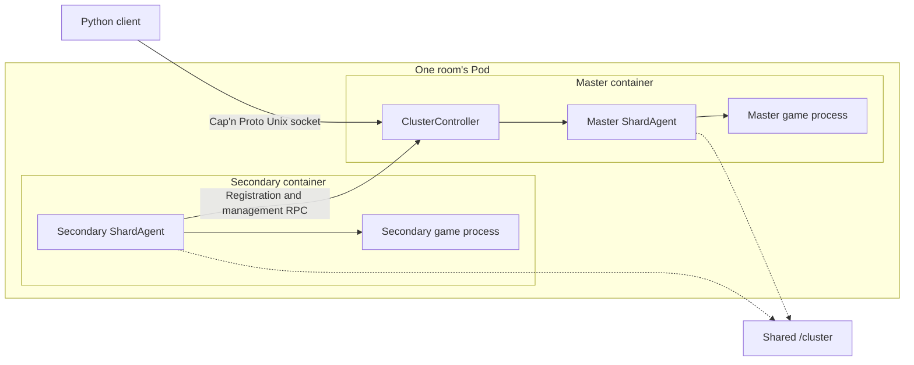
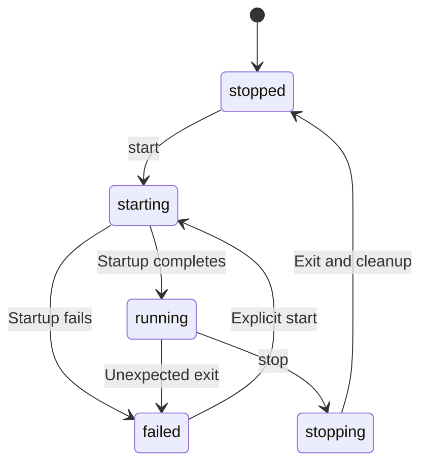
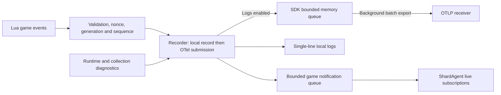

# Don't Starve Together Dedicated Server

[](https://steamcommunity.com/groups/lst99)
[](https://discord.gg/4N3aeNsFt8)

English | [简体中文](README.zh-Hans.md)

Deploy and manage Don't Starve Together (DST) servers with Podman, systemd, and a Python SDK.
Each room uses one Pod; an Agent in each container manages its shard, and the master coordinates the cluster.

- **Deploy**: generate game configuration and Quadlet units for forests, caves, and shared Mods.
- **Manage**: query players and worlds, save, roll back, restart, and administer games through local RPC.
- **Record**: collect game events as needed, using local logs or OTLP Logs export.

Default image: `quay.io/wh2099/dst-server:latest`; beta channel: `:beta`.

## Contents

Start with [Quick start](#quick-start), then jump to the task you need.

| Module | Common tasks |
| --- | --- |
| [Configuration and deployment](#configuration-and-deployment) | [Directory layout](#directory-layout) · [Ports](#shards-and-ports) · [World settings](#world-settings) · [Configuration SDK](#configuration-sdk) · [Permissions](#container-users-and-directory-permissions) · [DNS](#container-dns) |
| [Unified CLI](#unified-cli) | Room creation, configuration, templates, selection, and JSON output |
| [Routine maintenance](#routine-maintenance) | Image updates, console and logs, schedules, and maintenance tasks |
| [Runtime](#runtime) | [Components and communication](#components-and-communication) · [Lifecycle](#lifecycle-and-failure-recovery) · [Save confirmation](#saving-and-world-reloads) · [Timeouts](#default-timeouts) |
| [RPC and game SDK](#rpc-and-game-sdk) | [Connection example](#connecting-to-a-cluster) · [Shared requests](#shared-requests-and-validation) · [API index](#api-index) · [Emoji and Emote](#emoji-and-emote-enums) |
| [Saves and exports](#saves-and-exports) | [File reference](#save-files) · [Snapshots and rollback](#snapshot-queries-and-rollback-by-day) · [Exports and R2](#exports-and-r2-uploads) |
| [Mod management](#mod-management) | [Native updates](#native-mod-updates) · [Downloads and activation](#declaring-downloads-and-activation) |
| [Telemetry and historical logs](#telemetry-and-historical-logs) | [Collection scope](#collection-scope) · [OTLP](#otlp-configuration) · [Delivery](#in-memory-delivery) · [Log boundaries](#log-boundaries) · [Netdata](#netdata-deployment-and-queries) · [Troubleshooting](#telemetry-troubleshooting) |
| [Utilities](#utilities) | Klei services, player path encoding, Lua annotations |
| [Development and validation](#development-and-validation) | [Module boundaries](#module-boundaries), dependencies, check commands, source index |

## Quick Start

Requires Linux, Podman with Quadlet, systemd, and [uv](https://docs.astral.sh/uv/getting-started/installation/).
Python `>=3.14.7` includes the [process-wait fix](https://github.com/python/cpython/pull/154171) needed by Mod cleanup.
Run host CLI deployment commands as root on the server, locally or over SSH.

1. Install the package with host management support and create a token on the [Klei server page](https://accounts.klei.com/account/game/servers?game=DontStarveTogether).

   ```shell
   uv tool install --python 3.14 'dst-server[host]'
   export DST_SERVER_CLUSTER_TOKEN='replace-with-cluster-token'
   dst-server --help
   ```

2. Create one room, choosing its template independently of its number.

   ```shell
   dst-server template list
   dst-server room create 299 --template forge --max-players 9 \
     --volume-idmap 'uids=0-1000-1;gids=0-1000-1'
   ```

   This creates `/srv/dst/299` and its Quadlet units without starting or overwriting a room.

   - Use `pure_survival` for forest and caves; see `template list` for other templates.
   - `--token-file /run/secrets/dst_cluster_token` reads the token from a file.
   - Volume mapping is unset by default; the mapping above lets container UID `1000` use root-owned files.

3. Start the room and inspect its logs.

   ```shell
   dst-server room start 299
   dst-server room status 299
   dst-server logs --room 299 --lines 100 --follow
   ```

   Startup checks the image, prepares Mods, generates missing worlds, and waits for game readiness.
   Use `--no-wait` to submit a start without waiting, or `room wait 299` to wait separately.

   Rooms created this way use local journald logs; the LST fleet preset additionally configures Netdata export.

From a checkout, use `uv run --extra host dst-server ...` or `uv run --extra host python -m dst_server ...`.
Both installed entry points expose the same CLI; no subcommand displays help.
See [permissions](#container-users-and-directory-permissions) for rootless generation with the SDK.

### Unified CLI

| Command | Purpose |
| --- | --- |
| `room` | Create, inspect, edit, start, stop, restart, wait, and diagnose rooms. |
| `template`, `deployment` | Inspect or apply gameplay templates, create the LST fleet, and install automation units. |
| `schedule`, `maintenance` | Opening hours, idle recycling, and in-service countdown restarts. |
| `announce`, `player`, `world`, `mod` | Announcements, players and permissions, saves and worlds, and Mod configuration. |
| `console`, `logs`, `rpc` | Lua evaluation, retained journal logs, method discovery, direct calls, and live subscriptions. |
| `scripts` | Build and verify managed native script bundles. |
| `agent`, `annotations`, `completion` | Container process entry points, Lua annotations, and shell completion output. |

The default directories are `/srv/dst` and `/etc/containers/systemd`.
Override them with `--cluster-root` / `--quadlet-dir` or `DST_SERVER_CLUSTER_ROOT` / `DST_SERVER_QUADLET_DIR`.
Place global options before the command:

```shell
dst-server --cluster-root /srv/dst --quadlet-dir /etc/containers/systemd --json room list
dst-server room stop 000-029,060-069,299
dst-server room edit 000-029,060-069 --max-players 9
dst-server room edit 299 --set '/cluster/settings/cluster_description="Friday games"'
dst-server room start 000-029,060-069,299
dst-server room show 299 --field /cluster/settings/max_players
dst-server room schema
dst-server announce 'Maintenance starts in eight minutes.' --room 299
dst-server world snapshots --room 299 --limit 10
dst-server world save --room 299
```

#### Targets and Output

- `room` takes positional numbers; other groups use `--room`.
  Select comma-separated numbers, inclusive ranges, or supported `--template` / `--all` options.
- `room list` finds three-digit directories containing `cluster.ini`; operations require explicit targets.
  Batches return per-room results and a nonzero exit status if any room fails.
- Non-terminal stdout uses single-line JSON; `--json` selects it in a terminal.
  Streams emit one object per record; diagnostics use stderr and escape embedded newlines in non-terminal output.

#### Editing

- Stop rooms before `room edit`, `template apply`, `mod enable/disable/set`, or `schedule set`, including policy changes.
  Start them explicitly afterward.
- `room edit --set` takes JSON Pointer paths and JSON values; `--unset` removes a setting.
- World-generation changes leave existing maps intact; use `world regenerate` to replace them.

### LST Fleet Layout

The LST deployment preset contains 116 rooms: `000–099` and `200–215`.

```shell
dst-server deployment lst --room 000,030,209 \
  --volume-idmap 'uids=0-1000-1;gids=0-1000-1'
dst-server room stop 299
dst-server template apply forge --room 299
dst-server room start 299
```

Use `deployment lst --all` for all preset rooms; creation refuses existing rooms.
Daily windows use host local time: 白饭 10:00–18:00, 晚宴 18:00–00:00, and 夜饮 00:00–08:00.

| Gameplay | Always open | 白饭 | 晚宴 | 夜饮 |
| --- | --- | --- | --- | --- |
| Pure survival | `000–015` | `016–019` | `020–027` | `028–029` |
| Pure endless | `030–045` | `046–049` | `050–057` | `058–059` |
| Semi-vanilla survival | `060–065` | `066` | `067–068` | `069` |
| Semi-vanilla endless | `070–085` | `086–089` | `090–097` | `098–099` |

All special rooms are always open:

| Room numbers | Gameplay |
| --- | --- |
| `200–204` | AFK skin drops |
| `205` | Adventure |
| `206` | Gorge |
| `207–209` | Forge |
| `210–212` | Island Adventure |
| `213–215` | Hamlet |

Generic templates support any slot in `000–299`, including `lights_out_survival` and `lights_out_endless`.
Existing rooms are read from native files and never inherit template changes automatically.

Applying a template replaces gameplay, world, and Mod settings.
It preserves the number, name, description, password, token, shared key, and deployment settings.
Generation and maintenance are also available through the packaged async SDK.

## Configuration and Deployment

Game configuration and Quadlet units jointly define directories, shards, and networking.
Keep them consistent when making changes.

### Directory Layout

Each cluster uses one host directory, mounted as `/cluster` in every shard container.
The game is installed at `/install` inside the image.

```text
cluster/
├── .dst-control.json  (optional)
├── cluster.ini
├── cluster_token.txt
├── adminlist.txt / blocklist.txt / whitelist.txt
├── mods/
│   ├── dedicated_server_mods_setup.lua
│   ├── modsettings.lua
│   └── ugc/
├── forest/
│   ├── server.ini
│   ├── worldgenoverride.lua
│   ├── modoverrides.lua
│   └── save/
└── cave/
    └── Same shard files as forest
```

| File or path | Contents |
| --- | --- |
| `cluster.ini` | Cluster name, access restrictions, player count, gameplay, and shard connections. |
| `cluster_token.txt` | Klei dedicated server token. |
| The three permission lists | Administrators, bans, and whitelist entries, one identifier per line. |
| `<shard>/server.ini` | Shard identity, player and Steam query ports, and player save path encoding. |
| `<shard>/worldgenoverride.lua` | World generation and world setting overrides. |
| `<shard>/leveldataoverride.lua` | Optional full level baseline, required for event worlds. |
| `<shard>/modoverrides.lua` | Mods enabled on the shard and their options. |
| `<shard>/save/` | World and player snapshots plus supporting data; see [Save files](#save-files). |
| `mods/` | Shared download list, Mod content, and cache; see [Mod management](#mod-management). |
| `.dst-control.json` | Room policy (`template`, `schedule`, `recycle`, `paused`) and the latest activity checkpoint; no game or deployment configuration. |
| `.dst-server.sock` | Cluster RPC socket, created at runtime. |
| `.dst-operation.lock` | One short-lived host operation lock; its empty file remains after unlocking. |
| `<shard>/dst_server_driver.json` | Per-process Lua startup parameters, including the nonce and telemetry settings. |

**Configuration** comes from native INI/Lua files and Quadlet units, including systemd drop-ins.
There is no second room definition.
Startup reads these files, prepares Mods, and creates missing permission lists and Mod support files.

- Require `cluster.ini`, `cluster_token.txt`, and each enabled shard's `server.ini`, with exactly one master.
- Only directories containing `server.ini` are enabled shards.
  Removing a shard keeps its other files and saves for reuse.
- Configuration and shard directories cannot be symlinks.

**Activity** stays in Agent memory independently of telemetry.
The recycling timer saves shard session IDs and `last_active_at` under `activity` in `.dst-control.json`.
Without this file, a room has no schedule or automatic recycling.

Retention includes stopped time, regardless of how the service stopped.
An abrupt exit can lose activity since the last timer check.
Missing checkpoints or changed worlds receive a full new retention period.

### Shards and Ports

Shards in the same Pod share a network namespace.
Multi-shard deployments must meet these requirements at runtime:

- Enable `shard_enabled` and use the same nonempty `cluster_key` and `master_port` across all shards.
- Explicitly declare `is_master` in every `server.ini`.
  Secondaries also need a name and reachable `master_ip`, which can be inherited from cluster settings.
- Deployments within one Pod usually use `master_ip = 127.0.0.1`.
- When assigning shard IDs explicitly, use `1` for the master and unique IDs starting at `2` for secondaries.
- `master_port` and every shard's `server_port` and `master_server_port` must not conflict.

| Port allocation | Rule |
| --- | --- |
| Host range | `30000–32999`, with one ten-port slot per room. |
| Room slots | Any template supports `000–299`; the LST fleet preset covers `000–099` and `200–215`. |
| Shard count | Up to four shards per room; only UDP ports actually used are published. |
| Player connections | `-external_port` advertises the mapped host port; the container still listens on the internal port from `server.ini`. |

Rooms running at the same time must use different slots.
When changing the shard set, master identity, or published ports, regenerate the configuration and Quadlet units.
Then recreate the Pod.

In `cluster.ini`, `[NETWORK]` controls the name and access restrictions.
`[GAMEPLAY]` controls player count, PVP, and pausing when empty.
See [ClusterSettings / ShardSettings](src/dst_server/configuration/models.py) for all fields, ranges, and defaults.

The SDK defaults to `encode_user_path=True` and always writes its current value to `server.ini`.
It preserves an explicit `False`.
With existing saves, changing this value also requires updating the [player directories](#player-path-encoding).

### World Settings

`worldgenoverride.lua` requires `override_enabled = true` to take effect.
For a standard forest:

```lua
return {
    override_enabled = true,
    worldgen_preset = "SURVIVAL_TOGETHER",
    settings_preset = "SURVIVAL_TOGETHER",
    overrides = {},
}
```

| World | Settings |
| --- | --- |
| Caves | Set both presets to `DST_CAVE`. |
| Endless | Keep `game_mode = survival`, with the forest `ENDLESS` preset and corresponding cave overrides. |
| Forge / Gorge | `lavaarena` / `quagmire` also require full `leveldataoverride.lua` data, included in the built-in event presets. |

Prefer composing the [built-in configuration presets](src/dst_server/configuration/presets.py).
`leveldataoverride.lua` supplies the level baseline, then `worldgenoverride.lua` applies overrides.
Changing generation settings does not rebuild an existing map.
Game saves can also rewrite settings, so stop the games before editing.

### Configuration SDK

Import `ClusterConfig`, `ClusterSettings`, `ShardConfig`, and `ShardSettings` from `dst_server.configuration`.

| API | Purpose |
| --- | --- |
| `ClusterConfig.load()` / `.save()` | Read, validate, and save the configuration tree. |
| `.replace()` | Update only supplied fields. |
| `RoomPreset` | Combine configuration fragments. |
| `QuadletApplication.for_cluster(..., allocation=RoomPortAllocation(...))` | Generate matching Pod/container units, ports, and startup arguments. |

World options follow the pinned game source; beta-only options need a compatible game version.
Only explicit overrides are written.
For an endless forest-and-caves room:

```python
import os
from pathlib import Path

from pydantic import SecretStr

from dst_server.configuration.presets import ENDLESS, FOREST_CAVES, compose

config = compose(FOREST_CAVES, ENDLESS).build(
    token=SecretStr(os.environ["DST_SERVER_CLUSTER_TOKEN"]),
)
config.save(Path("cluster"))
```

Room creation has three layers:

- **Define:** build a `ClusterConfig`, then `Room(number=..., cluster=...)`.
  `presets.lst.fleet_room(...)` supplies an LST room definition.
- **Write files offline:** `room.save(directory, quadlet_dir=...)` uses explicit absolute paths.
  `RoomStore(root, quadlet_dir).save(room)` places it in `root/NNN`.
- **Manage a deployment:** `Host.create(room)` rejects existing rooms.
  `Host.edit(room)` requires a stopped room and handles deployment changes.

Custom `Room` definitions use slots `000–299` and have no telemetry export by default.
LST definitions consistently include their preset telemetry settings; customize `room.deployment.environment` before saving.

Offline saves preserve game progress and permission lists, but reject changes to shard names or master roles.
Use `Host.edit()` for those changes.

For a batch, construct all definitions before writing, so invalid room numbers fail before any files are created:

```python
from dst_server.rooms import Room, RoomStore

store = RoomStore(Path("/srv/dst"), Path("/etc/containers/systemd"))
rooms = [Room(number=number, cluster=config) for number in (0, 1)]
for room in rooms:
    store.save(room)
```

#### Shared Keys

Constructing a configuration, `load()`, and `files()` allow an omitted `cluster_key` without generating one or writing files.
`save(path)` honors explicit keys, otherwise reuses the target directory's key or generates one in `cluster.ini`.
Each new directory gets its own key, including single-shard rooms.

#### Editing Existing Rooms

`Room` combines game configuration, deployment settings, and policy in memory.
`RoomStore.load(number)` reads current files each time, including game-written changes.
Load before editing: saving applies the complete definition, including schedules and recycling policy.

- Use `room edit` or `Host.edit()` after stopping the room; editing does not start or stop services.
- Offline saves require readable game configuration.
  Configuration edits parse declarative Lua without executing it and reject unsupported dynamic Lua.
  Startup and schedule `show` / `pause` / `resume` / `run` do not parse world Lua.
- Changed native files are reformatted and lose their original comments.
  Files are replaced individually, without a cross-file transaction.
  Saves, permission lists, and unrelated files remain intact.
- Deployment changes regenerate SDK-owned Quadlet base units.
  Put local changes in systemd drop-ins; edits reject fields still overridden by a drop-in.

[ClusterClient](#connecting-to-a-cluster).`read_configuration()` returns a validated `ClusterConfig` or raises an error.
Persistent edits use host operations.

### Container Users and Directory Permissions

The image runs as `steam`, with UID and GID `1000`.
The generator does not select mappings based on the calling user; `volume_idmap` and `userns` both default to `None`.

| Deployment | Generator argument | Generated setting and effect |
| --- | --- | --- |
| Rootless | `--userns 'keep-id:uid=1000,gid=1000'` | Writes `UserNS` under `[Pod]` in the `.pod`, mapping the deployment user to container `1000:1000`. |
| Rootful | `--volume-idmap 'uids=0-1000-1;gids=0-1000-1'` | Uses idmap on each `.container` volume; host files remain `root:root` and appear as `1000:1000` in the container. |

The host CLI's service operations use the system manager.
For rootless deployment, generate files with the packaged SDK as the regular deployment user, then use `systemctl --user`:

```python
import os
from pathlib import Path

from pydantic import SecretStr

from dst_server.presets.lst import fleet_room

fleet_room(
    0,
    token=SecretStr(os.environ["DST_SERVER_CLUSTER_TOKEN"]),
    userns="keep-id:uid=1000,gid=1000",
).save(
    Path.home() / ".local/share/dst/000",
    quadlet_dir=Path.home() / ".config/containers/systemd",
)
```

```shell
systemctl --user daemon-reload
systemctl --user start dst-000-pod.service
journalctl --user -u dst-000-forest.service -f
```

For rootful deployment, follow [Quick start](#quick-start).
The kernel and data filesystem must support [idmapped mounts](https://docs.podman.io/en/latest/markdown/podman-run.1.html#volume-v-source-volume-host-dir-container-dir-options) when using `volume_idmap`.

The deployment user must own the cluster directory, with group and other-user writes disabled to pass RPC socket checks.
Mapping changes require recreating the Pod.

### Container DNS

Rootful Podman can use the [DNS policy](deploy/containers/podman-dns.json) to forward default-network queries to the host's systemd-resolved.
The `127.0.0.53` stub must work; if the host uses DNS over TLS, containers reuse its upstream policy.
This affects every container on the default network.

Generate a candidate configuration on the target host, preserving its network identity and addresses:

```shell
podman network inspect podman |
  jaq --slurpfile dns deploy/containers/podman-dns.json \
    '.[0] | del(.containers) | . + $dns[0]'
```

1. Back up the network configuration and save the games.
   Stop every container on the network, including infra and non-DST containers.
2. Confirm that the candidate changes only DNS fields.
   Install it as `/etc/containers/networks/podman.json` with mode `0644`.
3. Restart affected Pods and services, then verify DNS inside the containers.

The policy file cannot be installed directly as a complete network configuration.
Restarting only the games or running `podman network reload` does not fully apply the change.

[Back to contents](#contents)

## Routine Maintenance

```shell
dst-server room status 299
dst-server room diagnose 299
dst-server world save --room 299
dst-server room restart 299
dst-server room stop 299
```

Host service shutdown, container restarts, and SDK `stop()` do not implicitly confirm a save.
When a current snapshot is required, wait for `world save` or the SDK's [cluster `save()`](#saving-and-world-reloads).
SDK `restart()` confirms a save when all shards are ready before performing a full game restart.

### Player Announcements

[`dst_server.announcements`](src/dst_server/announcements.py) provides:

| Type | Behavior |
| --- | --- |
| `Repeat` | Sends fixed text `count` times at `interval`, using native `c_announce` and game simulation time. |
| `Countdown` | Uses the SDK's monotonic clock, so it advances even while the game is paused. |
| `maintenance()` | Chinese templates for shutdown, restart, Mod updates, deployment, and scheduled closing. |

Each world has one repeat slot; a new repeat replaces it.
One-shot notices (`count=1`), including countdown notices, leave it intact.

Countdown placeholders include `{remaining}` seconds, `{minutes}` rounded up, `{when}`, and custom names.
Attribute access, indexing, conversions, and format specifications are rejected.

```python
from dst_server.announcements import Countdown, Repeat, Template, maintenance


async def notify(cluster):
    await cluster.announce(Repeat(message="Welcome to the room.", count=3, interval=30))
    await cluster.announce(
        Countdown(
            template="{destination} opens in {remaining} seconds.",
            delay=60,
            interval=10,
            parameters={"destination": "The next room"},
        )
    )
    await cluster.restart(notice=maintenance(Template.RESTART, estimated_duration=600))
```

Templates accept delay, interval, estimated downtime, room/shard names, and next opening time for scheduled closing.
Use a custom `Countdown` for other wording or languages.

- SDK lifecycle defaults: a 60-second countdown, notices every 30 seconds, and a five-minute downtime estimate where applicable.
- Empty rooms skip the countdown; `notice=None` skips notices and waiting but still performs the operation.
- Host `room start` / `stop` / `restart` manage systemd directly, without a countdown.
- Announcements do not confirm saved progress.

```shell
dst-server announce 'Welcome!' --room 299 --count 3 --interval 30
dst-server announce '{destination} opens in {remaining} seconds.' --room 299 \
  --countdown 60 --interval 10 --parameter destination=Lobby
dst-server maintenance restart --room 299 --delay 2m --estimated-duration 10m
dst-server room stop 299
```

### Image Updates

- `:latest` follows the stable channel; use `--image quay.io/wh2099/dst-server:beta` when creating a beta room.
- `Pull=always` checks the registry on container start; `TimeoutStartSec=1800` allows 30 minutes for startup.
- Existing rooms: run `room stop`, edit `/deployment/image` with `room edit --set`, then run `room start`.
- Host `room restart` recreates containers and applies their image/environment settings.
- RPC `restart()` and `maintenance restart` restart games and prepare Mods inside existing containers.
  They do not apply new images.

#### Builds and Cache

| Setting | Behavior |
| --- | --- |
| Game layer | Cached by game version and channel; reusable when only the SDK changes. |
| Intermediate cache | New images carry `quay.expires-after=7d`; Quay expires their tags after seven days. |
| Final image | No expiration for `latest`, `beta`, version tags, or the hash cache alias. |
| `force_build` | Rebuild an already published game version. |
| `no_cache` | Disable cached layers; combine with `force_build` for a fresh rebuild of a published version. |

Expired tags do not immediately free shared layers; Quay garbage collection handles that.
Version tags use `:<version>` for stable and `:beta-<version>` for beta.

The workflow publishes from `main` only and does not deploy rooms.
GitHub concurrency cancels earlier runs on the same ref, so rerunning an old commit can interrupt a newer commit's run.

### Console and Logs

`console` evaluates Lua through the room's Agent RPC and defaults to the master shard:

```shell
dst-server console 'TheWorld.state.cycles + 1' --room 299
dst-server console 'print("hello"); return 1, nil, true' --room 299
dst-server console --file commands.lua --room 299
printf '%s\n' 'return TheWorld.state.cycles + 1' | dst-server console --room 299
dst-server console --room 299 --interactive
dst-server console --room 299 --interactive --follow
```

A single call returns captured print output, typed textual return values, and any compile or runtime error, then exits.
Lua executes once; expressions and statements are distinguished during compilation.

Interactive mode requires one room; add `--shard NAME` to target a secondary and `--follow` to display background logs.
Use Ctrl+D to close the prompt; Ctrl+C clears an input line.
Lua execution remains a trusted administrative operation and does not imply save confirmation.

```shell
dst-server logs --room 299 --lines 100
dst-server logs --room 299 --since yesterday --until now
dst-server --json logs --room 299 --cursor 's=...' --direction forward
dst-server logs --room 299 --follow
```

#### History and Pagination

Quadlet uses `LogDriver=journald`; history follows journal retention across game runs and host reboots.
Queries use fixed deployment names and still work for stopped rooms, damaged configuration, and deleted shards.

| Option or result | Behavior |
| --- | --- |
| `--follow` | Reads 100 historical records by default, then follows new records in the same reader. |
| Finite `--json` | Returns `records`, `next_cursor`, `has_more`, and bounded diagnostics. |
| `backward` / `forward` | Newest first (default) / oldest first; human-readable pages always display chronologically. |
| `next_cursor` | Continue with the same direction and filters, replacing `since` if present. |

`cursor` and `since` are mutually exclusive.
For bounded time ranges, paginate forward and keep `until`; backward pagination loses the lower bound when `since` is removed.
Unavailable cursors raise `JournalCursorError` and cannot recover expired records.

#### SDK Readers

`Host.journal()`, `Host.follow_journal()`, and `Host.telemetry()` accept one room or a sequence.
They do not load configuration, contact systemd, or open RPC.
`Host.log_units()` returns their historical unit selection.

- `shard=` takes the original directory name, including deleted shards.
  An explicit shard subscription can wait for its first record.
- Whole-room follow resolves units at startup; subscribe again to include newly created shards.
- For custom units or service identities, use `dst_server.logs.JournalLogs` or `NetdataLogs` directly.

```python
import asyncio

from dst_server.host import Host
from dst_server.logs import JournalQuery


async def main():
    host = Host()
    page = await host.journal(299, JournalQuery(limit=50))
    print(page.model_dump_json())
    if page.has_more:
        older = await host.journal(299, JournalQuery(cursor=page.next_cursor, limit=50))
        print(older.model_dump_json())

    async with host.follow_journal(299, shard="forest") as stream:
        async for record in stream:
            print(record.message)
            break
    print(stream.diagnostics)


asyncio.run(main())
```

SDK follow reads forward, with no initial history by default.
Use `JournalQuery(direction="forward", limit=100)` to include history.
A cursor reads all retained subsequent records, regardless of the initial-history limit.

Invalid follow cursors are reported on the first record or reader exit.
Leaving the context always closes and reaps the reader.

`JournalRecord.fields` preserves raw metadata, repeated values, and binary arrays.
`message`, `unit`, `timestamp`, and `cursor` are derived views that leave raw fields unchanged.

| Limit | Default |
| --- | --- |
| Per record, both readers | 4 MiB; adjustable in the constructor. |
| Finite response | 64 MiB; adjustable, with no cumulative limit on follow. |
| Diagnostics | Last 64 KiB; `diagnostics_truncated` indicates truncation, and empty results retain warnings. |

RPC subscriptions are live-only; Netdata queries separately exported structured events.

### Schedules and Maintenance Tasks

```shell
dst-server room stop 299
dst-server schedule set 09:00-12:00 22:00-05:00 --room 299
dst-server room start 299
dst-server schedule show --room 299
dst-server schedule pause --room 299
dst-server schedule resume --room 299
dst-server deployment install
systemctl enable --now dst-room-schedule.timer
```

Daily windows use host local time and may cross midnight.
`schedule set` requires a stopped room; `show`, `pause`, `resume`, and `run` work while it runs.

| Action | Effect |
| --- | --- |
| `room stop` / `schedule pause` | Pause scheduled transitions and recycling; a running room can still record activity. |
| `room start` / `room restart` / `schedule resume` | Resume automatic management. |
| `schedule set --always` | Remove opening windows. |
| `schedule run` | Check once; repeating within a minute can repeat the closing notice. |

Scheduled closing announces every minute for eight minutes.
The installed timer checks every minute, then runs recycling even if a schedule check fails.
Policy comes from each room's `.dst-control.json`; without it, schedules and recycling are disabled.

#### Install Automation

`deployment install` writes the [packaged systemd units](src/dst_server/host/systemd); enable the timer separately.
Units run `python -m dst_server schedule run` and `python -m dst_server maintenance recycle`.
They use the current Python executable and deployment paths.

After changing those paths or the Python environment, reinstall the units and enable the timer.

```shell
dst-server maintenance recycle --dry-run
dst-server maintenance restart --room 299 --delay 8m --estimated-duration 10m
```

`maintenance restart` calls the running SDK service once per room and returns per-room results.
The service owns the countdown and game restart; rooms must already have a reachable service.
Use `room restart` when containers themselves need restarting.

The recycling thresholds are based on the world's current game day:

| Game day | Retain since the latest observed activity |
| --- | --- |
| 1–8 | 6 hours |
| 9–30 | 24 hours |
| 31–70 | 36 hours |
| 71–280 | 72 hours |
| 281+ | 168 hours |

A reset requires elapsed time beyond the limit, all shards ready, and no players present.
Rooms are checked independently; busy rooms are skipped.
World identity and the empty-room condition are checked again before resetting.

## Runtime

Cluster control, shard supervision, and game processes each have their own lifecycle.

### Components and Communication



| Component | Responsibility and source |
| --- | --- |
| [daemon](src/dst_server/cluster/daemon.py) | Runs management services, registration connections, and systemd notifications. |
| [Controller](src/dst_server/cluster/controller.py) | Tracks expected shards and coordinates shared preparation and cluster operations. |
| [Mods](src/dst_server/mods/__init__.py) | Prepares shared Mod files, runs the native updater, and tracks outdated reports for one room's maintenance. |
| [Agent](src/dst_server/cluster/agent.py) | Owns one shard's process resources, consumes logs, lifecycle records, and events, and handles telemetry. |
| [Supervisor](src/dst_server/runtime/supervisor.py) | Starts, stops, and explicitly restarts game processes; reports unexpected failures. |
| [Server](src/dst_server/runtime/server.py) | Manages one DST subprocess and its communication channels; single use. |

The master container runs `dst-server agent master`; secondaries run `dst-server agent serve <shard>`.
The master Agent registers in-process; secondary Agents register through the Pod's abstract Unix socket, `dst-server-registry`.

| Channel | Purpose |
| --- | --- |
| `/cluster/.dst-server.sock` | Public Cap'n Proto RPC. |
| Game FD 3 | Single-line `DST_RPC` JSON requests: version, process nonce, request ID, Lua generation, method, and arguments. |
| Game FD 4 | Correlated JSON acceptance and result records; native Busy / Done are transport markers. |
| Game FD 5 | Native lifecycle events such as Ready, Session, Saved, and Stopping. |
| Game stdout | Ordinary logs and game domain events; stderr is merged into this channel. |

[`-cloudserver` and the launch wrapper](src/dst_server/runtime/fds.py) establish FD 3–5.
Each shard sends commands serially and waits for native code to consume the preceding input.

- **Requests:** strict JSON, at most 4 KiB including framing; only `evaluate` and `execute_script` compile Lua source.
- **Responses:** at most 64 KiB, matched by nonce, request ID, and Lua generation; native Done alone does not confirm success.
- **Retries:** only proven native Busy rejections; accepted or uncertain mutations are never replayed.
- **Timeouts:** the FD 4 reader keeps running and discards late replies; telemetry uses a separate stdout queue.

The public socket has mode `0600`.
Its parent directory must belong to the current user and disallow group and other-user writes.
The internal abstract socket relies on Pod network namespace isolation and has no filesystem permission boundary.

### Lifecycle and Failure Recovery

The controller waits up to 60 seconds for all Agents to register with stopped games, then prepares and starts the cluster.
It does not adopt games left running by another Controller.

```mermaid
sequenceDiagram
    participant A as All shard Agents
    participant C as Controller
    participant M as Shared Mods
    participant G as Game processes
    A->>C: Complete registration
    C->>C: Validate native INI topology
    C->>M: Update once all games are stopped
    M-->>C: Update succeeds, mark prepared
    C->>A: Activate resources and start concurrently
    A->>G: Create each shard's process
    G->>G: Native script bundle starts the Lua driver
    G-->>A: Native Ready and driver readiness
    Note over A,G: Core failure prevents startup; optional telemetry may degrade
```

| Operation | Shared Mods and game processes |
| --- | --- |
| Cluster `start()` | Prepares shared files and updates Mods when automatic updates are enabled, then starts the required shards; repeated calls reuse valid preparation. |
| Cluster `stop()` / `kill()` | Stops games and invalidates cached preparation, so the next `start()` prepares again. |
| Cluster `restart()` | Announces, saves ready games, stops all games, checks and updates shared Mods even when automatic updates are disabled, then activates and starts every shard. |
| `stop()` → `update_mods()` → `start()` | Manual refresh; the final step reuses the successful update. |
| `update_mods(restart=True)` | Saves and stops running games, updates once, and restarts them inside the existing containers. |
| Native outdated-Mod report | Schedules one internal room maintenance operation, using the same save, stop, update, and start steps. |
| Explicit single-shard restart | Reuses installed Mods without a shared update. |

Shared updates require all Agents connected and all game processes stopped, including any PID left in a failed state.
Update failures leave games stopped; automatic maintenance retries after 300 seconds.

The in-memory `prepared` flag avoids duplicate preparation within one service run.
Preparation does not rewrite world settings.

This diagram shows the main states of one shard's game process, using the public RPC state names:



The Supervisor tries once per start or restart request.
Startup failure, unexpected exit, or Agent disconnection stops all games and fails the management service.
Unexpected exit includes status zero.
Requested stops, restarts, and Mod maintenance are expected exits.

| Recovery | Behavior |
| --- | --- |
| Standalone SDK | Reports failure; the caller decides when to start again. |
| Master container | `Restart=on-failure`, a 30-second delay, at most three starts per 600 seconds. |
| Secondary containers | `Restart=no`; `Wants`, `BindsTo`, and `PartOf` tie them to the master. |
| Pod restart | Restarts all shards through the master's `PartOf` relationship. |
| Start limit reached | Fix the cause, then run `room start` or `room restart` to clear it. |

Shard services start and stop in parallel; Agent registration coordinates game startup.
Shutdown sends TERM before Quadlet waits for and removes the containers.
Clients must reconnect RPC and subscriptions after recovery.

With `NOTIFY_SOCKET`, the daemon sends `READY=1`, then `WATCHDOG=1` every 60 seconds.
Quadlet's `WatchdogSec=300` triggers room recovery after five minutes without a notification.

- **Watchdog:** confirms the management event loop is active.
- **`status.ready`:** confirms a live game reported native readiness.
- **`driver_health` / `driver_error`:** describe typed API readiness; use `health()` to investigate failures.

FD 4 EOF or write failure closes the control channel; a malformed response fails only its request.
Critical observation failures can terminate the Agent and trigger container recovery.

### Managed Native Script Bundle

The image builds and verifies `data/databundles/scripts.zip` after installing the SDK.
Standalone installations must prepare it before `Server.start()` using `scripts.zip` from the same game version.
The SDK does not download native scripts or build them from the game-source submodule.

```bash
dst-server scripts build /install/data/databundles/scripts.zip --output /tmp/scripts.managed.zip
dst-server scripts verify /tmp/scripts.managed.zip --source /install/data/databundles/scripts.zip
```

- **Build:** validates the native entrypoint, replaces obsolete SDK modules, and verifies the output before publishing it.
  Use the source path as `--output` for atomic replacement while games are stopped.
- **Verify:** checks file hashes, SDK version, and source digest in the manifest.
  `--source` compares with an independent native archive.
- **Update:** rebuild after a game or SDK update.
  Packaging tools can use [build_bundle / verify_bundle](src/dst_server/scripts.py) directly.

Only the empty `scripts/globalvariableoverrides.lua` is replaced; other native files retain their contents.
Native `main.lua` loads it before Mods, and `SpawnPrefabFromSim` attaches a world component that reports readiness at `OnPostInit`.
This requires neither Mod loading nor Console injection.

Before each process starts, Python writes a fresh nonce and telemetry settings to `<shard>/dst_server_driver.json`.
Lua reads it on every VM startup, including resets and rollbacks.
Startup waits for driver readiness even with profile `off`; optional telemetry failures remain visible in driver health.

Direct `Server` users must continuously consume lifecycle and game-event notifications; the Agent does this automatically.
Diagnostics go to the Recorder for local logging and optional OTLP export.
Full notification queues report losses without blocking readiness or save confirmation.

### Saving and World Reloads

`await cluster.save()` saves through the master and waits for its native completion callback.
Other shards must confirm matching snapshots.
Wait for success before stopping, restarting, or [exporting](#exports-and-r2-uploads).

- Use the cluster or master: direct saves on secondary shards are rejected.
- `ObservationCursor(attempt, sequence)` excludes notifications from earlier processes or operations.
- Submission, native Done, and unrelated autosaves do not confirm this save.
- Empty servers may overwrite the preceding snapshot without increasing its number.

Native resets and rollbacks start a new Lua generation within the same game process.
The bootstrap tracks it through `TheSim:GetNumLaunches()` and single-line `DST_DRIVER|` records.
FD 5 Session notifications do not control generations.

- Typed requests wait for the current generation's driver.
  Resets, rollbacks, and regeneration also wait for native startup in the new generation.
- Hooks install once per VM without Console commands; duplicate installation is rejected.
  Late Session notifications do not reinstall hooks or reset event sequences.
- A generation change detected before writing can wait and retry.
  A change after writing reports an uncertain outcome without automatic replay.
- `Server.execute()` uses the same generation-aware JSON RPC and bounded Lua evaluator as typed Console requests.

After a timeout or disconnection, a submitted save or rollback may still be running.
Check status or confirmation events before deciding what to do next.
See the [driver](src/dst_server/runtime/driver.py) and [save completion](src/dst_server/lua/dst_server/commands.lua) implementations.

### Default Timeouts

| Operation | Default budget |
| --- | --- |
| Ordinary commands and typed game requests | 120 seconds. |
| Saving and waiting for confirmation | 300 seconds. |
| Reset, rollback, rollback by day, and regeneration | 900 seconds. |
| One game startup and native driver readiness | 900 seconds. |
| Graceful game stop | 120 seconds; forced exit and output cleanup have separate budgets. |
| RPC connection and handshake | 60 seconds. |

Cluster save and reload timers start after acquiring the operation lock and confirming readiness.
Nested steps share one deadline.
The reload budget includes confirmation from every shard and new driver readiness.
Rollback by day also includes snapshot selection and result verification.

RPC budgets are declared in [commands.py](src/dst_server/commands.py).
`Start`, `Restart`, and `UpdateMods` allow three hours; `Stop` and `Kill` allow 120 seconds.
The server adds 30 seconds around the workflow; the client adds 60 seconds in total.
These deadlines include lock waits, preflight, forwarding, and responses, so they can expire before the workflow budget.

An internal RPC timeout leaves an unconfirmed mutation `indeterminate`; subscription `next()` uses long polling.
Quadlet allows 360 seconds for container stops and 420 seconds for systemd stops.
See [timeouts.py](src/dst_server/timeouts.py) for defaults.

### Game Launch Arguments

The Agent builds the command in standard deployments, so you do not need to supply these arguments yourself.

| Argument | Purpose |
| --- | --- |
| `-persistent_storage_root`, `-conf_dir`, `-cluster`, `-shard` | Locate the cluster and shard; containers ultimately read `/cluster`. |
| `-external_port` | Advertise the host's player port. |
| `-ugc_directory` | Shared UGC cache. |
| `-only_update_server_mods` / `-skip_update_server_mods` | Separate Mod updates from normal game startup. |
| `-monitor_parent_process` | Close the game when its parent exits. |
| `-cloudserver` | Establish local process communication. |

When managing game processes yourself, configure paths and `extra_args` through [ServerConfig](src/dst_server/runtime/config.py).
See [Klei's command-line guide](https://support.klei.com/hc/en-us/articles/360029556192-Dedicated-Server-Command-Line-Options-Guide) for other native arguments.

[Back to contents](#contents)

## RPC and Game SDK

RPC provides typed interfaces for deployed clusters.
The game SDK can also be embedded in applications that manage their own processes.

### Connecting to a Cluster

Install the package to use its SDK outside the repository, or run `uv run python your_script.py` from a checkout.
This example connects from the host to the room created in Quick start:

```python
import asyncio
from pathlib import Path

from dst_server.rpc import ClusterClient, rpc_runtime


async def main() -> None:
    socket = Path("/srv/dst/299/.dst-server.sock")
    async with rpc_runtime():
        async with await ClusterClient.connect(socket) as cluster:
            status = await cluster.status()
            print(status)
            print(await cluster.shard(status.master).status())


asyncio.run(main())
```

The host path is `/srv/dst/<room>/.dst-server.sock`; inside containers it is `/cluster/.dst-server.sock`.
`connect()` requires a path and must run within a `rpc_runtime()` context.

### Shared Requests and Validation

[commands.py](src/dst_server/commands.py) defines `Request[T]`: arguments, result types, scope, timeout, and world-reload behavior.
Python and Lua share command names.
Local controllers, game clients, and RPC clients validate the same Pydantic requests before execution.
Invalid values and commands outside the endpoint's scope are rejected.

[api.py](src/dst_server/api.py) wraps `invoke(request)` with `ClusterAPI`, `ShardAPI`, and `PlayerAPI` methods.
After `from dst_server import commands as c`, `shard.world()` and `shard.invoke(c.World())` use the same contract.
Pass a request to override its timeout, such as `c.World(timeout=30)`.

Cap'n Proto carries commands through `call` and observations through subscriptions.
Read-only `ClusterConfig` preserves omitted fields, explicit `False`, and world override types.
Results and statuses are in [models.cluster](src/dst_server/models/cluster.py); `DriverHealth` is in [models.driver](src/dst_server/models/driver.py).

| Failure | Result |
| --- | --- |
| Domain error | `RemoteError`. |
| Submitted mutation loses its reply | `IndeterminateError` for RPC; `IndeterminateCommandError` at the game boundary. |
| Caller cancels | `asyncio.CancelledError`; submitted mutations may continue, cancelled queries release their work. |

Accepted mutations continue after disconnection and are never automatically replayed when unconfirmed.
See [errors.py](src/dst_server/errors.py) for shared exceptions and codes.

### Direct RPC and Console Results

Discover methods on the running endpoint before calling them:

```shell
dst-server rpc list --room 299
dst-server rpc describe evaluate --room 299 --shard xforge
dst-server --json rpc call status --room 299
dst-server rpc call execute_json --room 299 --shard xforge \
  -f 'source=return TheWorld.state.cycles + 1'
dst-server rpc subscribe events --room 299
```

- `rpc describe`: argument/result schemas, scope, timeouts, and side effects from the running server.
- `rpc call`: `--input request.json` reads JSON; `--input -` reads stdin; repeated `-f name=value` accepts JSON or strings.
- `--shard`: targets a shard; omit it to target the cluster.
- `rpc subscribe`: live `logs`, `lifecycle`, or `events`, without history replay.

The typed SDK exposes the same console result:

```python
from dst_server.models.console import ConsoleResult
from dst_server.rpc import ShardClient


async def inspect_console(shard: ShardClient) -> None:
    result: ConsoleResult = await shard.evaluate('print("hello"); return 1, nil, true')
    print(result.output)
    print([(value.type, value.text) for value in result.values])
    print(result.error, result.truncated)
```

`error.kind` distinguishes compilation from runtime failures; `truncated` marks output limits.
Arbitrary Lua values are represented as bounded text; use `execute_json()` when a program needs JSON values.

### API Index

| Object | Common interfaces |
| --- | --- |
| `cluster` lifecycle | `status()`, `start()`, `stop()`, `restart()`, `kill()`, `update_mods()`. |
| `cluster` configuration and world | `read_configuration()`, `save()`, `pause()`, `reset()`, `rollback()`, `rollback_to_day()`, `regenerate()`, `list_snapshots()`. |
| `cluster` players and administration | `list_players()`, `get_player()`, `announce()`, `whitelist()`, `unwhitelist()`, `is_whitelisted()`, `execute_all()`. |
| `cluster.shard(name)` | Shard lifecycle, `status()`, `room()`, `world()`, `runtime()`, `health()`, `mods()`, `connected_shards()`, `save()`, `list_snapshots()`, `regenerate_shard()`. |
| `shard.players` | Player and inventory queries, kicks, bans, unbans, admin status, vitals, teleportation, shard migration, and adding or removing items. |
| `cluster` / `shard` subscriptions | `subscribe("logs")`, `subscribe("lifecycle")`, `subscribe("events")`; manage subscriptions with `async with`, then call `await subscription.next()`. |
| `shard.evaluate(lua)` | Evaluate expressions or statements once; return print output, typed textual values, and errors as `ConsoleResult`. |
| `shard.execute(lua)` | Execute Lua and return explicitly printed text. |
| `shard.execute_json(lua)` | Return JSON through the typed driver, for example `"return TheWorld.state.cycles + 1"`. |

Reference: [methods](src/dst_server/api.py), [requests](src/dst_server/commands.py), [RPC schema](src/dst_server/rpc/schema/rpc.capnp), and [return models](src/dst_server/models).
For history, use [journal logs](#console-and-logs) for process output and [Netdata](#netdata-deployment-and-queries) for exported events.

Use `ClusterClient` for standard Pod deployments.
To manage a process directly, use `dst_server.runtime.Server`, consume its notifications, and clean up the process yourself.
Pass a running `server.game` to SDK functions:

```python
from dst_server import commands as c
from dst_server.game import GameClient


async def inspect_game(game: GameClient) -> None:
    world = await game.invoke(c.World())
    day = await game.invoke(c.ExecuteJson(source="return TheWorld.state.cycles + 1"))
    players = await game.players.list()
    print(world, day, players)
```

`GameClient.request_save()` only requests the native save; use `Server.save()` or a cluster/shard `save()` to wait for confirmation.

### Emoji and Emote Enums

`dst_server.game` provides static enums for native emoji characters and emote commands.
The SDK does not read game Lua files at runtime.

| Enum | Values and additional fields |
| --- | --- |
| `Emoji` | 50 native emoji characters, with `chat_token` and account item type `item_type`. |
| `Emote` | 32 native emote command names, with `slash_command`, `category`, `item_type`, and `aliases`. |
| `EmoteType` | Wheel categories: `EMOTION=0`, `ACTION=1`, `UNLOCKABLE=2`. |

```python
from dst_server.game import Emoji, Emote, EmoteType

assert Emoji.BEEFALO == "\U000f0001"
assert Emoji.BEEFALO.chat_token == ":beefalo:"
assert Emoji.ALCHEMY.item_type == "emoji_alchemyengine"
assert Emote.WAVE.slash_command == "/wave"
assert Emote.WAVE.category is EmoteType.EMOTION
assert Emote.WAVE.aliases == ("waves", "hi", "bye", "goodbye")
```

`Emoji` and `Emote` are `StrEnum` types usable as strings and JSON values.
Constructors accept native values such as `Emote("wave")`; tokens, slash forms, aliases, and unknown values raise `ValueError`.

- `item_type` is an account item type, not an inventory item ID; ordinary emotes may have `None`.
- Emoji use U+F0000–U+F0031 and require the game font.
- The wheel sends names without `/`; `EmoteType` is a category, not a network action number.
- Ownership, posture, localized aliases, and Mod additions depend on the running game.

Native mappings: [emoji_items.lua](dst-scripts/scripts/emoji_items.lua), [emotes.lua](dst-scripts/scripts/emotes.lua), and [emote_items.lua](dst-scripts/scripts/emote_items.lua).

## Saves and Exports

Snapshots restore game progress; exports package configuration and saves into a shareable archive.

### Save Files

Each shard saves its world and player state separately.
`shardindex.session_id` identifies that shard's generated world, not one player login.
This is a typical layout with player path encoding enabled; files and directories are created as needed:

```text
<shard>/save/
├── shardindex
├── shardindex_time
├── session/
│   └── <session-id>/
│       ├── 0000000001
│       ├── 0000000001.meta
│       └── <encoded-user-id>/
│           ├── 0000000001
│           ├── 0000000001.meta
│           └── savelocation
├── profile
├── modindex / boot_modindex
├── cached_userid
├── server_temp/server_save
├── client_temp/
├── event_match_stats/
├── world_presets/
└── mod_config_data/
```

| File | Contents |
| --- | --- |
| `shardindex` | `world` options, `server` settings, `session_id` world ID, `enabled_mods` and their configuration, and index format `version`. |
| `shardindex_time` | `created` and `saved`: creation and latest-save Unix timestamps in seconds; saves preserve the creation time. |
| Numbered world snapshots | Map, roads, topology, persistent entities, world and network component state, Mod records, and an optional online player list. |
| World `.meta` | `clock` and `seasons` summaries used by rollback lists to read the day, phase, and season. |
| Numbered player snapshots | Character, position, age, skins, health, hunger, sanity, inventory, equipment, backpack, recipes, and other component state. |
| Player `.meta` | The base game writes only `character = player.prefab`. |
| Player `savelocation` | Optional native binary history of snapshots and shards, used to locate player saves when loading. |

- Snapshot IDs are not days: the day is `clock.cycles + 1`, and a day may contain several saves.
- Player snapshot IDs can have gaps and need not match every world snapshot.
  World saves include `AllPlayers`; some player events save separately, and the engine chooses files on load.
- Internal `savedata.meta` stores build version, seed, world type, and save version; it differs from the `.meta` summary.

| Supporting path | Purpose |
| --- | --- |
| `profile` | Runtime preferences, logically JSON, including controls, startup information, favorite Mods, presets, and hint state. |
| `modindex` / `boot_modindex` | A Lua table of Mod management state / a `loading` or `done` startup marker. |
| `cached_userid` | The server account's Klei ID, saved by the engine; not a token or player snapshot. |
| `server_temp/server_save` | A reduced map copy for world initialization, omitting entities, snapshots, tiles, navigation, and more; insufficient to restore the full world. |
| `client_temp/` | Engine-managed temporary client data. |
| `event_match_stats/` | Event statistics CSV files; the base game's writing branch excludes dedicated servers. |
| `world_presets/` | `.wsp` world settings and `.wgp` generation settings, containing base presets, overrides, names, descriptions, and versions. |
| `mod_config_data/` | Mod configuration and selected values, often named `modconfiguration_<modname>`; Mods can also write additional data. |

Servers without Mods may still create Mod management files.
Mods can extend `OnSave()` data or write separate files; disk files may use KLEI wrapping, compression, or trailing NULs.

Native source: [indexes](dst-scripts/scripts/shardindex.lua), [world saves](dst-scripts/scripts/mainfunctions.lua),
[players](dst-scripts/scripts/networking.lua), [entities](dst-scripts/scripts/entityscript.lua),
and [loading](dst-scripts/scripts/saveindex.lua).

### Player Path Encoding

With `encode_user_path` enabled, online players use 12-character directory names encoded from their Klei IDs.
When changing encoding for existing saves, update all three:

1. Player directory names.
2. `[ACCOUNT].encode_user_path` in `server.ini`.
3. `shardindex.server.encode_user_path`.

Preserve every player snapshot, `.meta` file, and `savelocation`.
Encoding changes paths only; Klei IDs in files such as `cached_userid` stay unchanged.
See [Utilities](#utilities) for SDK conversion functions.

### Snapshot Queries and Rollback by Day

`cluster.list_snapshots(limit=100, before=None)` queries the master shard's current session.
`cluster.shard(name).list_snapshots()` queries a specific shard.
Run this code inside the [cluster connection](#connecting-to-a-cluster) context:

```python
catalog = await cluster.list_snapshots(limit=100)
for snapshot in catalog.snapshots:
    day = snapshot.metadata.day if snapshot.metadata is not None else None
    print(snapshot.snapshot_id, day)

if catalog.has_more and catalog.snapshots:
    older = await cluster.list_snapshots(before=catalog.snapshots[-1].snapshot_id)
```

| Return value or parameter | Meaning |
| --- | --- |
| `SnapshotCatalog` | `session_id`, `snapshots` in descending snapshot ID order, and `has_more`. |
| `limit` / `before` | 1–100 per page; `before` is exclusive, so pass the last ID from the previous page. |
| `Snapshot` | Native `snapshot_id`, `world_file` relative to `save/`, and typed `metadata`. |
| `metadata=None` | A world file, metadata file, or native path is missing. |
| `metadata.day=None` | The metadata cannot determine the day. |

The Agent rejects path escapes, symlinks, invalid metadata, and session changes during a query.
For standalone reads, [models.snapshot](src/dst_server/models/snapshot.py) provides:

- `WorldSnapshotMetadata.load(path)`: `clock`, `seasons`, and nested fields; days use `clock.cycles + 1`.
- `PlayerSnapshotMetadata.load(path)`: `character`, including Mod characters.

Loaders accept UTF-8 Lua literals, native text headers, and trailing NULs.
They ignore extra Mod fields in `clock` / `seasons`, but reject other unknown fields, wrong types, and dynamic expressions.
They do not interpret Mod calendars.

`await cluster.rollback_to_day(day, timeout=900)` verifies sessions, rolls back all shards, and returns the chosen `Snapshot`.
It selects the **earliest** snapshot that day with a complete match on every shard; unknown days are excluded.
No complete match means failure, without guessing days from IDs.

Retention and rollback truncate history; query the catalog again afterward.

### Exports and R2 Uploads

The exporting process needs the `export` extra; the image includes only `otel` by default:

```shell
uv sync --extra export
```

Save and stop the games, then package configuration and saves as `.7z`:

```python
import shutil
from pathlib import Path

from dst_server.archive import export_cluster

with export_cluster(Path("/srv/dst/000")) as archive:
    destination = Path("/path/to/exports") / archive.filename
    with destination.open("xb") as output:
        shutil.copyfileobj(archive.stream, output)
```

Use an existing destination directory; the caller manages the exported file.
The SDK's readable, seekable temporary stream is cleaned up when the `with` block ends.

- **Filename:** `DST-<room-id>-<UTC timestamp>.7z`, e.g. `DST-000-20260909T010203Z.7z`.
  `room_id` defaults to the source directory name.
- **Settings:** `configuration=` changes only the archive, preserving shard names and master roles.
  The source directory is required.
- **Compression:** ZSTD level 22; use `py7zr` or `7-Zip-zstd`, since standard `7z` may not support it.

| Archive contents | Handling |
| --- | --- |
| SDK-supported game configuration | Preserves world and Mod declarations; removes passwords and all deployment `cluster_key` values. |
| `save/session/` | Preserves game and Mod progress, including player snapshots, `.meta`, and `savelocation`; excludes SDK files and directories. |
| Existing `save/shardindex` | Preserves world, session, and Mod information and removes credentials; missing indexes are not created. |
| Additional progress | Preserves `save/recipebook`, `save/reforged_achievements_server`, and `save/mod_config_data/mod_worldjump_data_*`. |
| Excluded | Token, permission lists, logs, Mod content, UGC caches, SDK control files, locks, sockets, driver configuration, and other supporting indexes. |

Exports omit Steam group settings, empty `[STEAM]` sections, and saved `clan` data.
Clan-only privacy becomes public; other visibility settings remain unchanged.
Recipients supply their own `cluster_token.txt`.
Then `ClusterConfig.load(path)` and `save(path)` create a shared key for their deployment.

`encode_user_path=True` converts player paths when needed and synchronizes configuration and `shardindex` flags.
Pass `False` to preserve source names and settings.
Saves with only `saveindex`, or a corrupt/unsupported `shardindex`, cannot be exported.

Export scans once: stop games or use an unchanged copy.
It checks file types, paths, collisions, and credentials, without monitoring concurrent writes.

Pass S3 connection settings and credentials directly when uploading to R2:

```python
from pathlib import Path

from pydantic import SecretStr

from dst_server.archive import export_cluster

with export_cluster(Path("/srv/dst/000")) as archive:
    result = archive.upload(
        endpoint="https://<account-id>.r2.cloudflarestorage.com",
        bucket="your-bucket",
        access_key_id=SecretStr("your-access-key-id"),
        secret_access_key=SecretStr("your-secret-access-key"),
        object_prefix="rooms/exports/",
        url_prefix="https://downloads.example.com/",
    )

print(result.key)
print(result.url)
```

| Upload argument | Type | Default | Environment fallback |
| --- | --- | --- | --- |
| `bucket` | `str \| None` | `None` | `AWS_BUCKET` |
| `endpoint` | `str \| None` | `None` | `AWS_ENDPOINT_URL_S3`, then `AWS_ENDPOINT` |
| `region` | `str` | `"auto"` | None; the argument overrides `AWS_REGION` |
| `access_key_id` | `SecretStr \| None` | `None` | `AWS_ACCESS_KEY_ID` |
| `secret_access_key` | `SecretStr \| None` | `None` | `AWS_SECRET_ACCESS_KEY` |
| `session_token` | `SecretStr \| None` | `None` | `AWS_SESSION_TOKEN` |
| `object_prefix` | `str` | `""` | None |
| `url_prefix` | `str \| None` | `None` | None |

Credentials require `SecretStr`; they are unwrapped only for `S3Store` and never enter the archive.
Explicit values override the environment.
`None` uses [obstore's per-field defaults](https://developmentseed.org/obstore/latest/api/store/aws/#obstore.store.S3Config).
An omitted `session_token` can therefore come from the environment even when both keys are explicit.

`upload()` reads from the stream's start and returns `ArchiveUploadResult`:

| Field | Value |
| --- | --- |
| `key` | `object_prefix + archive.filename`; uploading the same key replaces the object. |
| `url` | `None`, or `url_prefix + key.rsplit("/", 1)[-1]` when a prefix is supplied. |

Both prefixes concatenate literally: include separators such as `/` or `?file=` yourself.
`object_prefix` cannot start with `/`; neither prefix has an environment fallback, and URLs are not inferred from endpoints.

`region="auto"` matches [R2](https://developers.cloudflare.com/r2/api/s3/api/#bucket-region); set it for other S3 regions.
[obstore handles multipart uploads](https://developmentseed.org/obstore/latest/api/put/).
Errors propagate to the caller; local temporary files are still cleaned up.

Failed uploads may leave remote parts, which R2 removes after seven days by default.
Adjust this with [lifecycle rules](https://developers.cloudflare.com/r2/buckets/object-lifecycles/).

[Back to contents](#contents)

## Mod Management

The cluster shares Mod files and updates them before starting games.
Automatic updates are enabled by default:

- Startup downloads Mods; outdated reports from any running shard trigger room maintenance.
- Concurrent reports become one update; occupied rooms receive a countdown before stopping.
- Failed updates or continued outdated reports retry after 300 seconds.

Detection uses the game's callbacks, including their limits around required client Mods and paused simulation.
It does not poll Workshop or depend on telemetry.
A successful download does not guarantee that every Mod is current; detection continues after restart.

Inspect `await cluster.status()`:

| Field | Contents |
| --- | --- |
| `mod_update` | `enabled`, `pending`, `updating`, `retry_in_seconds`, `error` |
| `shards[*].outdated_mods` | Mod display names reported during that shard's `game_attempt` |

### Native Mod Updates

The SDK only uses the game's `-only_update_server_mods` downloader.

| Environment variable | Purpose |
| --- | --- |
| `DST_SERVER_MOD_AUTO_UPDATE` | `true` by default; `false` disables startup downloads and automatic updates for outdated Mods. |
| `DST_SERVER_MOD_PROXY` | Optional HTTP(S) download proxy; subprocesses clear inherited common proxy variables. |

Set these in room deployment settings or a Quadlet drop-in, then recreate the containers.
Disabling automatic updates leaves startup preparation enabled; explicit `update_mods()` and `agent prepare` still download.

Each update tries once, reuses the game's download cache, and times out after 30 minutes.
A nonzero exit, missing completion marker, setup error, or download failure fails the attempt.
Manual calls return the failure; automatic maintenance retries after 300 seconds.

### Declaring Downloads and Activation

The shared list is `mods/dedicated_server_mods_setup.lua`; use static calls with double quotes:

```lua
ServerModSetup("1803285852")
-- ServerModCollectionSetup("1234567890") -- Replace with a collection ID, then uncomment.
```

Room creation and editing add enabled Workshop Mods and `modsettings.lua`'s `ForceEnableMod` items to the download list.
Startup reads the list without rewriting it.

For manual edits, declare downloads in `dedicated_server_mods_setup.lua`.
Set activation and options in each shard's `modoverrides.lua`.
Downloading and enabling are separate operations.

- Configuration editing accepts supported declarative Lua, double-quoted IDs, and at most one final return.
- Low-level `dst_server.mods` functions preserve dynamic scripts and let the game execute them.
  `mods.prepare()` and `cluster.service.prepare_shared()` support this path.
- The game executes Mod code; Python does not use Lua version fields to determine updates.

See the [lifecycle table](#lifecycle-and-failure-recovery) for shared update timing.

| Operation | Behavior |
| --- | --- |
| `cluster.update_mods(restart=True)` | Saves, stops, updates, and restarts games in the existing containers |
| `cluster.update_mods()` | Requires stopped games; the next `start()` reuses the successful update |
| `mod update --room 000` | Requires stopped room services; uses the room lock and a temporary container, then leaves the room stopped |

Cancellation stops the downloader and waits for temporary-container cleanup.

[Back to contents](#contents)

## Telemetry and Historical Logs

OpenTelemetry uses Logs for game events and runtime diagnostics, Traces for management operations, and Metrics for counts.
Collection, export, and retention are configured separately; a shard's `ready` status does not indicate telemetry health.

### Collection Scope

The CLI uses `DST_SERVER_TELEMETRY_PROFILE`, which defaults to `critical`.
The SDK uses `TelemetrySettings(profile=..., actions=...)`, passed through `ServerConfig.telemetry` or Agent startup arguments.

| Profile | Collected data |
| --- | --- |
| `off` | Local activity observation and native Mod-update detection; management RPC remains available |
| `critical` | Player chat, announcements, skins, dice, votes, joins, departures, spawns, deaths, revivals, migration, drowning, and falls; significant entity deaths, shard connections, bosses, rifts, world state, and pauses |
| `history` | Adds combat, items, player state, skills, hound warnings, fishing, planting, and allowlisted Action results |

#### Login and Activity

- `dst.client.authenticated` / `disconnected` include clients without a player entity.
  `dst.connection.closed` preserves native reason codes without guessing player IDs or treating migration as login failure.
- `dst.server.presence` records clients, shard entities, capacity, and driver health.
  It runs at startup and every 60 seconds, even while paused.
  Snapshots deduplicate player IDs and correct counts; migration and missing events prevent exact session-duration estimates.
- `spawned` precedes positioning (`position=null`); `shard_entered` records shard entry.
  `loaded` records the completed client handshake.
  With `off`, `loaded` only updates in-memory activity.

#### Other Event Semantics

- Chat retains sender details, message text, whisper/emote flags, and available entity data within native length limits.
  Observations from different shards are not deduplicated by message text.
- Announcements retain their native kind and rendered text; system messages, skins, and dice have separate events.
  Skin notifications identify a name, not an account ID.
- Voting records master-shard `started`, `cast`, `closed`, and `result` events.
  `closed` precedes result calculation and does not mean cancelled; administrator announcements do not create votes.
- Deaths cover players, `epic` entities, and deaths attributable to players.
  Revivals distinguish `ghost`, `corpse`, and `charlie`; unknown combat `from_doattack` stays `null`.
- Pause events distinguish server flags (`domain=server`) from simulation transitions (`domain=simulation`).
  World-state names accept Mod identifiers; world-generation configuration remains separately constrained.
- Incidents record actual drowning/falling; eating includes food and Wortox souls.

See [telemetry configuration](src/dst_server/telemetry/config.py) for the default `history` Action list; `actions=()` disables only Action wrappers.
Profiles do not disable Python diagnostics, Metrics, or Traces, or delete history.
Optional collector failures report their stage and leave healthy collectors running.

### OTLP Configuration

The image includes OTLP dependencies; standalone SDK users install `dst-server[otel]`.
All signals use the OpenTelemetry SDK's gRPC exporters.
Agents initialize export when any of these variables is set:

- `OTEL_EXPORTER_OTLP_ENDPOINT`
- `OTEL_EXPORTER_OTLP_LOGS_ENDPOINT`
- `OTEL_EXPORTER_OTLP_METRICS_ENDPOINT`
- `OTEL_EXPORTER_OTLP_TRACES_ENDPOINT`

`OTEL_SDK_DISABLED=true` skips initialization; game events still follow the profile and appear in local logs.
Compression supports unset or `gzip`; Logs default to 128 attributes per record.
For mTLS, set the CA certificate and client key/certificate through the SDK environment variables.

| Setting | Behavior |
| --- | --- |
| `OTEL_LOGS_EXPORTER`, `OTEL_METRICS_EXPORTER`, `OTEL_TRACES_EXPORTER` | Support only `otlp` and `none`; default to `otlp` |
| `OTEL_EXPORTER_OTLP_*` | Configure endpoints, headers, certificates, compression, and timeouts; transport always uses gRPC |
| All export modes | Accepted events and diagnostics first become local single-line `DST_RECORD\|...` logs; enabled Logs also export them through OTLP |
| Dependency or initialization failure after export is explicitly enabled | The Agent exits with an error; no automatic fallback to local logs |

Place the Logs and Metrics configuration for Netdata on the same host under Quadlet's `[Container]`:

```ini
Environment=DST_SERVER_TELEMETRY_PROFILE=history
Environment=OTEL_EXPORTER_OTLP_LOGS_ENDPOINT=http://10.255.255.254:4317
Environment=OTEL_EXPORTER_OTLP_METRICS_ENDPOINT=http://10.255.255.254:4317
Environment=OTEL_TRACES_EXPORTER=none
```

Put manual changes in a `.container.d/*.conf` drop-in, then reload and restart room services.
Host-shell `export` does not override the container environment.

`deployment lst` sets both endpoints, including SDK queue/export metrics.
Rooms `000–099` use `history`; `200–215` use `critical`.
Without Netdata, use `room edit --set` to set both fields to `"none"`:

- `/deployment/environment/OTEL_LOGS_EXPORTER`
- `/deployment/environment/OTEL_METRICS_EXPORTER`

Individually created rooms have no export endpoint by default.
When calling `QuadletApplication.for_cluster()` directly, pass environment variables through `telemetry_environment`.

### In-Memory Delivery



See [events](src/dst_server/events) for event models.
Recognized diagnostics are in [operational.py](src/dst_server/runtime/operational.py).
Python validates types, fields, UTF-8, and the process nonce.
`DST_OTEL|` plus JSON is limited to 64 KiB, excluding the native timestamp.

Accepted events are logged locally and submitted to OTel before live notification delivery.
Health and presence update immediately, independently of consumers; duplicate or stale records are discarded.

| Input counter | Meaning |
| --- | --- |
| `telemetry_invalid` | Event validation failures |
| `telemetry_dropped` | Dropped live notifications; does not affect records already submitted to OTel |
| `telemetry_gaps` | Missing source sequences; presence snapshots correct counts without inventing login/logout times |

Collection diagnostics report rejections, sequence gaps, dropped notifications, and oversized lines with rate-limited counts.
They bypass the notification queue and never echo rejected payloads.

| Boundary | Behavior and limits |
| --- | --- |
| Submission | Synchronously adds records to memory; event consumption and live subscriptions do not wait for network export |
| Live notifications | 1,024 entries; drops the oldest when full; queued entries remain readable after closure |
| SDK queue | Defaults to 2,048 records, batches of up to 512, and a one-second schedule delay; a full queue discards the oldest records |
| Export failures | The SDK retries transient errors within the export timeout, which defaults to ten seconds; failed or rejected records are discarded |
| Shutdown and restart | Shutdown asks the SDK to finish pending export; records may be lost, and restarting does not replay them |

Local `DST_RECORD` logs retain event name, body, time, severity, and UID, plus source and OTel resource attributes.
They follow journal retention/rate limits and are not replayed when the receiver recovers.

SDK queue/export metrics are enabled by default; `OTEL_PYTHON_SDK_INTERNAL_METRICS_ENABLED=false` disables them.
Their export requires Metrics; SDK export losses are separate from the input counters above.

Game `log.record.uid` values use `nonce:generation:seq`; backend deduplication is not guaranteed.
Lua's `events_emitted` is the highest allocated sequence, not a delivery confirmation.

### Log Boundaries

Python reads merged game stdout/stderr; commands, responses, and lifecycle events use separate FDs 3, 4, and 5.
Stdout markers cannot complete commands, advance Sessions, or confirm saves.

The CLI writes Agent logs to container stderr, escaping embedded CR, LF, and NUL.
Each Python record, including a traceback, stays on one line.
Podman's journald driver forwards it through conmon; ordinary Python logs do not automatically go to OTLP.

| Input | Handling |
| --- | --- |
| Ordinary logs, unknown errors, and stack traces | Preserves text, including the original logs for recognized diagnostics |
| Accepted events and diagnostics | Writes single-line `DST_RECORD\|...` and submits to optional OTLP before game notifications; frequent events increase journal volume |
| Recognized but invalid events | Emits structured rejection diagnostics limited by reason, without echoing the payload |
| `DST_OTEL` embedded in chat, source locations, or error bodies | Preserves it as an ordinary log |
| Native `DST_Stats` | Discards it at ingestion |

- Only `DST_OTEL|` at the start of a line is recognized, optionally preceded by a native timestamp.
  The nonce associates a process attempt; it does not authenticate Mods within the same Lua VM.
- Events cannot always be recovered when writers interleave output on one physical line.
  Corrupt events are rejected, unrecognized fragments are preserved, and later complete lines are processed normally.
- Physical lines over 1 MiB are discarded before event validation and produce structured diagnostics and Metrics.
  They do not count toward the event-validation counter `telemetry_invalid`.
- Diagnostic severity comes from explicit signatures and exit results.
  Arbitrary `ERROR`, `PANIC`, or stack trace text is not treated as proof of a crash.
- [conmon][conmon-logging] splits container output on LF and may mark long lines as partial messages.
  Journal priority cannot reconstruct game stderr.

**Text preservation:** structured events and typed RPC reject invalid UTF-8; ordinary logs replace invalid bytes with U+FFFD.
Valid Unicode, including game [Emoji](dst-scripts/scripts/emoji_items.lua), remains unchanged; see the [Unicode notes][unicode-utf8].

Truncation preserves complete code points, not necessarily complete grapheme clusters.
Only LF splits physical records; ordinary logs retain NUL at the SDK boundary, before CLI escaping.
Terminal and journal rendering may differ.

#### Log Test Corpus and Sources

[Mixed-stream tests](tests/runtime/test_operational.py) combine short signatures with varied timestamps, line endings, chunks, and corruption.
The sources below supply test cases, not diagnoses for current failures.

| Corpus | Source and classification boundary |
| --- | --- |
| Lua / Mod traceback | [Original error][lua-error]; recognizes known headers without classifying each frame |
| Missing optional Mod files | Successful skip branch in [mods.lua](dst-scripts/scripts/mods.lua) |
| Game Workshop / SteamCMD timeout | [Game error][game-workshop] and [SteamCMD error][steamcmd-timeout]; the latter is a similar-output negative case |
| Worldgen | [Original error][worldgen-error] and [native implementation](dst-scripts/scripts/worldgen_main.lua); a retry is not an exit |
| Steam SDK / segmentation fault | [Original error][native-error]; supervisor text is a negative case, with exit confirmed by return code or signal |
| Missing shared library | [Original report][loader-error]; dynamic loader stderr before Lua starts |
| Authentication / DNS | [Token error][token-error] and [DNS error][dns-error], plus constructed current-CURL examples |
| Port bind failure | [Original error][bind-error]; one failed attempt does not prove final startup failure |

[Parser](tests/telemetry/test_stream.py), [RPC](tests/game/test_protocol.py), Lua, and [CLI](tests/telemetry/test_integration.py) tests cover validation, capture, encoding, and routing.
Verify actual journald storage and rendering in the deployment environment.

**Access control:** events may contain player IDs, names, chat (including whispers), coordinates, and activity history.
Strings are not redacted.
Protect local logs and receiver storage alike; disabling OTLP or changing profiles does not delete stored history.

### Netdata Deployment and Queries

Install Netdata on the host, place the repository's configuration files at the matching paths, then start the service.

| Repository configuration | Host path and purpose |
| --- | --- |
| [otel.yaml](deploy/netdata/otel.yaml) | `/etc/netdata/otel.yaml`: listens on `10.255.255.254:4317`, storing logs at `/srv/otel` |
| [netdata.conf](deploy/netdata/netdata.conf) | `/etc/netdata/netdata.conf`: binds the web UI only to localhost |
| [Loopback address](deploy/networkd/10-netdata-loopback.network) | `/etc/systemd/network/10-netdata-loopback.network`: adds a dedicated address to `lo` |
| [Service dependencies](deploy/netdata/netdata.service.d/dependencies.conf) | `/etc/systemd/system/netdata.service.d/dependencies.conf`: waits for network and storage mounts |

This example requires systemd-networkd to be enabled, with the listed `.network` file managing `lo`.
After installing the configuration:

1. Prepare `/srv/otel` and make it writable by the user running Netdata.
2. Run `networkctl reload` and `networkctl reconfigure lo`.
   Check that `ip address show dev lo` includes `10.255.255.254/32`.
3. Run `systemctl daemon-reload` and `systemctl restart netdata`.
   Confirm that the receiver is listening before starting rooms.

Retention is bounded by nine years, 1 TB, and 500,000 files, so individual logs are not guaranteed nine years of retention.
The dedicated address does not provide authentication.
Across hosts or when isolating untrusted containers, configure TLS, authentication, and network access controls.

`NetdataLogs` runs `/usr/lib/netdata/plugins.d/otel-plugin` directly on the host, reading `/etc/netdata/otel.yaml`.
The calling process needs access to the plugin, configuration, and storage; this interface is separate from Cluster RPC.

```shell
dst-server logs telemetry --room 299 --since 2026-09-12T00:00:00Z --limit 100
dst-server --json logs telemetry --room 299 --since 2026-09-12T00:00:00Z --filter event_name=dst.player.shard_entered
```

Use repeated `--filter FIELD=VALUE` and `--field FIELD` options for matching and projection.
OTel CLI times must include a timezone; source diagnostics are also written to stderr.

```python
import asyncio
from datetime import UTC, datetime, timedelta

from dst_server.host import Host
from dst_server.logs import NetdataLogQuery


async def main():
    result = await Host().telemetry(
        0,
        NetdataLogQuery(
            since=datetime.now(UTC) - timedelta(minutes=15),
            limit=100,
        ),
        shard="forest",
    )
    print(result.model_dump_json())


asyncio.run(main())
```

| Query setting | Semantics |
| --- | --- |
| `since` / `until` | Whole UTC seconds in `[since, until)`; omitted `until` is captured before queueing, including the current second |
| `service_name` / `limit` | Defaults to no service restriction / `200`; Host scopes by stable room attributes |
| `service_namespace` | Requires a service name; omitted or empty selects its empty namespace, not every namespace |
| `filters` / `query` / `fields` | Exact matches / regex over `key=value` / returned fields; use `body.player.userid` for players |
| Concurrency / timeout | Defaults to 1 / 120 seconds, including the wait for a concurrency slot; timeout cleans up the query process |
| Results | Newest limited records, reported `matched`, actual window, `truncated`, and bounded diagnostics; no cursor or follow |

**Filtering:** values for the same field are ORed; different fields are ANDed.
`Host.telemetry()` controls room/shard filters and rejects caller conflicts.
It includes previous service names and worlds using the same room number; narrow these with event, session, or attempt filters.

**Records:** `NetdataLogRecord.fields` preserves ordered duplicate fields; `values(key)` returns all values for a key.
Flattened fields do not restore original OTel value types.

**Completeness:** `matched` reports the backend's count; skipped files can return warnings alongside results.
If truncated diagnostics hide the summary, `matched` and `truncated` are `None`.
Offline queries may miss active writes and cannot read offloaded files without local copies.

### Telemetry Troubleshooting

`await cluster.shard(name).status()` returns driver status and input counters.
`health()` actively queries the current Lua driver.

| Observation | Action |
| --- | --- |
| `driver_health.telemetry_status=disabled` | The profile is `off`; change configuration and restart if game events are needed |
| `active` | Hooks are installed; check the SDK export logs and receiver next |
| `degraded` / `failed` | A callback errored / installation failed; inspect `last_error` and `errors`; installation is not retried within the same Lua module state |
| Rising `telemetry_invalid` / `telemetry_dropped` / `telemetry_gaps` | Check schema, nonce, input sequence gaps, queue saturation, and shutdown; use local event logs to compare with OTLP |
| SDK export errors or missing receiver records | Check the endpoint, receiver, TLS, credentials, and SDK logs; failed records are not retained for recovery |
| Agent startup failure after enabling export | Check OTLP dependencies and SDK configuration |

Shard status does not expose export delivery counters.

[Back to contents](#contents)

## Utilities

| Module | Entry point and purpose |
| --- | --- |
| [Klei services](src/dst_server/klei) | Install `dst-server[klei]`; use `KleiClient` to query builds, update pages, regions, lobbies, and room details |
| [Account directory encoding](src/dst_server/klei_id.py) | `encode_klei_id()` / `decode_klei_id()` convert between Klei IDs and 12-character save directory encodings |
| [Lua annotations](src/dst_server/annotations) | `dst-server annotations`, or Python's `generate_components()` / `generate_modutil()` |

Use `KleiClient` with `async with`.

- `get_latest_build()` reads the build list; `get_versions()` reads only the current update page.
- `get_regions()` and `get_lobbies()` query public lists; `get_rooms()` requires `access_token`.
- Lobby and room concurrency defaults to 8 and 24.
  Failed requests return an empty tuple or `None`, respectively; bulk results omit failed rooms.
  Invalid response structures raise errors.
- Callers close injected HTTP clients; the default client ignores proxy environment variables.

Klei ID conversion accepts `KU_[0-9A-Za-z_-]{8}` and 12-character encodings using `0–9` and `A–V`.
Invalid input raises `ValueError`.

For Lua annotations, first initialize the game source submodule as described in [Development and validation](#development-and-validation).

```console
uv run dst-server annotations dst-scripts/scripts/components --output components_def.lua
uv run dst-server annotations dst-scripts/scripts/modutil.lua --output modutil_def.lua
```

The tool generates LSP type annotations and empty function declarations from Lua syntax.

- Input type is detected automatically; use `--mode components|modutil` to choose explicitly.
- Directory scans include nested Lua files; `--max-workers 1` disables parallel processing.
- Parse errors stop generation and preserve existing output.

Start reading game source at the [DST Lua index](dst-scripts/index/README.md).

## Development and Validation

Controllers share requests, state, and errors with remote callers; they do not import RPC clients or wire schemas.
Pydantic validates and serializes configuration and deployment models.

### Module Boundaries

| Module | Responsibility |
| --- | --- |
| [models](src/dst_server/models) / [events](src/dst_server/events) | Values, state, driver health, cursors, and events |
| [commands.py](src/dst_server/commands.py) / [api.py](src/dst_server/api.py) / [errors.py](src/dst_server/errors.py) | Shared requests, results, call scopes, interfaces, and errors |
| [configuration](src/dst_server/configuration) | Configuration models and INI/Lua file access |
| [cli](src/dst_server/cli) | Arguments, text output, and JSON output |
| [host](src/dst_server/host) / [rooms](src/dst_server/rooms.py) | systemd, room views, journals, schedules, and maintenance |
| [presets](src/dst_server/presets) | Gameplay templates and LST deployment defaults |
| [deployment](src/dst_server/deployment) | Quadlet models, ports, and deployment units |
| [mods](src/dst_server/mods) | Mod configuration, files, updates, and scheduling |
| [lua_codec.py](src/dst_server/lua_codec.py) / [json_codec.py](src/dst_server/json_codec.py) | Lua/JSON conversion and validation, without file I/O |
| [process.py](src/dst_server/process.py) | Subprocess output and process-group cleanup |
| [runtime](src/dst_server/runtime) | Game processes, FD protocols, readiness, and command confirmation |
| [cluster](src/dst_server/cluster) | Agent topology, coordinated operations, subscriptions, and daemon setup |
| [rpc](src/dst_server/rpc) | Cap'n Proto connections, payloads, and remote subscriptions |
| [telemetry](src/dst_server/telemetry) | Collection and OpenTelemetry export |
| [archive.py](src/dst_server/archive.py) | Credential-free save exports, 7z archives, and uploads |
| [concurrency.py](src/dst_server/concurrency.py) / [timeouts.py](src/dst_server/timeouts.py) | Cancellation cleanup and deadlines |
| [klei](src/dst_server/klei) / [annotations](src/dst_server/annotations) / [logs](src/dst_server/logs) | External queries, Lua annotations, and historical logs |

Logbook handles logs, `python-ulid` generates IDs, and HTTPX2 handles HTTP/2.
Optional dependencies are grouped into `klei` (HTML), `otel` (OTLP/gRPC), and `export` (7z/object storage).

### Tests and Checks

Install Lua 5.1, LuaJIT, and just.
The game source submodule requires GitHub SSH access.

```console
git submodule update --init
uv sync --all-extras --all-groups
uv run prek install
just verify
```

#### Local Commands

The dependency chain is `fmt → lint → tc → test → build → verify`.
Each command runs its prerequisites first.

| Command | Action |
| --- | --- |
| `just fmt` | Format Python and Markdown |
| `just lint` | Apply lint fixes |
| `just tc` | Check types |
| `just test` | Run tests with locked dependencies; exclude `system` |
| `just build` | Build the Python package |
| `just verify` | Add repository hooks and an isolated wheel installation check |
| `just check` | Independently check the lockfile, formatting, lint, types, and Markdown without edits |

The prek hook runs `just check`; builtin whitespace and file-format hooks may edit files.

#### CI

PR, image, and release workflows share the explicit commands in [test.yml](.github/workflows/test.yml).
They install test dependencies with `uv sync --locked`, then reuse the environment with `uv run --no-sync`.

Releases verify the tag, run shared tests, then build and check the distributions.
The isolated wheel check uses package metadata, without the project's extras or lockfile.

#### Native and System Tests

Lua tests use the game source submodule by default; image CI uses each built image's script bundle.
To select an installed game version:

```console
uv run --locked --all-extras pytest tests --scripts-zip /path/to/scripts.zip
```

Missing Lua 5.1 or LuaJIT skips the affected tests locally and fails CI.

| Opt-in system validation | Prerequisites |
| --- | --- |
| `just test-system IMAGE` | An explicitly selected local image and rootful Podman; Quadlet tests also need systemd |
| `just test-netdata-system IMAGE` | Also requires local Netdata to verify the full OTLP round trip |

System tests are opt-in: they start games or contact external services.
Missing images, permissions, or runtimes cause these tests to fail.

Tests are grouped by behavior.
Configuration tests cover pinned-source fields and selected scripts; Hypothesis checks Lua, byte streams, and event order.
Process and transport tests use local pipes, sockets, and HTTP/gRPC services, with explicit gates for cancellation races.

Keep both READMEs' sections, examples, and links synchronized.
Diagrams use Mermaid [flowcharts](https://mermaid.js.org/syntax/flowchart.html), [sequence diagrams](https://mermaid.js.org/syntax/sequenceDiagram.html), and [state diagrams](https://mermaid.js.org/syntax/stateDiagram.html).

[Back to contents](#contents)

[conmon-logging]: https://github.com/containers/conmon/blob/44136f533e0bbb6810f3b5272273e1c932d980f4/src/ctr_logging.c
[unicode-utf8]: https://unicode.org/faq/utf_bom.html
[lua-error]: https://steamcommunity.com/app/322330/discussions/0/610573009235763156/
[game-workshop]: https://steamcommunity.com/workshop/filedetails/discussion/3490072866/599653921546396863/#c599658601187030609
[steamcmd-timeout]: https://discourse.cubecoders.com/t/customization-with-application-deployment-steamcmd-mods-timeout/24828
[worldgen-error]: https://steamcommunity.com/app/322330/discussions/0/2968393780771713862/#c2968393780771779261
[native-error]: https://steamcommunity.com/app/322330/discussions/0/351659808477347616/
[loader-error]: https://prinsss.github.io/deploy-dont-starve-together-dedicated-server/
[token-error]: https://steamcommunity.com/app/322330/discussions/0/3051633726587393889/#c3051633726589638324
[dns-error]: https://forums.kleientertainment.com/forums/topic/72877-curl-error-lobbyckleientertainmentcom-could-not-resolve-host-lobbyckleientertainmentcom-unknown-error/
[bind-error]: https://steamcommunity.com/app/322330/discussions/0/2564160288793879918/#c2564160288793897483
