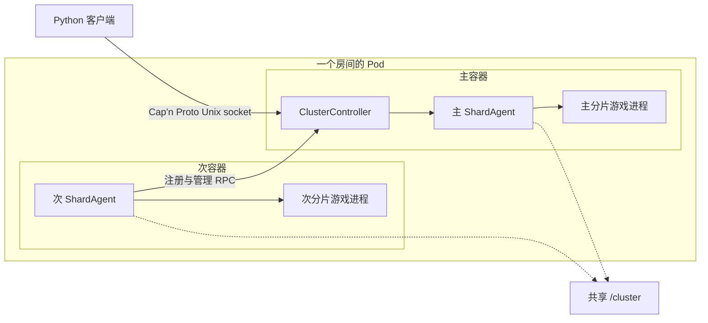
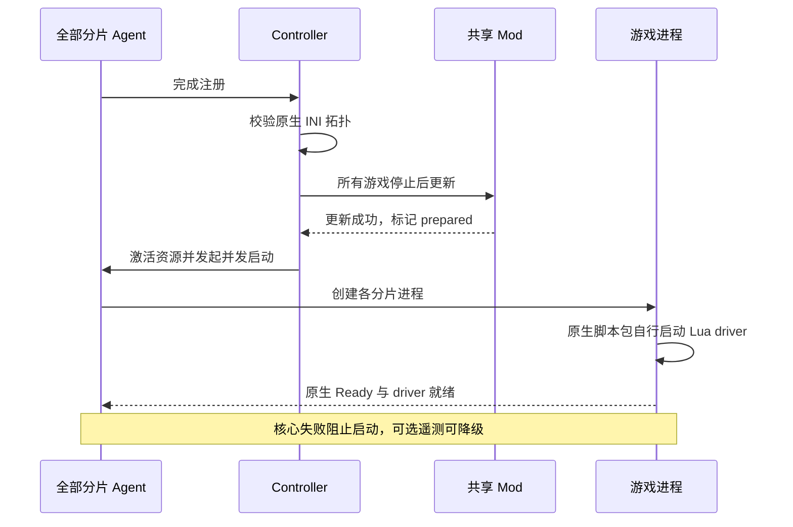
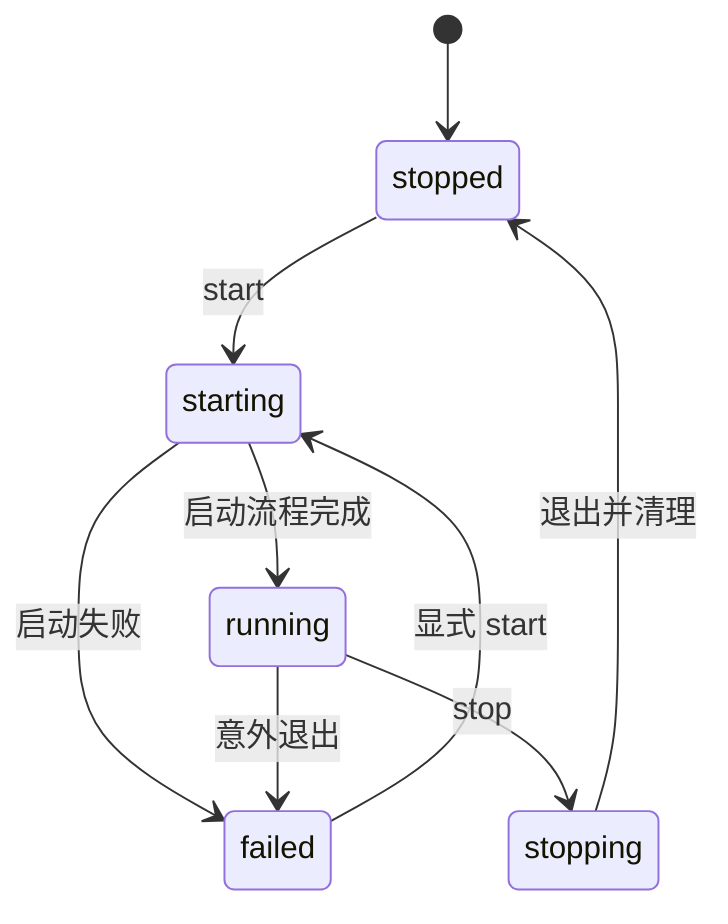
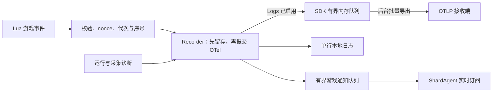

# 饥荒联机版专用服务器

[](https://steamcommunity.com/groups/lst99)
[](https://discord.gg/4N3aeNsFt8)

[English](README.md) | 简体中文

使用 Podman、systemd 和 Python SDK 部署与管理 Don't Starve Together（DST）服务器。
一个房间对应一个 Pod，每个容器中的 Agent 管理一个分片，主容器协调集群。

- **部署**：生成游戏配置与 Quadlet，统一管理森林、洞穴和 Mod。
- **管理**：通过本地 RPC 查询玩家与世界，执行保存、回档、重启和管理操作。
- **记录**：按需采集游戏事件，使用本地日志或 OTLP Logs 导出。

默认镜像：`quay.io/wh2099/dst-server:latest`；测试渠道：`:beta`。

## 目录

先看 [快速开始](#快速开始)，后续按任务跳转。

| 模块 | 常用入口 |
| --- | --- |
| [配置与部署](#配置与部署) | [目录布局](#目录布局) · [端口](#分片与端口) · [世界设置](#世界设置) · [配置 SDK](#配置-sdk) · [权限](#容器用户与目录权限) · [DNS](#容器-dns) |
| [统一 CLI](#统一-cli) | 创建与修改房间、模板、目标选择和 JSON 输出 |
| [日常维护](#日常维护) | 镜像更新、控制台与日志、定时和维护任务 |
| [运行机制](#运行机制) | [组件与通信](#组件与通信) · [生命周期](#生命周期与故障恢复) · [保存确认](#保存与世界重载) · [超时](#默认超时) |
| [RPC 与游戏 SDK](#rpc-与游戏-sdk) | [连接示例](#连接集群) · [共享请求](#共享请求与验证) · [接口索引](#接口索引) · [表情与动作](#表情与动作枚举) |
| [存档与导出](#存档与导出) | [文件说明](#存档文件) · [查询与回档](#快照查询与按天回档) · [导出与 R2](#导出与-r2-上传) |
| [Mod 管理](#mod-管理) | [原生更新](#原生-mod-更新) · [下载与启用](#声明下载与启用) |
| [遥测与历史日志](#遥测与历史日志) | [采集范围](#采集范围) · [OTLP](#otlp-配置) · [交付](#内存交付) · [日志边界](#日志边界) · [Netdata](#netdata-部署与查询) · [排障](#遥测排障) |
| [辅助工具](#辅助工具) | Klei 服务、玩家路径编码、Lua 注解 |
| [开发与验证](#开发与验证) | [模块边界](#模块边界)、依赖、检查命令、源码索引 |

## 快速开始

需要 Linux、Podman（支持 Quadlet）、systemd、[uv](https://docs.astral.sh/uv/getting-started/installation/) 和 Python `>=3.14.7`，Mod 清理依赖该版本的 [进程等待修复](https://github.com/python/cpython/pull/154171)。
宿主 CLI 部署命令在服务器上以 root 执行，可本地使用或通过 SSH 连接。

1. 安装含宿主管理功能的包，并在 [Klei 专服管理页面](https://accounts.klei.com/account/game/servers?game=DontStarveTogether) 创建 token。

   ```shell
   uv tool install --python 3.14 'dst-server[host]'
   export DST_SERVER_CLUSTER_TOKEN='replace-with-cluster-token'
   dst-server --help
   ```

2. 创建单个房间，模板与编号独立选择。

   ```shell
   dst-server template list
   dst-server room create 299 --template forge --max-players 9 \
     --volume-idmap 'uids=0-1000-1;gids=0-1000-1'
   ```

   这会生成 `/srv/dst/299` 和对应 Quadlet，不启动或覆盖已有房间。

   - 森林与洞穴使用 `pure_survival`，其他模板见 `template list`。
   - `--token-file /run/secrets/dst_cluster_token` 从文件读取 token。
   - 卷映射默认不设置；上述映射让容器 UID `1000` 可以使用 root 持有的文件。

3. 启动房间并查看日志。

   ```shell
   dst-server room start 299
   dst-server room status 299
   dst-server logs --room 299 --lines 100 --follow
   ```

   启动会检查镜像、准备 Mod、生成缺失的世界，并等待游戏真正就绪。
   `--no-wait` 只提交启动，`room wait 299` 可单独等待就绪。

   这样创建的房间使用本地 journald 日志；LST 整套部署预设还会配置 Netdata 导出。

在仓库中使用 `uv run --extra host dst-server ...` 或 `uv run --extra host python -m dst_server ...`。
安装后的两个入口提供同一套 CLI，不传子命令时显示帮助。
通过 SDK 生成 rootless 部署的方式见 [权限说明](#容器用户与目录权限)。

### 统一 CLI

| 命令 | 用途 |
| --- | --- |
| `room` | 创建、查看、修改、启停、重启、等待就绪和诊断房间。 |
| `template`、`deployment` | 查看或应用玩法模板，生成 LST 整套房间，安装自动维护单元。 |
| `schedule`、`maintenance` | 开放时段、空闲回收与服务内倒计时重启。 |
| `announce`、`player`、`world`、`mod` | 公告、玩家和权限、存档与世界、Mod 配置。 |
| `console`、`logs`、`rpc` | Lua 求值、历史日志、方法发现、直接调用与实时订阅。 |
| `scripts` | 构建和校验受管理的原生脚本包。 |
| `agent`、`annotations`、`completion` | 容器进程入口、Lua 注解、输出 shell 补全。 |

默认目录为 `/srv/dst` 和 `/etc/containers/systemd`。
通过 `--cluster-root` / `--quadlet-dir` 或 `DST_SERVER_CLUSTER_ROOT` / `DST_SERVER_QUADLET_DIR` 覆写。
全局选项放在命令之前：

```shell
dst-server --cluster-root /srv/dst --quadlet-dir /etc/containers/systemd --json room list
dst-server room stop 000-029,060-069,299
dst-server room edit 000-029,060-069 --max-players 9
dst-server room edit 299 --set '/cluster/settings/cluster_description="周五联机"'
dst-server room start 000-029,060-069,299
dst-server room show 299 --field /cluster/settings/max_players
dst-server room schema
dst-server announce '服务器将在八分钟后维护。' --room 299
dst-server world snapshots --room 299 --limit 10
dst-server world save --room 299
```

#### 目标与输出

- `room` 直接接房间编号，其他命令组使用 `--room`。
  支持逗号分隔、闭区间范围，以及相应命令提供的 `--template` / `--all`。
- `room list` 查找包含 `cluster.ini` 的三位编号目录；操作必须明确选择目标。
  批量操作逐房间返回结果，任一失败则退出码非零。
- stdout 非终端时使用单行 JSON，终端可加 `--json`。
  持续输出每条记录一行；诊断写入 stderr，非终端时转义内容中的换行。

#### 修改配置

- 执行 `room edit`、`template apply`、`mod enable/disable/set` 或 `schedule set` 前先停服，管理策略也一样。
  修改后手动启动。
- `room edit --set` 使用 JSON Pointer 路径和 JSON 值，`--unset` 删除设置。
- 世界生成设置不改变已有地图；需要替换时使用 `world regenerate`。

### LST 房间布局

LST 部署预设共 116 间房，编号为 `000–099` 和 `200–215`。

```shell
dst-server deployment lst --room 000,030,209 \
  --volume-idmap 'uids=0-1000-1;gids=0-1000-1'
dst-server room stop 299
dst-server template apply forge --room 299
dst-server room start 299
```

`deployment lst --all` 生成完整预设，创建会拒绝覆盖已有房间。
每日时段使用宿主本地时间：白饭 10:00–18:00、晚宴 18:00–00:00、夜饮 00:00–08:00。

| 玩法 | 常开 | 白饭 | 晚宴 | 夜饮 |
| --- | --- | --- | --- | --- |
| 纯净生存 | `000–015` | `016–019` | `020–027` | `028–029` |
| 纯净无尽 | `030–045` | `046–049` | `050–057` | `058–059` |
| 半纯生存 | `060–065` | `066` | `067–068` | `069` |
| 半纯无尽 | `070–085` | `086–089` | `090–097` | `098–099` |

特殊玩法房间全部常开：

| 房间编号 | 玩法 |
| --- | --- |
| `200–204` | 挂皮肤 |
| `205` | 冒险 |
| `206` | 暴食 |
| `207–209` | 熔炉 |
| `210–212` | 岛屿冒险 |
| `213–215` | 云霄国度 |

通用模板支持 `000–299` 任意槽位，包括永夜模板 `lights_out_survival` 和 `lights_out_endless`。
已有房间读取原生文件，不自动继承模板变化。

应用模板会替换玩法、世界和 Mod 配置。
房间编号、名称、介绍、密码、token、共享密钥及部署参数保持不变。
生成与维护也可通过包内异步 SDK 调用。

## 配置与部署

游戏配置与 Quadlet 共同决定目录、分片和网络，修改时需保持一致。

### 目录布局

一个集群使用一个宿主目录，所有分片容器将其挂载为 `/cluster`。
游戏安装位于镜像内的 `/install`。

```text
cluster/
├── .dst-control.json（可选）
├── cluster.ini
├── cluster_token.txt
├── adminlist.txt / blocklist.txt / whitelist.txt
├── mods/
│   ├── dedicated_server_mods_setup.lua
│   ├── modsettings.lua
│   └── ugc/
├── forest/
│   ├── server.ini
│   ├── worldgenoverride.lua
│   ├── modoverrides.lua
│   └── save/
└── cave/
    └── 与 forest 相同的分片文件
```

| 文件或路径 | 内容 |
| --- | --- |
| `cluster.ini` | 集群名称、访问限制、人数、玩法与分片连接设置。 |
| `cluster_token.txt` | Klei 专服 token。 |
| 三个权限名单 | 管理员、封禁和白名单，每行一个标识符。 |
| `<shard>/server.ini` | 分片身份、玩家与 Steam 查询端口、玩家存档路径编码。 |
| `<shard>/worldgenoverride.lua` | 世界生成和世界设置覆盖。 |
| `<shard>/leveldataoverride.lua` | 可选的完整关卡基线，事件世界需要。 |
| `<shard>/modoverrides.lua` | 当前分片启用的 Mod 及选项。 |
| `<shard>/save/` | 世界、人物快照与辅助数据，见 [存档文件](#存档文件)。 |
| `mods/` | 共享下载清单、Mod 内容和缓存，见 [Mod 管理](#mod-管理)。 |
| `.dst-control.json` | 房间策略 `template`、`schedule`、`recycle`、`paused`，以及最近活动记录；不存游戏和部署配置。 |
| `.dst-server.sock` | 运行时创建的集群 RPC socket。 |
| `.dst-operation.lock` | 宿主管理操作共用的一把锁，释放后保留空文件。 |
| `<shard>/dst_server_driver.json` | 每次游戏进程启动时提供给 Lua 的 nonce 和遥测参数。 |

**配置**来自原生 INI/Lua 文件与 Quadlet（含 systemd drop-in），不另存一份房间定义。
启动读取这些文件、准备 Mod，并补齐缺失的权限名单和 Mod 支持文件。

- 必须有 `cluster.ini`、`cluster_token.txt` 和各启用分片的 `server.ini`，且只有一个主分片。
- 只有含 `server.ini` 的目录才启用为分片。
  停用后保留其他文件与存档，便于再次使用。
- 配置和分片目录不能使用符号链接。

**活动记录**由 Agent 保存在内存中，不依赖遥测。
回收 timer 将分片世界 ID 和 `last_active_at` 写入 `.dst-control.json` 的 `activity`。
缺少该文件时，不执行定时启停和自动回收。

保留期计入停服时间，不区分正常或异常停机。
突然退出可能丢失上次 timer 检查后的活动；记录缺失或世界改变时，重新给足一轮保留期。

### 分片与端口

同一 Pod 内的分片共享网络命名空间。
多分片运行时需满足：

- 启用 `shard_enabled`，所有分片使用相同的非空 `cluster_key` 和 `master_port`。
- 每份 `server.ini` 显式声明 `is_master`；次分片还需名称及可连接的 `master_ip`，可继承集群设置。
- 同 Pod 部署通常使用 `master_ip = 127.0.0.1`。
- 显式设置分片 ID 时，主分片为 `1`，次分片从 `2` 开始且不能重复。
- `master_port`、各分片的 `server_port` 与 `master_server_port` 不能冲突。

| 端口分配 | 规则 |
| --- | --- |
| 宿主范围 | `30000–32999`，每个房间占一个十端口槽位。 |
| 房间槽位 | 任意模板支持 `000–299`，LST 整套部署预设覆盖 `000–099` 和 `200–215`。 |
| 分片数量 | 每个房间最多四个分片，只发布实际使用的 UDP 端口。 |
| 玩家连接 | `-external_port` 公告宿主映射端口，容器仍监听 `server.ini` 中的内部端口。 |

同时运行的房间必须使用不同槽位。
修改分片集合、主分片身份或发布端口时，重新生成配置与 Quadlet，并重建对应 Pod。

`cluster.ini` 的 `[NETWORK]` 管理名称与访问限制，`[GAMEPLAY]` 管理人数、PVP 和空房暂停。
完整字段、范围和默认值见 [ClusterSettings / ShardSettings](src/dst_server/configuration/models.py)。

SDK 默认 `encode_user_path=True`，始终在 `server.ini` 中写入当前值，也保留显式 `False`。
已有存档时，修改此值必须同步调整 [玩家目录](#玩家路径编码)。

### 世界设置

`worldgenoverride.lua` 需要 `override_enabled = true` 才会生效。
标准森林示例：

```lua
return {
    override_enabled = true,
    worldgen_preset = "SURVIVAL_TOGETHER",
    settings_preset = "SURVIVAL_TOGETHER",
    overrides = {},
}
```

| 世界 | 设置方式 |
| --- | --- |
| 洞穴 | 两个 preset 均使用 `DST_CAVE`。 |
| 无尽 | 保留 `game_mode = survival`，使用森林 `ENDLESS` preset 与洞穴对应 overrides。 |
| 熔炉 / 暴食 | `lavaarena` / `quagmire` 还需完整 `leveldataoverride.lua`，内置事件片段已包含。 |

优先组合 [内置配置片段](src/dst_server/configuration/presets.py)。
`leveldataoverride.lua` 提供关卡基线，`worldgenoverride.lua` 随后应用覆盖。
修改生成参数不会重建已有地图；游戏保存也可能重写设置，请停服后修改。

### 配置 SDK

从 `dst_server.configuration` 导入 `ClusterConfig`、`ClusterSettings`、`ShardConfig` 和 `ShardSettings`。

| API | 用途 |
| --- | --- |
| `ClusterConfig.load()` / `.save()` | 读取、校验和保存配置树。 |
| `.replace()` | 只更新传入的字段。 |
| `RoomPreset` | 组合配置片段。 |
| `QuadletApplication.for_cluster(..., allocation=RoomPortAllocation(...))` | 一起生成 Pod/容器单元、端口映射和启动参数。 |

世界选项对应固定的游戏源码，测试版专属选项需要相应版本支持。
只写入显式设置的覆盖项。
无尽森林与洞穴示例：

```python
import os
from pathlib import Path

from pydantic import SecretStr

from dst_server.configuration.presets import ENDLESS, FOREST_CAVES, compose

config = compose(FOREST_CAVES, ENDLESS).build(
    token=SecretStr(os.environ["DST_SERVER_CLUSTER_TOKEN"]),
)
config.save(Path("cluster"))
```

房间创建分为三层：

- **定义房间：**先构造 `ClusterConfig`，再创建 `Room(number=..., cluster=...)`；LST 房间直接用 `presets.lst.fleet_room(...)`。
- **离线写文件：**`room.save(directory, quadlet_dir=...)` 使用指定的绝对目录。
  `RoomStore(root, quadlet_dir).save(room)` 按编号写入 `root/NNN`。
- **管理部署：**`Host.create(room)` 拒绝覆盖已有房间；`Host.edit(room)` 检查房间已停机，并处理部署变更。

自定义 `Room` 可使用 `000–299` 任意槽位，默认不配置遥测导出。
LST 房间统一采用预设的遥测配置，可在保存前修改 `room.deployment.environment`。

离线保存保留游戏进度和权限名单，但不允许改变分片名称或主从角色；这些变更使用 `Host.edit()`。

批量创建时先构造全部房间，再逐个保存，避免写到一半才发现编号无效：

```python
from dst_server.rooms import Room, RoomStore

store = RoomStore(Path("/srv/dst"), Path("/etc/containers/systemd"))
rooms = [Room(number=number, cluster=config) for number in (0, 1)]
for room in rooms:
    store.save(room)
```

#### 共享密钥

构建配置、`load()` 和 `files()` 可省略 `cluster_key`，不会生成密钥或写文件。
`save(path)` 优先使用显式密钥，否则复用目录已有密钥，没有时才生成并写入 `cluster.ini`。
每个新目录各自生成密钥，单分片房间也一样。

#### 修改已有房间

`Room` 在内存中组合游戏配置、部署设置和运营策略。
`RoomStore.load(number)` 每次读取当前文件，也包含游戏自身的修改。
修改前先加载：保存会应用完整定义，包括时段和回收策略。

- 停服后使用 `room edit` 或 `Host.edit()`，编辑本身不启停服务。
- 离线保存要求现有游戏配置可正常解析。
  配置编辑只解析声明式 Lua，不执行脚本，遇到不支持的动态 Lua 会拒绝操作。
  启动和时段 `show` / `pause` / `resume` / `run` 不解析世界 Lua。
- 改动的原生文件会重新排版并移除原注释。
  文件逐个替换，不做跨文件事务；存档、权限名单和无关文件保持不变。
- 部署变更会重新生成 SDK 管理的 Quadlet 基础单元。
  本地定制放在 systemd drop-in；待修改字段仍被 drop-in 覆盖时会拒绝写入。

[ClusterClient](#连接集群) 的 `read_configuration()` 返回校验后的 `ClusterConfig`，无效配置抛出错误。
持久修改使用宿主操作。

### 容器用户与目录权限

镜像以 `steam` 用户运行，UID/GID 均为 `1000`。
生成器不会根据执行用户自动选择映射；`volume_idmap` 和 `userns` 默认均为 `None`。

| 部署方式 | 生成参数 | 生成位置与效果 |
| --- | --- | --- |
| rootless | `--userns 'keep-id:uid=1000,gid=1000'` | `.pod` 的 `[Pod]` 写入 `UserNS`，把部署用户映射为容器 `1000:1000`。 |
| rootful | `--volume-idmap 'uids=0-1000-1;gids=0-1000-1'` | 各 `.container` 的卷使用 idmap，宿主文件保持 `root:root`，容器看到 `1000:1000`。 |

宿主 CLI 的服务操作使用系统级管理器。
rootless 部署由普通部署用户通过包内 SDK 生成文件，再使用 `systemctl --user`：

```python
import os
from pathlib import Path

from pydantic import SecretStr

from dst_server.presets.lst import fleet_room

fleet_room(
    0,
    token=SecretStr(os.environ["DST_SERVER_CLUSTER_TOKEN"]),
    userns="keep-id:uid=1000,gid=1000",
).save(
    Path.home() / ".local/share/dst/000",
    quadlet_dir=Path.home() / ".config/containers/systemd",
)
```

```shell
systemctl --user daemon-reload
systemctl --user start dst-000-pod.service
journalctl --user -u dst-000-forest.service -f
```

rootful 部署使用 [快速开始](#快速开始) 的命令。
使用 `volume_idmap` 时，内核与数据文件系统必须支持 [idmapped mount](https://docs.podman.io/en/latest/markdown/podman-run.1.html#volume-v-source-volume-host-dir-container-dir-options)。

集群目录应属于部署用户，且不可被组或其他用户写入，以满足 RPC socket 的检查。
修改映射后需要重建 Pod。

### 容器 DNS

rootful Podman 可使用 [DNS 策略](deploy/containers/podman-dns.json)，将默认网络查询交给宿主机 systemd-resolved。
前提是 `127.0.0.53` stub 正常工作；宿主已配置 DNS over TLS 时，容器复用其上游策略。
这会影响默认网络上的所有容器。

在目标机生成候选配置，保留其网络身份与地址：

```shell
podman network inspect podman |
  jaq --slurpfile dns deploy/containers/podman-dns.json \
    '.[0] | del(.containers) | . + $dns[0]'
```

1. 备份网络配置、保存游戏，停止该网络的全部容器，包括 infra 和非 DST 容器。
2. 确认候选结果只改变 DNS 字段，以 `0644` 安装到 `/etc/containers/networks/podman.json`。
3. 重启受影响的 Pod 与服务，在容器内验证 DNS。

策略文件不能直接作为完整网络配置安装。
只重启游戏进程或执行 `podman network reload` 不会完整应用变更。

[返回目录](#目录)

## 日常维护

```shell
dst-server room status 299
dst-server room diagnose 299
dst-server world save --room 299
dst-server room restart 299
dst-server room stop 299
```

宿主关服、容器重启和 SDK `stop()` 不会隐式确认保存。
需要最新快照时，先等待 `world save` 或 SDK 的 [集群 `save()`](#保存与世界重载) 成功。
SDK `restart()` 在全部分片就绪时先确认保存，再执行完整的游戏重启。

### 玩家公告

[`dst_server.announcements`](src/dst_server/announcements.py) 提供：

| 类型 | 行为 |
| --- | --- |
| `Repeat` | 使用原生 `c_announce`，按游戏模拟时间每隔 `interval` 发送固定文案，共 `count` 次。 |
| `Countdown` | 使用 SDK 单调时钟，游戏暂停时仍推进倒计时。 |
| `maintenance()` | 关机、重启、Mod 更新、部署更新和定时关闭的中文模板。 |

每个世界只有一个重复公告槽位，新重复公告会替换旧公告。
一次性公告（`count=1`）及倒计时公告不影响它。

倒计时支持 `{remaining}` 剩余秒数、`{minutes}` 向上取整分钟数、`{when}` 和自定义名称。
不支持属性访问、下标、类型转换和格式说明符。

```python
from dst_server.announcements import Countdown, Repeat, Template, maintenance


async def notify(cluster):
    await cluster.announce(Repeat(message="欢迎来到本房间。", count=3, interval=30))
    await cluster.announce(
        Countdown(
            template="还有 {remaining} 秒开放{destination}。",
            delay=60,
            interval=10,
            parameters={"destination": "下一个房间"},
        )
    )
    await cluster.restart(notice=maintenance(Template.RESTART, estimated_duration=600))
```

模板可设置倒计时、公告间隔、预计耗时、房间或分片称呼，定时关闭还可设置下次开放时间。
其他文案或语言使用自定义 `Countdown`。

- SDK 生命周期操作默认倒计时 60 秒，每 30 秒公告一次，适用时提示预计耗时 5 分钟。
- 空房跳过倒计时；`notice=None` 跳过公告和等待，仍执行原操作。
- 宿主 `room start` / `stop` / `restart` 直接管理 systemd，不倒计时。
- 公告不代表已经确认保存进度。

```shell
dst-server announce '欢迎！' --room 299 --count 3 --interval 30
dst-server announce '还有 {remaining} 秒开放{destination}。' --room 299 \
  --countdown 60 --interval 10 --parameter destination=大厅
dst-server maintenance restart --room 299 --delay 2m --estimated-duration 10m
dst-server room stop 299
```

### 镜像更新

- `:latest` 跟随正式渠道，创建房间时用 `--image quay.io/wh2099/dst-server:beta` 选择测试渠道。
- `Pull=always` 在容器启动时检查远端镜像，`TimeoutStartSec=1800` 为启动预留 30 分钟。
- 已有房间先执行 `room stop`，通过 `room edit --set` 修改 `/deployment/image`，再执行 `room start` 应用。
- 宿主 `room restart` 重建容器并应用镜像、环境变量等容器设置。
- RPC `restart()` 和 `maintenance restart` 在现有容器内重启游戏、准备 Mod，不应用新镜像。

#### 构建与缓存

| 设置 | 行为 |
| --- | --- |
| 游戏层 | 按游戏版本和渠道缓存，仅修改 SDK 时可复用。 |
| 中间缓存 | 新镜像带有 `quay.expires-after=7d`，Quay 在七天后过期其标签。 |
| 最终成品 | `latest`、`beta`、版本标签和 hash 缓存别名均不过期。 |
| `force_build` | 重新构建已发布的游戏版本。 |
| `no_cache` | 禁用缓存层；与 `force_build` 同时使用可全新构建已发布版本。 |

标签过期不立即释放共享层，实际空间由 Quay 垃圾回收处理。
版本标签：正式版 `:<version>`，测试版 `:beta-<version>`。

工作流只从 `main` 发布镜像，不自动部署房间。
GitHub 并发控制会取消同一 ref 上较早的运行，因此重跑旧提交也可能打断新提交的运行。

### 控制台与日志

`console` 通过房间 Agent 的 RPC 执行 Lua，默认选择主分片：

```shell
dst-server console 'TheWorld.state.cycles + 1' --room 299
dst-server console 'print("hello"); return 1, nil, true' --room 299
dst-server console --file commands.lua --room 299
printf '%s\n' 'return TheWorld.state.cycles + 1' | dst-server console --room 299
dst-server console --room 299 --interactive
dst-server console --room 299 --interactive --follow
```

单次调用返回捕获的 print 输出、带类型的文本返回值，以及编译或运行错误，然后退出。
Lua 只执行一次，编译阶段区分表达式和语句。

交互模式只接受一个房间，通过 `--shard NAME` 指定次分片，`--follow` 同时显示后台日志。
Ctrl+D 关闭输入，Ctrl+C 清除当前输入行。
Lua 执行是可信管理操作，不代表保存已经确认。

```shell
dst-server logs --room 299 --lines 100
dst-server logs --room 299 --since yesterday --until now
dst-server --json logs --room 299 --cursor 's=...' --direction forward
dst-server logs --room 299 --follow
```

#### 历史与分页

Quadlet 使用 `LogDriver=journald`，按 journal 策略保留历次运行和宿主重启前的日志。
查询使用固定部署名称，房间停服、配置损坏或分片删除后仍可查询。

| 选项或结果 | 行为 |
| --- | --- |
| `--follow` | 默认读取 100 条历史，再由同一读取器持续跟随。 |
| 有限 `--json` 查询 | 返回 `records`、`next_cursor`、`has_more` 和有大小上限的诊断。 |
| `backward` / `forward` | 从新到旧（默认）/ 从旧到新；人类可读页面始终按时间正序展示。 |
| `next_cursor` | 保持原方向和过滤条件续查，替换原查询中的 `since`。 |

`cursor` 与 `since` 互斥。
限定时间范围时用 forward 分页并保留 `until`；backward 移除 `since` 后会失去时间下界。
不可用的游标抛出 `JournalCursorError`，已过期记录无法恢复。

#### SDK 读取器

`Host.journal()`、`Host.follow_journal()` 和 `Host.telemetry()` 接受单个或多个房间，不加载配置、不连接 systemd 或 RPC。
`Host.log_units()` 返回对应的历史 unit 选择。

- `shard=` 使用原目录名，也支持已删除的分片。
  显式指定分片可以等待它的第一条日志。
- 整房间 follow 在启动时确定 unit；要包含之后新建的分片，需重新订阅。
- 自定义 unit 或服务身份可直接使用 `dst_server.logs.JournalLogs` 或 `NetdataLogs`。

```python
import asyncio

from dst_server.host import Host
from dst_server.logs import JournalQuery


async def main():
    host = Host()
    page = await host.journal(299, JournalQuery(limit=50))
    print(page.model_dump_json())
    if page.has_more:
        older = await host.journal(299, JournalQuery(cursor=page.next_cursor, limit=50))
        print(older.model_dump_json())

    async with host.follow_journal(299, shard="forest") as stream:
        async for record in stream:
            print(record.message)
            break
    print(stream.diagnostics)


asyncio.run(main())
```

SDK follow 始终向前，默认不读历史；需要时传入 `JournalQuery(direction="forward", limit=100)`。
带 cursor 时读取其后所有保留记录，不受初始历史条数限制。

无效 follow 游标在首条记录或读取器退出时报告；退出上下文总会关闭并回收读取进程。

`JournalRecord.fields` 保留原始元数据、多值字段和二进制数组。
`message`、`unit`、`timestamp`、`cursor` 是派生视图，不改写原字段。

| 限制 | 默认值 |
| --- | --- |
| 两个读取器的单条记录 | 4 MiB，可通过构造参数调整。 |
| 有限查询总输出 | 64 MiB，可调整；follow 不限制累计大小。 |
| 诊断 | 最后 64 KiB，`diagnostics_truncated` 标记截断，空结果也保留警告。 |

RPC 订阅只推送实时记录；Netdata 查询另行导出的结构化事件。

### 定时与维护任务

```shell
dst-server room stop 299
dst-server schedule set 09:00-12:00 22:00-05:00 --room 299
dst-server room start 299
dst-server schedule show --room 299
dst-server schedule pause --room 299
dst-server schedule resume --room 299
dst-server deployment install
systemctl enable --now dst-room-schedule.timer
```

每日开放时段使用宿主本地时间，可以跨午夜。
`schedule set` 要求已停服；`show`、`pause`、`resume` 和 `run` 可在运行时使用。

| 操作 | 效果 |
| --- | --- |
| `room stop` / `schedule pause` | 暂停定时启停与回收；运行中房间仍可记录活动。 |
| `room start` / `room restart` / `schedule resume` | 恢复自动管理。 |
| `schedule set --always` | 移除开放时段。 |
| `schedule run` | 执行一次检查；同一分钟内重复调用可能重复公告。 |

计划关闭前八分钟，每分钟公告一次。
timer 每分钟检查时段，随后执行回收，时段检查失败也不影响后续回收。
策略来自各房间的 `.dst-control.json`；缺少时不定时启停，也不自动回收。

#### 安装自动维护

`deployment install` 写入 [包内 systemd 单元](src/dst_server/host/systemd)，timer 需单独启用。
单元执行 `python -m dst_server schedule run` 和 `python -m dst_server maintenance recycle`，使用当前 Python 解释器和部署路径。

这些路径或 Python 环境改变后，重新安装单元并启用 timer。

```shell
dst-server maintenance recycle --dry-run
dst-server maintenance restart --room 299 --delay 8m --estimated-duration 10m
```

`maintenance restart` 向每个运行中的 SDK 服务提交一次请求，并返回逐房间结果。
服务负责倒计时和游戏重启，房间的管理服务必须可连接。
需要重启容器时使用 `room restart`。

回收按当前游戏天数采用以下保留时间：

| 游戏天数 | 最近活动后的保留时间 |
| --- | --- |
| 1–8 天 | 6 小时 |
| 9–30 天 | 24 小时 |
| 31–70 天 | 36 小时 |
| 71–280 天 | 72 小时 |
| 281 天以上 | 168 小时 |

只有经过时间超过阈值、全部分片就绪且当前无人，才允许重置。
各房间独立检查，忙碌房间跳过；重置前再次核对世界身份与空房条件。

## 运行机制

集群控制、分片监督与游戏进程分别有自己的生命周期。

### 组件与通信



| 组件 | 职责与代码入口 |
| --- | --- |
| [daemon](src/dst_server/cluster/daemon.py) | 运行管理服务、注册连接与 systemd 通知。 |
| [Controller](src/dst_server/cluster/controller.py) | 维护预期分片名单，协调共享准备与集群操作。 |
| [Mods](src/dst_server/mods/__init__.py) | 准备共享 Mod 文件、执行更新器，维护一个房间的过期报告。 |
| [Agent](src/dst_server/cluster/agent.py) | 独占一个分片的进程资源，消费日志、生命周期、事件并处理遥测。 |
| [Supervisor](src/dst_server/runtime/supervisor.py) | 启动、停止和显式重启游戏进程，上报意外故障。 |
| [Server](src/dst_server/runtime/server.py) | 管理一次 DST 子进程及其通信通道；单次使用。 |

主容器运行 `dst-server agent master`，次容器运行 `dst-server agent serve <shard>`。
主 Agent 在进程内注册，次 Agent 通过 Pod 内的抽象 Unix socket `dst-server-registry` 注册。

| 通道 | 用途 |
| --- | --- |
| `/cluster/.dst-server.sock` | 公开 Cap'n Proto RPC。 |
| 游戏 FD 3 | 单行 `DST_RPC` JSON：版本、进程 nonce、请求 ID、Lua 代次、方法与参数。 |
| 游戏 FD 4 | 关联请求的 JSON 接收确认和结果；原生 Busy / Done 仅用于传输边界。 |
| 游戏 FD 5 | 原生 Ready、Session、Saved、Stopping 等生命周期事件。 |
| 游戏 stdout | 普通日志和游戏领域事件；stderr 合并到此通道。 |

[`-cloudserver` 与启动 wrapper](src/dst_server/runtime/fds.py) 建立 FD 3–5。
各分片串行发送命令，发送前确认游戏已读取前一块管道输入。

- **请求：**严格 JSON，含边界字符最多 4 KiB；只有 `evaluate`、`execute_script` 编译 Lua 源码。
- **响应：**最多 64 KiB，按 nonce、请求 ID 和 Lua 代次匹配；原生 Done 不代表命令成功。
- **重试：**仅重试明确未执行的原生 Busy 拒绝；已接收或结果不明的变更不自动重放。
- **超时：**FD 4 读取任务继续运行并丢弃迟到响应；遥测使用独立的 stdout 队列。

公开 socket 权限为 `0600`，父目录需由当前用户拥有且不可被组或其他用户写入。
内部抽象 socket 依赖 Pod 网络命名空间隔离，不提供文件权限边界。

### 生命周期与故障恢复

控制器等待全部 Agent 在 60 秒内以停服状态注册，再准备并启动集群。
它不接管另一个 Controller 遗留的运行中游戏。



| 操作 | 共享 Mod 与游戏进程 |
| --- | --- |
| 整服 `start()` | 准备共享文件，自动更新开启时更新 Mod，再启动所需分片；重复调用复用有效准备结果。 |
| 整服 `stop()` / `kill()` | 停止游戏并使准备缓存失效，后续 `start()` 重新准备。 |
| 整服 `restart()` | 公告、保存就绪游戏、停止全部游戏，即使自动更新关闭也检查更新共享 Mod，然后重新激活并启动全部分片。 |
| `stop()` → `update_mods()` → `start()` | 手动刷新；最后一步复用刚刚成功的更新。 |
| `update_mods(restart=True)` | 保存并停止运行中的游戏，更新一次，再在原容器内重启游戏。 |
| 游戏原生 Mod 过期报告 | 触发房间内部的一次维护，复用保存、停止、更新和启动流程。 |
| 显式重启单分片 | 复用已安装 Mod，不做共享更新。 |

共享更新要求全部 Agent 已连接、全部游戏进程已停止，包括失败后残留的 PID。
更新失败时保持停服，自动维护在 300 秒后重试。

内存中的 `prepared` 标记避免同一次服务运行中重复准备。
准备过程不改写世界设置。

下图只展示单分片游戏进程的主要状态，使用公开 RPC 的状态名称：



Supervisor 对每次启动或重启请求只尝试一次。
启动失败、意外退出（包括退出码为零）或 Agent 断线，都会停止其他游戏并使管理服务失败退出。
主动停服、重启和 Mod 维护属于预期退出。

| 恢复方式 | 行为 |
| --- | --- |
| 独立 SDK | 报告故障，由调用方决定何时重新启动。 |
| 主容器 | `Restart=on-failure`，间隔 30 秒，600 秒内最多启动三次。 |
| 次容器 | `Restart=no`，通过 `Wants`、`BindsTo`、`PartOf` 随主容器恢复。 |
| Pod 重启 | 通过主容器的 `PartOf` 关系重启全部分片。 |
| 达到启动限制 | 排除原因后，执行 `room start` 或 `room restart` 清除限制。 |

分片服务并行启停；游戏启动由 Agent 注册协调。
整房间启动会等待所有分片的命令接口可用，并确认游戏连接完整。
停服先发送 TERM，再由 Quadlet 等待容器退出并清理。
恢复后，客户端需重新连接 RPC 并订阅。

配置 `NOTIFY_SOCKET` 后，daemon 发送 `READY=1`，随后每 60 秒发送 `WATCHDOG=1`。
Quadlet 的 `WatchdogSec=300` 在连续五分钟无通知时触发房间恢复。

- **watchdog：**管理事件循环是否活跃。
- **`status.ready`：**存活游戏是否报告原生就绪。
- **`driver_health` / `driver_error`：**类型化接口是否就绪；故障可用 `health()` 排查。

FD 4 EOF 或写入失败会关闭控制通道；单条响应格式错误只使该请求失败。
关键观察流异常可能终止 Agent，触发容器恢复。

### 受管理的原生脚本包

镜像在安装 SDK 后构建并校验 `data/databundles/scripts.zip`。
独立安装也需在 `Server.start()` 前准备脚本包，输入必须是同一游戏版本已有的 `scripts.zip`。
SDK 不下载原生脚本，也不从游戏源码子模块构建原包。

```bash
dst-server scripts build /install/data/databundles/scripts.zip --output /tmp/scripts.managed.zip
dst-server scripts verify /tmp/scripts.managed.zip --source /install/data/databundles/scripts.zip
```

- **构建：**检查原生入口、替换旧 SDK 模块，校验新包后才输出。
  停服时可让 `--output` 与输入同路径，进行原子替换。
- **校验：**核对清单中的文件哈希、SDK 版本和原包摘要；`--source` 可与独立原包比对。
- **更新：**游戏或 SDK 更新后重新构建。
  打包工具可直接调用 [build_bundle / verify_bundle](src/dst_server/scripts.py)。

只替换空的 `scripts/globalvariableoverrides.lua`，保留其他原生文件内容。
原生 `main.lua` 在 Mod 之前加载此入口，经 `SpawnPrefabFromSim` 附加世界组件，在 `OnPostInit` 报告就绪。
无需 Mod 加载或 Console 注入。

Python 在每次进程启动前，将新 nonce 和遥测配置写入 `<shard>/dst_server_driver.json`。
Lua 每次 VM 启动都读取，包括重置和回档。
即使 profile 为 `off`，启动也需等待 driver 就绪；可选遥测失败仍会显示在健康状态中。

直接使用 `Server` 时，调用方需持续消费生命周期和游戏事件通知；Agent 自动完成这些读取。
诊断交给 Recorder 写本地日志，并按配置导出至 OTLP。
通知队列满时记录丢失，不阻塞就绪和保存确认。

### 保存与世界重载

`await cluster.save()` 通过主分片保存，等待其原生完成回调及其他分片的匹配快照。
成功后再停止、重启或 [导出](#导出与-r2-上传)。

- 通过集群或主分片发起；直接保存次分片会被拒绝。
- `ObservationCursor(attempt, sequence)` 排除旧进程、旧操作的通知。
- 请求已提交、原生 Done 和其他自动存档都不能确认本次保存。
- 空服可能覆盖前一个快照，编号不一定增长。

重新生成须确认各分片的世界 ID 都已改变。
原生重置和回档在同一游戏进程内创建新 Lua 代次。
bootstrap 通过 `TheSim:GetNumLaunches()` 和单行 `DST_DRIVER|` 记录追踪代次，不由 FD 5 Session 通知控制。

- 类型化请求等待当前 generation 的 driver 就绪；重置、回档和重新生成还等待新一代原生启动完成。
- 每个 VM 自行安装一次 Hook，无需 Console 命令；重复安装会报错，迟到的 Session 不会重装或清零事件序号。
- 写入前发现 generation 改变可以等待重试；写入后发生变化则报告结果不确定，不自动重放。
- `Server.execute()` 与类型化 Console 共用代次感知的 JSON RPC 和有界 Lua 求值器。

遇到超时或连接中断，已提交的保存、回档等操作可能仍在执行。
先查询状态或确认事件，再决定下一步。
实现见 [driver](src/dst_server/runtime/driver.py) 与 [保存完成回调](src/dst_server/lua/dst_server/commands.lua)。

### 默认超时

| 操作 | 默认预算 |
| --- | --- |
| 普通命令、类型化游戏请求 | 120 秒。 |
| 保存并等待确认 | 300 秒。 |
| 重置、回档、按天回档、重新生成 | 900 秒。 |
| 单次游戏启动及首次 driver 安装 | 900 秒。 |
| 游戏正常停止 | 120 秒，强制退出与输出清理另计。 |
| RPC 连接与握手 | 60 秒。 |

集群操作共用一个截止时间，包含就绪检查、转发和完成确认。
操作占用房间锁期间，其他变更请求会被拒绝。
重载预算包含全部分片确认和新 driver 就绪；按天回档还包含快照选择与结果核验。

RPC 预算见 [commands.py](src/dst_server/commands.py)：`Start`、`Restart`、`UpdateMods` 为三小时，`Stop`、`Kill` 为 120 秒。
服务端额外允许 30 秒，客户端总共额外允许 60 秒。
额外时间用于将操作结果送回客户端。

RPC 保留操作返回的错误；传输超时会将未确认变更标记为 `indeterminate`。
订阅 `next()` 使用长轮询。
Quadlet 的容器与 systemd 停止预算分别为 360 秒、420 秒。
默认值见 [timeouts.py](src/dst_server/timeouts.py)。

### 游戏启动参数

常规部署由 Agent 构造命令，无需手写参数。

| 参数 | 用途 |
| --- | --- |
| `-persistent_storage_root`、`-conf_dir`、`-cluster`、`-shard` | 定位集群与分片，容器最终读取 `/cluster`。 |
| `-external_port` | 公告宿主玩家端口。 |
| `-ugc_directory` | 共享 UGC 缓存。 |
| `-only_update_server_mods` / `-skip_update_server_mods` | 将 Mod 更新与正常游戏启动分开。 |
| `-monitor_parent_process` | 父进程退出时关闭游戏。 |
| `-cloudserver` | 建立本地进程通信。 |

自行持有游戏进程时，使用 [ServerConfig](src/dst_server/runtime/config.py) 设置路径和 `extra_args`。
其他原生参数见 [Klei 命令行指南](https://support.klei.com/hc/en-us/articles/360029556192-Dedicated-Server-Command-Line-Options-Guide)。

[返回目录](#目录)

## RPC 与游戏 SDK

RPC 为已部署的集群提供类型化接口，游戏 SDK 也可嵌入自行管理进程的应用。

### 连接集群

安装包后可在仓库之外使用 SDK，在仓库中也可用 `uv run python your_script.py`。
以下示例从宿主机连接快速开始生成的房间：

```python
import asyncio
from pathlib import Path

from dst_server.rpc import ClusterClient, rpc_runtime


async def main() -> None:
    socket = Path("/srv/dst/299/.dst-server.sock")
    async with rpc_runtime():
        async with await ClusterClient.connect(socket) as cluster:
            status = await cluster.status()
            print(status)
            print(await cluster.shard(status.master).status())


asyncio.run(main())
```

宿主路径为 `/srv/dst/<room>/.dst-server.sock`，容器内为 `/cluster/.dst-server.sock`。
`connect()` 必须传入路径，并在 `rpc_runtime()` 上下文内调用。

### 共享请求与验证

[commands.py](src/dst_server/commands.py) 的 `Request[T]` 声明参数、结果类型、作用域、超时和世界重载行为。
Python 与 Lua 共用命令名称；本地 Controller、游戏客户端和 RPC 客户端在执行前验证同一份 Pydantic 请求。
无效参数和超出入口范围的命令会被拒绝。

[api.py](src/dst_server/api.py) 的 `ClusterAPI`、`ShardAPI`、`PlayerAPI` 为 `invoke(request)` 提供便捷方法。
`from dst_server import commands as c` 后，`shard.world()` 与 `shard.invoke(c.World())` 使用同一契约。
直接传请求可覆盖超时，例如 `c.World(timeout=30)`。

Cap'n Proto 通过 `call` 传命令，通过订阅传观测记录。
只读 `ClusterConfig` 保留省略字段、显式 `False` 和世界覆盖类型。
结果与状态见 [models.cluster](src/dst_server/models/cluster.py)，`DriverHealth` 见 [models.driver](src/dst_server/models/driver.py)。

| 异常 | 结果 |
| --- | --- |
| 业务错误 | `RemoteError`。 |
| 已提交的变更丢失响应 | RPC 抛出 `IndeterminateError`，游戏边界抛出 `IndeterminateCommandError`。 |
| 调用方取消 | `asyncio.CancelledError`；已提交的变更可能继续，查询则释放工作。 |

已接受的变更在断连后继续执行；结果未确认时不自动重放。
共享异常与错误码见 [errors.py](src/dst_server/errors.py)。

### 直接 RPC 与 Console 结果

先查看运行中服务端提供的方法，再直接调用：

```shell
dst-server rpc list --room 299
dst-server rpc describe evaluate --room 299 --shard xforge
dst-server --json rpc call status --room 299
dst-server rpc call execute_json --room 299 --shard xforge \
  -f 'source=return TheWorld.state.cycles + 1'
dst-server rpc subscribe events --room 299
```

- `rpc describe`：查询运行中服务端的参数/结果 schema、作用域、超时和副作用。
- `rpc call`：`--input request.json` 读取 JSON，`--input -` 读取标准输入；`-f name=value` 可重复使用，支持 JSON 或字符串。
- `--shard`：指定分片；省略时调用集群。
- `rpc subscribe`：订阅实时 `logs`、`lifecycle` 或 `events`，不重放历史。

类型化 SDK 提供同样的 console 结果：

```python
from dst_server.models.console import ConsoleResult
from dst_server.rpc import ShardClient


async def inspect_console(shard: ShardClient) -> None:
    result: ConsoleResult = await shard.evaluate('print("hello"); return 1, nil, true')
    print(result.output)
    print([(value.type, value.text) for value in result.values])
    print(result.error, result.truncated)
```

`error.kind` 区分编译与运行错误，`truncated` 表示输出达到限制。
任意 Lua 对象返回有界文本，程序需要 JSON 值时使用 `execute_json()`。

### 接口索引

| 对象 | 常用接口 |
| --- | --- |
| `cluster` 生命周期 | `status()`、`start()`、`stop()`、`restart()`、`kill()`、`update_mods()`。 |
| `cluster` 配置与世界 | `read_configuration()`、`save()`、`pause()`、`reset()`、`rollback()`、`rollback_to_day()`、`regenerate()`、`list_snapshots()`。 |
| `cluster` 玩家与管理 | `list_players()`、`get_player()`、`announce()`、`whitelist()`、`unwhitelist()`、`is_whitelisted()`、`execute_all()`。 |
| `cluster.shard(name)` | 分片生命周期、`status()`、`room()`、`world()`、`runtime()`、`health()`、`mods()`、`connected_shards()`、`save()`、`list_snapshots()`、`regenerate_shard()`。 |
| `shard.players` | 查询人物与库存、踢出、封禁、解封、管理员状态、生命状态、传送、跨分片迁移、物品增减。 |
| `cluster` / `shard` 订阅 | `subscribe("logs")`、`subscribe("lifecycle")`、`subscribe("events")`；通过 `async with` 管理订阅，再 `await subscription.next()`。 |
| `shard.evaluate(lua)` | 对表达式或语句执行一次，以 `ConsoleResult` 返回 print 输出、带类型的文本值和错误。 |
| `shard.execute(lua)` | 执行 Lua，返回显式 `print` 的文本。 |
| `shard.execute_json(lua)` | 通过类型化 driver 返回 JSON，例如 `"return TheWorld.state.cycles + 1"`。 |

参考：[方法签名](src/dst_server/api.py)、[请求契约](src/dst_server/commands.py)、[RPC 协议](src/dst_server/rpc/schema/rpc.capnp)、[返回模型](src/dst_server/models)。
历史进程输出用 [日志查询](#控制台与日志)，已导出事件用 [Netdata](#netdata-部署与查询)。

常规 Pod 部署使用 `ClusterClient`。
直接管理进程时使用 `dst_server.runtime.Server`，自行消费通知并清理进程。
将运行中的 `server.game` 传给 SDK 函数：

```python
from dst_server import commands as c
from dst_server.game import GameClient


async def inspect_game(game: GameClient) -> None:
    world = await game.invoke(c.World())
    day = await game.invoke(c.ExecuteJson(source="return TheWorld.state.cycles + 1"))
    players = await game.players.list()
    print(world, day, players)
```

`GameClient.request_save()` 仅提交原生保存请求；需要等待确认时使用 `Server.save()` 或集群/分片的 `save()`。

### 表情与动作枚举

`dst_server.game` 为原生表情字符和动作命令提供静态枚举。
SDK 运行时不读取游戏 Lua 文件。

| 枚举 | 值与附加字段 |
| --- | --- |
| `Emoji` | 50 个原生表情字符，提供 `chat_token` 与账号物品类型 `item_type`。 |
| `Emote` | 32 个原生动作命令名，提供 `slash_command`、`category`、`item_type`、`aliases`。 |
| `EmoteType` | 轮盘分类：`EMOTION=0`、`ACTION=1`、`UNLOCKABLE=2`。 |

```python
from dst_server.game import Emoji, Emote, EmoteType

assert Emoji.BEEFALO == "\U000f0001"
assert Emoji.BEEFALO.chat_token == ":beefalo:"
assert Emoji.ALCHEMY.item_type == "emoji_alchemyengine"
assert Emote.WAVE.slash_command == "/wave"
assert Emote.WAVE.category is EmoteType.EMOTION
assert Emote.WAVE.aliases == ("waves", "hi", "bye", "goodbye")
```

`Emoji` 和 `Emote` 都是 `StrEnum`，可直接用作字符串和 JSON 值。
构造器接受 `Emote("wave")` 等原生值；聊天标记、斜杠写法、别名及未知值会抛出 `ValueError`。

- `item_type` 是账号物品类型，不是单件库存 ID；普通动作可为 `None`。
- 表情位于 U+F0000–U+F0031，需要游戏字体。
- 轮盘发送不带 `/` 的命令名；`EmoteType` 是分类，不是网络动作编号。
- 所有权、姿态、语言别名与 Mod 新增内容以运行中的游戏为准。

原始映射：[emoji_items.lua](dst-scripts/scripts/emoji_items.lua)、[emotes.lua](dst-scripts/scripts/emotes.lua)、[emote_items.lua](dst-scripts/scripts/emote_items.lua)。

## 存档与导出

快照用于恢复游戏进度，导出将配置与存档打包为可分享的归档。

### 存档文件

每个分片分别保存世界与人物状态。
`shardindex.session_id` 标识该分片生成的世界，不代表玩家的一次登录。
以下是启用玩家路径编码时的典型布局，文件和目录按需创建：

```text
<shard>/save/
├── shardindex
├── shardindex_time
├── session/
│   └── <session-id>/
│       ├── 0000000001
│       ├── 0000000001.meta
│       └── <encoded-user-id>/
│           ├── 0000000001
│           ├── 0000000001.meta
│           └── savelocation
├── profile
├── modindex / boot_modindex
├── cached_userid
├── server_temp/server_save
├── client_temp/
├── event_match_stats/
├── world_presets/
└── mod_config_data/
```

| 文件 | 内容 |
| --- | --- |
| `shardindex` | `world` 世界选项、`server` 服务设置、`session_id` 世界 ID、`enabled_mods` 启用 Mod 与配置、`version` 索引格式版本。 |
| `shardindex_time` | `created` 与 `saved`，创建及最近保存的 Unix 秒数；保存时保留创建时间。 |
| 世界数字快照 | 地图、道路、拓扑、持久实体、世界与网络组件状态、Mod 记录，以及可选在线玩家清单。 |
| 世界 `.meta` | `clock` 与 `seasons` 摘要，供回档列表读取天数、阶段和季节。 |
| 人物数字快照 | 角色、位置、年龄、皮肤、生命、饥饿、理智、库存、装备、背包、配方等组件状态。 |
| 人物 `.meta` | 原版仅写入 `character = player.prefab`。 |
| 人物 `savelocation` | 可选原生二进制历史，记录快照与分片，供读取人物存档时定位。 |

- 快照 ID 不是天数：天数为 `clock.cycles + 1`，同一天可保存多次。
- 人物快照 ID 可不连续，也不一定与每份世界快照对应。
  世界保存包含 `AllPlayers`，部分人物事件单独保存，由引擎在加载时选择文件。
- 内部 `savedata.meta` 记录构建版本、种子、世界类型和存档版本，与独立 `.meta` 摘要不同。

| 辅助路径 | 用途 |
| --- | --- |
| `profile` | 运行环境偏好，逻辑内容为 JSON，包含控制、启动信息、收藏 Mod、预设与提示状态。 |
| `modindex` / `boot_modindex` | Mod 管理状态的 Lua 表 / `loading` 或 `done` 启动标记。 |
| `cached_userid` | 引擎保存的服务器账号 Klei ID，不是 token 或人物快照。 |
| `server_temp/server_save` | 世界初始化时的精简地图副本，去掉实体、快照、地块、导航等，不能还原完整世界。 |
| `client_temp/` | 引擎维护的客户端临时数据。 |
| `event_match_stats/` | 活动统计 CSV；原版写入分支排除专服。 |
| `world_presets/` | `.wsp` 世界设置和 `.wgp` 生成设置，包含基础预设、覆盖项、名称、描述与版本。 |
| `mod_config_data/` | Mod 配置及选定值，常见文件名为 `modconfiguration_<modname>`，Mod 也可写额外数据。 |

纯净服也可能创建 Mod 管理文件。
Mod 可扩展 `OnSave()` 数据或另写文件；磁盘文件可能带 KLEI 封装、压缩或末尾 NUL。

原生实现：[索引](dst-scripts/scripts/shardindex.lua)、[世界保存](dst-scripts/scripts/mainfunctions.lua)、[人物](dst-scripts/scripts/networking.lua)、[实体](dst-scripts/scripts/entityscript.lua)、[加载](dst-scripts/scripts/saveindex.lua)。

### 玩家路径编码

启用 `encode_user_path` 时，在线玩家使用 Klei ID 对应的 12 位目录编码。
已有存档切换编码时，必须同步：

1. 人物目录名。
2. `server.ini` 的 `[ACCOUNT].encode_user_path`。
3. `shardindex.server.encode_user_path`。

保留全部人物快照、`.meta` 和 `savelocation`。
编码只改路径，`cached_userid` 等文件中的 Klei ID 不变。
SDK 转换函数见 [辅助工具](#辅助工具)。

### 快照查询与按天回档

`cluster.list_snapshots(limit=100, before=None)` 查询主分片当前 session。
`cluster.shard(name).list_snapshots()` 查询指定分片。
以下代码放在 [集群连接](#连接集群) 的上下文中：

```python
catalog = await cluster.list_snapshots(limit=100)
for snapshot in catalog.snapshots:
    day = snapshot.metadata.day if snapshot.metadata is not None else None
    print(snapshot.snapshot_id, day)

if catalog.has_more and catalog.snapshots:
    older = await cluster.list_snapshots(before=catalog.snapshots[-1].snapshot_id)
```

| 返回或参数 | 含义 |
| --- | --- |
| `SnapshotCatalog` | `session_id`、按快照 ID 从大到小排列的 `snapshots`、`has_more`。 |
| `limit` / `before` | 每页 1–100；`before` 不包含边界，下一页传前页最后一个 ID。 |
| `Snapshot` | 原生 `snapshot_id`、相对 `save/` 的 `world_file`、类型化 `metadata`。 |
| `metadata=None` | 世界文件、元数据文件或原生路径缺失。 |
| `metadata.day=None` | 元数据不足以确定天数。 |

Agent 拒绝路径逃逸、符号链接、无效元数据和查询期间的 session 变化。
独立读取可用 [models.snapshot](src/dst_server/models/snapshot.py)：

- `WorldSnapshotMetadata.load(path)`：读取 `clock`、`seasons` 及嵌套字段，天数为 `clock.cycles + 1`。
- `PlayerSnapshotMetadata.load(path)`：读取 `character`，支持 Mod 角色。

加载器接受 UTF-8 Lua 字面量、原生文本文件头和末尾 NUL。
忽略 Mod 在 `clock` / `seasons` 中新增的字段，拒绝其他未知字段、错误类型和动态表达式。
不解释 Mod 自定义日历。

`cluster.reset()` 与 `cluster.rollback(0)` 加载最新保存的存档。
`cluster.rollback(1)` 加载它的前一份存档；次数按存档列表计算，不受距上次保存的时间影响。
回档开始前，所有分片都必须有选中的存档。

`await cluster.rollback_to_day(day, timeout=900)` 核对 session、协调全服回档，并返回选中的 `Snapshot`。
选择当天所有分片都有完整匹配存档的**最早一份**，跳过天数未知的记录。
没有完整匹配时失败，不按 ID 猜测天数。

保留策略与回档会截断历史，完成后应重新查询目录。

### 导出与 R2 上传

运行导出的进程需安装 `export` extra，镜像默认只包含 `otel`：

```shell
uv sync --extra export
```

先保存并停止游戏，再将配置与存档打包为 `.7z`：

```python
import shutil
from pathlib import Path

from dst_server.archive import export_cluster

with export_cluster(Path("/srv/dst/000")) as archive:
    destination = Path("/path/to/exports") / archive.filename
    with destination.open("xb") as output:
        shutil.copyfileobj(archive.stream, output)
```

目标目录需已存在，导出文件由调用方管理。
SDK 的临时流可读取、定位，离开 `with` 后自动清理。

- **文件名：**`DST-<room-id>-<UTC时间>.7z`，例如 `DST-000-20260909T010203Z.7z`。
  `room_id` 默认取源目录名。
- **配置：**`configuration=` 只修改分享包，分片名称与主从角色必须保持一致。
  源目录始终必填。
- **压缩：**ZSTD 级别 22，使用 `py7zr` 或 `7-Zip-zstd`；原版 `7z` 不一定支持。

| 归档内容 | 处理方式 |
| --- | --- |
| SDK 支持的游戏配置 | 保留世界与 Mod 声明，清除密码及所有部署用 `cluster_key`。 |
| `save/session/` | 保留游戏和 Mod 进度，包括人物快照、`.meta` 和 `savelocation`，排除 SDK 文件及目录。 |
| 已有 `save/shardindex` | 保留世界、session 与 Mod 信息并清除凭据；缺失时不补建。 |
| 额外进度 | 保留 `save/recipebook`、`save/reforged_achievements_server`、`save/mod_config_data/mod_worldjump_data_*`。 |
| 不包含 | token、权限名单、日志、Mod 内容、UGC 缓存、SDK 控制文件、锁、socket、驱动配置及其余辅助索引。 |

导出会移除 Steam 组设置、空 `[STEAM]` 段和存档中的 `clan` 数据。
组专属可见性改为公开，其他设置保留。
接收方提供自己的 `cluster_token.txt`，再用 `ClusterConfig.load(path)` 和 `save(path)` 生成共享密钥。

`encode_user_path=True` 按需转换人物路径，并同步配置与 `shardindex` 的标志。
传 `False` 保留源目录名和设置。
仅有 `saveindex`、`shardindex` 损坏或格式不支持的存档无法导出。

导出只扫描一次，需先停服或使用不变的副本。
检查文件类型、路径、重名冲突和凭据，不监控并发写入。

上传 R2 时可直接传入 S3 连接配置和凭据：

```python
from pathlib import Path

from pydantic import SecretStr

from dst_server.archive import export_cluster

with export_cluster(Path("/srv/dst/000")) as archive:
    result = archive.upload(
        endpoint="https://<account-id>.r2.cloudflarestorage.com",
        bucket="your-bucket",
        access_key_id=SecretStr("your-access-key-id"),
        secret_access_key=SecretStr("your-secret-access-key"),
        object_prefix="rooms/exports/",
        url_prefix="https://downloads.example.com/",
    )

print(result.key)
print(result.url)
```

| 上传参数 | 类型 | 默认值 | 环境变量回退 |
| --- | --- | --- | --- |
| `bucket` | `str \| None` | `None` | `AWS_BUCKET` |
| `endpoint` | `str \| None` | `None` | `AWS_ENDPOINT_URL_S3` 优先，其次 `AWS_ENDPOINT` |
| `region` | `str` | `"auto"` | 无；参数覆盖 `AWS_REGION` |
| `access_key_id` | `SecretStr \| None` | `None` | `AWS_ACCESS_KEY_ID` |
| `secret_access_key` | `SecretStr \| None` | `None` | `AWS_SECRET_ACCESS_KEY` |
| `session_token` | `SecretStr \| None` | `None` | `AWS_SESSION_TOKEN` |
| `object_prefix` | `str` | `""` | 无 |
| `url_prefix` | `str \| None` | `None` | 无 |

凭据必须使用 `SecretStr`，只在创建 `S3Store` 时解包，不会进入归档。
显式值覆盖环境配置；`None` 按字段回退到 [obstore 环境配置](https://developmentseed.org/obstore/latest/api/store/aws/#obstore.store.S3Config)。
即使两个密钥已显式传入，省略的 `session_token` 仍可能来自环境变量。

`upload()` 从流开头上传，返回 `ArchiveUploadResult`：

| 字段 | 值 |
| --- | --- |
| `key` | `object_prefix + archive.filename`；相同 key 会覆盖原对象。 |
| `url` | 未传前缀时为 `None`，否则为 `url_prefix + key.rsplit("/", 1)[-1]`。 |

两个前缀按字面拼接，需自行包含 `/`、`?file=` 等分隔符。
`object_prefix` 不能以 `/` 开头；两者都没有环境变量回退，URL 不从 endpoint 推导。

`region="auto"` 适用于 [R2](https://developers.cloudflare.com/r2/api/s3/api/#bucket-region)，其他 S3 区域需显式设置。
[obstore 处理 multipart 上传](https://developmentseed.org/obstore/latest/api/put/)。
异常向调用方传播，本地临时文件仍会清理。

失败上传可能残留远端分片，R2 默认七天后清理。
可通过 [生命周期规则](https://developers.cloudflare.com/r2/buckets/object-lifecycles/) 调整。

[返回目录](#目录)

## Mod 管理

集群共享 Mod 文件，更新完成后才启动游戏。
自动更新默认开启：

- 启动时下载；运行中任意分片报告 Mod 过期时，触发房间维护。
- 同时收到的报告合并为一次更新；房间有人时先公告倒计时，再停服。
- 更新失败或重启后仍报告过期，等待 300 秒再重试。

检测依赖游戏回调，包括其对客户端必需 Mod 和暂停模拟的处理限制，不自行轮询 Workshop，也不依赖遥测。
下载成功不保证所有 Mod 均为最新，重启后继续检测。

通过 `await cluster.status()` 查看状态：

| 字段 | 内容 |
| --- | --- |
| `mod_update` | `enabled`、`pending`、`updating`、`retry_in_seconds`、`error` |
| `shards[*].outdated_mods` | 当前分片 `game_attempt` 报告的 Mod 显示名 |

### 原生 Mod 更新

SDK 只使用游戏自带的 `-only_update_server_mods` 下载器。

| 环境变量 | 用途 |
| --- | --- |
| `DST_SERVER_MOD_AUTO_UPDATE` | 默认 `true`；`false` 关闭启动下载和 Mod 过期后的自动更新。 |
| `DST_SERVER_MOD_PROXY` | 可选 HTTP(S) 下载代理；子进程清除继承的常见代理变量。 |

通过房间部署设置或 Quadlet drop-in 配置，然后重建容器。
关闭自动更新后，启动只准备本地文件；显式 `update_mods()` 和 `agent prepare` 仍会下载。

每次更新只尝试一次，复用游戏下载缓存，超时为 30 分钟。
非零退出、缺少完成标记、setup 错误或下载错误均视为失败。
手动调用直接返回失败；自动维护等待 300 秒后重试。

### 声明下载与启用

共享清单位于 `mods/dedicated_server_mods_setup.lua`，使用双引号静态调用：

```lua
ServerModSetup("1803285852")
-- ServerModCollectionSetup("1234567890") -- 替换为实际合集 ID 后取消注释。
```

SDK 创建或编辑房间时，将启用的 Workshop Mod 及 `modsettings.lua` 中 `ForceEnableMod` 的项目纳入下载清单。
启动只读取清单，不改写。

手工编辑时，在 `dedicated_server_mods_setup.lua` 声明下载项，在各分片的 `modoverrides.lua` 设置启用状态与选项。
下载和启用是独立操作。

- 配置编辑只接受受支持的声明式 Lua、双引号 ID 和至多一个末尾 return。
- 底层 `dst_server.mods` 函数保留动态脚本，交给游戏执行。
  `mods.prepare()` 和 `cluster.service.prepare_shared()` 支持这条路径。
- Mod 代码由游戏执行，Python 不靠 Lua 版本字段判断更新。

共享更新时机统一见 [生命周期表](#生命周期与故障恢复)。

| 操作 | 行为 |
| --- | --- |
| `cluster.update_mods(restart=True)` | 在现有容器内保存、停止、更新并重启游戏 |
| `cluster.update_mods()` | 要求游戏已停止；下次 `start()` 复用成功的更新 |
| `mod update --room 000` | 要求房间服务已停止；使用房间锁和临时容器，完成后保持离线 |

取消时停止下载器，并等待临时容器清理。

[返回目录](#目录)

## 遥测与历史日志

OpenTelemetry 用 Logs 记录游戏事件与运行诊断，用 Traces 记录管理操作，用 Metrics 记录计数。
采集、导出和保留策略分别配置；分片 `ready` 不代表遥测健康。

### 采集范围

CLI 使用 `DST_SERVER_TELEMETRY_PROFILE`，默认 `critical`。
SDK 使用 `TelemetrySettings(profile=..., actions=...)`，通过 `ServerConfig.telemetry` 或 Agent 启动参数传入。

| Profile | 采集内容 |
| --- | --- |
| `off` | 保留本地活动观察、原生 Mod 过期检测和管理 RPC |
| `critical` | 玩家聊天、公告、皮肤、骰子、投票、进入、离开、出生、死亡复活、迁移、落水与坠落；重要实体死亡、分片连接、Boss、裂隙、世界状态和暂停 |
| `history` | 增加战斗、物品、玩家状态、技能、猎犬预警、钓鱼、种植和允许列表中的 Action 结果 |

#### 登录与活动

- `dst.client.authenticated` / `disconnected` 覆盖尚无玩家实体的客户端。
  `dst.connection.closed` 保留原生原因码，不猜测玩家 ID，也不将迁移视为登录失败。
- `dst.server.presence` 在启动后及每 60 秒记录客户端、分片实体、容量和驱动健康，暂停时也继续运行。
  快照按玩家 ID 去重并校正人数；迁移和缺失事件会影响在线时长统计，不能视为精确会话记录。
- `spawned` 发生在出生定位前（`position=null`），`shard_entered` 表示进入分片，`loaded` 表示客户端完成握手。
  `off` 时，`loaded` 仅更新内存活动时间。

#### 其他事件语义

- 聊天保留发送者信息、正文、悄悄话/表情标志及可取得的实体信息，遵循原生长度限制。
  不同分片的观察记录不按正文去重。
- 公告保留原生类型和正文；系统消息、皮肤、骰子另有独立事件。
  皮肤通知只有姓名，没有账号 ID。
- 投票记录主分片的 `started`、`cast`、`closed`、`result`。
  `closed` 发生在结果计算前，不代表取消；管理员公告不构成投票。
- 死亡记录覆盖玩家、`epic` 实体及可归因于玩家的死亡。
  复活区分 `ghost`、`corpse`、`charlie`；战斗来源 `from_doattack` 未知时保留 `null`。
- 暂停事件区分服务器标志（`domain=server`）和模拟状态变化（`domain=simulation`）。
  世界状态名称接受 Mod 标识符，世界生成配置保持独立约束。
- 事故记录实际落水或坠落；进食包括普通食物和 Wortox 灵魂。

`history` 的默认 Action 列表见 [遥测配置](src/dst_server/telemetry/config.py)；`actions=()` 仅关闭 Action 包装。
Profile 不关闭 Python 诊断、Metrics 或 Traces，也不删除历史。
可选采集模块失败时报告阶段，其余模块继续运行。

### OTLP 配置

镜像已包含 OTLP 依赖；独立使用 SDK 时安装 `dst-server[otel]`。
各类信号均使用 OpenTelemetry SDK 的 gRPC 导出器。
设置以下任一变量后，Agent 初始化导出：

- `OTEL_EXPORTER_OTLP_ENDPOINT`
- `OTEL_EXPORTER_OTLP_LOGS_ENDPOINT`
- `OTEL_EXPORTER_OTLP_METRICS_ENDPOINT`
- `OTEL_EXPORTER_OTLP_TRACES_ENDPOINT`

`OTEL_SDK_DISABLED=true` 跳过初始化，游戏事件仍按 Profile 输出本地日志。
压缩可不设置或使用 `gzip`，Logs 默认每条最多 128 个属性。
mTLS 通过 SDK 环境变量配置 CA 证书及客户端私钥、证书。

| 配置 | 行为 |
| --- | --- |
| `OTEL_LOGS_EXPORTER`、`OTEL_METRICS_EXPORTER`、`OTEL_TRACES_EXPORTER` | 仅支持 `otlp`、`none`，默认 `otlp` |
| `OTEL_EXPORTER_OTLP_*` | 配置 endpoint、headers、证书、压缩和超时；传输固定使用 gRPC |
| 所有导出模式 | 接受的事件和诊断先写本地单行 `DST_RECORD\|...`；启用 Logs 时额外通过 OTLP 导出 |
| 显式启用后的依赖或初始化失败 | Agent 报错退出，不自动回退到本地日志 |

同机 Netdata 的 Logs 和 Metrics 配置放在 Quadlet 的 `[Container]`：

```ini
Environment=DST_SERVER_TELEMETRY_PROFILE=history
Environment=OTEL_EXPORTER_OTLP_LOGS_ENDPOINT=http://10.255.255.254:4317
Environment=OTEL_EXPORTER_OTLP_METRICS_ENDPOINT=http://10.255.255.254:4317
Environment=OTEL_TRACES_EXPORTER=none
```

手动定制写入 `.container.d/*.conf` drop-in，然后重新加载并重启房间服务。
宿主 shell 的 `export` 不覆盖容器环境。

`deployment lst` 配置这两个 endpoint，同时导出 SDK 队列及导出指标。
房间 `000–099` 使用 `history`，`200–215` 使用 `critical`。
没有 Netdata 时，通过 `room edit --set` 将以下字段均设为 `"none"`：

- `/deployment/environment/OTEL_LOGS_EXPORTER`
- `/deployment/environment/OTEL_METRICS_EXPORTER`

单独创建的房间默认不配置导出 endpoint。
直接调用 `QuadletApplication.for_cluster()` 时，通过 `telemetry_environment` 显式传入环境变量。

### 内存交付



事件模型见 [events](src/dst_server/events)，可识别的诊断见 [operational.py](src/dst_server/runtime/operational.py)。
Python 校验类型、字段、UTF-8 和进程 nonce；`DST_OTEL|` 加 JSON 上限为 64 KiB，不计原生时间戳。

接受的事件先写本地日志并提交 OTel，再交付实时通知。
健康状态和在线快照立即更新，不依赖消费者；重复或过时记录直接丢弃。

| 入口计数 | 含义 |
| --- | --- |
| `telemetry_invalid` | 事件校验失败 |
| `telemetry_dropped` | 实时通知被丢弃，不影响已经提交到 OTel 的记录 |
| `telemetry_gaps` | 源序号缺口；快照会校正人数，但不补造登录、退出时间 |

采集诊断按限频计数报告拒收、序号缺口、通知丢弃和超长行。
它们不经过通知队列，也不回显被拒收的正文。

| 边界 | 行为与限制 |
| --- | --- |
| 提交 | 同步提交到内存，事件消费和实时订阅不等待网络导出 |
| 实时通知 | 容量 1,024，满时丢弃最旧项；关闭后仍可读取已入队记录 |
| SDK 队列 | 默认 2,048 条，每批最多 512 条，调度间隔一秒；队列满时丢弃最旧记录 |
| 导出失败 | SDK 在导出超时内重试临时错误，默认超时十秒；最终失败或被拒收的记录直接丢弃 |
| 关闭与重启 | 关闭时请求 SDK 完成待导出记录，仍允许丢失；重启不重放 |

本地 `DST_RECORD` 保留事件名、正文、时间、严重程度、UID、来源属性及已配置的 OTel 资源属性。
这些日志受 journal 保留策略和限流影响，接收端恢复后不会自动重放。

SDK 队列及导出指标默认开启，可用 `OTEL_PYTHON_SDK_INTERNAL_METRICS_ENABLED=false` 关闭。
导出这些指标需要启用 Metrics；SDK 导出丢失不计入上述入口计数。

游戏事件的 `log.record.uid` 为 `nonce:generation:seq`，不保证后端自动去重。
Lua `events_emitted` 是已分配的最高序号，不代表已经送达。

### 日志边界

Python 读取合流的游戏 stdout/stderr；命令、响应、生命周期分别使用独立的 FD 3、4、5。
stdout 标记不能完成命令、推进 Session 或确认保存。

CLI 将 Agent 日志写到容器 stderr，转义内部 CR、LF、NUL，使每条 Python 日志（包括异常堆栈）保持单行。
Podman 的 journald driver 通过 conmon 转交 journal；普通 Python 日志不会自动导出到 OTLP。

| 输入 | 处理方式 |
| --- | --- |
| 普通日志、未知报错、堆栈 | 保留文本；已识别诊断也保留原始日志 |
| 接受的事件和诊断 | 游戏通知入队前写单行 `DST_RECORD\|...` 并提交可选 OTLP；高频事件增加 journal 体积 |
| 已识别但无效的事件 | 按原因限次输出结构化拒收诊断，不回显 payload |
| 聊天、源码位置、错误正文中嵌入 `DST_OTEL` | 保留为普通日志 |
| 原生 `DST_Stats` | 在输入端丢弃 |

- 仅行首 `DST_OTEL|` 被识别，之前可带原生时间戳；nonce 关联进程尝试，不认证同一 Lua VM 内的 Mod。
- 不同写入者交错到同一物理行时，不能保证恢复事件；损坏事件拒绝，未识别片段保留，后续完整行继续处理。
- 底层物理行超过 1 MiB 会整行丢弃，同时输出结构化诊断和 Metrics；不进入事件校验计数 `telemetry_invalid`。
- 诊断严重程度来自明确签名和退出结果，不根据任意 `ERROR`、`PANIC` 或堆栈文本推断崩溃。
- [conmon][conmon-logging] 按 LF 处理容器输出，长行可能带部分消息标记；journal 优先级不能还原游戏 stderr。

**文本保留：**结构化事件和类型化 RPC 拒绝非法 UTF-8，普通日志用 U+FFFD 替换非法字节。
合法 Unicode 原样保留，包括游戏 [Emoji](dst-scripts/scripts/emoji_items.lua)，详见 [Unicode 说明][unicode-utf8]。

截断保留完整码点，不保证完整组合字形。
仅 LF 分隔物理记录；普通日志在 SDK 出口保留 NUL，再由 CLI 转义。
终端和 journal 工具的呈现可能不同。

#### 日志测试语料与来源

[混合流测试](tests/runtime/test_operational.py) 将短签名与时间前缀、换行、分块和损坏方式组合。
以下来源仅提供测试样例，不用于判断当前故障的根因。

| 语料 | 来源与分类边界 |
| --- | --- |
| Lua / Mod traceback | [原始报错][lua-error]；只识别已知 header，不逐帧分类 |
| 缺少可选 Mod 文件 | [mods.lua](dst-scripts/scripts/mods.lua) 的成功跳过分支 |
| 游戏 Workshop / SteamCMD 超时 | [游戏报错][game-workshop]、[SteamCMD 报错][steamcmd-timeout]；后者只是相似输出负例 |
| Worldgen | [原始报错][worldgen-error]、[原生实现](dst-scripts/scripts/worldgen_main.lua)；重试不等于退出 |
| Steam SDK / 段错误 | [原始报错][native-error]；监督进程文字只是负例，退出以返回码或信号确认 |
| 缺少共享库 | [原始记录][loader-error]；Lua 启动前的动态加载器 stderr |
| 鉴权 / DNS | [token 报错][token-error]、[DNS 报错][dns-error]；另构造当前 CURL 格式样例 |
| bind 端口失败 | [原始报错][bind-error]；单次尝试不证明最终启动失败 |

[解析](tests/telemetry/test_stream.py)、[RPC](tests/game/test_protocol.py)、Lua 和 [CLI](tests/telemetry/test_integration.py) 测试覆盖校验、采集、编码与分流。
实际 journald 存储和渲染需在部署环境验证。

**访问控制：**事件可能包含未脱敏的玩家 ID、姓名、聊天（含悄悄话）、坐标、动作和物品历史。
本地日志与接收端应采用相同保护；关闭 OTLP 或切换 Profile 不会删除已有记录。

### Netdata 部署与查询

先在宿主安装 Netdata，再将仓库配置放到对应位置并启动服务。

| 仓库配置 | 宿主位置与用途 |
| --- | --- |
| [otel.yaml](deploy/netdata/otel.yaml) | `/etc/netdata/otel.yaml`：监听 `10.255.255.254:4317`，日志放在 `/srv/otel` |
| [netdata.conf](deploy/netdata/netdata.conf) | `/etc/netdata/netdata.conf`：Web 界面仅绑定 localhost |
| [loopback 地址](deploy/networkd/10-netdata-loopback.network) | `/etc/systemd/network/10-netdata-loopback.network`：为 `lo` 添加专用地址 |
| [服务依赖](deploy/netdata/netdata.service.d/dependencies.conf) | `/etc/systemd/system/netdata.service.d/dependencies.conf`：等待网络和存储挂载 |

本例要求 systemd-networkd 已启用，并由上述 `.network` 文件管理 `lo`。
安装配置后：

1. 准备 `/srv/otel`，确保 Netdata 运行用户可写。
2. 执行 `networkctl reload` 和 `networkctl reconfigure lo`，确认 `ip address show dev lo` 包含 `10.255.255.254/32`。
3. 执行 `systemctl daemon-reload` 和 `systemctl restart netdata`，确认接收端监听后再启动房间。

保留同时受九年、1 TB、500,000 文件约束，不保证每条日志保留九年。
专用地址不提供身份认证；跨主机或隔离不可信容器时需配置 TLS、鉴权和网络访问控制。

`NetdataLogs` 在宿主直接执行 `/usr/lib/netdata/plugins.d/otel-plugin`，读取 `/etc/netdata/otel.yaml`。
调用进程需要插件、配置与存储的访问权限；此接口不属于 Cluster RPC。

```shell
dst-server logs telemetry --room 299 --since 2026-09-12T00:00:00Z --limit 100
dst-server --json logs telemetry --room 299 --since 2026-09-12T00:00:00Z --filter event_name=dst.player.shard_entered
```

可重复使用 `--filter FIELD=VALUE` 和 `--field FIELD` 设置匹配与字段投影。
OTel CLI 时间必须带时区，来源诊断同时写入 stderr。

```python
import asyncio
from datetime import UTC, datetime, timedelta

from dst_server.host import Host
from dst_server.logs import NetdataLogQuery


async def main():
    result = await Host().telemetry(
        0,
        NetdataLogQuery(
            since=datetime.now(UTC) - timedelta(minutes=15),
            limit=100,
        ),
        shard="forest",
    )
    print(result.model_dump_json())


asyncio.run(main())
```

| 查询设置 | 语义 |
| --- | --- |
| `since` / `until` | UTC 整秒区间 `[since, until)`；省略的结束时间在排队前捕获，包含当前秒 |
| `service_name` / `limit` | 默认不限服务 / `200`；Host 以稳定的房间属性限定范围 |
| `service_namespace` | 需要服务名；省略或空字符串选择空 namespace，不代表所有 namespace |
| `filters` / `query` / `fields` | 精确匹配 / `key=value` 正则搜索 / 返回字段；玩家过滤可用 `body.player.userid` |
| 并发 / 超时 | 默认 1 / 120 秒，包含并发槽位等待；超时清理查询进程 |
| 结果 | 最新有限条、后端报告的 `matched`、实际时间窗、`truncated` 与有界诊断；没有 cursor 或 follow |

**过滤：**同字段多个值取 OR，不同字段取 AND。
`Host.telemetry()` 管理房间/分片过滤，拒绝调用方重复设置。
查询包含同一房间编号此前的服务名和世界，可用事件、session 或 attempt 进一步筛选。

**记录：**`NetdataLogRecord.fields` 保留有序重复字段，`values(key)` 返回同名字段的全部值。
扁平字段不会还原为原始 OTel 值类型。

**完整性：**`matched` 是后端报告的数量；跳过文件时可能同时返回结果和警告。
诊断截断导致 summary 不可见时，`matched` 和 `truncated` 为 `None`。
离线查询可能看不到正在写入的记录，也无法读取已 offload 且无本地副本的文件。

### 遥测排障

`await cluster.shard(name).status()` 返回驱动状态与入口计数；`health()` 主动查询当前 Lua driver。

| 观察结果 | 处理 |
| --- | --- |
| `driver_health.telemetry_status=disabled` | Profile 为 `off`，需要游戏事件时修改配置并重启 |
| `active` | Hook 已安装，继续检查 SDK 导出日志和接收端 |
| `degraded` / `failed` | 回调曾出错 / 安装失败；检查 `last_error`、`errors`，同一 Lua module state 不自动重试安装 |
| `telemetry_invalid` / `telemetry_dropped` / `telemetry_gaps` 增长 | 检查 schema、nonce、源序号缺口、队列饱和与关闭状态，结合本地事件日志比对 OTLP |
| SDK 导出报错或接收端缺失记录 | 检查 endpoint、接收端、TLS、凭据和 SDK 日志；失败记录不会保留等待恢复 |
| 启用导出后 Agent 启动失败 | 检查 OTLP 依赖和 SDK 配置 |

分片状态不提供导出交付计数。

[返回目录](#目录)

## 辅助工具

| 模块 | 入口与用途 |
| --- | --- |
| [Klei 服务](src/dst_server/klei) | 安装 `dst-server[klei]`，用 `KleiClient` 查询构建、更新页面、地区、Lobby 与房间详情 |
| [账号目录编码](src/dst_server/klei_id.py) | `encode_klei_id()` / `decode_klei_id()` 在 Klei ID 与 12 位存档目录编码之间转换 |
| [Lua 注解](src/dst_server/annotations) | `dst-server annotations`，或 Python 的 `generate_components()` / `generate_modutil()` |

用 `async with` 管理 `KleiClient` 连接。

- `get_latest_build()` 读取构建列表，`get_versions()` 只读取当前更新页面。
- `get_regions()`、`get_lobbies()` 查询公开列表，`get_rooms()` 需要 `access_token`。
- Lobby 和房间默认并发分别为 8 和 24，请求失败分别返回空元组和 `None`。
  批量结果省略失败的房间；无效响应结构仍报错。
- 注入的 HTTP 客户端由调用方关闭；默认客户端不读取代理环境变量。

账号目录转换接受 `KU_[0-9A-Za-z_-]{8}` 格式的 Klei ID，以及由 `0–9`、`A–V` 组成的 12 位编码。
无效输入抛出 `ValueError`。

Lua 注解需要先按 [开发与验证](#开发与验证) 初始化游戏源码子模块。

```console
uv run dst-server annotations dst-scripts/scripts/components --output components_def.lua
uv run dst-server annotations dst-scripts/scripts/modutil.lua --output modutil_def.lua
```

工具根据 Lua 语法生成 LSP 类型注解和空函数声明。

- 自动识别输入类型，也可指定 `--mode components|modutil`。
- 递归扫描目录内的 Lua 文件，`--max-workers 1` 禁用并行处理。
- 解析失败即终止，并保留已有输出。

游戏源码阅读入口见 [DST Lua 索引](dst-scripts/index/README.md)。

## 开发与验证

Controller 与远端调用方共用请求、状态和错误，不导入 RPC client 或 wire schema。
Pydantic 负责配置与部署模型的验证和序列化。

### 模块边界

| 模块 | 职责 |
| --- | --- |
| [models](src/dst_server/models) / [events](src/dst_server/events) | 业务值、状态、driver 健康、游标与事件 |
| [commands.py](src/dst_server/commands.py) / [api.py](src/dst_server/api.py) / [errors.py](src/dst_server/errors.py) | 共享请求、结果、调用范围、接口与错误 |
| [configuration](src/dst_server/configuration) | 配置模型与 INI/Lua 文件读写 |
| [cli](src/dst_server/cli) | 命令参数、文本与 JSON 输出 |
| [host](src/dst_server/host) / [rooms](src/dst_server/rooms.py) | systemd、房间视图、日志、定时与维护 |
| [presets](src/dst_server/presets) | 玩法模板与 LST 部署预设 |
| [deployment](src/dst_server/deployment) | Quadlet 模型、端口与部署单元 |
| [mods](src/dst_server/mods) | Mod 配置、文件、更新与调度 |
| [lua_codec.py](src/dst_server/lua_codec.py) / [json_codec.py](src/dst_server/json_codec.py) | Lua/JSON 转换与校验，不读写文件 |
| [process.py](src/dst_server/process.py) | 子进程输出与进程组清理 |
| [runtime](src/dst_server/runtime) | 游戏进程、FD 协议、就绪与命令确认 |
| [cluster](src/dst_server/cluster) | Agent 拓扑、协调操作、订阅与 daemon 组装 |
| [rpc](src/dst_server/rpc) | Cap'n Proto 连接、数据传输与远端订阅 |
| [telemetry](src/dst_server/telemetry) | 采集与 OpenTelemetry 导出 |
| [archive.py](src/dst_server/archive.py) | 存档去凭据导出、7z 归档与上传 |
| [concurrency.py](src/dst_server/concurrency.py) / [timeouts.py](src/dst_server/timeouts.py) | 取消清理与超时 |
| [klei](src/dst_server/klei) / [annotations](src/dst_server/annotations) / [logs](src/dst_server/logs) | 外部查询、Lua 注解与历史日志 |

Logbook 负责日志，`python-ulid` 生成标识，HTTPX2 处理 HTTP/2 请求。
可选依赖分为 `klei`（HTML）、`otel`（OTLP/gRPC）和 `export`（7z/对象存储）。

### 测试与检查

先安装 Lua 5.1、LuaJIT 和 just。
游戏源码子模块需要 GitHub SSH 访问权限。

```console
git submodule update --init
uv sync --all-extras --all-groups
uv run prek install
just verify
```

#### 本地命令

依赖链为 `fmt → lint → tc → test → build → verify`，每条命令先执行前置依赖。

| 命令 | 操作 |
| --- | --- |
| `just fmt` | 格式化 Python 和 Markdown |
| `just lint` | 应用 lint 修复 |
| `just tc` | 检查类型 |
| `just test` | 使用锁定依赖运行测试，排除 `system` |
| `just build` | 构建 Python 包 |
| `just verify` | 再运行仓库钩子和隔离安装检查 |
| `just check` | 独立检查锁文件、格式、lint、类型和 Markdown，不修改文件 |

prek 钩子运行 `just check`；内置空白和文件格式钩子仍可能修改文件。

#### CI

PR、镜像和发布工作流共用 [test.yml](.github/workflows/test.yml) 中的显式命令。
依赖先通过 `uv sync --locked` 安装，后续命令通过 `uv run --no-sync` 复用环境。

发布依次验证标签、运行共享测试，再构建并检查安装包。
隔离安装检查按包的元数据解析依赖，不使用项目的可选依赖和锁文件。

#### 原生与系统测试

Lua 测试默认使用游戏源码子模块；镜像 CI 使用所构建镜像中的脚本包。
要验证已安装的游戏版本：

```console
uv run --locked --all-extras pytest tests --scripts-zip /path/to/scripts.zip
```

缺少 Lua 5.1 或 LuaJIT 时，本地跳过对应测试，CI 则报错。

| 显式启用的系统验证 | 前提 |
| --- | --- |
| `just test-system IMAGE` | 明确指定本地镜像，准备 rootful Podman；Quadlet 测试还需要 systemd |
| `just test-netdata-system IMAGE` | 再准备本机 Netdata，验证 OTLP 完整往返 |

系统测试需要显式启用，会启动游戏或访问外部服务。
缺少镜像、权限或运行环境时会报错。

测试按行为分组。
配置测试检查源码字段覆盖与脚本兼容性，Hypothesis 验证 Lua、字节流与事件顺序。
进程和传输测试使用本地管道、socket 和 HTTP/gRPC 服务，并用显式同步点验证取消竞态。

两份 README 的章节、示例和链接保持同步。
图表使用 Mermaid 的 [流程图](https://mermaid.js.org/syntax/flowchart.html)、[时序图](https://mermaid.js.org/syntax/sequenceDiagram.html) 和 [状态图](https://mermaid.js.org/syntax/stateDiagram.html)。

[返回目录](#目录)

[conmon-logging]: https://github.com/containers/conmon/blob/44136f533e0bbb6810f3b5272273e1c932d980f4/src/ctr_logging.c
[unicode-utf8]: https://unicode.org/faq/utf_bom.html
[lua-error]: https://steamcommunity.com/app/322330/discussions/0/610573009235763156/
[game-workshop]: https://steamcommunity.com/workshop/filedetails/discussion/3490072866/599653921546396863/#c599658601187030609
[steamcmd-timeout]: https://discourse.cubecoders.com/t/customization-with-application-deployment-steamcmd-mods-timeout/24828
[worldgen-error]: https://steamcommunity.com/app/322330/discussions/0/2968393780771713862/#c2968393780771779261
[native-error]: https://steamcommunity.com/app/322330/discussions/0/351659808477347616/
[loader-error]: https://prinsss.github.io/deploy-dont-starve-together-dedicated-server/
[token-error]: https://steamcommunity.com/app/322330/discussions/0/3051633726587393889/#c3051633726589638324
[dns-error]: https://forums.kleientertainment.com/forums/topic/72877-curl-error-lobbyckleientertainmentcom-could-not-resolve-host-lobbyckleientertainmentcom-unknown-error/
[bind-error]: https://steamcommunity.com/app/322330/discussions/0/2564160288793879918/#c2564160288793897483
