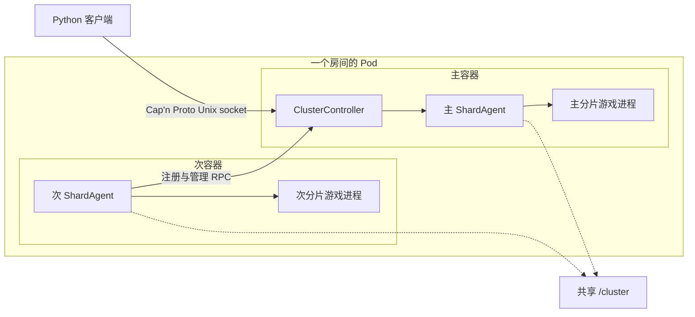
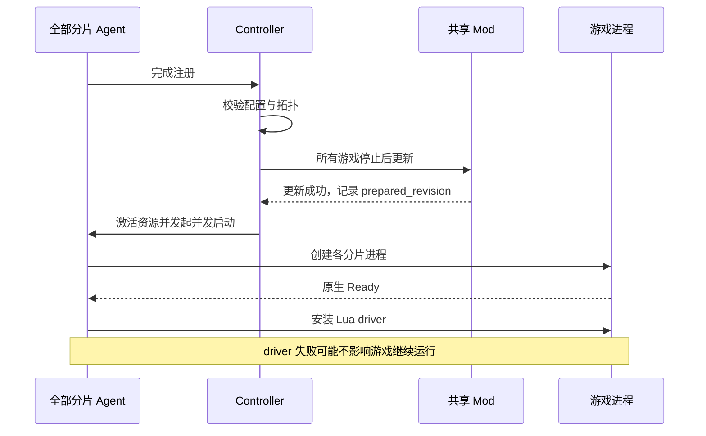
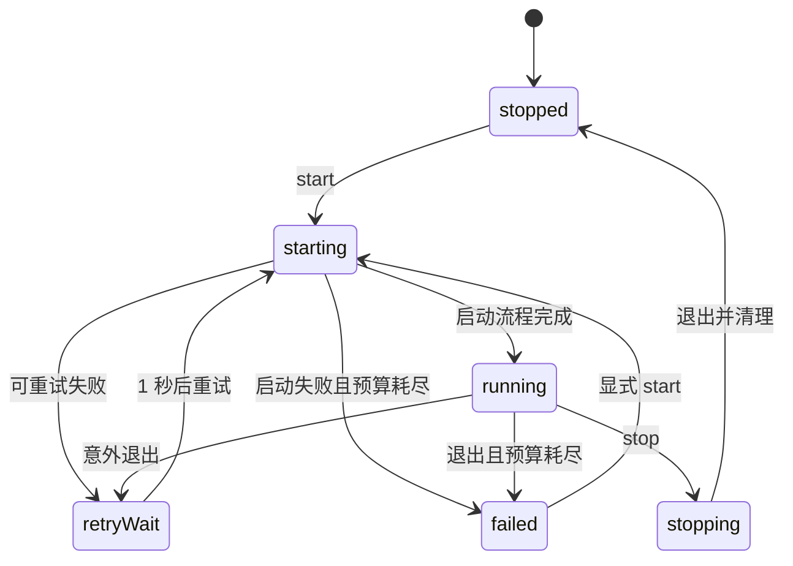
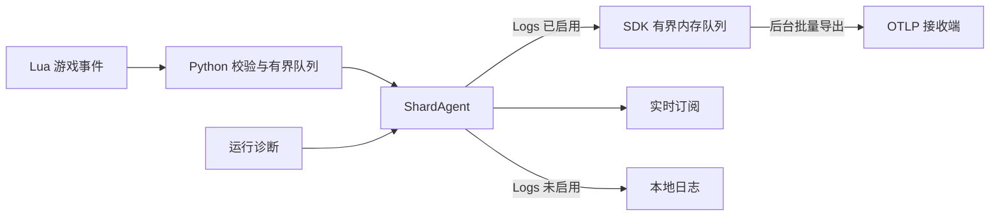

# 饥荒联机版专用服务器

[](https://steamcommunity.com/groups/lst99)
[](https://discord.gg/4N3aeNsFt8)

[English](README.md) | 简体中文

使用 Podman、systemd 和 Python SDK 部署与管理 Don't Starve Together（DST）服务器。
一个房间对应一个 Pod，每个分片由一个长驻 Agent 容器管理游戏进程，主容器负责集群协调。
默认镜像为 `quay.io/wh2099/dst-server:latest`，测试渠道使用 `:beta`。

- **部署**：生成游戏配置与 Quadlet，统一管理森林、洞穴和 Mod。
- **管理**：通过本地 RPC 查询玩家与世界，执行保存、回档、重启和管理操作。
- **记录**：按需采集游戏事件，使用本地日志或 OTLP Logs 导出。

## 目录

先看 [快速开始](#快速开始)，后续按任务跳转。
两种语言均包含完整的模块文档。

| 模块 | 常用入口 |
| --- | --- |
| [配置与部署](#配置与部署) | [目录布局](#目录布局) · [端口](#分片与端口) · [世界设置](#世界设置) · [配置 SDK](#配置-sdk) · [权限](#容器用户与目录权限) · [DNS](#容器-dns) |
| [日常维护](#日常维护) | systemd 命令、镜像更新、恢复控制台 |
| [运行机制](#运行机制) | [组件与通信](#组件与通信) · [生命周期](#生命周期与故障恢复) · [保存确认](#保存与世界重载) · [超时](#默认超时) |
| [RPC 与游戏 SDK](#rpc-与游戏-sdk) | [连接示例](#连接集群) · [共享请求](#共享请求与验证) · [接口索引](#接口索引) · [表情与动作](#表情与动作枚举) |
| [存档与导出](#存档与导出) | [文件说明](#存档文件) · [查询与回档](#快照查询与按天回档) · [导出与 R2](#导出与-r2-上传) |
| [Mod 管理](#mod-管理) | [更新器](#选择更新器) · [下载与启用](#声明下载与启用) · [Workshop SDK](#独立-workshop-sdk) |
| [遥测与历史日志](#遥测与历史日志) | [采集范围](#采集范围) · [OTLP](#otlp-配置) · [交付](#内存交付) · [日志边界](#日志边界) · [Netdata](#netdata-部署与查询) · [排障](#遥测排障) |
| [辅助工具](#辅助工具) | Klei 服务、玩家路径编码、Lua 注解 |
| [开发与验证](#开发与验证) | [模块边界](#模块边界)、依赖、检查命令、源码索引 |

## 快速开始

需要 Linux、Podman（支持 Quadlet）、systemd 和 [uv](https://docs.astral.sh/uv/getting-started/installation/)。
项目要求 Python `>=3.14.7`，`uv run` 会按项目配置准备 Python 与依赖。
以下命令由拥有集群目录的普通用户执行。

1. 获取项目，并在 [Klei 专服管理页面](https://accounts.klei.com/account/game/servers?game=DontStarveTogether) 创建 token。

   ```shell
   git clone https://github.com/LetsStarveTogether/dst-server.git
   cd dst-server
   export DST_SERVER_CLUSTER_TOKEN='replace-with-cluster-token'
   ```

2. 生成一个森林与洞穴房间及其 Quadlet。

   ```shell
   uv run python -m scripts.generate_rooms 0 \
     --userns 'keep-id:uid=1000,gid=1000' \
     --cluster-root "${HOME}/.local/share/dst" \
     --quadlet-dir "${HOME}/.config/containers/systemd"
   ```

   token 来自文件时，改用 `--token-file /run/secrets/dst_cluster_token`，文件优先于环境变量。
   `0` 只生成房间 `000`；可传入多个编号，例如 `0 20 139`。
   不传编号会生成全部 `000–139` 内置房间，房间类型、名称、Mod 和遥测选项由 [生成脚本](scripts/generate_rooms.py) 决定。
   自定义房间使用 [配置 SDK](#配置-sdk)。

3. 选择日志接收方式。

   生成器默认向同机 Netdata 的 `10.255.255.254:4317` 导出 Logs。
   请先完成 [Netdata 部署](#netdata-部署与查询)；只需要本地日志时，在生成的每份 `.container` 的 `[Container]` 中添加：

   ```ini
   Environment=OTEL_LOGS_EXPORTER=none
   ```

   生成器已经关闭 Metrics 和 Traces 导出，这一行即可让游戏事件保留在本地日志。
   宿主 shell 的 `export` 不会修改生成的容器环境。

4. 加载并启动房间。

   ```shell
   systemctl --user daemon-reload
   systemctl --user start dst-000-pod.service
   journalctl --user -u dst-000-forest.service -f
   ```

首次启动会拉取镜像、准备 Mod 并生成世界。
管理容器启动成功不代表游戏已就绪；使用 [RPC 状态](#连接集群) 查看各分片的 `ready`。
rootful 部署、目录映射和网络设置见下文。

## 配置与部署

游戏配置与 Quadlet 共同决定目录、分片和网络，修改时需保持一致。

### 目录布局

一个集群使用一个宿主目录，所有分片容器将其挂载为 `/cluster`。
游戏安装位于镜像内的 `/install`。

```text
cluster/
├── cluster.ini
├── cluster_token.txt
├── adminlist.txt / blocklist.txt / whitelist.txt
├── mods/
│   ├── dedicated_server_mods_setup.lua
│   ├── modsettings.lua
│   └── ugc/
├── forest/
│   ├── server.ini
│   ├── worldgenoverride.lua
│   ├── modoverrides.lua
│   └── save/
└── cave/
    └── 与 forest 相同的分片文件
```

| 文件或路径 | 内容 |
| --- | --- |
| `cluster.ini` | 集群名称、访问限制、人数、玩法与分片连接设置。 |
| `cluster_token.txt` | Klei 专服 token。 |
| 三个权限名单 | 管理员、封禁和白名单，每行一个标识符。 |
| `<shard>/server.ini` | 分片身份、玩家与 Steam 查询端口、玩家存档路径编码。 |
| `<shard>/worldgenoverride.lua` | 世界生成和世界设置覆盖。 |
| `<shard>/leveldataoverride.lua` | 可选的完整关卡基线，事件世界需要。 |
| `<shard>/modoverrides.lua` | 当前分片启用的 Mod 及选项。 |
| `<shard>/save/` | 世界、人物快照与辅助数据，见 [存档文件](#存档文件)。 |
| `mods/` | 共享下载清单、Mod 内容和缓存，见 [Mod 管理](#mod-管理)。 |
| `.dst-server.sock`、`console` | 运行时创建的集群 RPC socket 与主分片恢复 FIFO。 |
| `<secondary>/console` | 次分片恢复 FIFO。 |

`cluster.ini`、`cluster_token.txt` 和每个分片的 `server.ini` 必须存在，且只能有一个主分片。
根目录中除 `mods` 外的子目录都视为分片，因此备份应放在集群目录外。
受管配置和分片目录不能使用符号链接；准备阶段会补齐缺失的权限名单与 Mod 支持文件。

### 分片与端口

同一 Pod 内的分片共享网络命名空间。
多分片运行时需满足：

- 启用 `shard_enabled`，所有分片使用相同的非空 `cluster_key` 和 `master_port`。
- 每份 `server.ini` 显式声明 `is_master`；次分片还需名称及可连接的 `master_ip`，可继承集群设置。
- 同 Pod 部署通常使用 `master_ip = 127.0.0.1`。
- 显式设置分片 ID 时，主分片为 `1`，次分片从 `2` 开始且不能重复。
- `master_port`、各分片的 `server_port` 与 `master_server_port` 不能冲突。

| 端口分配 | 规则 |
| --- | --- |
| 宿主范围 | `30000–32999`，每个房间占一个十端口槽位。 |
| 房间槽位 | 分配器支持 `000–299`；CLI 内置房间只覆盖 `000–139`。 |
| 分片数量 | 每个房间最多四个分片，只发布实际使用的 UDP 端口。 |
| 玩家连接 | `-external_port` 公告宿主映射端口，容器仍监听 `server.ini` 中的内部端口。 |

同时运行的房间必须使用不同槽位。
修改分片集合、主分片身份或发布端口时，重新生成配置与 Quadlet，并重建对应 Pod。

`cluster.ini` 的 `[NETWORK]` 管理名称与访问限制，`[GAMEPLAY]` 管理人数、PVP 和空房暂停。
完整字段、范围和默认值见 [ClusterSettings / ShardSettings](src/dst_server/configuration/models.py)。
SDK 默认 `encode_user_path=True`，始终在 `server.ini` 中写入当前值，也保留显式 `False`。
已有存档时，修改此值必须同步迁移 [玩家目录](#玩家路径编码)。

### 世界设置

`worldgenoverride.lua` 需要 `override_enabled = true` 才会生效。
标准森林示例：

```lua
return {
    override_enabled = true,
    worldgen_preset = "SURVIVAL_TOGETHER",
    settings_preset = "SURVIVAL_TOGETHER",
    overrides = {},
}
```

| 世界 | 设置方式 |
| --- | --- |
| 洞穴 | 两个 preset 均使用 `DST_CAVE`。 |
| 无尽 | 保留 `game_mode = survival`，使用森林 `ENDLESS` preset 与洞穴对应 overrides。 |
| 熔炉 / 暴食 | `lavaarena` / `quagmire` 还需完整 `leveldataoverride.lua`，内置事件片段已包含。 |

优先组合 [内置配置片段](src/dst_server/configuration/presets.py)。
`leveldataoverride.lua` 提供关卡基线，`worldgenoverride.lua` 随后应用覆盖。
修改生成参数不会重建已有地图；游戏保存也可能重写设置，请停服后修改。

### 配置 SDK

`ClusterConfig`、`ClusterSettings`、`ShardConfig`、`ShardSettings` 从 `dst_server.configuration` 导入。
`ClusterConfig` 读取、验证和保存完整配置树，`RoomPreset` 组合配置片段。
`dst_server.deployment.QuadletApplication` 根据配置推导 Pod 和容器单元。
以下示例在新目录生成无尽森林与洞穴：

```python
import os
from pathlib import Path

from pydantic import SecretStr

from dst_server.configuration.presets import ENDLESS, FOREST_CAVES, compose

config = compose(FOREST_CAVES, ENDLESS).build(
    token=SecretStr(os.environ["DST_SERVER_CLUSTER_TOKEN"]),
)
config.save(Path("cluster"))
```

- 读取与修改：`ClusterConfig.load(path)`、`.replace(...)`。
- 生成自定义房间和 Quadlet：`scripts.generate_rooms.generate_configured_room()`，传入绝对目录。
- 批量自定义房间：`generate_configured_rooms()`，可使用 `000–299` 中任意槽位。
- 自定义生成函数默认不配置遥测导出，通过 `environment` / `environments` 显式传入。

构建配置、`load()` 和 `files()` 允许省略 `cluster_key`，不会因此生成密钥或写入磁盘。
`save(path)` 会复用目标目录已有的共享密钥，没有可复用密钥时才生成并保存到 `cluster.ini`。
不同新目录各自生成不同密钥，重复保存同一目录保留已有密钥；显式密钥仍会使用。
单分片房间同样适用。

SDK 只解析受支持的声明式 Lua，不执行脚本。
保存会规范化排版并移除原注释；文件逐个替换，不是整个配置树的跨文件事务。

已部署的集群通过 [ClusterClient](#连接集群) 修改配置：

1. 等待 `save()` 成功，再 `stop()`。
2. 用 `read_configuration()` 读取有效配置与 revision。
3. 将修改后的配置和原 revision 传给 `save_configuration()`。
4. 调用 `start()`，由控制器准备 Mod 并启动分片。

revision 冲突时重新读取并合并。
RPC 写入要求全部 Agent 已连接、游戏进程停止，并拒绝修改分片拓扑、`server_port` 和 `master_server_port`。
内部 `master_port` 可修改，但必须在各分片保持一致。

### 容器用户与目录权限

镜像以 `steam` 用户运行，UID/GID 均为 `1000`。
生成器不会根据执行用户自动选择映射；`volume_idmap` 和 `userns` 默认均为 `None`。

| 部署方式 | 生成参数 | 生成位置与效果 |
| --- | --- | --- |
| rootless | `--userns 'keep-id:uid=1000,gid=1000'` | `.pod` 的 `[Pod]` 写入 `UserNS`，把部署用户映射为容器 `1000:1000`。 |
| rootful | `--volume-idmap 'uids=0-1000-1;gids=0-1000-1'` | 各 `.container` 的卷使用 idmap，宿主文件保持 `root:root`，容器看到 `1000:1000`。 |

rootless 使用 [快速开始](#快速开始) 的命令。
rootful 以 root 运行：

```shell
uv run python -m scripts.generate_rooms 0 \
  --volume-idmap 'uids=0-1000-1;gids=0-1000-1' \
  --cluster-root /srv/dst \
  --quadlet-dir /etc/containers/systemd
```

rootful 的 `systemctl` 和 `journalctl` 命令省略 `--user`，日志接收方式同样需要配置。
其内核与数据文件系统必须支持 [idmapped mount](https://docs.podman.io/en/latest/markdown/podman-run.1.html#volume-v-source-volume-host-dir-container-dir-options)。
集群目录应属于部署用户，且不可被组或其他用户写入，以满足 RPC socket 的检查。
修改映射后需重新生成 Quadlet 并重建 Pod。

### 容器 DNS

rootful Podman 可使用 [DNS 策略](deploy/containers/podman-dns.json)，将默认网络查询交给宿主机 systemd-resolved。
前提是 `127.0.0.53` stub 正常工作；宿主已配置 DNS over TLS 时，容器复用其上游策略。
这会影响默认网络上的所有容器。

在目标机生成候选配置，保留其网络身份与地址：

```shell
podman network inspect podman |
  jaq --slurpfile dns deploy/containers/podman-dns.json \
    '.[0] | del(.containers) | . + $dns[0]'
```

1. 备份网络配置、保存游戏，停止该网络的全部容器，包括 infra 和非 DST 容器。
2. 确认候选结果只改变 DNS 字段，以 `0644` 安装到 `/etc/containers/networks/podman.json`。
3. 重启受影响的 Pod 与服务，在容器内验证 DNS。

策略文件不能直接作为完整网络配置安装。
只重启游戏进程或执行 `podman network reload` 不会完整应用变更。

[返回目录](#目录)

## 日常维护

```shell
systemctl --user status dst-000-pod.service
journalctl --user -u dst-000-forest.service -f
systemctl --user restart dst-000-pod.service
systemctl --user stop dst-000-pod.service
```

**停止、重启和正常退出均不会隐式确认保存。
**
需要最新快照时，先等待 [集群 `save()`](#保存与世界重载) 成功。

### 镜像更新

- `:latest` 跟随正式渠道，`--image quay.io/wh2099/dst-server:beta` 选择测试渠道。
- 生成器不解析或固定镜像摘要与游戏版本；`Pull=always` 在容器启动时检查远端镜像。
- `TimeoutStartSec=1800` 为容器启动预留 30 分钟。
- 修改 Quadlet 后执行 `systemctl --user daemon-reload`，下次重启容器才应用镜像与环境变更。
- RPC `restart()` 只重启游戏进程；升级镜像应重启 Pod 服务。

### 恢复控制台

每个 Agent 创建一个 `console` FIFO。
主分片位于集群根目录，次分片位于各自目录：

```shell
echo 'c_announce("服务器即将维护。")' > "${HOME}/.local/share/dst/000/console"
echo 'c_save()' > "${HOME}/.local/share/dst/000/cave/console"
```

FIFO 写入本身不提供保存确认。
它和 RPC 都能执行任意服务端 Lua，仅应向同一信任边界内的进程开放。
EOF、driver 故障和保存结果不确定时的处理见 [运行机制](#运行机制)。

## 运行机制

集群控制、分片监督与游戏进程分别有自己的生命周期。

### 组件与通信



| 组件 | 职责与代码入口 |
| --- | --- |
| [daemon](src/dst_server/cluster/daemon.py) | 运行管理服务、注册连接与 systemd 通知。 |
| [Controller](src/dst_server/cluster/controller.py) | 维护预期分片名单，协调共享准备、配置 revision 与集群操作。 |
| [Agent](src/dst_server/cluster/agent.py) | 独占一个分片的进程资源，消费日志、生命周期、事件并处理遥测。 |
| [Supervisor](src/dst_server/runtime/supervisor.py) | 停止和重试游戏进程，每次尝试创建新的 `Server`。 |
| [Server](src/dst_server/runtime/server.py) | 管理一次 DST 子进程及其通信通道；单次使用。 |

主容器运行 `dst-server master`，次容器运行 `dst-server serve <shard>`。
主 Agent 在进程内注册，次 Agent 通过 Pod 内的抽象 Unix socket `dst-server-registry` 注册。

| 通道 | 用途 |
| --- | --- |
| `/cluster/.dst-server.sock` | 公开 Cap'n Proto RPC。 |
| 游戏 FD 3 | 输入 Lua 命令。 |
| 游戏 FD 4 | 返回命令文本，原始 Lua 需显式 `print`。 |
| 游戏 FD 5 | 原生 Ready、Session、Saved、Stopping 等生命周期事件。 |
| 游戏 stdout | 普通日志和游戏领域事件；stderr 合并到此通道。 |

[`-cloudserver` 与启动 wrapper](src/dst_server/runtime/fds.py) 建立 FD 3–5。
每个分片串行执行 Console 命令并消费完整结果。
所有输出流都需持续消费，否则背压可能阻塞游戏；标准部署由 Agent 完成。

公开 socket 权限为 `0600`，父目录需由当前用户拥有且不可被组或其他用户写入。
内部抽象 socket 依赖 Pod 网络命名空间隔离，不提供文件权限边界。

### 生命周期与故障恢复

控制器默认期望集群运行，但必须等齐配置中的全部 Agent 才开始准备和启动。
下面是首次启动的顺序：



| 操作 | 共享 Mod 与游戏进程 |
| --- | --- |
| 整服 `start()` | 准备未完成时更新 Mod，再启动所需分片；重复调用复用有效准备结果。 |
| 整服 `stop()` / `kill()` | 停止游戏并使准备缓存失效，后续 `start()` 重新准备。 |
| 整服 `restart()` | 先停止全部游戏，再更新 Mod 并启动。 |
| `stop()` → `update_mods()` → `start()` | 手动刷新；最后一步复用刚刚成功的更新。 |
| 单分片重启或崩溃恢复 | 复用已安装 Mod，不做共享更新。 |
| 接管运行中的 Agent | 校验配置、保留游戏并跳过更新；`prepared_revision` 可以为空。 |

共享更新要求全部 Agent 已连接、全部游戏进程已停止；失败状态但仍有 PID 不算停止。
更新失败会阻止启动，运行中的配置漂移也不会触发在线覆盖 Mod。

下图只展示单分片游戏进程的主要状态，使用公开 RPC 的状态名称：



Supervisor 最多连续尝试五次，失败间隔一秒，稳定运行十分钟后清零计数。
某个分片耗尽预算时，控制器停止其他游戏进程，保留 Agent 与公开 RPC 用于排障和显式恢复。
次 Agent 注册连接断开时会杀死自己的游戏，控制器停止仍连接的其他分片。
主容器丢失会暂时断开 RPC，直到 systemd 重启主容器及绑定的次容器。

配置 `NOTIFY_SOCKET` 时，daemon 先发送 `READY=1`，之后每 60 秒发送 `WATCHDOG=1`。
Quadlet 设置 `WatchdogSec=300`，连续五分钟无通知则重启容器。
watchdog 只表明管理事件循环活跃；`status.ready` 只表明存活游戏已报告原生就绪，类型化接口需另查 `driver_health` / `driver_error`。

FD 4 出现 EOF 或不完整响应会使 Console 不可用；游戏仍运行但类型化请求失败时，检查 `driver_error` 和 `health()`。
关键观察流异常可使 Agent 退出，由进程管理器重启容器。

### 保存与世界重载

`await cluster.save()` 只向主分片发起一次保存，并等待全部分片在各自观测游标之后报告匹配的 Saved 确认。
`ObservationCursor(attempt, sequence)` 将标记绑定到一次进程尝试，之前的进程不能确认新的操作。
成功返回后，再执行停止、重启或 [导出](#导出与-r2-上传)。
命令提交成功、FIFO 写入完成和退出日志都不能替代保存确认。

FD 5 的 Session 推进宿主记录的 generation，并使上一代 driver 健康状态失效。

- 类型化请求等待当前 generation 的 driver 就绪；重置、回档和重新生成还等待新一代安装完成。
- 同一 Lua VM 的 Hook 只安装一次；迟到的 Session 不会重复安装或清零事件序号。
- 写入前发现 generation 改变可以等待重试；写入后发生变化则报告结果不确定，不自动重放。
- 首次安装和后续重载共用安装任务；同一代失败后不重复安装，新的 Session 可再次尝试。
- 原始 `Server.execute()` 不等待 driver，调用方自行处理重载时序。

遇到超时或连接中断，已提交的保存、回档等操作可能仍在执行。
先查询状态或确认事件，再决定下一步。
实现见 [driver](src/dst_server/runtime/driver.py) 与 [保存确认](src/dst_server/runtime/lifecycle.py)。

### 默认超时

| 操作 | 默认预算 |
| --- | --- |
| 普通命令、类型化游戏请求 | 120 秒。 |
| 保存并等待确认 | 300 秒。 |
| 重置、回档、按天回档、重新生成 | 900 秒。 |
| 单次游戏启动及首次 driver 安装 | 900 秒。 |
| 游戏正常停止 | 120 秒，强制退出与输出清理另计。 |
| RPC 连接与握手 | 60 秒。 |

集群保存和重载在取得操作锁并确认就绪后开始计时，嵌套步骤共享同一个截止时间。
重载预算包含全部分片确认和新 driver 就绪；按天回档还包含快照选择与结果核验。

请求预算由 [commands.py](src/dst_server/commands.py) 声明。
`Start`、`Restart`、`UpdateMods` 默认为三小时，`Stop` 和 `Kill` 均默认为 120 秒。
RPC 服务端在工作流外额外允许 30 秒，客户端总共额外允许 60 秒。
RPC 整体截止时间还包括等锁、预检、转发和响应，因此可能在工作流仍有剩余预算时到期。
已提交但未确认的变更会报告为 `indeterminate`。
订阅 `next()` 保持长轮询；Quadlet 的容器与 systemd 停止预算分别为 360 秒和 420 秒。
默认值统一定义于 [timeouts.py](src/dst_server/timeouts.py)。

### 游戏启动参数

常规部署由 Agent 构造命令，无需手写参数。

| 参数 | 用途 |
| --- | --- |
| `-persistent_storage_root`、`-conf_dir`、`-cluster`、`-shard` | 定位集群与分片，容器最终读取 `/cluster`。 |
| `-external_port` | 公告宿主玩家端口。 |
| `-ugc_directory` | 共享 UGC 缓存。 |
| `-only_update_server_mods` / `-skip_update_server_mods` | 将 Mod 更新与正常游戏启动分开。 |
| `-monitor_parent_process` | 父进程退出时关闭游戏。 |
| `-cloudserver` | 建立本地进程通信。 |

自行持有游戏进程时，使用 [ServerConfig](src/dst_server/runtime/config.py) 设置路径和 `extra_args`。
其他原生参数见 [Klei 命令行指南](https://support.klei.com/hc/en-us/articles/360029556192-Dedicated-Server-Command-Line-Options-Guide)。

[返回目录](#目录)

## RPC 与游戏 SDK

RPC 为已部署的集群提供类型化接口，游戏 SDK 也可嵌入自行管理进程的应用。

### 连接集群

在项目目录用 `uv run python your_script.py` 运行 SDK 脚本。
以下示例从宿主机连接快速开始生成的房间：

```python
import asyncio
from pathlib import Path

from dst_server.rpc import ClusterClient, rpc_runtime


async def main() -> None:
    socket = Path.home() / ".local/share/dst/000/.dst-server.sock"
    async with rpc_runtime():
        async with await ClusterClient.connect(socket) as cluster:
            status = await cluster.status()
            print(status)
            print(await cluster.shard(status.master).status())


asyncio.run(main())
```

rootful 宿主路径为 `/srv/dst/000/.dst-server.sock`，容器内为 `/cluster/.dst-server.sock`。
`connect()` 必须传入路径，并在 `rpc_runtime()` 上下文内调用。

### 共享请求与验证

[commands.py](src/dst_server/commands.py) 定义 `Request[T]` 子类，统一声明类型化参数、结果类型、允许的调用范围和超时。
[api.py](src/dst_server/api.py) 的 `ClusterAPI`、`ShardAPI`、`PlayerAPI` 在 `invoke(request)` 之上提供便捷方法。
例如，从 `dst_server` 导入 `commands as c` 后，`await shard.world()` 与 `await shard.invoke(c.World())` 使用同一契约。
本地 Controller、游戏客户端和 RPC 客户端都在分发前验证同一份 Pydantic 请求。
错误类型、越界参数和含无效值的复制模型会在执行前被拒绝。
直接传请求可覆盖超时，例如 `c.World(timeout=30)`。
各入口只接受声明的命令范围；游戏客户端处理游戏操作，Controller 负责进程生命周期与集群协调。

Cap'n Proto 通过 `call` 传输命令，通过订阅能力传输观测记录。
配置传输保留省略字段、显式 `False`、世界覆盖类型，以及保存配置所需的秘密值。

集群结果、状态与观测游标从 [models.cluster](src/dst_server/models/cluster.py) 导入，`DriverHealth` 从 [models.driver](src/dst_server/models/driver.py) 导入。
共享异常和错误码位于 [errors.py](src/dst_server/errors.py)。
RPC 使用 `RemoteError` 报告业务错误，丢失未确认的变更结果时抛出 `IndeterminateError`。
游戏边界使用 `IndeterminateCommandError` 报告未确认的原生变更。
调用方取消或断开连接后，已接受的变更仍由服务端任务持有；取消查询会释放查询工作。
未确认的变更不会自动重放。

### 接口索引

| 对象 | 常用接口 |
| --- | --- |
| `cluster` 生命周期 | `status()`、`start()`、`stop()`、`restart()`、`kill()`、`update_mods()`。 |
| `cluster` 配置与世界 | `read_configuration()`、`save_configuration()`、`save()`、`pause()`、`reset()`、`rollback()`、`rollback_to_day()`、`regenerate()`、`list_snapshots()`。 |
| `cluster` 玩家与管理 | `list_players()`、`get_player()`、`announce()`、`whitelist()`、`unwhitelist()`、`is_whitelisted()`、`execute_all()`。 |
| `cluster.shard(name)` | 分片生命周期、`status()`、`room()`、`world()`、`runtime()`、`health()`、`mods()`、`connected_shards()`、`save()`、`list_snapshots()`、`regenerate_shard()`。 |
| `shard.players` | 查询人物与库存、踢出、封禁、解封、管理员状态、生命状态、传送、跨分片迁移、物品增减。 |
| `cluster` / `shard` 订阅 | `subscribe_logs()`、`subscribe_lifecycle()`、`subscribe_events()`；通过 `async with` 管理订阅，再 `await subscription.next()`。 |
| `shard.execute(lua)` | 执行单行 Lua，返回显式 `print` 的文本。 |
| `shard.execute_json(lua)` | 通过类型化 driver 返回 JSON，例如 `"return TheWorld.state.cycles + 1"`。 |

便捷方法签名见 [api.py](src/dst_server/api.py)，请求契约见 [commands.py](src/dst_server/commands.py)，能力协议见 [rpc.capnp](src/dst_server/rpc/schema/rpc.capnp)。
玩家、实体、世界与快照的返回模型见 [models](src/dst_server/models)。
实时订阅不提供历史重放，持久历史查询见 [Netdata](#netdata-部署与查询)。

需要自行管理单个游戏进程的应用可使用 `dst_server.runtime.Server` 与 `server.game`。
调用方负责持续消费 lifecycle、game 和 operational 观察流，以及进程清理。
常规 Pod 部署使用 `ClusterClient` 即可。
对于已运行的 `Server`，可将 `server.game` 传给以下函数：

```python
from dst_server import commands as c
from dst_server.game import GameClient


async def inspect_game(game: GameClient) -> None:
    world = await game.invoke(c.World())
    day = await game.invoke(c.ExecuteJson(source="return TheWorld.state.cycles + 1"))
    players = await game.players.list()
    print(world, day, players)
```

`GameClient.request_save()` 仅提交原生保存请求；需要等待确认时使用 `Server.save()` 或集群/分片的 `save()`。

### 表情与动作枚举

`dst_server.game` 提供静态枚举，映射对应仓库固定的 DST build `747465`。
SDK 运行时不读取游戏 Lua 文件。

| 枚举 | 值与附加字段 |
| --- | --- |
| `Emoji` | 50 个原生表情字符，提供 `chat_token` 与账号物品类型 `item_type`。 |
| `Emote` | 32 个原生动作命令名，提供 `slash_command`、`category`、`item_type`、`aliases`。 |
| `EmoteType` | 轮盘分类：`EMOTION=0`、`ACTION=1`、`UNLOCKABLE=2`。 |

```python
from dst_server.game import Emoji, Emote, EmoteType

assert Emoji.BEEFALO == "\U000f0001"
assert Emoji.BEEFALO.chat_token == ":beefalo:"
assert Emoji.ALCHEMY.item_type == "emoji_alchemyengine"
assert Emote.WAVE.slash_command == "/wave"
assert Emote.WAVE.category is EmoteType.EMOTION
assert Emote.WAVE.aliases == ("waves", "hi", "bye", "goodbye")
```

`Emoji` 和 `Emote` 都是 `StrEnum`，可直接用作字符串和 JSON 值。
构造器按原生值反查，例如 `Emote("wave")`；不接受聊天标记、斜杠写法或别名，未知值抛出 `ValueError`。
`item_type` 使用原生映射，普通动作可为 `None`，它不是单件库存物品 ID。

表情位于 U+F0000–U+F0031 私用区，显示依赖游戏字体。
轮盘发送不带 `/` 的命令名，`EmoteType` 不表示网络动作编号。
枚举不检查玩家所有权或当前姿态，语言别名与 Mod 动态注册以运行中的游戏为准。
原始映射见 [emoji_items.lua](dst-scripts/scripts/emoji_items.lua)、[emotes.lua](dst-scripts/scripts/emotes.lua) 与 [emote_items.lua](dst-scripts/scripts/emote_items.lua)。

## 存档与导出

快照用于恢复游戏进度，导出将配置与存档打包为可分享的归档。

### 存档文件

每个分片分别保存世界与人物状态。
`shardindex.session_id` 标识该分片生成的世界，不代表玩家的一次登录。
以下是启用玩家路径编码时的典型布局，文件和目录按需创建：

```text
<shard>/save/
├── shardindex
├── shardindex_time
├── session/
│   └── <session-id>/
│       ├── 0000000001
│       ├── 0000000001.meta
│       └── <encoded-user-id>/
│           ├── 0000000001
│           ├── 0000000001.meta
│           └── savelocation
├── profile
├── modindex / boot_modindex
├── cached_userid
├── server_temp/server_save
├── client_temp/
├── event_match_stats/
├── world_presets/
└── mod_config_data/
```

| 文件 | 内容 |
| --- | --- |
| `shardindex` | `world` 世界选项、`server` 服务设置、`session_id` 世界 ID、`enabled_mods` 启用 Mod 与配置、`version` 索引格式版本。 |
| `shardindex_time` | `created` 与 `saved`，创建及最近保存的 Unix 秒数；保存时保留创建时间。 |
| 世界数字快照 | 地图、道路、拓扑、持久实体、世界与网络组件状态、Mod 记录，以及可选在线玩家清单。 |
| 世界 `.meta` | `clock` 与 `seasons` 摘要，供回档列表读取天数、阶段和季节。 |
| 人物数字快照 | 角色、位置、年龄、皮肤、生命、饥饿、理智、库存、装备、背包、配方等组件状态。 |
| 人物 `.meta` | 原版仅写入 `character = player.prefab`。 |
| 人物 `savelocation` | 可选原生二进制历史，记录快照与分片，供读取人物存档时定位。 |

数字文件名是快照序号，天数为 `clock.cycles + 1`；同一天可以保存多次。
人物快照可不连续，也不保证每份世界快照都有同号人物文件。
保存世界会保存当时的 `AllPlayers`，部分人物事件也单独保存，加载时由原生引擎选择人物文件。
世界主体内部的 `savedata.meta` 记录构建版本、随机种子、世界类型和存档版本，与独立 `.meta` 摘要不同。

| 辅助路径 | 用途 |
| --- | --- |
| `profile` | 运行环境偏好，逻辑内容为 JSON，包含控制、启动信息、收藏 Mod、预设与提示状态。 |
| `modindex` / `boot_modindex` | Mod 管理状态的 Lua 表 / `loading` 或 `done` 启动标记。 |
| `cached_userid` | 引擎保存的服务器账号 Klei ID，不是 token 或人物快照。 |
| `server_temp/server_save` | 世界初始化时的精简地图副本，去掉实体、快照、地块、导航等，不能还原完整世界。 |
| `client_temp/` | 引擎维护的客户端临时数据。 |
| `event_match_stats/` | 活动统计 CSV；原版写入分支排除专服。 |
| `world_presets/` | `.wsp` 世界设置和 `.wgp` 生成设置，包含基础预设、覆盖项、名称、描述与版本。 |
| `mod_config_data/` | Mod 配置及选定值，常见文件名为 `modconfiguration_<modname>`，Mod 也可写额外数据。 |

纯净服也可能创建 Mod 管理文件。
实体与组件通过 `OnSave()` 提供数据，Mod 可扩展字段或另写文件。
表中为逻辑内容，磁盘文件可能带 KLEI 封装、压缩或末尾 NUL。
原生实现见 [ShardIndex](dst-scripts/scripts/shardindex.lua)、[SaveGame](dst-scripts/scripts/mainfunctions.lua)、[人物序列化](dst-scripts/scripts/networking.lua)、[实体保存](dst-scripts/scripts/entityscript.lua) 与 [存档加载](dst-scripts/scripts/saveindex.lua)。

### 玩家路径编码

启用 `encode_user_path` 时，在线玩家使用 Klei ID 对应的 12 位目录编码。
已有存档切换编码时，必须同步：

1. 人物目录名。
2. `server.ini` 的 `[ACCOUNT].encode_user_path`。
3. `shardindex.server.encode_user_path`。

保留人物目录的全部快照、`.meta` 和 `savelocation`。
路径编码不改变账号身份，`cached_userid` 等身份文件中的 Klei ID 保持原值。
SDK 转换函数见 [辅助工具](#辅助工具)。

### 快照查询与按天回档

`cluster.list_snapshots(limit=100, before=None)` 查询主分片当前 session。
`cluster.shard(name).list_snapshots()` 查询指定分片。
以下代码放在 [集群连接](#连接集群) 的上下文中：

```python
catalog = await cluster.list_snapshots(limit=100)
for snapshot in catalog.snapshots:
    day = snapshot.metadata.day if snapshot.metadata is not None else None
    print(snapshot.snapshot_id, day)

if catalog.has_more and catalog.snapshots:
    older = await cluster.list_snapshots(before=catalog.snapshots[-1].snapshot_id)
```

| 返回或参数 | 含义 |
| --- | --- |
| `SnapshotCatalog` | `session_id`、按快照 ID 从大到小排列的 `snapshots`、`has_more`。 |
| `limit` / `before` | 每页 1–100；`before` 不包含边界，下一页传前页最后一个 ID。 |
| `Snapshot` | 原生 `snapshot_id`、相对 `save/` 的 `world_file`、类型化 `metadata`。 |
| `metadata=None` | 世界文件、元数据文件或原生路径缺失。 |
| `metadata.day=None` | 元数据不足以确定天数。 |

Agent 拒绝路径逃逸、符号链接、无效元数据和查询期间的 session 变化。
独立读取可使用 `WorldSnapshotMetadata.load(path)` / `PlayerSnapshotMetadata.load(path)`，入口为 [models.snapshot](src/dst_server/models/snapshot.py)。
加载器只解析 UTF-8 Lua 字面量，支持原生文本文件头与末尾 NUL。
忽略 Mod 在 `clock` 和 `seasons` 中追加的字段，已知字段仍严格校验；拒绝其他位置的未知字段、错误类型和动态表达式。
天数使用标准的 `clock.cycles + 1`，不解释 Mod 独立日历。
世界模型覆盖 `clock`、`seasons` 及嵌套字段，人物模型提供 `character`，也支持 Mod 角色标识。

`await cluster.rollback_to_day(day, timeout=900)` 返回实际选中的 `Snapshot`。
同一天有多份快照时，选择所有分片都有完整匹配存档的**最早一份**，核对 session 后协调全服回档。
无法确定天数的记录不参与选择；没有完整匹配时失败，不按快照 ID 猜测天数。
原生保留策略与回档会截断记录，完成后应重新查询目录。

### 导出与 R2 上传

运行导出的进程需安装 `export` extra，镜像默认只包含 `otel`：

```shell
uv sync --extra export
```

先保存并停止游戏，再将配置与存档打包为 `.7z`：

```python
import shutil
from pathlib import Path

from dst_server.archive import export_cluster

with export_cluster(Path("/srv/dst/000")) as archive:
    destination = Path("/path/to/exports") / archive.filename
    with destination.open("xb") as output:
        shutil.copyfileobj(archive.stream, output)
```

将导出路径替换为自己的已有目录；持久文件由调用方管理。
SDK 使用匿名 `TemporaryFile`，流可读取和定位，离开 `with` 后自动关闭清理。
默认文件名为 `DST-<room-id>-<UTC时间>.7z`，例如 `DST-000-20260909T010203Z.7z`。
`room_id` 默认取源目录名，可显式指定；`configuration=` 可复用已加载的 `ClusterConfig`，源目录始终必填。
归档使用 ZSTD 级别 22，请用 `py7zr` 或 `7-Zip-zstd` 读取，原版 `7z` 不一定支持。

| 归档内容 | 处理方式 |
| --- | --- |
| SDK 支持的游戏配置 | 保留世界与 Mod 声明，清除密码及所有部署用 `cluster_key`。 |
| `save/session/` | 保留全部普通文件，包括人物快照、`.meta` 和 `savelocation`。 |
| 已有 `save/shardindex` | 保留世界、session 与 Mod 信息并清除凭据；缺失时不补建。 |
| 额外进度 | 保留 `save/recipebook`、`save/reforged_achievements_server`、`save/mod_config_data/mod_worldjump_data_*`。 |
| 不包含 | token、权限名单、日志、Mod 内容、UGC 缓存、临时文件及其余辅助索引。 |

导出不生成替代密钥。
导出配置省略 Steam 组字段和空的 `[STEAM]` 段。
存档中的 `clan` 数据会被删除，组专属可见性恢复为公开，其他可见性设置保留。
接收方需补充自己的 `cluster_token.txt`，再 `ClusterConfig.load(path)` 并 `save(path)`，为目标部署补齐共享密钥。
SDK 不会随机生成 Klei token。

默认 `encode_user_path=True` 按源 `server.ini` 判断是否转换人物目录，并同步导出配置与 `shardindex` 的编码标志。
传入 `False` 则保留源设置与目录名。
旧版仅有 `saveindex` 的存档需先由游戏迁移，已有 `shardindex` 损坏或格式不支持时会失败。
导出会检测文件变化，但不能保证在线多分片的原子快照；输入必须保持静止。
目前提供导出与上传，尚无导入接口。

上传 R2 时可直接传入 S3 连接配置和凭据：

```python
from pathlib import Path

from pydantic import SecretStr

from dst_server.archive import export_cluster

with export_cluster(Path("/srv/dst/000")) as archive:
    result = archive.upload(
        endpoint="https://<account-id>.r2.cloudflarestorage.com",
        bucket="your-bucket",
        access_key_id=SecretStr("your-access-key-id"),
        secret_access_key=SecretStr("your-secret-access-key"),
        object_prefix="rooms/exports/",
        url_prefix="https://downloads.example.com/",
    )

print(result.key)
print(result.url)
```

| 上传参数 | 类型 | 默认值 | 环境变量回退 |
| --- | --- | --- | --- |
| `bucket` | `str \| None` | `None` | `AWS_BUCKET` |
| `endpoint` | `str \| None` | `None` | `AWS_ENDPOINT_URL_S3` 优先，其次 `AWS_ENDPOINT` |
| `region` | `str` | `"auto"` | 无；参数覆盖 `AWS_REGION` |
| `access_key_id` | `SecretStr \| None` | `None` | `AWS_ACCESS_KEY_ID` |
| `secret_access_key` | `SecretStr \| None` | `None` | `AWS_SECRET_ACCESS_KEY` |
| `session_token` | `SecretStr \| None` | `None` | `AWS_SESSION_TOKEN` |
| `object_prefix` | `str` | `""` | 无 |
| `url_prefix` | `str \| None` | `None` | 无 |

三个机密参数必须传入 `SecretStr` 实例，不接受普通字符串。
机密只在创建 `S3Store` 时解包，且不会写入归档。
显式值覆盖对应的环境配置，其中 `endpoint` 也会覆盖 `AWS_ENDPOINT_URL_S3`。
传入 `None` 的字段仍由 [obstore 的环境配置](https://developmentseed.org/obstore/latest/api/store/aws/#obstore.store.S3Config) 提供。
回退按字段生效：即使两个密钥已显式传入，省略的 `session_token` 仍可能来自环境变量。
obstore 的其它选项仍沿用其环境变量行为。
不传连接和机密参数调用 `upload()` 时，继续使用 AWS 环境变量。

`upload()` 从流开头上传，返回含 `key` 和 `url` 字段的 `ArchiveUploadResult`。
对象 key 为 `object_prefix + archive.filename`，`object_prefix` 默认为空字符串。
归档文件名仍为 `DST-<room-id>-<UTC timestamp>.7z`，时间戳精确到秒。
使用相同前缀再次上传同名归档时，key 和 URL 保持相同，并替换原对象。
未传入 `url_prefix` 时，`url` 为 `None`；否则严格等于 `url_prefix + key.rsplit("/", 1)[-1]`。
两个前缀都是显式 SDK 参数，按字面拼接。
`object_prefix` 不能以 `/` 开头，避免存储后端将它剥离后导致返回 key 与实际对象不一致。
所需的 `/` 或 `?file=` 等分隔符需自行包含。
查询前缀和末尾分隔符都会保留，URL 不会根据桶名或 S3 endpoint 推导。
两个前缀都是普通字符串，没有对应的环境变量。
默认 `region="auto"` 使用 [R2 的 `auto` 区域](https://developers.cloudflare.com/r2/api/s3/api/#bucket-region)。
上传到其它 S3 区域时可显式传入 `region`。
[obstore 处理 multipart](https://developmentseed.org/obstore/latest/api/put/)，异常向调用方传播，本地临时文件仍会清理。
失败上传的远端分片不保证立即清理；R2 默认七天后清理，可通过 [生命周期规则](https://developers.cloudflare.com/r2/buckets/object-lifecycles/) 修改。

[返回目录](#目录)

## Mod 管理

Mod 内容由集群共享，更新完成后才启动游戏。

### 选择更新器

| `DST_SERVER_MOD_UPDATER` | 行为 |
| --- | --- |
| `native`（默认） | 执行游戏的 `-only_update_server_mods`，检查明确的下载结果。 |
| `steamcmd` | 独立下载并安装，准备过程不启动游戏二进制。 |

| 环境变量 | 用途 |
| --- | --- |
| `DST_SERVER_MOD_UPDATER` | 选择 `native` 或 `steamcmd`。 |
| `DST_SERVER_STEAMCMD` | 显式 SteamCMD 可执行文件路径。 |
| `DST_SERVER_MOD_PROXY` | 可选 HTTP(S) 下载代理；下载子进程会清除继承的常见代理变量。 |

使用 Quadlet 时，在 `.container` 的 `[Container]` 中设置，例如：

```ini
Environment=DST_SERVER_MOD_UPDATER=steamcmd
```

修改后重新加载并重启容器，宿主 shell 的 `export` 不会覆盖容器配置。
SteamCMD 路径按 `DST_SERVER_STEAMCMD` → `STEAMCMDDIR/steamcmd.sh` → `PATH` 中的 `steamcmd` 选择。
选中的路径不存在或不可执行时立即失败，不继续回退。

两个后端每次更新最多尝试五次，共享 30 分钟总期限，并复用下载缓存。
原生更新器还检查完成标记和错误日志，退出码为零不保证下载成功。
非零退出、缺少完成标记或 setup 错误会立即失败，只有识别出的可重试下载失败才重试。

### 声明下载与启用

共享清单位于 `mods/dedicated_server_mods_setup.lua`，使用双引号静态调用：

```lua
ServerModSetup("1803285852")
-- ServerModCollectionSetup("1234567890") -- 替换为实际合集 ID 后取消注释。
```

配置 SDK 保存时合并 `modsettings.lua` 中 `ForceEnableMod` 的 Workshop 项目，准备阶段也补入分片显式启用的项目。
下载不会自动启用 Mod，各分片的启用状态与选项由 `modoverrides.lua` 决定。

- 集群两个后端都先经过配置 SDK，只接受受支持的声明式 Lua、双引号 ID 和至多一个末尾 return。
- 独立 SteamCMD 准备路径也只提取静态字符串调用，不支持变量、循环、条件和计算表达式。
- 底层 `dst_server.mods.prepare_shared()` / `activate()` 保留已有动态 setup 脚本，`update_native()` 交给游戏执行。
  `cluster.service.prepare_shared()` 的 native backend 也支持这条底层路径。
  修改 Controller 的 backend 不会放宽配置 SDK 限制。
- `modinfo.lua`、`modmain.lua` 等 Mod 代码由游戏执行；Python 安装器不靠 Lua 版本字段判断更新。

共享更新时机统一见 [生命周期表](#生命周期与故障恢复)。
手动更新使用 `save()` → `stop()` → `update_mods()` → `start()`，全部 Agent 需连接且游戏已停稳。

### 独立 Workshop SDK

Linux 上准备好 SteamCMD，停止使用目标 `mods` 目录的游戏后，可独立下载：

```python
import asyncio
from pathlib import Path

from dst_server.mods import SteamCMD, WorkshopUpdater


async def main() -> None:
    updater = WorkshopUpdater(SteamCMD("steamcmd"), Path("mods").resolve())
    installed = await updater.update([1803285852, 466732225], attempts=5)
    print(installed)


asyncio.run(main())
```

返回已安装 ID 的排序元组，上例为 `(466732225, 1803285852)`。
`collections=[合集数字ID]` 可递归展开合集并去重，合集详情接口不要求 API key。
SteamCMD 管理 `mods/ugc/steamcmd` 下的 ACF、manifest 与下载状态，SDK 不另建安装 revision 数据库。
Workshop 元数据与旧格式下载使用 HTTPX2，显式传入 `SteamCMD.proxy` 并设置 `trust_env=False`。
继承的代理环境变量不会配置这些请求。

| 下载产物 | 安装方式 |
| --- | --- |
| legacy 文件，常见后缀 `_legacy.bin`，实际为 ZIP | 校验并解压到 `mods/workshop-<ID>/`。 |
| UGC 内容目录 | 完整复制并替换 `mods/workshop-<ID>/`。 |

安装器只接受明确下载完成、包含 `modinfo.lua` 的内容，拒绝越界路径和符号链接。
每项先暂存再切换，失败保留该项旧安装；后续失败不回退已经提交的项目。
切换被强制中断时，下次调用先恢复未发布成功的旧目录，再联网。
目录独占锁覆盖更新与安装；取消会清理下载进程，等待正在执行的文件安装结束后释放锁。
实现见 [WorkshopUpdater](src/dst_server/mods/workshop.py) 与 [SteamCMD](src/dst_server/mods/steamcmd.py)。

[返回目录](#目录)

## 遥测与历史日志

游戏事件与运行诊断使用 OpenTelemetry Logs，管理操作使用 Traces，进程、玩家、动作和事件计数使用 Metrics。
采集范围、导出配置和接收端保留策略分别控制，分片 `ready` 不代表遥测健康。

### 采集范围

CLI 使用 `DST_SERVER_TELEMETRY_PROFILE`，默认 `critical`。
SDK 使用 `TelemetrySettings(profile=..., actions=...)`，通过 `ServerConfig.telemetry` 或 Agent 启动参数传入。

| Profile | 采集内容 |
| --- | --- |
| `off` | 不安装游戏事件 Hook，保留管理 RPC |
| `critical` | 玩家进入、离开、出生、死亡复活、迁移、落水与坠落；重要实体死亡、分片连接、Boss、裂隙和世界状态 |
| `history` | 增加战斗、物品、玩家状态、技能、猎犬预警、钓鱼、种植和允许列表中的 Action 结果 |

- 实体死亡仅记录玩家、带 `epic` 标签的实体，或可归因于玩家的死亡。
- `spawned` 表示新角色生成，尚未完成出生定位，位置为 `null`；进入分片由 `shard_entered` 表达。
- `incident` 记录实际进入原版落水或坠落状态，只保留玩家和事故类型；进食包含普通食物与 Wortox 灵魂。
- `history` 的默认 Action 列表见 [遥测配置](src/dst_server/telemetry/config.py)；`actions=()` 仅关闭 Action 包装。
- Profile 不关闭 Python 运行诊断、Metrics 或 Traces，也不删除已有历史。

### OTLP 配置

镜像已包含 OTLP 依赖；独立使用 SDK 时安装 `dst-server[otel]`。
Logs 使用 OpenTelemetry SDK 的 `LoggerProvider`、`BatchLogRecordProcessor` 和 gRPC `OTLPLogExporter`。
Metrics 和 Traces 同样使用 OpenTelemetry SDK 导出器。
endpoint、headers、TLS、压缩、超时和记录限制均由 SDK 处理。
Logs 默认每条最多 128 个属性，压缩可不设置或使用 `gzip`。
mTLS 通过 SDK 环境变量配置 CA 证书以及客户端私钥和证书。
设置以下任一变量后，Agent 初始化导出：

- `OTEL_EXPORTER_OTLP_ENDPOINT`
- `OTEL_EXPORTER_OTLP_LOGS_ENDPOINT`
- `OTEL_EXPORTER_OTLP_METRICS_ENDPOINT`
- `OTEL_EXPORTER_OTLP_TRACES_ENDPOINT`

`OTEL_SDK_DISABLED=true` 跳过初始化，游戏事件仍按 Profile 输出本地日志。

| 配置 | 行为 |
| --- | --- |
| `OTEL_LOGS_EXPORTER`、`OTEL_METRICS_EXPORTER`、`OTEL_TRACES_EXPORTER` | 仅支持 `otlp`、`none`，默认 `otlp` |
| `OTEL_EXPORTER_OTLP_*` | 配置 endpoint、headers、证书、压缩和超时；传输固定使用 gRPC |
| 无 endpoint 或 Logs 为 `none` | 游戏事件写入本地 `DST_EVENT\|...` 并发布给实时订阅 |
| 显式启用后的依赖或初始化失败 | Agent 报错退出，不自动回退到本地日志 |

同机 Netdata 的 Logs 配置放在 Quadlet 的 `[Container]`：

```ini
Environment=DST_SERVER_TELEMETRY_PROFILE=history
Environment=OTEL_EXPORTER_OTLP_LOGS_ENDPOINT=http://10.255.255.254:4317
Environment=OTEL_METRICS_EXPORTER=none
Environment=OTEL_TRACES_EXPORTER=none
```

修改生成的 `.container` 后重新加载并重启对应服务；宿主 shell 的 `export` 不覆盖容器环境。
`scripts.generate_rooms` CLI 为所有模板配置该 endpoint。
其中 `000–099`、`110–119` 使用 `history`，其余模板使用默认 `critical`。
没有 Netdata 时，按 [快速开始](#快速开始) 保留本地日志即可。
直接调用 `QuadletApplication.for_cluster()` 时，通过 `telemetry_environment` 显式传入环境变量。

### 内存交付



事件模型见 [events](src/dst_server/events)，运行诊断白名单见 [operational.py](src/dst_server/runtime/operational.py)。
Python 校验类型、字段、UTF-8 和当前进程 nonce；`DST_OTEL|` 加 JSON 上限为 64 KiB，不计可选原生时间戳。
合法事件进入容量 1,024 的队列，满时等待，关闭后仍可消费已入队记录。
校验拒绝计入 `telemetry_invalid`；关闭或取消前尚未入队的事件计入 `telemetry_dropped`。

| 边界 | 行为与限制 |
| --- | --- |
| 提交 | 同步提交到内存，事件消费和实时订阅不等待网络导出 |
| SDK 队列 | 默认 2,048 条，每批最多 512 条，调度间隔一秒；队列满时丢弃最旧记录 |
| 导出失败 | SDK 在导出超时内重试临时错误，默认超时十秒；最终失败或被拒收的记录直接丢弃 |
| 关闭与重启 | 关闭时请求 SDK 完成待导出记录，仍允许丢失；重启不重放 |

Logs 不为导出在本地持久化，接收端恢复后仅能继续导出后续批次。
SDK 队列或导出丢失不计入入口计数 `telemetry_invalid`、`telemetry_dropped`。
程序不读取、迁移或删除旧 `.telemetry.sqlite3`、`.telemetry.sqlite3-wal`、`.telemetry.sqlite3-shm` 文件。
停服后可手工清理这些文件。
游戏事件的 `log.record.uid` 为 `nonce:generation:seq`，可用于辨认重复，不能假定后端自动去重。
Lua `events_emitted` 只是已分配输出序号的高水位；输出失败可能留下缺号，不代表 Python 已校验或送达。

### 日志边界

游戏 stdout 与 stderr 合流后由 Python 读取，无法再区分来源。
FD 3 命令输入、FD 4 命令响应、FD 5 生命周期保持独立；stdout 中的相同标记不完成命令、推进 Session 或确认保存。
标准 CLI 通过 Logbook 将 Agent 日志写到容器 stdout。
普通 Logbook 记录不会自动通过 OTLP 导出，结构化游戏事件和白名单运行诊断保持显式分流。
Podman 使用 journald driver 时由 conmon 转交 journal。

| 输入 | 处理方式 |
| --- | --- |
| 普通日志、未知报错、堆栈 | 保留文本；已识别诊断也保留原始日志 |
| 合法事件，Logs 已启用 | 消费原始事件行，提交到 SDK 内存队列，不重复写本地事件日志 |
| 合法事件，Logs 未启用 | 转成 `DST_EVENT\|...`；高频事件仍增加 journal 体积 |
| 已识别但无效的事件 | 按原因限次警告，不回显 payload |
| 聊天、源码位置、错误正文中嵌入 `DST_OTEL` | 保留为普通日志 |
| 原生 `DST_Stats` | 在输入端丢弃 |

- 仅行首 `DST_OTEL|` 被识别，之前可带原生时间戳；nonce 关联进程尝试，不认证同一 Lua VM 内的 Mod。
- 不同写入者交错到同一物理行时，不能保证恢复事件；损坏事件拒绝，未识别片段保留，后续完整行继续处理。
- 底层物理行超过 1 MiB 会整行丢弃，不进入事件校验，也不计入 `telemetry_invalid`。
- 诊断严重程度来自明确签名和退出结果，不根据任意 `ERROR`、`PANIC` 或堆栈文本推断崩溃。
- [conmon][conmon-logging] 按 LF 处理容器输出，长行可能带部分消息标记；journal 优先级不能还原游戏 stderr。

结构化事件和类型化 RPC 拒绝非法 UTF-8；普通日志用 U+FFFD 替换非法字节并继续转发。
合法组合字符、ZWJ、变体选择符、方向控制符、私用区字符都保留，不规范化或清理不可见字符，见 [Unicode 说明][unicode-utf8]。
游戏 [Emoji](dst-scripts/scripts/emoji_items.lua) 使用合法私用区字符，例如 U+F0001。
受限文本截取完整 UTF-8 码点，不保证完整组合字形；物理换行仅按 LF，不把 NEL、U+2028、U+2029 当成记录边界。
普通日志中的 NUL 在 SDK 出口保留；字体、终端和 journal 工具的呈现不属于字符串保真保证。

#### 日志测试语料与来源

[混合流测试](tests/runtime/test_operational.py) 将九组语料与时间前缀、换行、分块、损坏方式交叉，覆盖 486 个组合。
语料只保留短签名并替换本地 Mod 名；历史帖子不用于推断当前版本根因。

| 语料 | 来源与分类边界 |
| --- | --- |
| Lua / Mod traceback | [原始报错][lua-error]；只识别已知 header，不逐帧分类 |
| 缺少可选 Mod 文件 | [mods.lua](dst-scripts/scripts/mods.lua) 的成功跳过分支 |
| 游戏 Workshop / SteamCMD 超时 | [游戏报错][game-workshop]、[SteamCMD 报错][steamcmd-timeout]；后者只是相似输出负例 |
| Worldgen | [原始报错][worldgen-error]、[原生实现](dst-scripts/scripts/worldgen_main.lua)；重试不等于退出 |
| Steam SDK / 段错误 | [原始报错][native-error]；监督进程文字只是负例，退出以返回码或信号确认 |
| 缺少共享库 | [原始记录][loader-error]；Lua 启动前的动态加载器 stderr |
| 鉴权 / DNS | [token 报错][token-error]、[DNS 报错][dns-error]；另构造当前 CURL 格式样例 |
| bind 端口失败 | [原始报错][bind-error]；单次尝试不证明最终启动失败 |

[事件解析](tests/telemetry/test_stream.py) 另测 schema、nonce、大小和编码；Lua 测试执行原版日志函数并交叉输出顺序。
[RPC](tests/game/test_protocol.py) 验证特殊 Unicode 和截断预算，[CLI](tests/telemetry/test_integration.py) 验证本地与 OTLP 分流。
真实 journald 存储和终端渲染需在部署环境另行验证。

事件可能包含玩家 `userid`、实体、坐标、动作与物品历史，本地日志与接收端存储应采用相同访问控制。
采集器不专门采集聊天、console、密码或 token，但不自动脱敏所有字符串；例如 Action `reason` 可含 Mod 返回的敏感文本。
关闭 OTLP 不删除本地日志，切换 Profile 不删除持久化历史。

### Netdata 部署与查询

先在宿主安装 Netdata，再将仓库配置放到对应位置并启动服务。

| 仓库配置 | 宿主位置与用途 |
| --- | --- |
| [otel.yaml](deploy/netdata/otel.yaml) | `/etc/netdata/otel.yaml`：监听 `10.255.255.254:4317`，日志放在 `/srv/otel` |
| [netdata.conf](deploy/netdata/netdata.conf) | `/etc/netdata/netdata.conf`：Web 界面仅绑定 localhost |
| [loopback 地址](deploy/networkd/10-netdata-loopback.network) | `/etc/systemd/network/10-netdata-loopback.network`：为 `lo` 添加专用地址 |
| [服务依赖](deploy/netdata/netdata.service.d/dependencies.conf) | `/etc/systemd/system/netdata.service.d/dependencies.conf`：等待网络和存储挂载 |

本例要求 systemd-networkd 已启用，并由上述 `.network` 文件管理 `lo`。
安装配置后：

1. 准备 `/srv/otel`，确保 Netdata 运行用户可写。
2. 执行 `networkctl reload` 和 `networkctl reconfigure lo`，确认 `ip address show dev lo` 包含 `10.255.255.254/32`。
3. 执行 `systemctl daemon-reload` 和 `systemctl restart netdata`，确认接收端监听后再启动房间。

保留同时受九年、1 TB、500,000 文件约束，不保证每条日志保留九年。
专用地址不提供身份认证；跨主机或隔离不可信容器时需配置 TLS、鉴权和网络访问控制。

`NetdataLogs` 在宿主直接执行 `/usr/lib/netdata/plugins.d/otel-plugin`，读取 `/etc/netdata/otel.yaml`。
调用进程需要插件、配置与存储的访问权限；此接口不属于 Cluster RPC。

```python
import asyncio
from datetime import UTC, datetime, timedelta

from dst_server.netdata import NetdataLogQuery, NetdataLogs


async def main():
    result = await NetdataLogs().query(
        NetdataLogQuery(
            since=datetime.now(UTC) - timedelta(minutes=15),
            filters=(("attributes.dst.cluster.name", "dst-000"),),
            limit=100,
        )
    )
    print(result.records)
    print(result.diagnostics)


asyncio.run(main())
```

| 查询设置 | 语义 |
| --- | --- |
| `since` / `until` | 必须带时区，规范化为 UTC 整秒；结束时间晚于开始时间 |
| `service_name` / `limit` | 默认 `dst-server` / `200` |
| `filters` / `query` / `fields` | 精确匹配 / 搜索表达式 / 返回字段；玩家过滤可用 `body.player.userid` |
| 并发 / 超时 | 默认 1 / 120 秒，包含并发槽位等待；超时清理查询进程 |
| 结果 | 有序键值对保留重复字段，`diagnostics` 保留查询警告；只返回窗口内最新有限条，无游标分页 |

### 遥测排障

`await cluster.shard(name).status()` 返回驱动状态与入口计数；`health()` 主动查询当前 Lua driver。

| 观察结果 | 处理 |
| --- | --- |
| `driver_health.telemetry_status=disabled` | Profile 为 `off`，需要游戏事件时修改配置并重启 |
| `active` | Hook 已安装，继续检查 SDK 导出日志和接收端 |
| `degraded` / `failed` | 回调曾出错 / 安装失败；检查 `last_error`、`errors`，同一 Lua module state 不自动重试安装 |
| `telemetry_invalid` / `telemetry_dropped` 增长 | 检查编码、大小、schema、nonce 和关闭相关拒绝原因 |
| SDK 导出报错或接收端缺失记录 | 检查 endpoint、接收端、TLS、凭据和 SDK 日志；失败记录不会保留等待恢复 |
| 启用导出后 Agent 启动失败 | 检查 OTLP 依赖和 SDK 配置 |

分片状态不提供导出交付计数。

[返回目录](#目录)

## 辅助工具

| 模块 | 入口与用途 |
| --- | --- |
| [Klei 服务](src/dst_server/klei) | 安装 `dst-server[klei]`，用 `KleiClient` 查询构建、更新页面、地区、Lobby 与房间详情 |
| [账号目录编码](src/dst_server/klei_id.py) | `encode_klei_id()` / `decode_klei_id()` 在 Klei ID 与 12 位存档目录编码之间转换 |
| [Lua 注解](src/dst_server/annotations) | `dst-annotations`，或 Python 的 `generate_components()` / `generate_modutil()` |

`KleiClient` 使用 `async with` 管理连接；`get_latest_build()` 读取构建列表。
`get_versions()` / `get_version_page()` 读取当前更新页面，不遍历历史分页。
`get_regions()`、`get_lobbies()` 查询公开列表，`get_rooms()` 需要 `access_token`；Lobby 和房间默认并发分别为 8 和 24。
Lobby 请求失败返回空元组，房间请求失败返回 `None` 并在批量结果中省略；无效响应结构仍报错。
注入的 HTTP 客户端由调用方关闭；默认自有客户端不读取代理环境变量。

账号目录转换接受 `KU_[0-9A-Za-z_-]{8}` 格式的 Klei ID，以及由 `0–9`、`A–V` 组成的 12 位编码。
无效输入抛出 `ValueError`，转换不改变账号身份。

Lua 注解需要先按 [开发与验证](#开发与验证) 初始化游戏源码子模块。

```console
uv run dst-annotations dst-scripts/scripts/components --output components_def.lua
uv run dst-annotations dst-scripts/scripts/modutil.lua --output modutil_def.lua
```

注解工具自动识别 components 目录和 `modutil` 文件，也可指定 `--mode components|modutil`。
目录递归扫描 Lua，`--max-workers 1` 顺序处理；任一文件解析失败则终止，已有输出保留。
生成结果是基于语法推断的 LSP 定义；游戏源码阅读入口见 [DST Lua 索引](dst-scripts/index/README.md)。

## 开发与验证

SDK 将数据与格式、游戏进程、集群协调和传输分开。

### 模块边界

| 模块 | 职责 |
| --- | --- |
| [models](src/dst_server/models) / [events](src/dst_server/events) | 业务值、状态、driver 健康、观测游标与事件 schema。 |
| [commands.py](src/dst_server/commands.py) / [api.py](src/dst_server/api.py) / [errors.py](src/dst_server/errors.py) | 共享请求与结果验证、允许的调用范围、Python 接口和业务错误。 |
| [configuration](src/dst_server/configuration) | 配置模型、INI/Lua 格式、显式字段语义、目录读写和带 revision 的配置存储。 |
| [deployment](src/dst_server/deployment) | Quadlet 模型与序列化、房间端口及 Pod/systemd 部署推导。 |
| [mods](src/dst_server/mods) | Mod 声明与文件、原生更新、SteamCMD、Workshop HTTP 与下载进程管理。 |
| [lua_codec.py](src/dst_server/lua_codec.py) | 不含文件 I/O 的 Lua 字面量解析、渲染与 JSON 值编码。 |
| [runtime](src/dst_server/runtime) | 游戏进程、FD 协议、命令确认、driver 就绪与 Supervisor 重试。 |
| [cluster](src/dst_server/cluster) | Agent 注册、拓扑、协调操作、观测订阅与 daemon 组装。 |
| [rpc](src/dst_server/rpc) | Cap'n Proto 连接与能力、经过验证的 payload 传输和远端订阅。 |
| [telemetry](src/dst_server/telemetry) | 采集与 OpenTelemetry SDK 导出。 |
| [archive.py](src/dst_server/archive.py) | 存档导出、凭据清理、7z 归档与对象存储上传。 |
| [concurrency.py](src/dst_server/concurrency.py) / [timeouts.py](src/dst_server/timeouts.py) | 取消时的完整清理与共享截止时间处理。 |
| [klei](src/dst_server/klei) / [annotations](src/dst_server/annotations) / [netdata.py](src/dst_server/netdata.py) | 外部查询、Lua 注解生成与历史日志查询。 |

Controller 使用共享请求和模型契约，不导入 RPC client 或 wire schema。
配置与部署模型使用 Pydantic 字段声明驱动验证和序列化。
本地与远端调用方共用业务状态和错误。
Logbook 继续负责应用日志，`python-ulid` 提供进程尝试、revision 和错误的标识。
带 HTTP/2 支持的 HTTPX2 是 Workshop 与 Klei 共用的核心依赖，`klei` extra 增加 HTML 解析。
`otel` extra 提供 OTLP 与 gRPC 依赖，`export` 提供 7z 与对象存储依赖。

### 测试与检查

测试按行为分组，覆盖配置、部署、Mod、runtime、cluster、RPC、游戏/Lua、遥测与辅助工具。
Hypothesis 验证 Lua 值往返和字节流分块。
进程和传输测试使用本地管道、Unix socket、HTTP/gRPC 服务，并以显式同步门闩验证取消竞态。

先安装 Lua 5.1、LuaJIT 和 just，并初始化游戏源码子模块；仓库的子模块 URL 使用 GitHub SSH。

```console
git submodule update --init
uv sync --all-extras --all-groups
uv run prek install
just check
uv run rumdl check README.md README.zh-Hans.md
just test
```

`just check` 检查锁文件、Python 格式、lint 和类型；`just test` 使用锁定依赖，默认排除 `system` 测试。
`just fmt` 格式化 Python 和 Markdown；`just lint`、`just tc` 及 prek 钩子可能修改文件。
Lua 契约测试需要 Lua 5.1 和 LuaJIT，本地缺失时跳过，CI 缺失时报错。

| 显式启用的系统验证 | 前提 |
| --- | --- |
| `just test-system IMAGE` | 明确指定本地镜像，准备 rootful Podman；Quadlet 测试还需要 systemd |
| `just test-netdata-system IMAGE` | 再准备本机 Netdata，验证 OTLP 完整往返 |
| `just test-steamcmd-system` | 可联网的 SteamCMD，默认 `/usr/bin/steamcmd`，可用 `DST_SERVER_STEAMCMD` 指定 |

系统测试会实际启动游戏或访问外部服务，需要单独准备环境；不会随普通测试自动运行。
构建 Python 包使用 `just build`，先运行测试再执行 `uv build`。

文档统一维护在这两份 README，修改时同步章节、示例和链接。
图表使用 Mermaid 的 [流程图](https://mermaid.js.org/syntax/flowchart.html)、[时序图](https://mermaid.js.org/syntax/sequenceDiagram.html) 和 [状态图](https://mermaid.js.org/syntax/stateDiagram.html)。

[返回目录](#目录)

[conmon-logging]: https://github.com/containers/conmon/blob/44136f533e0bbb6810f3b5272273e1c932d980f4/src/ctr_logging.c
[unicode-utf8]: https://unicode.org/faq/utf_bom.html
[lua-error]: https://steamcommunity.com/app/322330/discussions/0/610573009235763156/
[game-workshop]: https://steamcommunity.com/workshop/filedetails/discussion/3490072866/599653921546396863/#c599658601187030609
[steamcmd-timeout]: https://discourse.cubecoders.com/t/customization-with-application-deployment-steamcmd-mods-timeout/24828
[worldgen-error]: https://steamcommunity.com/app/322330/discussions/0/2968393780771713862/#c2968393780771779261
[native-error]: https://steamcommunity.com/app/322330/discussions/0/351659808477347616/
[loader-error]: https://prinsss.github.io/deploy-dont-starve-together-dedicated-server/
[token-error]: https://steamcommunity.com/app/322330/discussions/0/3051633726587393889/#c3051633726589638324
[dns-error]: https://forums.kleientertainment.com/forums/topic/72877-curl-error-lobbyckleientertainmentcom-could-not-resolve-host-lobbyckleientertainmentcom-unknown-error/
[bind-error]: https://steamcommunity.com/app/322330/discussions/0/2564160288793879918/#c2564160288793897483
