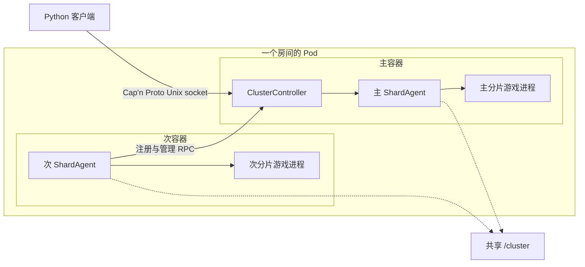
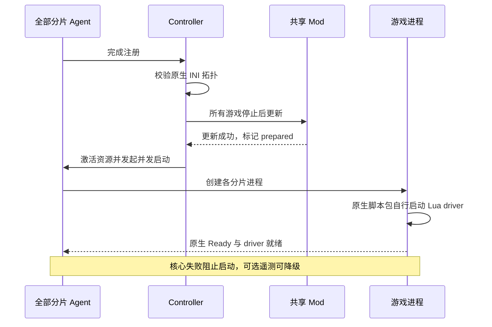
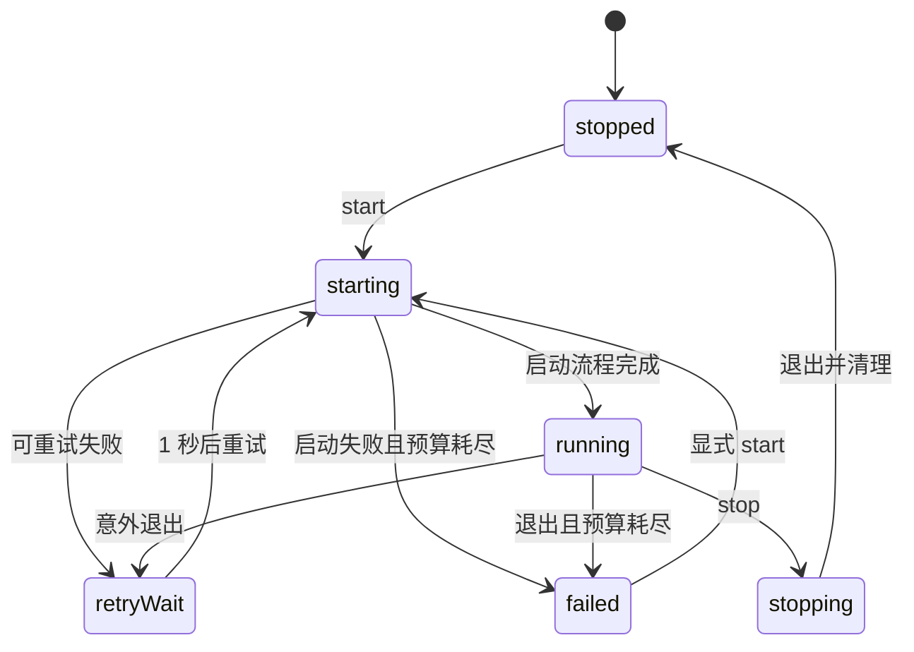
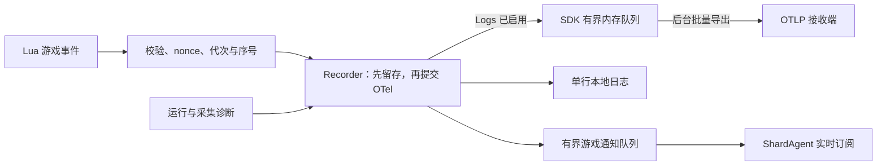

# 饥荒联机版专用服务器

[](https://steamcommunity.com/groups/lst99)
[](https://discord.gg/4N3aeNsFt8)

[English](README.md) | 简体中文

使用 Podman、systemd 和 Python SDK 部署与管理 Don't Starve Together（DST）服务器。
一个房间对应一个 Pod，每个分片由一个长驻 Agent 容器管理游戏进程，主容器负责集群协调。
默认镜像为 `quay.io/wh2099/dst-server:latest`，测试渠道使用 `:beta`。

- **部署**：生成游戏配置与 Quadlet，统一管理森林、洞穴和 Mod。
- **管理**：通过本地 RPC 查询玩家与世界，执行保存、回档、重启和管理操作。
- **记录**：按需采集游戏事件，使用本地日志或 OTLP Logs 导出。

## 目录

先看 [快速开始](#快速开始)，后续按任务跳转。
两种语言均包含完整的模块文档。

| 模块 | 常用入口 |
| --- | --- |
| [配置与部署](#配置与部署) | [目录布局](#目录布局) · [端口](#分片与端口) · [世界设置](#世界设置) · [配置 SDK](#配置-sdk) · [权限](#容器用户与目录权限) · [DNS](#容器-dns) |
| [统一 CLI](#统一-cli) | 创建与修改房间、模板、目标选择和 JSON 输出 |
| [日常维护](#日常维护) | 镜像更新、控制台与日志、定时和维护任务 |
| [运行机制](#运行机制) | [组件与通信](#组件与通信) · [生命周期](#生命周期与故障恢复) · [保存确认](#保存与世界重载) · [超时](#默认超时) |
| [RPC 与游戏 SDK](#rpc-与游戏-sdk) | [连接示例](#连接集群) · [共享请求](#共享请求与验证) · [接口索引](#接口索引) · [表情与动作](#表情与动作枚举) |
| [存档与导出](#存档与导出) | [文件说明](#存档文件) · [查询与回档](#快照查询与按天回档) · [导出与 R2](#导出与-r2-上传) |
| [Mod 管理](#mod-管理) | [原生更新](#原生-mod-更新) · [下载与启用](#声明下载与启用) |
| [遥测与历史日志](#遥测与历史日志) | [采集范围](#采集范围) · [OTLP](#otlp-配置) · [交付](#内存交付) · [日志边界](#日志边界) · [Netdata](#netdata-部署与查询) · [排障](#遥测排障) |
| [辅助工具](#辅助工具) | Klei 服务、玩家路径编码、Lua 注解 |
| [开发与验证](#开发与验证) | [模块边界](#模块边界)、依赖、检查命令、源码索引 |

## 快速开始

需要 Linux、Podman（支持 Quadlet）、systemd 和 [uv](https://docs.astral.sh/uv/getting-started/installation/)。
项目要求 Python `>=3.14.7`。
Mod 更新器的清理流程依赖 [Python 3.14.7 的进程等待修复](https://github.com/python/cpython/pull/154171)。
宿主 CLI 管理系统服务，部署命令在服务器上以 root 执行，也可通过 SSH 使用。

1. 安装含宿主管理功能的包，并在 [Klei 专服管理页面](https://accounts.klei.com/account/game/servers?game=DontStarveTogether) 创建 token。

   ```shell
   uv tool install --python 3.14 'dst-server[host]'
   export DST_SERVER_CLUSTER_TOKEN='replace-with-cluster-token'
   dst-server --help
   ```

2. 创建单个房间，模板与编号独立选择。

   ```shell
   dst-server template list
   dst-server room create 299 --template forge --max-players 9 \
     --volume-idmap 'uids=0-1000-1;gids=0-1000-1'
   ```

   这会生成 `/srv/dst/299` 和对应 Quadlet，不启动房间，也不覆盖已有文件。
   使用 `--token-file /run/secrets/dst_cluster_token` 可优先从文件读取 token。
   卷映射默认不设置；上述 rootful 映射让容器 UID `1000` 可以使用 root 持有的文件。
   森林与洞穴房间可选 `pure_survival`，其他名称由 `template list` 查看。

3. 启动房间并查看日志。

   ```shell
   dst-server room start 299
   dst-server room status 299
   dst-server logs --room 299 --lines 100 --follow
   ```

   启动会检查镜像、准备 Mod、生成缺失的世界，并等待游戏真正就绪。
   `--no-wait` 只提交启动，`room wait 299` 可单独等待就绪。
   这样创建的房间使用本地 journald 日志；LST 整套部署预设还会配置 Netdata 导出。

在仓库中使用 `uv run --extra host dst-server ...` 或 `uv run --extra host python -m dst_server ...`。
安装后的两个入口提供同一套 CLI，不传子命令时显示帮助。
通过 SDK 生成 rootless 部署的方式见 [权限说明](#容器用户与目录权限)。

### 统一 CLI

| 命令 | 用途 |
| --- | --- |
| `room` | 创建、查看、修改、启停、重启、等待就绪和诊断房间。 |
| `template`、`deployment` | 查看或应用玩法模板，生成 LST 整套房间，安装自动维护单元。 |
| `schedule`、`maintenance` | 开放时段、空闲回收与服务内倒计时重启。 |
| `announce`、`player`、`world`、`mod` | 公告、玩家和权限、存档与世界、Mod 配置。 |
| `console`、`logs`、`rpc` | Lua 求值、历史日志、方法发现、直接调用与实时订阅。 |
| `scripts` | 构建和校验受管理的原生脚本包。 |
| `agent`、`annotations`、`completion` | 容器进程入口、Lua 注解、输出 shell 补全。 |

默认目录为 `/srv/dst` 和 `/etc/containers/systemd`。
通过 `--cluster-root` / `--quadlet-dir` 或 `DST_SERVER_CLUSTER_ROOT` / `DST_SERVER_QUADLET_DIR` 覆写。
全局选项放在命令之前：

```shell
dst-server --cluster-root /srv/dst --quadlet-dir /etc/containers/systemd --json room list
dst-server room stop 000-029,060-069,299
dst-server room edit 000-029,060-069 --max-players 9
dst-server room edit 299 --set '/cluster/settings/cluster_description="周五联机"'
dst-server room start 000-029,060-069,299
dst-server room show 299 --field /cluster/settings/max_players
dst-server room schema
dst-server announce '服务器将在八分钟后维护。' --room 299
dst-server world snapshots --room 299 --limit 10
dst-server world save --room 299
```

`room` 命令使用位置参数编号，其他命令组使用 `--room`。
支持逗号分隔编号、闭区间范围，以及相应命令提供的 `--template` 或显式 `--all`。
`room list` 发现包含 `cluster.ini` 的三位编号房间目录，操作命令要求明确选择目标。
批量操作逐房间返回结果，任何房间失败都会使整体退出码非零。
stdout 非终端时默认输出紧凑的单行 JSON；终端中也可用 `--json` 选择该格式。
持续输出按记录逐行发送 JSON；日志与诊断写入 stderr，非终端输出会转义内容中的换行。
`room edit --set` 使用 JSON Pointer 路径和 JSON 值，`--unset` 删除显式设置。
`room edit`、`template apply`、`mod enable/disable/set` 和 `schedule set` 均要求房间已停止，包括管理策略修改。
先执行 `room stop`，修改完成后显式执行 `room start`。
修改世界生成设置不替换现有地图，需要显式执行 `world regenerate`。

### LST 房间布局

LST 部署预设共 116 间房，编号为 `000–099` 和 `200–215`。

```shell
dst-server deployment lst --room 000,030,209 \
  --volume-idmap 'uids=0-1000-1;gids=0-1000-1'
dst-server room stop 299
dst-server template apply forge --room 299
dst-server room start 299
```

`deployment lst --all` 生成完整预设，创建会拒绝覆盖已有房间。
每日时段使用宿主本地时间：白饭 10:00–18:00、晚宴 18:00–00:00、夜饮 00:00–08:00。

| 玩法 | 常开 | 白饭 | 晚宴 | 夜饮 |
| --- | --- | --- | --- | --- |
| 纯净生存 | `000–015` | `016–019` | `020–027` | `028–029` |
| 纯净无尽 | `030–045` | `046–049` | `050–057` | `058–059` |
| 半纯生存 | `060–065` | `066` | `067–068` | `069` |
| 半纯无尽 | `070–085` | `086–089` | `090–097` | `098–099` |

特殊玩法房间全部常开：

| 房间编号 | 玩法 |
| --- | --- |
| `200–204` | 挂皮肤 |
| `205` | 冒险 |
| `206` | 暴食 |
| `207–209` | 熔炉 |
| `210–212` | 岛屿冒险 |
| `213–215` | 云霄国度 |

通用模板支持 `000–299` 任意槽位，包括永夜模板 `lights_out_survival` 和 `lights_out_endless`。
已有房间直接读取原生文件。
应用模板会显式替换玩法、世界和 Mod 配置，保留房间编号、名称、介绍、密码、token、共享密钥及部署参数。
已有房间不会自动继承模板变化。
核心生成与维护代码随包发布，可直接调用异步 SDK。

## 配置与部署

游戏配置与 Quadlet 共同决定目录、分片和网络，修改时需保持一致。

### 目录布局

一个集群使用一个宿主目录，所有分片容器将其挂载为 `/cluster`。
游戏安装位于镜像内的 `/install`。

```text
cluster/
├── .dst-control.json  （可选）
├── cluster.ini
├── cluster_token.txt
├── adminlist.txt / blocklist.txt / whitelist.txt
├── mods/
│   ├── dedicated_server_mods_setup.lua
│   ├── modsettings.lua
│   └── ugc/
├── forest/
│   ├── server.ini
│   ├── worldgenoverride.lua
│   ├── modoverrides.lua
│   └── save/
└── cave/
    └── 与 forest 相同的分片文件
```

| 文件或路径 | 内容 |
| --- | --- |
| `cluster.ini` | 集群名称、访问限制、人数、玩法与分片连接设置。 |
| `cluster_token.txt` | Klei 专服 token。 |
| 三个权限名单 | 管理员、封禁和白名单，每行一个标识符。 |
| `<shard>/server.ini` | 分片身份、玩家与 Steam 查询端口、玩家存档路径编码。 |
| `<shard>/worldgenoverride.lua` | 世界生成和世界设置覆盖。 |
| `<shard>/leveldataoverride.lua` | 可选的完整关卡基线，事件世界需要。 |
| `<shard>/modoverrides.lua` | 当前分片启用的 Mod 及选项。 |
| `<shard>/save/` | 世界、人物快照与辅助数据，见 [存档文件](#存档文件)。 |
| `mods/` | 共享下载清单、Mod 内容和缓存，见 [Mod 管理](#mod-管理)。 |
| `.dst-control.json` | 房间策略 `template`、`schedule`、`recycle`、`paused`，以及最近活动记录；不存游戏和部署配置。 |
| `.dst-server.sock` | 运行时创建的集群 RPC socket。 |
| `.dst-operation.lock` | 宿主管理操作共用的一把锁，释放后保留空文件。 |
| `<shard>/dst_server_driver.json` | 每次游戏进程启动时提供给 Lua 的 nonce 和遥测参数。 |

配置来源是原生 INI/Lua 文件和 Quadlet，包括由 systemd 处理的 drop-in。
房间定义没有额外的持久化副本。
缺少 `.dst-control.json` 时，房间默认没有开放时段，也不自动回收。
启动读取现有文件并准备 Mod，不重新生成游戏配置。
`cluster.ini`、`cluster_token.txt` 和每个启用分片的 `server.ini` 必须存在，且只能有一个主分片。
只有包含 `server.ini` 的子目录才是启用分片。
停用分片保留目录、其他配置和存档，再添加同名分片时可以复用存档。
配置和分片目录不能使用符号链接；准备阶段会补齐缺失的权限名单与 Mod 支持文件。

Agent 在内存中记录最近玩家活动，不依赖遥测导出。
宿主回收 timer 将整个房间的 `activity` 写入 `.dst-control.json`，其中包含当前分片世界 ID 和 `last_active_at`。
回收直接比较当前时间与最近活动时间，停服时间也计入，不区分正常和异常停机。
进程突然退出时，可以丢失上次 timer 检查之后尚未落盘的活动。
记录缺失或世界改变时，从当前时间开始给足一轮保留期。

### 分片与端口

同一 Pod 内的分片共享网络命名空间。
多分片运行时需满足：

- 启用 `shard_enabled`，所有分片使用相同的非空 `cluster_key` 和 `master_port`。
- 每份 `server.ini` 显式声明 `is_master`；次分片还需名称及可连接的 `master_ip`，可继承集群设置。
- 同 Pod 部署通常使用 `master_ip = 127.0.0.1`。
- 显式设置分片 ID 时，主分片为 `1`，次分片从 `2` 开始且不能重复。
- `master_port`、各分片的 `server_port` 与 `master_server_port` 不能冲突。

| 端口分配 | 规则 |
| --- | --- |
| 宿主范围 | `30000–32999`，每个房间占一个十端口槽位。 |
| 房间槽位 | 任意模板支持 `000–299`，LST 整套部署预设覆盖 `000–099` 和 `200–215`。 |
| 分片数量 | 每个房间最多四个分片，只发布实际使用的 UDP 端口。 |
| 玩家连接 | `-external_port` 公告宿主映射端口，容器仍监听 `server.ini` 中的内部端口。 |

同时运行的房间必须使用不同槽位。
修改分片集合、主分片身份或发布端口时，重新生成配置与 Quadlet，并重建对应 Pod。

`cluster.ini` 的 `[NETWORK]` 管理名称与访问限制，`[GAMEPLAY]` 管理人数、PVP 和空房暂停。
完整字段、范围和默认值见 [ClusterSettings / ShardSettings](src/dst_server/configuration/models.py)。
SDK 默认 `encode_user_path=True`，始终在 `server.ini` 中写入当前值，也保留显式 `False`。
已有存档时，修改此值必须同步调整 [玩家目录](#玩家路径编码)。

### 世界设置

`worldgenoverride.lua` 需要 `override_enabled = true` 才会生效。
标准森林示例：

```lua
return {
    override_enabled = true,
    worldgen_preset = "SURVIVAL_TOGETHER",
    settings_preset = "SURVIVAL_TOGETHER",
    overrides = {},
}
```

| 世界 | 设置方式 |
| --- | --- |
| 洞穴 | 两个 preset 均使用 `DST_CAVE`。 |
| 无尽 | 保留 `game_mode = survival`，使用森林 `ENDLESS` preset 与洞穴对应 overrides。 |
| 熔炉 / 暴食 | `lavaarena` / `quagmire` 还需完整 `leveldataoverride.lua`，内置事件片段已包含。 |

优先组合 [内置配置片段](src/dst_server/configuration/presets.py)。
`leveldataoverride.lua` 提供关卡基线，`worldgenoverride.lua` 随后应用覆盖。
修改生成参数不会重建已有地图；游戏保存也可能重写设置，请停服后修改。

### 配置 SDK

`ClusterConfig`、`ClusterSettings`、`ShardConfig`、`ShardSettings` 从 `dst_server.configuration` 导入。
`ClusterConfig` 读取、验证和保存完整配置树，`RoomPreset` 组合配置片段。
`dst_server.deployment.QuadletApplication` 根据配置推导 Pod 和容器单元。
通过 `for_cluster(..., allocation=RoomPortAllocation(...))` 一起生成端口映射和启动参数。
`.replace()` 只更新显式传入的字段。
以下示例在新目录生成无尽森林与洞穴：

```python
import os
from pathlib import Path

from pydantic import SecretStr

from dst_server.configuration.presets import ENDLESS, FOREST_CAVES, compose

config = compose(FOREST_CAVES, ENDLESS).build(
    token=SecretStr(os.environ["DST_SERVER_CLUSTER_TOKEN"]),
)
config.save(Path("cluster"))
```

- 读取与修改：`ClusterConfig.load(path)`、`.replace(...)`。
- 生成自定义房间和 Quadlet：`dst_server.presets.lst.generate_configured_room()`，传入绝对目录。
- 批量自定义房间：`generate_configured_rooms()`，可使用 `000–299` 中任意槽位。
- 自定义生成函数默认不配置遥测导出，通过 `environment` / `environments` 显式传入。

构建配置、`load()` 和 `files()` 允许省略 `cluster_key`，不会因此生成密钥或写入磁盘。
`save(path)` 会复用目标目录已有的共享密钥，没有可复用密钥时才生成并保存到 `cluster.ini`。
不同新目录各自生成不同密钥，重复保存同一目录保留已有密钥；显式密钥仍会使用。
单分片房间同样适用。

`dst_server.rooms.Room` 是原生游戏配置、部署设置和运营策略的内存视图。
`RoomStore.load(number)` 每次直接读取文件，也能读到游戏自身写入的修改。
停服后使用 `room edit` 或 `dst_server.host.Host.edit()` 校验并写入配置。
所有编辑都要求房间已停止，包括策略修改；编辑本身不启动或停止服务。
SDK 只解析受支持的声明式 Lua，不执行脚本；修改配置时遇到不支持的动态 Lua 会拒绝操作。
启动和时段运行控制（`show`、`pause`、`resume`、`run`）不需要解析世界 Lua。
写回的原生文件会规范化排版并移除该文件的原注释。
生成的 Quadlet 基础单元归 SDK 管理，部署设置改变时重新生成。
本地 systemd 定制放在 drop-in 中；需要修改的字段仍被 drop-in 覆盖时，SDK 会拒绝写入。
存档和无关游戏文件保留。
文件逐个替换，不是整个配置树的跨文件事务。
权限名单和存档是独立的实时文件，房间编辑会保留它们。

[ClusterClient](#连接集群) 的 `read_configuration()` 直接返回 `ClusterConfig`，无效配置抛出错误。
持久配置通过宿主操作修改。

### 容器用户与目录权限

镜像以 `steam` 用户运行，UID/GID 均为 `1000`。
生成器不会根据执行用户自动选择映射；`volume_idmap` 和 `userns` 默认均为 `None`。

| 部署方式 | 生成参数 | 生成位置与效果 |
| --- | --- | --- |
| rootless | `--userns 'keep-id:uid=1000,gid=1000'` | `.pod` 的 `[Pod]` 写入 `UserNS`，把部署用户映射为容器 `1000:1000`。 |
| rootful | `--volume-idmap 'uids=0-1000-1;gids=0-1000-1'` | 各 `.container` 的卷使用 idmap，宿主文件保持 `root:root`，容器看到 `1000:1000`。 |

宿主 CLI 的服务操作使用系统级管理器。
rootless 部署由普通部署用户通过包内 SDK 生成文件，再使用 `systemctl --user`：

```python
import os
from pathlib import Path

from pydantic import SecretStr

from dst_server.presets.lst import generate_room

generate_room(
    0,
    token=SecretStr(os.environ["DST_SERVER_CLUSTER_TOKEN"]),
    cluster_dir=Path.home() / ".local/share/dst/000",
    quadlet_dir=Path.home() / ".config/containers/systemd",
    userns="keep-id:uid=1000,gid=1000",
)
```

```shell
systemctl --user daemon-reload
systemctl --user start dst-000-pod.service
journalctl --user -u dst-000-forest.service -f
```

rootful 部署使用 [快速开始](#快速开始) 的命令。
使用 `volume_idmap` 时，内核与数据文件系统必须支持 [idmapped mount](https://docs.podman.io/en/latest/markdown/podman-run.1.html#volume-v-source-volume-host-dir-container-dir-options)。
集群目录应属于部署用户，且不可被组或其他用户写入，以满足 RPC socket 的检查。
修改映射后需要重建 Pod。

### 容器 DNS

rootful Podman 可使用 [DNS 策略](deploy/containers/podman-dns.json)，将默认网络查询交给宿主机 systemd-resolved。
前提是 `127.0.0.53` stub 正常工作；宿主已配置 DNS over TLS 时，容器复用其上游策略。
这会影响默认网络上的所有容器。

在目标机生成候选配置，保留其网络身份与地址：

```shell
podman network inspect podman |
  jaq --slurpfile dns deploy/containers/podman-dns.json \
    '.[0] | del(.containers) | . + $dns[0]'
```

1. 备份网络配置、保存游戏，停止该网络的全部容器，包括 infra 和非 DST 容器。
2. 确认候选结果只改变 DNS 字段，以 `0644` 安装到 `/etc/containers/networks/podman.json`。
3. 重启受影响的 Pod 与服务，在容器内验证 DNS。

策略文件不能直接作为完整网络配置安装。
只重启游戏进程或执行 `podman network reload` 不会完整应用变更。

[返回目录](#目录)

## 日常维护

```shell
dst-server room status 299
dst-server room diagnose 299
dst-server world save --room 299
dst-server room restart 299
dst-server room stop 299
```

宿主关服、容器重启和 SDK `stop()` 不会隐式确认保存。
需要最新快照时，先等待 `world save` 或 SDK 的 [集群 `save()`](#保存与世界重载) 成功。
SDK `restart()` 在全部分片就绪时先确认保存，再执行完整的游戏重启。

### 玩家公告

[`dst_server.announcements`](src/dst_server/announcements.py) 统一管理固定重复、变化倒计时和维护模板。
`Repeat` 提交一次固定文案，Lua 将 `interval` 传给原生 `c_announce`，并把原生任务的有限重复次数设为 `count`。
一次性公告就是 `count=1`。
每个世界只有一个定时重复公告槽位，新重复公告会替换旧重复公告。
一次性公告及 `Countdown` 逐次发送的公告不会取消已有重复公告。
`Countdown` 使用 SDK 单调时钟，每次发送时更新 `{remaining}` 剩余秒数、`{minutes}` 向上取整分钟数或 `{when}` 时间提示。
原生固定重复使用游戏模拟时间；SDK 倒计时在游戏暂停模拟时仍按实际经过时间推进。
支持自定义具名参数；拒绝属性访问、下标、类型转换和格式说明符。

```python
from dst_server.announcements import Countdown, Repeat, Template, maintenance


async def notify(cluster):
    await cluster.announce(Repeat(message="欢迎来到本房间。", count=3, interval=30))
    await cluster.announce(
        Countdown(
            template="还有 {remaining} 秒开放{destination}。",
            delay=60,
            interval=10,
            parameters={"destination": "下一个房间"},
        )
    )
    await cluster.restart(notice=maintenance(Template.RESTART, estimated_duration=600))
```

默认模板覆盖关机、维护重启、Mod 更新、部署更新和定时关闭。
可设置倒计时长度、公告间隔、预计中断耗时以及房间或分片称呼；定时关闭还支持下次开放时间。
内置文案为中文，自定义 `Countdown` 可以修改文案或语言。
服务内 SDK 生命周期操作默认提前 60 秒公告，每 30 秒重复，适用时默认提示预计耗时 5 分钟。
空房跳过服务内生命周期倒计时。
宿主 `room start`、`room stop`、`room restart` 直接管理 systemd 服务，不执行倒计时。
`notice=None` 显式跳过公告和等待，不会跳过请求的更新或重启。
公告不代表已经确认保存进度。

```shell
dst-server announce '欢迎！' --room 299 --count 3 --interval 30
dst-server announce '还有 {remaining} 秒开放{destination}。' --room 299 \
  --countdown 60 --interval 10 --parameter destination=大厅
dst-server maintenance restart --room 299 --delay 2m --estimated-duration 10m
dst-server room stop 299
```

### 镜像更新

- `:latest` 跟随正式渠道，创建房间时用 `--image quay.io/wh2099/dst-server:beta` 选择测试渠道。
- `Pull=always` 在容器启动时检查远端镜像，`TimeoutStartSec=1800` 为启动预留 30 分钟。
- 已有房间先执行 `room stop`，通过 `room edit --set` 修改 `/deployment/image`，再执行 `room start` 应用。
- 宿主 `room restart` 重建容器并应用镜像、环境变量等容器设置。
- RPC `restart()` 在现有容器内重启全部游戏进程、检查共享 Mod，并重新激活各分片资源。

镜像将体积较大的游戏安装保留为独立缓存层，以游戏版本和渠道区分；仅修改 SDK 时可以复用。
镜像工作流的 `force_build` 让已发布的游戏版本也重新构建，`no_cache` 则禁止这次构建复用缓存层。
要对已发布版本执行无缓存构建，同时勾选两个参数。
镜像工作流只发布镜像，不会自动部署房间。
宿主执行 `room restart 299` 重建容器并拉取配置中的镜像。
修改配置时，先 `room stop`，修改完成后 `room start`。
`maintenance restart` 只重启现有容器里的游戏，不应用新镜像。
只有当前 `main` 提交可以构建和发布。
使用 GitHub 原生并发控制，同一工作流和 ref 上的新运行会取消此前的运行。
因此，重新运行旧提交也会打断较新提交的运行。
其他 ref 的运行会跳过，构建前和发布前的 HEAD 检查会拒绝过期提交。
正式镜像的版本标签为 `:<version>`，测试镜像为 `:beta-<version>`。

### 控制台与日志

`console` 通过房间 Agent 的 RPC 执行 Lua，默认选择主分片：

```shell
dst-server console 'TheWorld.state.cycles + 1' --room 299
dst-server console 'print("hello"); return 1, nil, true' --room 299
dst-server console --file commands.lua --room 299
printf '%s\n' 'return TheWorld.state.cycles + 1' | dst-server console --room 299
dst-server console --room 299 --interactive
dst-server console --room 299 --interactive --follow
```

单次调用返回捕获的 print 输出、带类型的文本返回值，以及编译或运行错误，然后退出。
Lua 只执行一次，表达式与语句在编译阶段区分，不会因执行失败而重复执行。
交互模式只接受一个房间，通过 `--shard NAME` 指定次分片，`--follow` 同时显示后台日志。
Ctrl+D 关闭输入，Ctrl+C 清除当前输入行。
Lua 执行是可信管理操作，不代表保存已经确认。

```shell
dst-server logs --room 299 --lines 100
dst-server logs --room 299 --since yesterday --until now
dst-server --json logs --room 299 --cursor 's=...' --direction forward
dst-server logs --room 299 --follow
```

Quadlet 显式使用 `LogDriver=journald`。
房间关闭、配置损坏或分片删除后仍可查询历史。
房间和分片身份由固定部署名称确定，覆盖历次运行和仍被保留的宿主重启前记录。
保留时长遵循 journald 策略。
`--follow` 用同一个读取进程先查询历史再持续跟随，默认历史为 100 条。
有限 `--json` 查询返回完整页面，包含 `records`、`next_cursor`、`has_more` 和有界诊断信息。
默认 `backward` 从新到旧，`forward` 从旧到新。
人类可读输出按时间正序展示每页，JSON 保持查询方向。
使用同方向和过滤条件传入 `next_cursor` 续查；若原查询使用了 `since`，续查时以 cursor 替换它。
`cursor` 与 `since` 是互斥的原生起点。
限定时间范围时使用 forward 分页并保留 `until`。
backward 续查清除 `since` 后会失去原时间下界。
游标在所选范围不可用时抛出 `JournalCursorError`，不会悄悄从另一条记录继续。
已经被保留策略删除的记录无法由游标恢复。

SDK 提供 `Host.journal()`、`Host.follow_journal()` 和 `Host.telemetry()`，支持单个房间或房间编号序列。
这些操作不加载房间文件，不连接 systemd 或 Cluster RPC。
`shard=` 使用原分片目录名，也支持已经删除的分片名。
`Host.log_units()` 返回对应的历史 unit 选择。
整房间 follow 在启动时展开 unit 模式，之后新建的分片需要重新订阅。
显式指定分片时，可以等待该 unit 的第一条日志。
自定义 unit 或历史服务身份可直接使用 `dst_server.logs` 下的 `JournalLogs`、`NetdataLogs`。

```python
import asyncio

from dst_server.host import Host
from dst_server.logs import JournalQuery


async def main():
    host = Host()
    page = await host.journal(299, JournalQuery(limit=50))
    print(page.model_dump_json())
    if page.has_more:
        older = await host.journal(299, JournalQuery(cursor=page.next_cursor, limit=50))
        print(older.model_dump_json())

    async with host.follow_journal(299, shard="forest") as stream:
        async for record in stream:
            print(record.message)
            break
    print(stream.diagnostics)


asyncio.run(main())
```

SDK follow 默认只读新记录且始终向前；需要初始历史时传入 `JournalQuery(direction="forward", limit=100)`。
带 cursor 时读取其后所有仍被保留的记录，初始历史条数不会截断积压记录。
follow 游标不可用时，在读取器返回首条记录或退出时报告错误。
退出 follow 上下文会关闭并回收子进程，取消和异常也一样。
`JournalRecord.fields` 保留原始元数据、多值字段和二进制数组。
`message`、`unit`、`timestamp`、`cursor` 是派生视图，显示解码不改写原字段。
两个读取器默认单条上限 4 MiB、有限查询总输出上限 64 MiB，可通过构造参数调整。
follow 仅限制单条大小，不限制整个订阅的累计字节数。
诊断保留最后 64 KiB，并通过 `diagnostics_truncated` 标明截断。
成功且结果为空时仍保留警告。
RPC 订阅只推送实时记录，Netdata 独立查询已导出的结构化事件。

### 定时与维护任务

```shell
dst-server room stop 299
dst-server schedule set 09:00-12:00 22:00-05:00 --room 299
dst-server room start 299
dst-server schedule show --room 299
dst-server schedule pause --room 299
dst-server schedule resume --room 299
dst-server deployment install
systemctl enable --now dst-room-schedule.timer
```

每日开放时段使用宿主本地时间，可以跨午夜。
`schedule set` 要求房间已停止；`show`、`pause`、`resume` 和 `run` 可以在房间运行时使用。
手动 `room stop` 暂停自动管理，防止 timer 在维护期间重新开服。
手动 `room start`、`room restart` 和 `schedule resume` 恢复自动管理。
`pause` 暂停定时启停与回收；运行中房间仍可继续记录活动。
`--always` 移除定时窗口，`schedule run` 执行一次检查。
计划关闭前八分钟，每分钟发送一次公告。
安装的 timer 每分钟检查一次，检查结束后无论成功或失败都会继续执行空闲回收。
`deployment install` 写入包内的 systemd 单元，启用 timer 是单独的部署动作。
[包内单元模板](src/dst_server/host/systemd) 是自动维护服务配置的唯一来源。
安装后的服务执行 `python -m dst_server schedule run` 和 `python -m dst_server maintenance recycle`。
安装器将当前 Python 解释器、房间根目录和 Quadlet 目录写入命令。
创建房间时将模板、开放时段和回收策略写入 `.dst-control.json`。
自动维护读取各房间策略；缺少该文件的房间默认没有定时窗口，且关闭回收。
修改 Python 环境或部署路径后，重新执行 `deployment install`，再启用 timer。

```shell
dst-server maintenance recycle --dry-run
dst-server maintenance restart --room 299 --delay 8m --estimated-duration 10m
```

`maintenance restart` 向每个运行中的 SDK 服务提交一次请求，并返回逐房间结果。
服务负责倒计时和游戏重启，房间的管理服务必须可连接。
需要重启容器时使用 `room restart`。

回收按当前游戏天数采用以下保留时间：

| 游戏天数 | 最近活动后的保留时间 |
| --- | --- |
| 1–8 天 | 6 小时 |
| 9–30 天 | 24 小时 |
| 31–70 天 | 36 小时 |
| 71–280 天 | 72 小时 |
| 281 天以上 | 168 小时 |

只有经过时间超过阈值、全部分片就绪且当前无人，才允许重置。
忙碌房间跳过，执行时仍核对世界身份与空房条件。

## 运行机制

集群控制、分片监督与游戏进程分别有自己的生命周期。

### 组件与通信



| 组件 | 职责与代码入口 |
| --- | --- |
| [daemon](src/dst_server/cluster/daemon.py) | 运行管理服务、注册连接与 systemd 通知。 |
| [Controller](src/dst_server/cluster/controller.py) | 维护预期分片名单，协调共享准备与集群操作。 |
| [Mods](src/dst_server/mods/__init__.py) | 准备共享 Mod 文件、执行更新器，维护一个房间的过期报告。 |
| [Agent](src/dst_server/cluster/agent.py) | 独占一个分片的进程资源，消费日志、生命周期、事件并处理遥测。 |
| [Supervisor](src/dst_server/runtime/supervisor.py) | 停止和重试游戏进程，每次尝试创建新的 `Server`。 |
| [Server](src/dst_server/runtime/server.py) | 管理一次 DST 子进程及其通信通道；单次使用。 |

主容器运行 `dst-server agent master`，次容器运行 `dst-server agent serve <shard>`。
主 Agent 在进程内注册，次 Agent 通过 Pod 内的抽象 Unix socket `dst-server-registry` 注册。

| 通道 | 用途 |
| --- | --- |
| `/cluster/.dst-server.sock` | 公开 Cap'n Proto RPC。 |
| 游戏 FD 3 | 单行 `DST_RPC` JSON：版本、进程 nonce、请求 ID、Lua 代次、方法与参数。 |
| 游戏 FD 4 | 关联请求的 JSON 接收确认和结果；原生 Busy / Done 仅用于传输边界。 |
| 游戏 FD 5 | 原生 Ready、Session、Saved、Stopping 等生命周期事件。 |
| 游戏 stdout | 普通日志和游戏领域事件；stderr 合并到此通道。 |

[`-cloudserver` 与启动 wrapper](src/dst_server/runtime/fds.py) 建立 FD 3–5。
每个分片串行派发类型化方法；仅显式的 `evaluate`、`execute_script` 方法编译 Lua 源码。
FD 4 常驻读取任务按 nonce、请求 ID 和代次匹配响应。
严格 JSON 解析保留对象、数组和 null，不使用原生解码器的 `loadstring`。
超时或取消不终止读取任务，迟到响应不能完成另一个请求。
仅明确未执行的原生 Busy 拒绝会重试，已接收或执行结果不明的修改操作不自动重放。
原生 Done 本身不代表命令成功；遥测通过 stdout 进入独立队列。
输入整帧（含 JSON 和边界字符）最多 4 KiB，响应最多 64 KiB。
再次发送前检查游戏是否已读取前一块管道输入，避免原生按块读取时合并或拆分请求。

公开 socket 权限为 `0600`，父目录需由当前用户拥有且不可被组或其他用户写入。
内部抽象 socket 依赖 Pod 网络命名空间隔离，不提供文件权限边界。

### 生命周期与故障恢复

控制器默认期望集群运行，允许全部 Agent 在 60 秒内完成首次注册，再开始准备和启动。
注册时游戏进程必须停止，不接管另一个 Controller 遗留的运行中游戏。
下面是首次启动的顺序：



| 操作 | 共享 Mod 与游戏进程 |
| --- | --- |
| 整服 `start()` | 准备共享文件，自动更新开启时更新 Mod，再启动所需分片；重复调用复用有效准备结果。 |
| 整服 `stop()` / `kill()` | 停止游戏并使准备缓存失效，后续 `start()` 重新准备。 |
| 整服 `restart()` | 公告、保存就绪游戏、停止全部游戏，即使自动更新关闭也检查更新共享 Mod，然后重新激活并启动全部分片。 |
| `stop()` → `update_mods()` → `start()` | 手动刷新；最后一步复用刚刚成功的更新。 |
| `update_mods(restart=True)` | 保存并停止运行中的游戏，更新一次，再在原容器内重启游戏。 |
| 游戏原生 Mod 过期报告 | 触发房间内部的一次维护，复用保存、停止、更新和启动流程。 |
| 单分片重启或崩溃恢复 | 复用已安装 Mod，不做共享更新。 |

共享更新要求全部 Agent 已连接、全部游戏进程已停止；失败状态但仍有 PID 不算停止。
更新失败时保持游戏停止，自动维护在 300 秒后重新尝试下载。
内存中的 `prepared` 布尔值避免同一次服务运行中重复准备，不保存准备版本号，也不重写世界设置。

下图只展示单分片游戏进程的主要状态，使用公开 RPC 的状态名称：



Supervisor 首次启动失败后最多重试三次，失败间隔一秒，稳定运行十分钟后恢复重试预算。
某个分片耗尽重试预算或已注册 Agent 断线时，停止其他游戏并让管理服务失败退出。
主容器使用 `Restart=on-failure`、`RestartSec=30`，600 秒内最多启动三次。
次容器使用 `Restart=no`，通过主容器的 `Wants` 及次容器的 `BindsTo`、`PartOf` 随主容器恢复。
主容器也通过 `PartOf` 归属 Pod，因此重启 Pod 会重启全部分片。
达到 systemd 启动限制后，排除原因，再手动 `room start` 或 `room restart` 清除限制。
管理服务恢复后，客户端需要重新连接 RPC 并重新订阅。

配置 `NOTIFY_SOCKET` 时，daemon 先发送 `READY=1`，之后每 60 秒发送 `WATCHDOG=1`。
Quadlet 设置 `WatchdogSec=300`，连续五分钟无通知则使容器失败，进入整房间恢复流程。
watchdog 只表明管理事件循环活跃；`status.ready` 只表明存活游戏已报告原生就绪，类型化接口需另查 `driver_health` / `driver_error`。

FD 4 EOF 或写入失败会关闭控制通道。
单条响应不完整或格式错误只使该请求失败，后续关联请求可以恢复；可通过 `driver_error` 和 `health()` 检查驱动状态。
关键观察流异常可使 Agent 退出，由进程管理器重启容器。

### 受管理的原生脚本包

镜像在安装 SDK 后构建并校验 `data/databundles/scripts.zip`。
独立使用游戏安装目录时，也必须先准备受管理的脚本包，再调用 `Server.start()`。
直接使用 `Server` 时，应持续消费生命周期和游戏事件通知；标准 Agent 自动完成这些读取。
运行诊断直接交给 Recorder 写本地日志，并按配置通过 OTLP 导出。
通知队列满时明确记录丢失，不阻塞原生就绪和保存确认。
调用方必须传入同一游戏安装版本已有的 `scripts.zip` 路径。
SDK 不下载原生脚本，也不使用仓库中的游戏源码子模块代替输入包。

```bash
dst-server scripts build /install/data/databundles/scripts.zip --output /tmp/scripts.managed.zip
dst-server scripts verify /tmp/scripts.managed.zip --source /install/data/databundles/scripts.zip
```

游戏停止时，可让 `--output` 与输入同路径，进行原子替换。
支持重复构建和升级已有受管理包，并清除已移除的 SDK 模块。
打包工具可直接调用 [scripts 模块](src/dst_server/scripts.py) 的 `build_bundle(source, output)` 与 `verify_bundle(path, source=...)`。
每次构建检查原生入口，保留其余原生文件内容，校验新包成功后才发布输出。
清单记录文件哈希、SDK 版本和原包内容摘要；`verify --source` 可与独立提供的原包比对。
游戏或 SDK 更新后需重新构建。

唯一被替换的原生文件是刻意留空的 `scripts/globalvariableoverrides.lua`，原生 `main.lua` 会在加载 Mod 前主动加载它。
此入口启动 SDK bootstrap，经 `SpawnPrefabFromSim` 为世界附加原生组件，并在 `OnPostInit` 报告就绪。
SDK 不以 Mod 加载，不依赖散落 Lua 文件覆盖顺序或 Console 注入。
Python 在创建每个游戏进程前，将本次 nonce 和遥测配置写入 `<shard>/dst_server_driver.json`。
Lua 每次 VM 启动都通过 `TheSim:GetPersistentString("../dst_server_driver.json", ...)` 读取，包括重置和回档。
启动必须等到原生 driver 就绪，`off` 也不例外；可选遥测失败通过健康状态显式报告。

### 保存与世界重载

`await cluster.save()` 只向主分片发起一次保存，主分片仅在本次原生保存完成回调中返回已保存路径。
其他分片保留原生快照同步机制，要求其 Saved 通知位于各自游标之后，且匹配该快照。
`ObservationCursor(attempt, sequence)` 将标记绑定到一次进程尝试，之前的进程不能确认新的操作。
成功返回后，再执行停止、重启或 [导出](#导出与-r2-上传)。
提交成功、原生 Done 和其他自动存档的 Saved 通知都不能完成主分片的本次保存请求。
次分片的直接保存会被拒绝，应通过集群或主分片发起。
空服可能覆盖前一个快照，成功保存不一定使编号增长。

原生 bootstrap 使用 `TheSim:GetNumLaunches()` 标识 Lua generation。
单行 `DST_DRIVER|` 启动／就绪记录更新宿主中的 driver 健康状态。
FD 5 Session 通知不控制 driver generation。

- 类型化请求等待当前 generation 的 driver 就绪；重置、回档和重新生成还等待新一代原生启动完成。
- 同一 Lua VM 的 Hook 只安装一次，重复安装会报错；迟到的 Session 不会重复安装或清零事件序号。
- 写入前发现 generation 改变可以等待重试；写入后发生变化则报告结果不确定，不自动重放。
- 每个 Lua VM 自行安装 Hook，无需 Console 命令；Console 故障不会阻止原生世界重载后的安装。
- `Server.execute()` 与类型化 Console 共用代次感知的 JSON RPC 和有界 Lua 求值器。

遇到超时或连接中断，已提交的保存、回档等操作可能仍在执行。
先查询状态或确认事件，再决定下一步。
实现见 [driver](src/dst_server/runtime/driver.py) 与 [保存完成回调](src/dst_server/lua/dst_server/commands.lua)。

### 默认超时

| 操作 | 默认预算 |
| --- | --- |
| 普通命令、类型化游戏请求 | 120 秒。 |
| 保存并等待确认 | 300 秒。 |
| 重置、回档、按天回档、重新生成 | 900 秒。 |
| 单次游戏启动及首次 driver 安装 | 900 秒。 |
| 游戏正常停止 | 120 秒，强制退出与输出清理另计。 |
| RPC 连接与握手 | 60 秒。 |

集群保存和重载在取得操作锁并确认就绪后开始计时，嵌套步骤共享同一个截止时间。
重载预算包含全部分片确认和新 driver 就绪；按天回档还包含快照选择与结果核验。

请求预算由 [commands.py](src/dst_server/commands.py) 声明。
`Start`、`Restart`、`UpdateMods` 默认为三小时，`Stop` 和 `Kill` 均默认为 120 秒。
RPC 服务端在工作流外额外允许 30 秒，客户端总共额外允许 60 秒。
RPC 整体截止时间还包括等锁、预检、转发和响应，因此可能在工作流仍有剩余预算时到期。
已提交但未确认的变更会报告为 `indeterminate`。
订阅 `next()` 保持长轮询；Quadlet 的容器与 systemd 停止预算分别为 360 秒和 420 秒。
默认值统一定义于 [timeouts.py](src/dst_server/timeouts.py)。

### 游戏启动参数

常规部署由 Agent 构造命令，无需手写参数。

| 参数 | 用途 |
| --- | --- |
| `-persistent_storage_root`、`-conf_dir`、`-cluster`、`-shard` | 定位集群与分片，容器最终读取 `/cluster`。 |
| `-external_port` | 公告宿主玩家端口。 |
| `-ugc_directory` | 共享 UGC 缓存。 |
| `-only_update_server_mods` / `-skip_update_server_mods` | 将 Mod 更新与正常游戏启动分开。 |
| `-monitor_parent_process` | 父进程退出时关闭游戏。 |
| `-cloudserver` | 建立本地进程通信。 |

自行持有游戏进程时，使用 [ServerConfig](src/dst_server/runtime/config.py) 设置路径和 `extra_args`。
其他原生参数见 [Klei 命令行指南](https://support.klei.com/hc/en-us/articles/360029556192-Dedicated-Server-Command-Line-Options-Guide)。

[返回目录](#目录)

## RPC 与游戏 SDK

RPC 为已部署的集群提供类型化接口，游戏 SDK 也可嵌入自行管理进程的应用。

### 连接集群

安装包后可在仓库之外使用 SDK，在仓库中也可用 `uv run python your_script.py`。
以下示例从宿主机连接快速开始生成的房间：

```python
import asyncio
from pathlib import Path

from dst_server.rpc import ClusterClient, rpc_runtime


async def main() -> None:
    socket = Path("/srv/dst/299/.dst-server.sock")
    async with rpc_runtime():
        async with await ClusterClient.connect(socket) as cluster:
            status = await cluster.status()
            print(status)
            print(await cluster.shard(status.master).status())


asyncio.run(main())
```

宿主路径为 `/srv/dst/<room>/.dst-server.sock`，容器内为 `/cluster/.dst-server.sock`。
`connect()` 必须传入路径，并在 `rpc_runtime()` 上下文内调用。

### 共享请求与验证

[commands.py](src/dst_server/commands.py) 定义 `Request[T]` 子类，统一声明类型化参数、结果类型、允许的调用范围和超时。
[api.py](src/dst_server/api.py) 的 `ClusterAPI`、`ShardAPI`、`PlayerAPI` 在 `invoke(request)` 之上提供便捷方法。
例如，从 `dst_server` 导入 `commands as c` 后，`await shard.world()` 与 `await shard.invoke(c.World())` 使用同一契约。
本地 Controller、游戏客户端和 RPC 客户端都在分发前验证同一份 Pydantic 请求。
错误类型、越界参数和含无效值的复制模型会在执行前被拒绝。
直接传请求可覆盖超时，例如 `c.World(timeout=30)`。
各入口只接受声明的命令范围；游戏客户端处理游戏操作，Controller 负责进程生命周期与集群协调。

Cap'n Proto 通过 `call` 传输命令，通过订阅能力传输观测记录。
只读 `ClusterConfig` 保留省略字段、显式 `False` 和世界覆盖类型。

集群结果、状态与观测游标从 [models.cluster](src/dst_server/models/cluster.py) 导入，`DriverHealth` 从 [models.driver](src/dst_server/models/driver.py) 导入。
共享异常和错误码位于 [errors.py](src/dst_server/errors.py)。
RPC 使用 `RemoteError` 报告业务错误，丢失未确认的变更结果时抛出 `IndeterminateError`。
游戏边界使用 `IndeterminateCommandError` 报告未确认的原生变更。
调用方取消或断开连接后，已接受的变更仍由服务端任务持有；取消查询会释放查询工作。
未确认的变更不会自动重放。

### 直接 RPC 与 Console 结果

先查看运行中服务端提供的方法，再直接调用：

```shell
dst-server rpc list --room 299
dst-server rpc describe evaluate --room 299 --shard xforge
dst-server --json rpc call status --room 299
dst-server rpc call execute_json --room 299 --shard xforge \
  -f 'source=return TheWorld.state.cycles + 1'
dst-server rpc subscribe events --room 299
```

`rpc describe` 从服务端注册表返回参数和结果 schema、作用域、超时及副作用语义。
`rpc call --input request.json` 读取 JSON 对象，`--input -` 从标准输入读取。
可重复使用 `-f name=value`，值支持 JSON 或普通字符串。
加 `--shard` 选择分片入口，省略时选择集群入口。
订阅支持 `logs`、`lifecycle` 和 `events`，不重放历史。

类型化 SDK 提供同样的 console 结果：

```python
from dst_server.models.console import ConsoleResult
from dst_server.rpc import ShardClient


async def inspect_console(shard: ShardClient) -> None:
    result: ConsoleResult = await shard.evaluate('print("hello"); return 1, nil, true')
    print(result.output)
    print([(value.type, value.text) for value in result.values])
    print(result.error, result.truncated)
```

`error.kind` 区分编译与运行错误，`truncated` 表示输出达到限制。
任意 Lua 对象返回有界文本，程序需要 JSON 值时使用 `execute_json()`。

### 接口索引

| 对象 | 常用接口 |
| --- | --- |
| `cluster` 生命周期 | `status()`、`start()`、`stop()`、`restart()`、`kill()`、`update_mods()`。 |
| `cluster` 配置与世界 | `read_configuration()`、`save()`、`pause()`、`reset()`、`rollback()`、`rollback_to_day()`、`regenerate()`、`list_snapshots()`。 |
| `cluster` 玩家与管理 | `list_players()`、`get_player()`、`announce()`、`whitelist()`、`unwhitelist()`、`is_whitelisted()`、`execute_all()`。 |
| `cluster.shard(name)` | 分片生命周期、`status()`、`room()`、`world()`、`runtime()`、`health()`、`mods()`、`connected_shards()`、`save()`、`list_snapshots()`、`regenerate_shard()`。 |
| `shard.players` | 查询人物与库存、踢出、封禁、解封、管理员状态、生命状态、传送、跨分片迁移、物品增减。 |
| `cluster` / `shard` 订阅 | `subscribe("logs")`、`subscribe("lifecycle")`、`subscribe("events")`；通过 `async with` 管理订阅，再 `await subscription.next()`。 |
| `shard.evaluate(lua)` | 对表达式或语句执行一次，以 `ConsoleResult` 返回 print 输出、带类型的文本值和错误。 |
| `shard.execute(lua)` | 执行 Lua，返回显式 `print` 的文本。 |
| `shard.execute_json(lua)` | 通过类型化 driver 返回 JSON，例如 `"return TheWorld.state.cycles + 1"`。 |

便捷方法签名见 [api.py](src/dst_server/api.py)，请求契约见 [commands.py](src/dst_server/commands.py)，能力协议见 [rpc.capnp](src/dst_server/rpc/schema/rpc.capnp)。
玩家、实体、世界与快照的返回模型见 [models](src/dst_server/models)。
实时订阅不提供历史重放，进程历史输出使用 [日志查询](#控制台与日志)，已导出的事件使用 [Netdata](#netdata-部署与查询)。

需要自行管理单个游戏进程的应用可使用 `dst_server.runtime.Server` 与 `server.game`。
调用方负责持续消费生命周期和游戏事件通知，以及进程清理。
常规 Pod 部署使用 `ClusterClient` 即可。
对于已运行的 `Server`，可将 `server.game` 传给以下函数：

```python
from dst_server import commands as c
from dst_server.game import GameClient


async def inspect_game(game: GameClient) -> None:
    world = await game.invoke(c.World())
    day = await game.invoke(c.ExecuteJson(source="return TheWorld.state.cycles + 1"))
    players = await game.players.list()
    print(world, day, players)
```

`GameClient.request_save()` 仅提交原生保存请求；需要等待确认时使用 `Server.save()` 或集群/分片的 `save()`。

### 表情与动作枚举

`dst_server.game` 为原生表情字符和动作命令提供静态枚举。
SDK 运行时不读取游戏 Lua 文件。

| 枚举 | 值与附加字段 |
| --- | --- |
| `Emoji` | 50 个原生表情字符，提供 `chat_token` 与账号物品类型 `item_type`。 |
| `Emote` | 32 个原生动作命令名，提供 `slash_command`、`category`、`item_type`、`aliases`。 |
| `EmoteType` | 轮盘分类：`EMOTION=0`、`ACTION=1`、`UNLOCKABLE=2`。 |

```python
from dst_server.game import Emoji, Emote, EmoteType

assert Emoji.BEEFALO == "\U000f0001"
assert Emoji.BEEFALO.chat_token == ":beefalo:"
assert Emoji.ALCHEMY.item_type == "emoji_alchemyengine"
assert Emote.WAVE.slash_command == "/wave"
assert Emote.WAVE.category is EmoteType.EMOTION
assert Emote.WAVE.aliases == ("waves", "hi", "bye", "goodbye")
```

`Emoji` 和 `Emote` 都是 `StrEnum`，可直接用作字符串和 JSON 值。
构造器按原生值反查，例如 `Emote("wave")`；不接受聊天标记、斜杠写法或别名，未知值抛出 `ValueError`。
`item_type` 使用原生映射，普通动作可为 `None`，它不是单件库存物品 ID。

表情位于 U+F0000–U+F0031 私用区，显示依赖游戏字体。
轮盘发送不带 `/` 的命令名，`EmoteType` 不表示网络动作编号。
枚举不检查玩家所有权或当前姿态，语言别名与 Mod 动态注册以运行中的游戏为准。
原始映射见 [emoji_items.lua](dst-scripts/scripts/emoji_items.lua)、[emotes.lua](dst-scripts/scripts/emotes.lua) 与 [emote_items.lua](dst-scripts/scripts/emote_items.lua)。

## 存档与导出

快照用于恢复游戏进度，导出将配置与存档打包为可分享的归档。

### 存档文件

每个分片分别保存世界与人物状态。
`shardindex.session_id` 标识该分片生成的世界，不代表玩家的一次登录。
以下是启用玩家路径编码时的典型布局，文件和目录按需创建：

```text
<shard>/save/
├── shardindex
├── shardindex_time
├── session/
│   └── <session-id>/
│       ├── 0000000001
│       ├── 0000000001.meta
│       └── <encoded-user-id>/
│           ├── 0000000001
│           ├── 0000000001.meta
│           └── savelocation
├── profile
├── modindex / boot_modindex
├── cached_userid
├── server_temp/server_save
├── client_temp/
├── event_match_stats/
├── world_presets/
└── mod_config_data/
```

| 文件 | 内容 |
| --- | --- |
| `shardindex` | `world` 世界选项、`server` 服务设置、`session_id` 世界 ID、`enabled_mods` 启用 Mod 与配置、`version` 索引格式版本。 |
| `shardindex_time` | `created` 与 `saved`，创建及最近保存的 Unix 秒数；保存时保留创建时间。 |
| 世界数字快照 | 地图、道路、拓扑、持久实体、世界与网络组件状态、Mod 记录，以及可选在线玩家清单。 |
| 世界 `.meta` | `clock` 与 `seasons` 摘要，供回档列表读取天数、阶段和季节。 |
| 人物数字快照 | 角色、位置、年龄、皮肤、生命、饥饿、理智、库存、装备、背包、配方等组件状态。 |
| 人物 `.meta` | 原版仅写入 `character = player.prefab`。 |
| 人物 `savelocation` | 可选原生二进制历史，记录快照与分片，供读取人物存档时定位。 |

数字文件名是快照序号，天数为 `clock.cycles + 1`；同一天可以保存多次。
人物快照可不连续，也不保证每份世界快照都有同号人物文件。
保存世界会保存当时的 `AllPlayers`，部分人物事件也单独保存，加载时由原生引擎选择人物文件。
世界主体内部的 `savedata.meta` 记录构建版本、随机种子、世界类型和存档版本，与独立 `.meta` 摘要不同。

| 辅助路径 | 用途 |
| --- | --- |
| `profile` | 运行环境偏好，逻辑内容为 JSON，包含控制、启动信息、收藏 Mod、预设与提示状态。 |
| `modindex` / `boot_modindex` | Mod 管理状态的 Lua 表 / `loading` 或 `done` 启动标记。 |
| `cached_userid` | 引擎保存的服务器账号 Klei ID，不是 token 或人物快照。 |
| `server_temp/server_save` | 世界初始化时的精简地图副本，去掉实体、快照、地块、导航等，不能还原完整世界。 |
| `client_temp/` | 引擎维护的客户端临时数据。 |
| `event_match_stats/` | 活动统计 CSV；原版写入分支排除专服。 |
| `world_presets/` | `.wsp` 世界设置和 `.wgp` 生成设置，包含基础预设、覆盖项、名称、描述与版本。 |
| `mod_config_data/` | Mod 配置及选定值，常见文件名为 `modconfiguration_<modname>`，Mod 也可写额外数据。 |

纯净服也可能创建 Mod 管理文件。
实体与组件通过 `OnSave()` 提供数据，Mod 可扩展字段或另写文件。
表中为逻辑内容，磁盘文件可能带 KLEI 封装、压缩或末尾 NUL。
原生实现见 [ShardIndex](dst-scripts/scripts/shardindex.lua)、[SaveGame](dst-scripts/scripts/mainfunctions.lua)、[人物序列化](dst-scripts/scripts/networking.lua)、[实体保存](dst-scripts/scripts/entityscript.lua) 与 [存档加载](dst-scripts/scripts/saveindex.lua)。

### 玩家路径编码

启用 `encode_user_path` 时，在线玩家使用 Klei ID 对应的 12 位目录编码。
已有存档切换编码时，必须同步：

1. 人物目录名。
2. `server.ini` 的 `[ACCOUNT].encode_user_path`。
3. `shardindex.server.encode_user_path`。

保留人物目录的全部快照、`.meta` 和 `savelocation`。
路径编码不改变账号身份，`cached_userid` 等身份文件中的 Klei ID 保持原值。
SDK 转换函数见 [辅助工具](#辅助工具)。

### 快照查询与按天回档

`cluster.list_snapshots(limit=100, before=None)` 查询主分片当前 session。
`cluster.shard(name).list_snapshots()` 查询指定分片。
以下代码放在 [集群连接](#连接集群) 的上下文中：

```python
catalog = await cluster.list_snapshots(limit=100)
for snapshot in catalog.snapshots:
    day = snapshot.metadata.day if snapshot.metadata is not None else None
    print(snapshot.snapshot_id, day)

if catalog.has_more and catalog.snapshots:
    older = await cluster.list_snapshots(before=catalog.snapshots[-1].snapshot_id)
```

| 返回或参数 | 含义 |
| --- | --- |
| `SnapshotCatalog` | `session_id`、按快照 ID 从大到小排列的 `snapshots`、`has_more`。 |
| `limit` / `before` | 每页 1–100；`before` 不包含边界，下一页传前页最后一个 ID。 |
| `Snapshot` | 原生 `snapshot_id`、相对 `save/` 的 `world_file`、类型化 `metadata`。 |
| `metadata=None` | 世界文件、元数据文件或原生路径缺失。 |
| `metadata.day=None` | 元数据不足以确定天数。 |

Agent 拒绝路径逃逸、符号链接、无效元数据和查询期间的 session 变化。
独立读取可使用 `WorldSnapshotMetadata.load(path)` / `PlayerSnapshotMetadata.load(path)`，入口为 [models.snapshot](src/dst_server/models/snapshot.py)。
加载器只解析 UTF-8 Lua 字面量，支持原生文本文件头与末尾 NUL。
忽略 Mod 在 `clock` 和 `seasons` 中追加的字段，已知字段仍严格校验；拒绝其他位置的未知字段、错误类型和动态表达式。
天数使用标准的 `clock.cycles + 1`，不解释 Mod 独立日历。
世界模型覆盖 `clock`、`seasons` 及嵌套字段，人物模型提供 `character`，也支持 Mod 角色标识。

`await cluster.rollback_to_day(day, timeout=900)` 返回实际选中的 `Snapshot`。
同一天有多份快照时，选择所有分片都有完整匹配存档的**最早一份**，核对 session 后协调全服回档。
无法确定天数的记录不参与选择；没有完整匹配时失败，不按快照 ID 猜测天数。
原生保留策略与回档会截断记录，完成后应重新查询目录。

### 导出与 R2 上传

运行导出的进程需安装 `export` extra，镜像默认只包含 `otel`：

```shell
uv sync --extra export
```

先保存并停止游戏，再将配置与存档打包为 `.7z`：

```python
import shutil
from pathlib import Path

from dst_server.archive import export_cluster

with export_cluster(Path("/srv/dst/000")) as archive:
    destination = Path("/path/to/exports") / archive.filename
    with destination.open("xb") as output:
        shutil.copyfileobj(archive.stream, output)
```

将导出路径替换为自己的已有目录；持久文件由调用方管理。
SDK 使用匿名 `TemporaryFile`，流可读取和定位，离开 `with` 后自动关闭清理。
默认文件名为 `DST-<room-id>-<UTC时间>.7z`，例如 `DST-000-20260909T010203Z.7z`。
`room_id` 默认取源目录名，可显式指定；`configuration=` 可复用已加载的 `ClusterConfig`，源目录始终必填。
归档使用 ZSTD 级别 22，请用 `py7zr` 或 `7-Zip-zstd` 读取，原版 `7z` 不一定支持。

| 归档内容 | 处理方式 |
| --- | --- |
| SDK 支持的游戏配置 | 保留世界与 Mod 声明，清除密码及所有部署用 `cluster_key`。 |
| `save/session/` | 保留全部普通文件，包括人物快照、`.meta` 和 `savelocation`。 |
| 已有 `save/shardindex` | 保留世界、session 与 Mod 信息并清除凭据；缺失时不补建。 |
| 额外进度 | 保留 `save/recipebook`、`save/reforged_achievements_server`、`save/mod_config_data/mod_worldjump_data_*`。 |
| 不包含 | token、权限名单、日志、Mod 内容、UGC 缓存、临时文件及其余辅助索引。 |

导出不生成替代密钥。
导出配置省略 Steam 组字段和空的 `[STEAM]` 段。
存档中的 `clan` 数据会被删除，组专属可见性恢复为公开，其他可见性设置保留。
接收方需补充自己的 `cluster_token.txt`，再 `ClusterConfig.load(path)` 并 `save(path)`，为目标部署补齐共享密钥。
SDK 不会随机生成 Klei token。

默认 `encode_user_path=True` 按源 `server.ini` 判断是否转换人物目录，并同步导出配置与 `shardindex` 的编码标志。
传入 `False` 则保留源设置与目录名。
不支持仅有 `saveindex` 的存档，已有 `shardindex` 损坏或格式不支持时会失败。
导出只枚举一次存档，要求游戏已停止或输入是不会变化的副本。
保留普通文件、路径、重名冲突和凭据过滤检查，不监控并发写入，也不二次扫描目录。
归档 API 支持导出与上传。

上传 R2 时可直接传入 S3 连接配置和凭据：

```python
from pathlib import Path

from pydantic import SecretStr

from dst_server.archive import export_cluster

with export_cluster(Path("/srv/dst/000")) as archive:
    result = archive.upload(
        endpoint="https://<account-id>.r2.cloudflarestorage.com",
        bucket="your-bucket",
        access_key_id=SecretStr("your-access-key-id"),
        secret_access_key=SecretStr("your-secret-access-key"),
        object_prefix="rooms/exports/",
        url_prefix="https://downloads.example.com/",
    )

print(result.key)
print(result.url)
```

| 上传参数 | 类型 | 默认值 | 环境变量回退 |
| --- | --- | --- | --- |
| `bucket` | `str \| None` | `None` | `AWS_BUCKET` |
| `endpoint` | `str \| None` | `None` | `AWS_ENDPOINT_URL_S3` 优先，其次 `AWS_ENDPOINT` |
| `region` | `str` | `"auto"` | 无；参数覆盖 `AWS_REGION` |
| `access_key_id` | `SecretStr \| None` | `None` | `AWS_ACCESS_KEY_ID` |
| `secret_access_key` | `SecretStr \| None` | `None` | `AWS_SECRET_ACCESS_KEY` |
| `session_token` | `SecretStr \| None` | `None` | `AWS_SESSION_TOKEN` |
| `object_prefix` | `str` | `""` | 无 |
| `url_prefix` | `str \| None` | `None` | 无 |

三个机密参数必须传入 `SecretStr` 实例，不接受普通字符串。
机密只在创建 `S3Store` 时解包，且不会写入归档。
显式值覆盖对应的环境配置，其中 `endpoint` 也会覆盖 `AWS_ENDPOINT_URL_S3`。
传入 `None` 的字段仍由 [obstore 的环境配置](https://developmentseed.org/obstore/latest/api/store/aws/#obstore.store.S3Config) 提供。
回退按字段生效：即使两个密钥已显式传入，省略的 `session_token` 仍可能来自环境变量。
obstore 的其它选项遵循其环境变量行为。
不传连接和机密参数调用 `upload()` 时，使用 AWS 环境变量。

`upload()` 从流开头上传，返回含 `key` 和 `url` 字段的 `ArchiveUploadResult`。
对象 key 为 `object_prefix + archive.filename`，`object_prefix` 默认为空字符串。
归档文件名为 `DST-<room-id>-<UTC timestamp>.7z`，时间戳精确到秒。
使用相同前缀再次上传同名归档时，key 和 URL 保持相同，并替换原对象。
未传入 `url_prefix` 时，`url` 为 `None`；否则严格等于 `url_prefix + key.rsplit("/", 1)[-1]`。
两个前缀都是显式 SDK 参数，按字面拼接。
`object_prefix` 不能以 `/` 开头，避免存储后端将它剥离后导致返回 key 与实际对象不一致。
所需的 `/` 或 `?file=` 等分隔符需自行包含。
查询前缀和末尾分隔符都会保留，URL 不会根据桶名或 S3 endpoint 推导。
两个前缀都是普通字符串，没有对应的环境变量。
默认 `region="auto"` 使用 [R2 的 `auto` 区域](https://developers.cloudflare.com/r2/api/s3/api/#bucket-region)。
上传到其它 S3 区域时可显式传入 `region`。
[obstore 处理 multipart](https://developmentseed.org/obstore/latest/api/put/)，异常向调用方传播，本地临时文件仍会清理。
失败上传的远端分片不保证立即清理；R2 默认七天后清理，可通过 [生命周期规则](https://developers.cloudflare.com/r2/buckets/object-lifecycles/) 修改。

[返回目录](#目录)

## Mod 管理

Mod 内容由集群共享，更新完成后才启动游戏。
`dst_server.mods` 统一准备共享文件并执行更新器，Controller 负责房间的保存、停止和启动。
启动、手动更新和自动维护共用同一个更新实现。

自动更新默认开启，包括启动时更新，以及游戏报告 Mod 过期后的重启更新。
Lua driver 接收游戏原生的 Mod 过期回调，Agent 按当前游戏运行实例保留报告。
任意当前分片都能触发维护，多个分片或多个 Mod 同时报告时，合并为一次房间操作。
本次更新覆盖旧游戏实例的报告，新启动实例产生的报告仍保留，供后续判断。
Controller 还会读取 Agent 保留的状态，补回遗漏的通知；不自行轮询 Workshop 版本，也不依赖遥测导出。
更新失败或重启后仍报告过期时，固定等待 300 秒再开始下一轮。
自动更新在房间有人时先公告倒计时，再停止游戏。

通过 `status = await cluster.status()` 读取 `status.mod_update`。
其中提供 `enabled`、`pending`、`updating`、`retry_in_seconds` 和 `error`。
`status.shards` 中每个分片的 `outdated_mods` 保存游戏报告的 Mod 显示名，归属于该分片的 `game_attempt`。

检测范围和时机由游戏自己的版本检查决定，包括对客户端必需 Mod 的检查，以及暂停模拟带来的延迟。
下载成功不保证所有 Mod 始终为最新版，重启后仍以游戏的过期信号继续判断。

### 原生 Mod 更新

SDK 只使用游戏自带的 `-only_update_server_mods` 下载器。

| 环境变量 | 用途 |
| --- | --- |
| `DST_SERVER_MOD_AUTO_UPDATE` | 默认 `true`；`false` 关闭启动下载和 Mod 过期后的自动更新。 |
| `DST_SERVER_MOD_PROXY` | 可选 HTTP(S) 下载代理；子进程清除继承的常见代理变量。 |

通过房间部署设置或 Quadlet drop-in 配置，然后重建容器。
关闭自动更新后，启动只准备本地文件；显式 `update_mods()` 和 `agent prepare` 仍会下载。
每次原生更新只尝试一次，最多等待 30 分钟，并复用游戏自己的下载缓存。
非零退出、缺少完成标记、setup 错误或下载错误都会使本次更新失败。
自动维护可在 300 秒后重试；手动调用直接返回失败。

### 声明下载与启用

共享清单位于 `mods/dedicated_server_mods_setup.lua`，使用双引号静态调用：

```lua
ServerModSetup("1803285852")
-- ServerModCollectionSetup("1234567890") -- 替换为实际合集 ID 后取消注释。
```

SDK 创建或编辑房间时，将启用的 Workshop Mod 及 `modsettings.lua` 中 `ForceEnableMod` 的项目纳入下载清单。
启动只读取 `dedicated_server_mods_setup.lua`，不自动改写。
手工管理配置时，需要在该文件声明下载项；只在 `modoverrides.lua` 启用 Mod 不会自动补入下载清单。
下载不会自动启用 Mod，各分片的启用状态与选项由 `modoverrides.lua` 决定。

- 配置编辑只接受受支持的声明式 Lua、双引号 ID 和至多一个末尾 return。
- 底层 `dst_server.mods.prepare_shared()` / `activate()` 保留已有动态 setup 脚本，`update_native()` 交给游戏执行。
  `mods.prepare()` 和 `cluster.service.prepare_shared()` 也支持这条底层路径。
  动态 `modoverrides.lua` 交给游戏处理。
- `modinfo.lua`、`modmain.lua` 等 Mod 代码由游戏执行；Python 安装器不靠 Lua 版本字段判断更新。

共享更新时机统一见 [生命周期表](#生命周期与故障恢复)。
运行中的房间使用 `cluster.update_mods(restart=True)`，在现有容器内保存、停止、更新并重新启动游戏。
未传 `restart=True` 时，SDK 要求全部游戏已停稳；随后 `start()` 复用成功的更新。
宿主 `mod update --room 000` 要求房间服务已停止，只运行一次临时准备容器，完成后保持离线。
它使用房间操作锁。
取消时停止下载器，并等待临时容器清理。

[返回目录](#目录)

## 遥测与历史日志

游戏事件与运行诊断使用 OpenTelemetry Logs，管理操作使用 Traces，进程、玩家、动作和事件计数使用 Metrics。
采集范围、导出配置和接收端保留策略分别控制，分片 `ready` 不代表遥测健康。

### 采集范围

CLI 使用 `DST_SERVER_TELEMETRY_PROFILE`，默认 `critical`。
SDK 使用 `TelemetrySettings(profile=..., actions=...)`，通过 `ServerConfig.telemetry` 或 Agent 启动参数传入。

| Profile | 采集内容 |
| --- | --- |
| `off` | 保留本地活动观察、原生 Mod 过期检测和管理 RPC |
| `critical` | 玩家聊天、公告、皮肤、骰子、投票、进入、离开、出生、死亡复活、迁移、落水与坠落；重要实体死亡、分片连接、Boss、裂隙、世界状态和暂停 |
| `history` | 增加战斗、物品、玩家状态、技能、猎犬预警、钓鱼、种植和允许列表中的 Action 结果 |

- `dst.client.authenticated`、`dst.client.disconnected` 采集原生认证完成与断开回调，覆盖尚无玩家实体的客户端。
- `dst.server.presence` 在启动后及每 60 秒记录客户端表、分片玩家实体、容量与驱动健康。
  静态定时器在模拟暂停时继续运行；玩家人数按 userid 去重，每次快照重新校正。
  客户端表观察和分片实体各有语义，不能把迁移或缺失事件直接解释为精确登录时长。
- 实体死亡仅记录玩家、带 `epic` 标签的实体，或可归因于玩家的死亡。
- `chat` 从原生 `Networking_Say` 回调采集，保留发送者 ID、姓名、角色、原始正文、悄悄话/表情标志，以及可取得的实体信息。
  遵循游戏原生聊天长度限制，保留各分片的观察记录；同一广播被多个分片观察时，不按正文去重。
- `dst.server.announcement` 保留原生公告类型和显示正文，覆盖维护、踢人、封禁和投票公告。
  `dst.server.system_message`、`dst.player.skin_received`、`dst.player.dice_rolled` 保留对应原生消息或参数。
  骰子点数和显示公告是两种事实；皮肤通知只有姓名，不推测账号 ID。
- `dst.vote.started`、`cast`、`closed`、`result` 采集主分片通过校验的投票状态和原生完成结果。
  `vote_id` 包含驱动 nonce、代次和本地计数器。
  原生先关闭状态再计算结果，单独的 `closed` 不代表取消，管理员直接公告也不构成真实投票。
- `revived.method` 区分 `ghost`、`corpse` 和 Charlie 藤蔓救援的 `charlie`。
  战斗记录保留可空的 `from_doattack`，未知来源不转换为 `false`。
- `dst.server.pause_changed` 区分服务器暂停标志（`domain=server`）和模拟引擎实际暂停（`domain=simulation`）。
  模拟暂停回调同步采集，不依赖暂停期间无法运行的游戏定时器，也不补造初始状态变化。
- 季节、阶段、月相、梦魇和降水名称等观测字段接受 MOD 标识符，并严格校验字符串类型和长度。
  世界生成配置的合法选项保持独立约束。
- `dst.connection.closed` 仅在没有等价 Lua 原因回调时解析原生 `CloseConnectionWithReason` 文本。
  保留原因码，不猜测玩家 ID，也不将正常迁移一律解释为入服失败。
- `spawned` 表示新角色生成，尚未完成出生定位，位置为 `null`；进入分片由 `shard_entered` 表达。
  `loaded` 表示客户端完成加载握手；`off` 时只更新内存中的活动时间。
- `incident` 记录实际进入原版落水或坠落状态，只保留玩家和事故类型；进食包含普通食物与 Wortox 灵魂。
- `history` 的默认 Action 列表见 [遥测配置](src/dst_server/telemetry/config.py)；`actions=()` 仅关闭 Action 包装。
- Profile 不关闭 Python 运行诊断、Metrics 或 Traces，也不删除已有历史。
  可选采集模块分别初始化，失败会报告具体阶段，其余模块继续采集并显示降级健康状态。

### OTLP 配置

镜像已包含 OTLP 依赖；独立使用 SDK 时安装 `dst-server[otel]`。
Logs 使用 OpenTelemetry SDK 的 `LoggerProvider`、`BatchLogRecordProcessor` 和 gRPC `OTLPLogExporter`。
Metrics 和 Traces 同样使用 OpenTelemetry SDK 导出器。
endpoint、headers、TLS、压缩、超时和记录限制均由 SDK 处理。
Logs 默认每条最多 128 个属性，压缩可不设置或使用 `gzip`。
mTLS 通过 SDK 环境变量配置 CA 证书以及客户端私钥和证书。
设置以下任一变量后，Agent 初始化导出：

- `OTEL_EXPORTER_OTLP_ENDPOINT`
- `OTEL_EXPORTER_OTLP_LOGS_ENDPOINT`
- `OTEL_EXPORTER_OTLP_METRICS_ENDPOINT`
- `OTEL_EXPORTER_OTLP_TRACES_ENDPOINT`

`OTEL_SDK_DISABLED=true` 跳过初始化，游戏事件仍按 Profile 输出本地日志。

| 配置 | 行为 |
| --- | --- |
| `OTEL_LOGS_EXPORTER`、`OTEL_METRICS_EXPORTER`、`OTEL_TRACES_EXPORTER` | 仅支持 `otlp`、`none`，默认 `otlp` |
| `OTEL_EXPORTER_OTLP_*` | 配置 endpoint、headers、证书、压缩和超时；传输固定使用 gRPC |
| 所有导出模式 | 接受的事件和诊断先写本地单行 `DST_RECORD\|...`；启用 Logs 时额外通过 OTLP 导出 |
| 显式启用后的依赖或初始化失败 | Agent 报错退出，不自动回退到本地日志 |

同机 Netdata 的 Logs 和 Metrics 配置放在 Quadlet 的 `[Container]`：

```ini
Environment=DST_SERVER_TELEMETRY_PROFILE=history
Environment=OTEL_EXPORTER_OTLP_LOGS_ENDPOINT=http://10.255.255.254:4317
Environment=OTEL_EXPORTER_OTLP_METRICS_ENDPOINT=http://10.255.255.254:4317
Environment=OTEL_TRACES_EXPORTER=none
```

手动定制写入 `.container.d/*.conf` drop-in，然后重新加载并重启房间服务。
宿主 shell 的 `export` 不覆盖容器环境。
`deployment lst` CLI 为整套部署预设配置这两个 endpoint，同时导出 SDK 队列及导出指标。
预设中的 `000–099` 使用 `history`，`200–215` 使用默认 `critical`。
没有 Netdata 时，通过 `room edit --set` 将以下字段均设为 `"none"`：

- `/deployment/environment/OTEL_LOGS_EXPORTER`
- `/deployment/environment/OTEL_METRICS_EXPORTER`

单独创建的房间默认不配置导出 endpoint。
直接调用 `QuadletApplication.for_cluster()` 时，通过 `telemetry_environment` 显式传入环境变量。

### 内存交付



事件模型见 [events](src/dst_server/events)，运行诊断白名单见 [operational.py](src/dst_server/runtime/operational.py)。
Python 校验类型、字段、UTF-8 和当前进程 nonce；`DST_OTEL|` 加 JSON 上限为 64 KiB，不计可选原生时间戳。
接受的事件先本地留存并提交 OTel，再进入容量 1,024 的通知队列。
队列满时丢弃最旧通知并增加 `telemetry_dropped`；关闭后仍可消费已入队记录。
通知丢弃不会丢弃已经提交的 OTel 记录。
健康状态和在线快照在入口更新，不依赖通知消费者。
校验拒绝计入 `telemetry_invalid`，重复序号和旧代次分别计数。
`telemetry_gaps` 记录源序号缺口，最近事件与快照时间用于发现采集停滞。
快照可在缺口后校正人数，但不会补造历史登录、退出时间。
`dst.telemetry.rejected`、`sequence_gap`、`notification_dropped`、`physical_line_oversized` 结构化诊断直接进入观测出口。
首次、2 的幂次和关闭时剩余尾数会报告累计计数，不回显拒收正文。
计数覆盖本次进程尝试，`last_generation` 表示最近一次发生的世界代次，不代表整个累计量的归属。
重复和过时代次、序号不产生第二份本地或 OTel 观测记录。

| 边界 | 行为与限制 |
| --- | --- |
| 提交 | 同步提交到内存，事件消费和实时订阅不等待网络导出 |
| SDK 队列 | 默认 2,048 条，每批最多 512 条，调度间隔一秒；队列满时丢弃最旧记录 |
| 导出失败 | SDK 在导出超时内重试临时错误，默认超时十秒；最终失败或被拒收的记录直接丢弃 |
| 关闭与重启 | 关闭时请求 SDK 完成待导出记录，仍允许丢失；重启不重放 |

本地事件日志提供独立于 OTLP 的追查依据，其保留范围受 journal 保留策略和限流影响。
`DST_RECORD` 封套保留事件名、正文、观测时间、严重程度、记录 UID、来源属性及已配置的 OTel 资源属性。
它不是导出队列：接收端恢复后只导出后续批次，不自动重放 journal。
启用导出时默认开启 OpenTelemetry 内部队列和导出指标，可用 `OTEL_PYTHON_SDK_INTERNAL_METRICS_ENABLED=false` 关闭。
这些指标的导出还要求启用 Metrics。
SDK 队列或导出丢失不计入入口计数 `telemetry_invalid`、`telemetry_dropped`。
游戏事件的 `log.record.uid` 为 `nonce:generation:seq`，可用于辨认重复，不能假定后端自动去重。
Lua `events_emitted` 只是已分配输出序号的高水位；输出失败可能留下缺号，不代表 Python 已校验或送达。

### 日志边界

游戏 stdout 与 stderr 合流后由 Python 读取，不区分来源。
FD 3 命令输入、FD 4 命令响应、FD 5 生命周期保持独立；stdout 中的相同标记不完成命令、推进 Session 或确认保存。
标准 CLI 通过 Logbook 将 Agent 日志写到容器 stderr。
每条 Python 日志在格式化后转义内部的 CR、LF 和 NUL，异常堆栈也保留在同一行。
普通 Logbook 记录不会自动通过 OTLP 导出，结构化游戏事件和白名单运行诊断保持显式分流。
Podman 使用 journald driver 时由 conmon 转交 journal。

| 输入 | 处理方式 |
| --- | --- |
| 普通日志、未知报错、堆栈 | 保留文本；已识别诊断也保留原始日志 |
| 接受的事件和诊断 | 游戏通知入队前写单行 `DST_RECORD\|...` 并提交可选 OTLP；高频事件增加 journal 体积 |
| 已识别但无效的事件 | 按原因限次输出结构化拒收诊断，不回显 payload |
| 聊天、源码位置、错误正文中嵌入 `DST_OTEL` | 保留为普通日志 |
| 原生 `DST_Stats` | 在输入端丢弃 |

- 仅行首 `DST_OTEL|` 被识别，之前可带原生时间戳；nonce 关联进程尝试，不认证同一 Lua VM 内的 Mod。
- 不同写入者交错到同一物理行时，不能保证恢复事件；损坏事件拒绝，未识别片段保留，后续完整行继续处理。
- 底层物理行超过 1 MiB 会整行丢弃，同时输出结构化诊断和 Metrics；不进入事件校验计数 `telemetry_invalid`。
- 诊断严重程度来自明确签名和退出结果，不根据任意 `ERROR`、`PANIC` 或堆栈文本推断崩溃。
- [conmon][conmon-logging] 按 LF 处理容器输出，长行可能带部分消息标记；journal 优先级不能还原游戏 stderr。

结构化事件和类型化 RPC 拒绝非法 UTF-8；普通日志用 U+FFFD 替换非法字节并继续转发。
合法组合字符、ZWJ、变体选择符、方向控制符、私用区字符都保留，不规范化或清理不可见字符，见 [Unicode 说明][unicode-utf8]。
游戏 [Emoji](dst-scripts/scripts/emoji_items.lua) 使用合法私用区字符，例如 U+F0001。
受限文本截取完整 UTF-8 码点，不保证完整组合字形；物理换行仅按 LF，不把 NEL、U+2028、U+2029 当成记录边界。
普通日志中的 NUL 在 SDK 出口保留；字体、终端和 journal 工具的呈现不属于字符串保真保证。

#### 日志测试语料与来源

[混合流测试](tests/runtime/test_operational.py) 将九组语料与时间前缀、换行、分块、损坏方式交叉，覆盖 486 个组合。
语料只保留短签名并替换本地 Mod 名；历史帖子不用于推断当前版本根因。

| 语料 | 来源与分类边界 |
| --- | --- |
| Lua / Mod traceback | [原始报错][lua-error]；只识别已知 header，不逐帧分类 |
| 缺少可选 Mod 文件 | [mods.lua](dst-scripts/scripts/mods.lua) 的成功跳过分支 |
| 游戏 Workshop / SteamCMD 超时 | [游戏报错][game-workshop]、[SteamCMD 报错][steamcmd-timeout]；后者只是相似输出负例 |
| Worldgen | [原始报错][worldgen-error]、[原生实现](dst-scripts/scripts/worldgen_main.lua)；重试不等于退出 |
| Steam SDK / 段错误 | [原始报错][native-error]；监督进程文字只是负例，退出以返回码或信号确认 |
| 缺少共享库 | [原始记录][loader-error]；Lua 启动前的动态加载器 stderr |
| 鉴权 / DNS | [token 报错][token-error]、[DNS 报错][dns-error]；另构造当前 CURL 格式样例 |
| bind 端口失败 | [原始报错][bind-error]；单次尝试不证明最终启动失败 |

[事件解析](tests/telemetry/test_stream.py) 另测 schema、nonce、大小和编码；Lua 测试执行原版日志函数并交叉输出顺序。
[RPC](tests/game/test_protocol.py) 验证特殊 Unicode 和截断预算，[CLI](tests/telemetry/test_integration.py) 验证本地与 OTLP 分流。
真实 journald 存储和终端渲染需在部署环境另行验证。

事件可能包含玩家 `userid`、姓名、聊天正文（含悄悄话）、实体、坐标、动作与物品历史，本地日志与接收端存储应采用相同访问控制。
采集器不自动脱敏字符串，聊天正文和 Action `reason` 均可能包含敏感文本。
关闭 OTLP 不删除本地日志，切换 Profile 不删除持久化历史。

### Netdata 部署与查询

先在宿主安装 Netdata，再将仓库配置放到对应位置并启动服务。

| 仓库配置 | 宿主位置与用途 |
| --- | --- |
| [otel.yaml](deploy/netdata/otel.yaml) | `/etc/netdata/otel.yaml`：监听 `10.255.255.254:4317`，日志放在 `/srv/otel` |
| [netdata.conf](deploy/netdata/netdata.conf) | `/etc/netdata/netdata.conf`：Web 界面仅绑定 localhost |
| [loopback 地址](deploy/networkd/10-netdata-loopback.network) | `/etc/systemd/network/10-netdata-loopback.network`：为 `lo` 添加专用地址 |
| [服务依赖](deploy/netdata/netdata.service.d/dependencies.conf) | `/etc/systemd/system/netdata.service.d/dependencies.conf`：等待网络和存储挂载 |

本例要求 systemd-networkd 已启用，并由上述 `.network` 文件管理 `lo`。
安装配置后：

1. 准备 `/srv/otel`，确保 Netdata 运行用户可写。
2. 执行 `networkctl reload` 和 `networkctl reconfigure lo`，确认 `ip address show dev lo` 包含 `10.255.255.254/32`。
3. 执行 `systemctl daemon-reload` 和 `systemctl restart netdata`，确认接收端监听后再启动房间。

保留同时受九年、1 TB、500,000 文件约束，不保证每条日志保留九年。
专用地址不提供身份认证；跨主机或隔离不可信容器时需配置 TLS、鉴权和网络访问控制。

`NetdataLogs` 在宿主直接执行 `/usr/lib/netdata/plugins.d/otel-plugin`，读取 `/etc/netdata/otel.yaml`。
调用进程需要插件、配置与存储的访问权限；此接口不属于 Cluster RPC。

```shell
dst-server logs telemetry --room 299 --since 2026-09-12T00:00:00Z --limit 100
dst-server --json logs telemetry --room 299 --since 2026-09-12T00:00:00Z --filter event_name=dst.player.shard_entered
```

可重复使用 `--filter FIELD=VALUE` 和 `--field FIELD` 设置匹配与字段投影。
OTel CLI 时间必须带时区，来源诊断同时写入 stderr。

```python
import asyncio
from datetime import UTC, datetime, timedelta

from dst_server.host import Host
from dst_server.logs import NetdataLogQuery


async def main():
    result = await Host().telemetry(
        0,
        NetdataLogQuery(
            since=datetime.now(UTC) - timedelta(minutes=15),
            limit=100,
        ),
        shard="forest",
    )
    print(result.model_dump_json())


asyncio.run(main())
```

| 查询设置 | 语义 |
| --- | --- |
| `since` / `until` | UTC 整秒区间 `[since, until)`；省略的结束时间在排队前捕获，包含当前秒 |
| `service_name` / `limit` | 默认不限服务 / `200`；Host 以稳定的房间属性限定范围 |
| `service_namespace` | 需要服务名；省略或空字符串选择空 namespace，不代表所有 namespace |
| `filters` / `query` / `fields` | 精确匹配 / `key=value` 正则搜索 / 返回字段；玩家过滤可用 `body.player.userid` |
| 并发 / 超时 | 默认 1 / 120 秒，包含并发槽位等待；超时清理查询进程 |
| 结果 | 最新有限条、后端报告的 `matched`、实际时间窗、`truncated` 与有界诊断；没有 cursor 或 follow |

同字段多个过滤值取 OR，不同字段取 AND。
`Host.telemetry()` 管理房间和分片属性过滤，拒绝调用方再次设置这两个字段。
默认覆盖此前使用过的服务名，不读取当前 exporter 配置。
复用房间编号会包含此前世界的日志，需要时用事件、session 或 attempt 字段进一步筛选。
`NetdataLogRecord.fields` 保留有序重复字段，`values(key)` 返回同名字段的全部值。
它不从 Netdata 扁平字段重建原始 OTel 值类型。
`matched` 是后端报告，不是完整性保证；跳过文件时仍可能成功返回并附带警告。
诊断被截断且 summary 不可见时，`matched` 和 `truncated` 为 `None`。
离线 CLI 可能暂时看不到活动写入，也无法读取已 offload 并删除本地副本的文件。

### 遥测排障

`await cluster.shard(name).status()` 返回驱动状态与入口计数；`health()` 主动查询当前 Lua driver。

| 观察结果 | 处理 |
| --- | --- |
| `driver_health.telemetry_status=disabled` | Profile 为 `off`，需要游戏事件时修改配置并重启 |
| `active` | Hook 已安装，继续检查 SDK 导出日志和接收端 |
| `degraded` / `failed` | 回调曾出错 / 安装失败；检查 `last_error`、`errors`，同一 Lua module state 不自动重试安装 |
| `telemetry_invalid` / `telemetry_dropped` / `telemetry_gaps` 增长 | 检查 schema、nonce、源序号缺口、队列饱和与关闭状态，结合本地事件日志比对 OTLP |
| SDK 导出报错或接收端缺失记录 | 检查 endpoint、接收端、TLS、凭据和 SDK 日志；失败记录不会保留等待恢复 |
| 启用导出后 Agent 启动失败 | 检查 OTLP 依赖和 SDK 配置 |

分片状态不提供导出交付计数。

[返回目录](#目录)

## 辅助工具

| 模块 | 入口与用途 |
| --- | --- |
| [Klei 服务](src/dst_server/klei) | 安装 `dst-server[klei]`，用 `KleiClient` 查询构建、更新页面、地区、Lobby 与房间详情 |
| [账号目录编码](src/dst_server/klei_id.py) | `encode_klei_id()` / `decode_klei_id()` 在 Klei ID 与 12 位存档目录编码之间转换 |
| [Lua 注解](src/dst_server/annotations) | `dst-server annotations`，或 Python 的 `generate_components()` / `generate_modutil()` |

`KleiClient` 使用 `async with` 管理连接；`get_latest_build()` 读取构建列表。
`get_versions()` 读取当前更新页面中的版本信息，不遍历历史分页。
`get_regions()`、`get_lobbies()` 查询公开列表，`get_rooms()` 需要 `access_token`；Lobby 和房间默认并发分别为 8 和 24。
Lobby 请求失败返回空元组，房间请求失败返回 `None` 并在批量结果中省略；无效响应结构仍报错。
注入的 HTTP 客户端由调用方关闭；默认自有客户端不读取代理环境变量。

账号目录转换接受 `KU_[0-9A-Za-z_-]{8}` 格式的 Klei ID，以及由 `0–9`、`A–V` 组成的 12 位编码。
无效输入抛出 `ValueError`，转换不改变账号身份。

Lua 注解需要先按 [开发与验证](#开发与验证) 初始化游戏源码子模块。

```console
uv run dst-server annotations dst-scripts/scripts/components --output components_def.lua
uv run dst-server annotations dst-scripts/scripts/modutil.lua --output modutil_def.lua
```

注解工具自动识别 components 目录和 `modutil` 文件，也可指定 `--mode components|modutil`。
目录递归扫描 Lua，`--max-workers 1` 顺序处理；任一文件解析失败则终止，已有输出保留。
生成的 LSP 定义包含基于语法推断的类型注解和空函数声明。
游戏源码阅读入口见 [DST Lua 索引](dst-scripts/index/README.md)。

## 开发与验证

SDK 将数据与格式、游戏进程、集群协调和传输分开。

### 模块边界

| 模块 | 职责 |
| --- | --- |
| [models](src/dst_server/models) / [events](src/dst_server/events) | 业务值、状态、driver 健康、观测游标与事件 schema。 |
| [commands.py](src/dst_server/commands.py) / [api.py](src/dst_server/api.py) / [errors.py](src/dst_server/errors.py) | 共享请求与结果验证、允许的调用范围、Python 接口和业务错误。 |
| [configuration](src/dst_server/configuration) | 配置模型、INI/Lua 格式、显式字段语义、目录读写和直接的只读配置访问。 |
| [cli](src/dst_server/cli) | SDK 操作的参数、人类可读结果与 JSON 输出。 |
| [host](src/dst_server/host)、[rooms](src/dst_server/rooms.py) | 异步 systemd 操作、原生房间视图、日志、定时与维护。 |
| [presets](src/dst_server/presets) | 包内玩法模板和 LST 整套部署预设。 |
| [deployment](src/dst_server/deployment) | Quadlet 模型与序列化、房间端口及 Pod/systemd 部署推导。 |
| [mods](src/dst_server/mods) | Mod 声明与文件、原生更新和下载进程管理。 |
| [lua_codec.py](src/dst_server/lua_codec.py) | 不含文件 I/O 的 Lua 字面量解析、渲染与 JSON 值编码。 |
| [runtime](src/dst_server/runtime) | 游戏进程、FD 协议、命令确认、driver 就绪与 Supervisor 重试。 |
| [cluster](src/dst_server/cluster) | Agent 注册、拓扑、协调操作、观测订阅与 daemon 组装。 |
| [rpc](src/dst_server/rpc) | Cap'n Proto 连接与能力、经过验证的 payload 传输和远端订阅。 |
| [telemetry](src/dst_server/telemetry) | 采集与 OpenTelemetry SDK 导出。 |
| [archive.py](src/dst_server/archive.py) | 存档导出、凭据清理、7z 归档与对象存储上传。 |
| [concurrency.py](src/dst_server/concurrency.py) / [timeouts.py](src/dst_server/timeouts.py) | 取消时的完整清理与共享截止时间处理。 |
| [klei](src/dst_server/klei) / [annotations](src/dst_server/annotations) / [logs](src/dst_server/logs) | 外部查询、Lua 注解生成与原生日志查询。 |

Controller 使用共享请求和模型契约，不导入 RPC client 或 wire schema。
配置与部署模型使用 Pydantic 字段声明驱动验证和序列化。
本地与远端调用方共用业务状态和错误。
Logbook 负责应用日志，`python-ulid` 提供进程尝试和错误的标识。
HTTPX2 提供 HTTP/2 请求支持，`klei` extra 增加 HTML 解析。
`otel` extra 提供 OTLP 与 gRPC 依赖，`export` 提供 7z 与对象存储依赖。

### 测试与检查

测试按行为分组，覆盖配置、部署、Mod、runtime、cluster、RPC、游戏/Lua、遥测与辅助工具。
原生 Lua 测试默认读取游戏源码子模块。
验证某个已安装游戏版本时，运行 `uv run --locked --all-extras pytest tests/game --scripts-zip /path/to/scripts.zip`。
镜像 CI 从构建出的 release 或 beta 镜像提取脚本包，并运行同一套契约测试。
Hypothesis 验证 Lua 值往返和字节流分块。
进程和传输测试使用本地管道、Unix socket、HTTP/gRPC 服务，并以显式同步门闩验证取消竞态。

先安装 Lua 5.1、LuaJIT 和 just，并初始化游戏源码子模块；仓库的子模块 URL 使用 GitHub SSH。

```console
git submodule update --init
uv sync --all-extras --all-groups
uv run prek install
just check
uv run rumdl check README.md README.zh-Hans.md
just test
```

`just check` 检查锁文件、Python 格式、lint 和类型；`just test` 使用锁定依赖，默认排除 `system` 测试。
`just fmt` 格式化 Python 和 Markdown；`just lint`、`just tc` 及 prek 钩子可能修改文件。
Lua 契约测试需要 Lua 5.1 和 LuaJIT，本地缺失时跳过，CI 缺失时报错。

| 显式启用的系统验证 | 前提 |
| --- | --- |
| `just test-system IMAGE` | 明确指定本地镜像，准备 rootful Podman；Quadlet 测试还需要 systemd |
| `just test-netdata-system IMAGE` | 再准备本机 Netdata，验证 OTLP 完整往返 |

系统测试会实际启动游戏或访问外部服务，需要单独准备环境；不会随普通测试自动运行。
构建 Python 包使用 `just build`，先运行测试再执行 `uv build`。

文档统一维护在这两份 README，修改时同步章节、示例和链接。
图表使用 Mermaid 的 [流程图](https://mermaid.js.org/syntax/flowchart.html)、[时序图](https://mermaid.js.org/syntax/sequenceDiagram.html) 和 [状态图](https://mermaid.js.org/syntax/stateDiagram.html)。

[返回目录](#目录)

[conmon-logging]: https://github.com/containers/conmon/blob/44136f533e0bbb6810f3b5272273e1c932d980f4/src/ctr_logging.c
[unicode-utf8]: https://unicode.org/faq/utf_bom.html
[lua-error]: https://steamcommunity.com/app/322330/discussions/0/610573009235763156/
[game-workshop]: https://steamcommunity.com/workshop/filedetails/discussion/3490072866/599653921546396863/#c599658601187030609
[steamcmd-timeout]: https://discourse.cubecoders.com/t/customization-with-application-deployment-steamcmd-mods-timeout/24828
[worldgen-error]: https://steamcommunity.com/app/322330/discussions/0/2968393780771713862/#c2968393780771779261
[native-error]: https://steamcommunity.com/app/322330/discussions/0/351659808477347616/
[loader-error]: https://prinsss.github.io/deploy-dont-starve-together-dedicated-server/
[token-error]: https://steamcommunity.com/app/322330/discussions/0/3051633726587393889/#c3051633726589638324
[dns-error]: https://forums.kleientertainment.com/forums/topic/72877-curl-error-lobbyckleientertainmentcom-could-not-resolve-host-lobbyckleientertainmentcom-unknown-error/
[bind-error]: https://steamcommunity.com/app/322330/discussions/0/2564160288793879918/#c2564160288793897483
