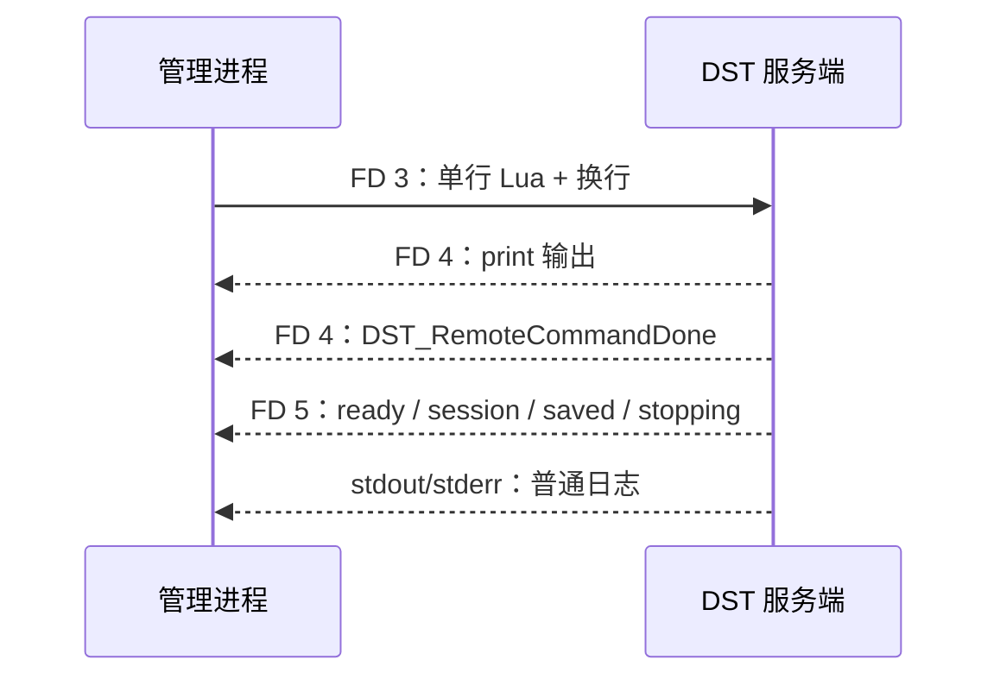

# `-cloudserver` 双向通信

`-cloudserver` 是 DST Linux 专用服务器提供的一组进程间通信接口。

它解决的是外部管理程序如何可靠地执行 Lua、取得命令结果，以及接收服务端状态。

## 游戏服务端原本的机制

启用 `-cloudserver` 后，服务端启动时会直接使用三个已经打开的文件描述符：

| FD | 方向 | 内容 | 边界 |
| --- | --- | --- | --- |
| 3 | 管理进程 → DST | Lua 命令 | 一条命令以换行结束 |
| 4 | DST → 管理进程 | 当前命令的输出 | 以独立一行 `DST_RemoteCommandDone` 结束 |
| 5 | DST → 管理进程 | 生命周期和状态消息 | 每条消息一行 |

FD 3、4、5 不是标准输入、标准输出和标准错误的别名。

标准的 FD 0、1、2 仍然保留原来的用途，普通服务端日志也仍从 stdout/stderr 输出。

管理进程在看到 `DST_RemoteCommandDone` 前不能发送下一条命令。

服务端暂时不能执行 Lua 时，FD 4 会返回 `DST_LuaBusy`；调用方应稍后重试，而不是并发塞入更多命令。

FD 5 与命令执行相互独立。

常见消息包括 `DST_Master_Ready`、`DST_SessionId`、`DST_Saved`、`DST_Stopping` 和 `DST_Shutdown`，也可能出现尚未公开格式的统计消息。



## 命令如何返回结构化结果

FD 4 只提供文本行，没有请求 ID、类型和错误模型。

本项目一次只执行一条命令，并在 Lua 外包一层带 ULID 请求身份的最小协议：

1. 每次尝试生成标准 26 字符 ULID，并在编译原命令前输出 `DST_SERVER_FRAME|<ulid>|START`。
2. 原命令经 `lua_string()` 转义后由 `loadstring()` 编译，并在 `pcall` 内执行。
3. 类型化调用把成功值或错误编码为 JSON，再输出 `DST_SERVER_RESULT|<json>`。
4. 外层编译或运行错误会安全转换为普通文本，再输出匹配 token 的 `END`，不会在 END 后重新抛出。
5. Python 只在匹配 START 与 END 后接受 DST 最终追加的原生 `DST_RemoteCommandDone`。
6. Python 找到结构化结果前缀后，再用严格的 Pydantic 模型校验。

START 与 END 之间出现的文本 `DST_RemoteCommandDone` 或 `DST_LuaBusy` 只是命令输出，不会结束或重放当前命令。

只有 START 前没有其他普通输出的原生 `DST_LuaBusy` 会触发使用新 token 的重试。

成功的 Lua `return` 值不会自动成为 FD 4 的结果。

需要返回给管理进程的数据必须显式 `print`，本项目用 `json.encode_compliant` 保证输出是标准 JSON。

`DST_SERVER_RESULT|` 前缀与 JSON 合计最多 65,536 bytes，不计算结尾 LF。

SDK 生成的结果超限时会改发短 failure envelope；其他 FD 4 超长行会被完整丢弃，当前 ULID 帧排空后才允许下一条命令。

如果 EOF、传输错误或结果读取任务取消导致帧无法重新对齐，Console 会拒绝后续命令。

## 本项目如何接管 FD

父进程创建三根匿名 pipe，每根只承担一个方向：

```text
Python 写端 ───────> DST FD 3
Python 读端 <─────── DST FD 4
Python 读端 <─────── DST FD 5
```

`subprocess` 的 `pass_fds` 只能保证描述符被子进程继承，不能把任意描述符自动改成 3、4、5。

因此启动链路中有一个很薄的 wrapper：

1. 先把可能占用 3、4、5 的源描述符移动到 5 以上。
2. 子进程通过 `pass_fds` 继承这三个源描述符。
3. wrapper 用 `dup2` 把它们映射为准确的 3、4、5。
4. wrapper 关闭多余副本，再用 `execv` 原地替换为 DST 进程。

这样 DST 看到的是固定协议 FD，Python 只保留自己需要的三端，不会让无关 pipe 端点留在两边阻止 EOF。

Python 再用 asyncio 的 pipe transport 把三个父端接入 `StreamReader` 和 `StreamWriter`。

## 两条事件通道

FD 5 只承载游戏原生的服务端消息，不是通用游戏事件总线。

项目注入的 Lua Hook 使用 `print` 输出带 `DST_OTEL|` 前缀的事件：

- 在 FD 3 命令同步执行期间产生的 `print` 会进入 FD 4。
- 之后由游戏回调异步产生的 `print` 会进入普通日志流。

因此 Python 对 FD 4 和 stdout/stderr 使用同一个事件解析器。

解析器先分流 `DST_OTEL|`，剩余 FD 4 文本才算命令输出；普通日志中没有事件前缀的行仍按日志处理。

## 并发与安全边界

命令执行由一把进程内锁串行化，这是底层协议的要求，不是吞吐优化问题。

读取任务必须持续消费 FD 4、FD 5 和 stdout/stderr，否则 pipe 写满后会反向阻塞游戏进程。

FD 3 可以执行任意服务端 Lua，必须只交给与 DST 同一信任域的管理进程，不能直接暴露为网络接口。

## 参考资料

- [Klei Forum：`-cloudserver` 的 FD 3、4、5](https://forums.kleientertainment.com/forums/topic/118972-unix-python-web-portal-for-dedicated-dst-server/#findComment-1344090)
- [Klei Forum：每个方向需要独立 pipe](https://forums.kleientertainment.com/forums/topic/140113-problem-with-file-descriptors/#findComment-1568906)
- [Klei Forum：FD 3 保留写端，FD 4/5 保留读端](https://forums.kleientertainment.com/forums/topic/140113-problem-with-file-descriptors/#findComment-1568918)
- [Python：`loop.connect_read_pipe()`](https://docs.python.org/3/library/asyncio-eventloop.html#asyncio.loop.connect_read_pipe)
- [Python：`os.dup2()`](https://docs.python.org/3/library/os.html#os.dup2)
