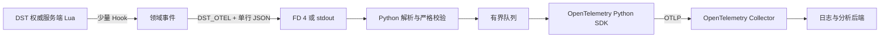

# 游戏事件与 OpenTelemetry

本项目在 DST 的权威服务端 Lua 中采集关键游戏事件，在 Python 进程中完成校验和 OpenTelemetry 导出。

核心原则只有一条：Lua 负责形成事实，Python 和 Collector 负责传输、可靠性与存储。

## 设计目标

- 记录玩家生命周期、关键行为、死亡和世界状态变化。
- 不修改游戏本体 Script，不要求客户端安装代码。
- 遥测失败不能改变游戏逻辑，也不能阻塞模拟线程。
- 每个分片独立采集，进入 OpenTelemetry 后再按集群、分片和会话汇总。
- 事件结构保持稳定，具体 Hook 可以随游戏版本调整。

## 整体链路



每个 shard 都是独立进程，拥有自己的 Lua 状态、事件序号和输入流。

Python 管理进程负责补充 cluster、shard、session 和进程实例信息。

## Lua 侧：只产生小而确定的事件

服务端 ready 后，Python 通过 FD 3 扩展 `package.path`，加载包内的 `dst_server` 模块并调用 `install`。

默认 profile 为 `off`，只安装 management RPC；需要游戏事件时必须显式选择 `critical` 或 `history`。

埋点选择权威、低歧义的领域位置，例如玩家进出分片、复活、死亡、选定 Action 的最终结果，以及少量世界状态变化。

项目不会包装全局 `EntityScript:PushEvent`。

那个入口覆盖所有实体和大量高频内部事件，固定开销大，也容易把 Mod 私有数据带入遥测。

每条事件都编码成带版本号的 envelope：

```json
{
  "v": 1,
  "nonce": "...",
  "seq": 42,
  "event": "dst.entity.death",
  "tick": 1200,
  "monotonic_ms": 45678,
  "cycle": 17,
  "data": {}
}
```

Lua 使用 `json.encode_compliant` 生成标准 JSON，再通过 `print("DST_OTEL|" .. payload)` 输出一行。

Lua 不实现 OTLP、HTTP 重试、鉴权或磁盘缓冲，也不持有 Collector 凭据。

这些能力与游戏模拟无关，放进 Lua 只会扩大故障面。

## 安装与健康状态

Python 通过一次同步 `driver.install(options)` RPC 完成安装。

Health 固定包含五个字段：

```text
protocol
telemetry_status
telemetry_error
events_emitted
errors
```

| `telemetry_status` | `telemetry_error` | 含义 |
| --- | --- | --- |
| `disabled` | `null` | profile 为 `off`，未加载 telemetry 模块或安装 Hook |
| `active` | `null` | 所需 Hook 全部安装成功 |
| `failed` | 非空字符串 | telemetry 安装失败并在当前 generation 关闭 |

完整调用时序见 [Python SDK Telemetry Driver 关键时序](python-sdk-telemetry-flow.md)。

安装边界和已知限制详见 [Python SDK 接入已确认问题](python-sdk-known-issues.md)。

## Python 侧：分流、校验和背压

同步命令期间的 `print` 会进入 FD 4，异步游戏回调的 `print` 会进入普通日志流。

因此两个输入都交给同一个 `DST_OTEL|` 解析器，具体原因见 [`-cloudserver` 双向通信](cloudserver-ipc.md)。

解析边界包括：

- 单行最大 64 KiB。
- 每个服务端进程使用独立 nonce，避免把普通日志或其他 Mod 输出误认成事件。
- Pydantic 以 strict 模式校验带判别字段的事件联合。
- 未知字段、类型转换、NaN、无穷值和未知核心事件默认拒绝。
- 合法事件进入固定容量队列；队列满时丢弃并计数，日志读取不能停。

Python 保存接收时间，因为 Lua 的 `GetTimeReal` 是进程内单调时间，不是可直接跨主机比较的 UTC 时间。

## OpenTelemetry 映射

游戏内事实是某个时刻已经发生的事件，最适合映射为带 `EventName` 和结构化 `Body` 的 OpenTelemetry Log Event。

它们不是人为制造的零时长 Span。

| 数据 | OpenTelemetry 信号 | 例子 |
| --- | --- | --- |
| 游戏事实 | Log Event | 玩家进入、Action 完成、实体死亡、季节变化 |
| 管理操作 | Span | 启动、停止、执行 Lua、等待保存 |
| 聚合状态 | Metric | 进程存活、在线人数、队列深度、事件丢弃数 |

事件名描述稳定的事件类型，`Body` 保存该事件的结构化数据，attributes 保存 sequence、tick、cluster、shard 和 session 等上下文。

管理操作如果已有父 Trace，会沿用当前上下文；游戏事件没有可靠因果关系时不强行绑定 Trace。

## 导出与 Collector

Python 使用官方 OpenTelemetry SDK 的批处理器和 OTLP exporter。

endpoint、headers、证书、压缩和超时继续使用标准 `OTEL_EXPORTER_OTLP_*` 环境变量，不在项目中复制一套配置。

这些环境变量只配置传输，不会隐式启用 Lua 游戏事件采集。

生产部署建议先发给 Collector，再由 Collector 负责重试、批处理、过滤、鉴权和后端路由。

Collector 或后端不可用时，游戏进程和日志读取必须继续工作。

## 故障边界

- Lua Hook 保留原函数的参数、返回值和错误行为。
- 遥测构造与输出由 `pcall` 隔离，失败只增加内部错误计数。
- Python 丢弃不可信或超限记录，不把未验证对象交给 exporter。
- 队列有上限，不能用无限内存掩盖下游故障。
- 不采集聊天正文、控制台命令、密码、token 或任意 Mod 私有表。

## 演进边界

`off`、`critical` 和 `history` 三个 profile 已经覆盖关闭、关键事件和较完整历史三种需求。

只有真实负载证明事件量或信息不足时，才增加新的 Hook、采样规则或 Lua 批量缓冲。

游戏更新后应重新核对关键源码锚点，并用真实服务端做最小 smoke test；兼容性检查失败时只关闭遥测，不能带着未知签名继续 monkeypatch。

## 参考资料

- [Klei Forum：公开游戏脚本是 Mod 开发的源码参考](https://forums.kleientertainment.com/forums/topic/136505-how-to-get-developer-tools/)
- [DST 游戏脚本：`BufferedAction:Do`](https://github.com/LetsStarveTogether/dst-scripts/blob/3b39061246fecaab00dce0f73c771e61f637389e/bufferedaction.lua#L22)
- [DST 游戏脚本：`EntityScript:PushEvent`](https://github.com/LetsStarveTogether/dst-scripts/blob/3b39061246fecaab00dce0f73c771e61f637389e/entityscript.lua#L1286)
- [OpenTelemetry Logs 数据模型](https://opentelemetry.io/docs/specs/otel/logs/data-model/)
- [OpenTelemetry Event 语义约定](https://opentelemetry.io/docs/specs/semconv/general/events/)
- [OpenTelemetry Collector](https://opentelemetry.io/docs/collector/)
- [OpenTelemetry Python Exporters](https://opentelemetry.io/docs/languages/python/exporters/)
- [OTLP Exporter 规范](https://opentelemetry.io/docs/specs/otel/protocol/exporter/)
