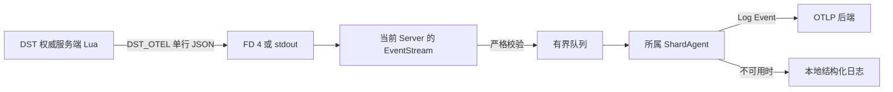

# 游戏事件与 OpenTelemetry

本项目在 DST 权威服务端 Lua 中形成游戏事实，在所属分片的 Python Agent 中校验并导出事件。
Lua 不实现 OTLP、网络重试、鉴权或磁盘缓冲，也不持有后端凭据。

## 设计边界

- 不修改游戏本体脚本，也不要求客户端安装代码。
- 只采集权威、低歧义的玩家、实体、分片和世界状态事件。
- 不包装高频且可能携带 Mod 私有数据的全局 `EntityScript:PushEvent`。
- 遥测失败不能改变游戏逻辑，也不能阻塞模拟线程或日志读取。
- 每个分片独立采集，后端再按 cluster 和 shard 汇总。

## 数据链路



同步 management 命令期间的 Lua `print` 进入 FD 4，异步游戏回调中的 `print` 进入 stdout。
`Console` 和 stdout pump 共用同一个事件解析入口。
Agent 独占当前分片的 lifecycle、日志和游戏事件 drain，因此其他分片不会阻塞该输入流。
运行时与 generation 行为见 [Python SDK 运行时与遥测时序](python-sdk-telemetry-flow.md)。

## Profile 与安装

`DST_SERVER_TELEMETRY_PROFILE` 接受 `off`、`critical` 和 `history`，默认值为 `critical`。
`off` 保留 management driver，但不加载游戏事件模块或安装 Telemetry Hook。
`critical` 记录玩家生命周期、实体死亡、分片连接和关键世界状态变化。
`history` 增加玩家行为、战斗、物品、状态、种植和配置 allowlist 中的 Action 结果。
`history` 的 Action allowlist 为空时不会包装 `BufferedAction.Do`。
Python 在 shard ready 后同步安装当前已观察 generation，并在安装期间变代时追赶最新 generation。
Health 固定包含 `protocol`、`telemetry_status`、`telemetry_error`、`events_emitted` 和 `errors`。

| `telemetry_status` | 含义 |
| --- | --- |
| `disabled` | profile 为 `off` |
| `active` | 当前 Lua module state 的全部 Telemetry Hook 已安装 |
| `failed` | 安装失败且当前 Lua module state 不会自动重试 |

Telemetry 安装失败不会阻止 shard ready 或 management RPC。

## 事件契约

每条 Lua 事件使用版本化 envelope。

```json
{
  "v": 1,
  "nonce": "01ARZ3NDEKTSV4RRFFQ69G5FAV",
  "seq": 42,
  "event": "dst.entity.death",
  "tick": 1200,
  "monotonic_ms": 45678,
  "cycle": 17,
  "data": {}
}
```

`nonce` 是当前 Python `Server` 尝试生成并传给 Lua 的 canonical ULID。
`seq` 在当前 Lua module state 内递增，编码失败也会留下序号间隙。
事件不携带 Session 或 Lua runtime generation，Python 也不会从可变服务端状态猜测补写。
因此 `(nonce, seq)` 不能用作跨 reload 唯一身份，也不能可靠表达事件所属 Session。
`tick` 和 `monotonic_ms` 只描述生产进程内时间，Python 另外保存 UTC 观察时间。

## 校验与背压

- 完整事件行不得超过 64 KiB。
- 单个 `picksomething` 事件最多转换 64 个 loot item。
- Pydantic 以 strict 模式校验带判别字段的事件联合。
- 未知字段、错误类型、NaN、无穷值和未知事件名都会被拒绝。
- non-UTF-8 encoding、oversized、schema 和 nonce 四类拒绝分别只记录第一次 warning。
- 合法事件进入容量为 1,024 的队列。
- 队列满时丢弃当前事件并计数，输入 pump 继续运行。

Lua 的 `events_emitted` 只表示 `print` 已返回，不表示 Python 已经校验、入队或导出。
Python 的 `invalid` 和 `dropped` 分别表示输入拒绝与队列丢弃。

## OpenTelemetry 映射

游戏事实映射为带 `event_name` 和结构化 `body` 的 OpenTelemetry Log Event，而不是零时长 Span。

| 数据 | OpenTelemetry 信号 |
| --- | --- |
| 游戏事实 | Log Event |
| management 操作 | Span |
| 进程、玩家和事件结果 | Metric |

Log Event attributes 包含 sequence、tick、cluster 和 shard 等稳定上下文。
游戏事件没有可靠因果上下文时不会强行绑定 Trace。
Agent incarnation 的 canonical ULID 用作 `service.instance.id`。

## 导出配置

Python 使用 OpenTelemetry SDK 的 batch processor 和 OTLP/gRPC exporter。
endpoint、headers、证书、压缩和超时沿用标准 `OTEL_EXPORTER_OTLP_*` 环境变量。
`OTEL_LOGS_EXPORTER`、`OTEL_METRICS_EXPORTER` 和 `OTEL_TRACES_EXPORTER` 在本项目中接受 `otlp` 或 `none`。
OTLP 环境变量只配置 Python pipeline，不会隐式改变 Lua profile。
`QuadletApplication` 只传播调用方显式提供的 telemetry environment。
仓库的 `scripts.generate_rooms` 为所有生成容器配置同机 Netdata logs endpoint，并只为需要完整历史的房间选择 `history`。
当前部署示例关闭 metrics 和 traces exporter，因为本机 Netdata 配置只承担 OTLP logs。
同机 Netdata listener、专用 loopback 地址和存储配置分别位于 [`deploy/netdata`](../deploy/netdata) 与 [`deploy/networkd`](../deploy/networkd)。
跨主机或存在不可信本地容器时，应使用 TLS、鉴权和网络访问控制，而不是公开明文 listener。

## 历史日志查询

宿主机管理进程可以通过 `dst_server.netdata.NetdataLogs` 查询 Netdata 保存的结构化 OpenTelemetry 日志。
查询使用带时区的绝对时间和精确字段筛选，不暴露 Netdata CLI 的参数语法。
时间窗口会规范化为 Netdata 查询引擎支持的 UTC 整秒。

```python
from datetime import UTC, datetime, timedelta

from dst_server.netdata import NetdataLogQuery, NetdataLogs

result = await NetdataLogs().query(
    NetdataLogQuery(
        since=datetime.now(UTC) - timedelta(minutes=15),
        filters=(
            ("attributes.dst.cluster.name", "room-000"),
            ("body.player.userid", "KU_..."),
        ),
        limit=100,
    )
)
```

记录字段使用有序的键值对而不是字典，因为一条 Netdata 记录可以包含重复字段。
`diagnostics` 保留 Netdata 查询警告；退出成功不代表所有损坏或轮转中的文件都已读取。
本机查询只返回时间窗口内最新的有限条记录，不提供游标分页或完整历史遍历。
该能力属于宿主机级日志存储，不进入单个房间的 Cluster RPC。
调用进程必须能够执行 `otel-plugin` 并读取 Netdata 的日志存储目录。

## 故障与隐私边界

- Listener、watcher 和 wrapper 在 inactive 时不调用 emit。
- Telemetry callback、编码和输出异常由 Lua `pcall` 隔离并增加 `errors`。
- Action 和 shard wrapper 保留原函数参数、返回值和异常行为。
- Hook 安装不是回滚事务，失败后可能留下 inactive wrapper 或 listener。
- 同一 Lua module state 安装失败后不会自动重试。
- Python 不把未经校验或超限的对象交给 exporter。
- OTLP pipeline 初始化失败或同步 emit 抛错时，当前事件写入本地结构化日志。
- Batch exporter 的异步失败由 OpenTelemetry 自行报告，不触发 Agent 级逐事件回退。
- 不采集聊天正文、console 命令、密码、token 或任意 Mod 私有表。

## 参考资料

- [OpenTelemetry Logs 数据模型](https://opentelemetry.io/docs/specs/otel/logs/data-model/)
- [OpenTelemetry Event 语义约定](https://opentelemetry.io/docs/specs/semconv/general/events/)
- [OpenTelemetry Python Exporters](https://opentelemetry.io/docs/languages/python/exporters/)
- [Netdata OTLP ingestion](https://learn.netdata.cloud/docs/collecting-metrics/opentelemetry/otlp-ingestion)
