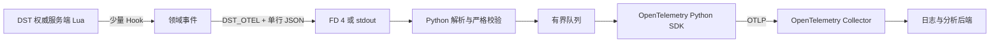

# 游戏事件与 OpenTelemetry

本项目在 DST 的权威服务端 Lua 中采集关键游戏事件，在 Python 进程中完成校验和 OpenTelemetry 导出。

核心原则只有一条：Lua 负责形成事实，Python 和 Collector 负责传输、可靠性与存储。

## 设计目标

- 记录玩家生命周期、关键行为、死亡和世界状态变化。
- 不修改游戏本体 Script，不要求客户端安装代码。
- 遥测失败不能改变游戏逻辑，也不能阻塞模拟线程。
- 每个分片独立采集，进入 OpenTelemetry 后再按集群和分片汇总。
- 事件结构保持稳定，具体 Hook 可以随游戏版本调整。

## 整体链路



每个 shard 都是独立进程，拥有自己的 Lua 状态、事件序号和输入流。

Python 管理进程只为游戏事件补充来自固定配置的 cluster 和 shard，以及 Python 观察时间。

当前游戏事件不携带 session，Python 不会从可变的服务端状态猜测补写。

## Lua 侧：只产生小而确定的事件

服务端 ready 后，Python 通过 FD 3 扩展 `package.path`，加载包内的 `dst_server` 模块并调用 `install`。

默认 profile 为 `critical`，安装 management RPC 和关键游戏事件；`off` 关闭游戏事件，`history` 扩展记录范围。

`history` 的 Action allowlist 为空时不安装全局 `BufferedAction.Do` wrapper。

埋点选择权威、低歧义的领域位置，例如玩家进出分片、复活、死亡、选定 Action 的最终结果，以及少量世界状态变化。

项目不会包装全局 `EntityScript:PushEvent`。

那个入口覆盖所有实体和大量高频内部事件，固定开销大，也容易把 Mod 私有数据带入遥测。

每条事件都编码成带版本号的 envelope：

```json
{
  "v": 1,
  "nonce": "01ARZ3NDEKTSV4RRFFQ69G5FAV",
  "seq": 42,
  "event": "dst.entity.death",
  "tick": 1200,
  "monotonic_ms": 45678,
  "cycle": 17,
  "data": {}
}
```

Lua 使用 `json.encode_compliant` 生成标准 JSON，再通过 `print("DST_OTEL|" .. payload)` 输出一行。

Lua 不实现 OTLP、HTTP 重试、鉴权或磁盘缓冲，也不持有 Collector 凭据。

这些能力与游戏模拟无关，放进 Lua 只会扩大故障面。

## 安装与健康状态

Python 通过一次同步 `driver.install(options)` RPC 完成安装。

Health 固定包含五个字段：

```text
protocol
telemetry_status
telemetry_error
events_emitted
errors
```

| `telemetry_status` | `telemetry_error` | 含义 |
| --- | --- | --- |
| `disabled` | `null` | profile 为 `off`，未加载 telemetry 模块或安装 Hook |
| `active` | `null` | 所需 Hook 全部安装成功 |
| `failed` | 非空字符串 | telemetry 安装失败并在当前 generation 关闭 |

启动、generation 和 RPC 行为见 [Python SDK Telemetry Driver 关键时序](python-sdk-telemetry-flow.md)。

安装边界和已知限制见 [Python SDK 已确认问题](python-sdk-known-issues.md)。

## Python 侧：分流、校验和背压

同步命令期间的 `print` 会进入 FD 4，异步游戏回调的 `print` 会进入普通日志流。

因此两个输入都交给同一个 `DST_OTEL|` 解析器，具体原因见 [`-cloudserver` 双向通信](cloudserver-ipc.md)。

解析边界包括：

- 单行最大 64 KiB。
- 单个 `picksomething` 事件最多转换 64 个 loot item；超限时丢弃该事件并增加 Lua `errors`。
- 每个服务端进程使用独立的 canonical ULID nonce，避免把普通日志或其他 Mod 输出误认成事件。
- Pydantic 以 strict 模式校验带判别字段的事件联合。
- 未知字段、类型转换、NaN、无穷值和未知核心事件默认拒绝。
- Oversized、schema 和 nonce 三类非法输入各只记录第一次 warning，计数仍逐条增加。
- 合法事件进入固定容量队列；队列满时丢弃并计数，日志读取不能停。

Python 保存接收时间，因为 Lua 的 `GetTimeReal` 是进程内单调时间，不是可直接跨主机比较的 UTC 时间。

Cluster service 在等待 shard ready 前启动事件 consumer，避免较快 shard 的启动期事件因其他 shard 较慢而堆满队列。

## OpenTelemetry 映射

游戏内事实是某个时刻已经发生的事件，最适合映射为带 `EventName` 和结构化 `Body` 的 OpenTelemetry Log Event。

它们不是人为制造的零时长 Span。

Pipeline 生成 canonical ULID 作为 `service.instance.id`，并拒绝非 ULID override。

| 数据 | OpenTelemetry 信号 | 例子 |
| --- | --- | --- |
| 游戏事实 | Log Event | 玩家进入、Action 完成、实体死亡、季节变化 |
| 管理操作 | Span | 启动、停止、执行 Lua、等待保存 |
| 聚合状态 | Metric | 进程存活、在线人数、事件处理结果 |

事件名描述稳定的事件类型，`Body` 保存该事件的结构化数据，attributes 保存 sequence、tick、cluster 和 shard 等上下文。

管理操作如果已有父 Trace，会沿用当前上下文；游戏事件没有可靠因果关系时不强行绑定 Trace。

## 导出与后端

Python 使用官方 OpenTelemetry SDK 的批处理器和 OTLP exporter。

endpoint、headers、证书、压缩和超时继续使用标准 `OTEL_EXPORTER_OTLP_*` 环境变量，不在项目中复制一套配置。

`OTEL_LOGS_EXPORTER`、`OTEL_METRICS_EXPORTER` 和 `OTEL_TRACES_EXPORTER` 支持标准的 `otlp` 与 `none` 值。

这些环境变量只配置传输，不会隐式启用 Lua 游戏事件采集。

容器入口通过 `DST_SERVER_TELEMETRY_PROFILE=off|critical|history` 调整记录等级，未设置时使用 `critical`。

### 本机 Netdata

Netdata 2.11 的 Agent 正式接收 OTLP/gRPC metrics 和 logs，但尚未提供公开的 trace 查询流程。

SDK 的 Quadlet 生成器默认不注入 telemetry profile 或 OTLP exporter endpoint。

这使未明确配置可达后端的新 Pod 不会反复尝试导出。

仓库中的 rootful 部署示例则显式启用了下面的本机 Netdata logs 配置。

Netdata stock 配置的 OTLP/gRPC listener 仅监听宿主机 `127.0.0.1:4317`。

在推荐的 private-network Pod 中，`127.0.0.1` 指向 Pod 自己，不是宿主机 Netdata。

仓库通过 `systemd-networkd` 给 `lo` 声明专用地址 `10.255.255.254/32`，Netdata 只监听该地址的 `4317` 端口。

这个地址不是额外网关，也不需要手写路由；内核会为本机地址自动建立 `local` 路由。

安装配置并重启 Netdata：

```shell
sudo install -D -m 0644 deploy/netdata/otel.yaml /etc/netdata/otel.yaml
sudo install -D -m 0644 \
  deploy/networkd/10-netdata-loopback.network \
  /etc/systemd/network/10-netdata-loopback.network
sudo install -D -m 0644 \
  deploy/netdata/netdata.service.d/networkd.conf \
  /etc/systemd/system/netdata.service.d/networkd.conf
sudo rm -f /etc/systemd/system/netdata.service.d/otel-container-address.conf
sudo networkctl reload
sudo systemctl daemon-reload
sudo systemctl restart netdata
```

其中 `rm` 只清理仓库旧版本安装的 Netdata service drop-in；全新部署中该文件不存在。

地址现在由 `systemd-networkd` 持有，不再随 Netdata 的启动、停止或升级而变化。

Netdata 的 drop-in 只等待 `lo` 配置完成，不执行命令或修改网络。

这里使用按接口的 wait-online unit，是因为默认 wait-online 会忽略 loopback。

rootful private Pod 通过自己的默认路由访问该宿主机本地地址，不需要 host network 或公开 listener。

不直接绑定 Podman 网关，因为该接口可能仅在容器运行时存在；专用 loopback 地址的生命周期独立于 Podman。

`scripts.generate_rooms` 默认把这组环境注入所有生成的 worker。

它等价于下列环境：

```python
environment = {
    "DST_SERVER_TELEMETRY_PROFILE": "history",
    "OTEL_EXPORTER_OTLP_LOGS_ENDPOINT": "http://10.255.255.254:4317",
    "OTEL_METRICS_EXPORTER": "none",
    "OTEL_TRACES_EXPORTER": "none",
}
```

这里的 `http://` 表示同机明文 gRPC，不是 OTLP/HTTP。

Netdata 不接受 OTLP/HTTP 或端口 `4318`。

这个地址只适用于同机受信任的 Podman 网络。

存在不可信本地容器或跨主机 sender 时，应改用 Netdata 官方推荐的 TLS/mTLS endpoint 和网络访问控制。

不要把明文 listener 暴露为 `0.0.0.0:4317`。

Netdata 当前不能作为可查询的 trace 后端，所以本机配置显式关闭 trace exporter。

SDK 的 trace exporter 能力保持不变，可指向独立的 Collector 或 trace 后端。

未登录 Netdata Cloud 时，`otel-logs` Function 会拒绝敏感日志查询，但可用 Agent 自带的离线查询命令验证相同 WAL：

```shell
sudo /usr/lib/netdata/plugins.d/otel-plugin logs \
  --stock-config /usr/lib/netdata/conf.d/otel.yaml \
  --config /etc/netdata/otel.yaml \
  --since -5m \
  --name dst-server \
  --limit 20
```

没有配置 `base_dir`，因此 Netdata 继续使用 stock 存储位置。

本地索引日志共用 `1TB` 容量上限和 `500000` 文件安全上限，并将 `max_age` 设为 `9 years`，使时间条件在实际容量范围内不先触发。

持续写入的 WAL 按 `100MB` 或 `200000` 条记录轮转，代码默认的 15 分钟时限仍会及时封口低流量文件。

生产部署建议先发给 Collector，再由 Collector 负责重试、批处理、过滤、鉴权和后端路由。

Collector 或后端不可用时，游戏进程和日志读取必须继续工作。

## 故障边界

- Lua Hook 保留原函数的参数、返回值和错误行为。
- Listener、watcher 和 wrapper 在 inactive 时不会调用 emit，遥测构造与输出由入口的 `pcall` 隔离。
- `telemetry.emit()` 本身不重复检查 active，失败只增加入口维护的内部错误计数。
- Python 丢弃不可信或超限记录，不把未验证对象交给 exporter。
- 队列有上限，不能用无限内存掩盖下游故障。
- 不采集聊天正文、控制台命令、密码、token 或任意 Mod 私有表。

## 演进边界

`off`、`critical` 和 `history` 三个 profile 已经覆盖关闭、关键事件和较完整历史三种需求。

只有真实负载证明事件量或信息不足时，才增加新的 Hook、采样规则或 Lua 批量缓冲。

游戏更新后应重新核对关键源码锚点，并用真实服务端做最小 smoke test；兼容性检查失败时只关闭遥测，不能带着未知签名继续 monkeypatch。

## 参考资料

- [Klei Forum：公开游戏脚本是 Mod 开发的源码参考](https://forums.kleientertainment.com/forums/topic/136505-how-to-get-developer-tools/)
- [DST 游戏脚本：`BufferedAction:Do`](https://github.com/LetsStarveTogether/dst-scripts/blob/3b39061246fecaab00dce0f73c771e61f637389e/bufferedaction.lua#L22)
- [DST 游戏脚本：`EntityScript:PushEvent`](https://github.com/LetsStarveTogether/dst-scripts/blob/3b39061246fecaab00dce0f73c771e61f637389e/entityscript.lua#L1286)
- [OpenTelemetry Logs 数据模型](https://opentelemetry.io/docs/specs/otel/logs/data-model/)
- [OpenTelemetry Event 语义约定](https://opentelemetry.io/docs/specs/semconv/general/events/)
- [OpenTelemetry Collector](https://opentelemetry.io/docs/collector/)
- [OpenTelemetry Python Exporters](https://opentelemetry.io/docs/languages/python/exporters/)
- [OTLP Exporter 规范](https://opentelemetry.io/docs/specs/otel/protocol/exporter/)
- [systemd.network](https://www.freedesktop.org/software/systemd/man/latest/systemd.network.html)
- [systemd-networkd-wait-online.service](https://www.freedesktop.org/software/systemd/man/latest/systemd-networkd-wait-online.service.html)
- [Podman：`host.containers.internal`](https://docs.podman.io/en/latest/markdown/podman-create.1.html#add-host-hostname-hostname-ip)
- [Netdata：OTLP metrics 和 logs ingestion](https://learn.netdata.cloud/docs/collecting-metrics/opentelemetry/otlp-ingestion)
- [Netdata：OpenTelemetry plugin 配置](https://learn.netdata.cloud/docs/collecting-metrics/opentelemetry)
- [Netdata：OpenTelemetry logs](https://learn.netdata.cloud/docs/logs/opentelemetry-logs)
