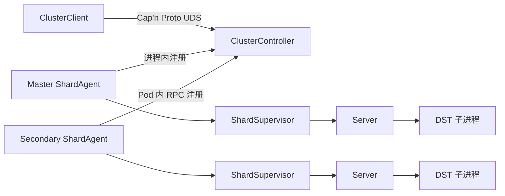
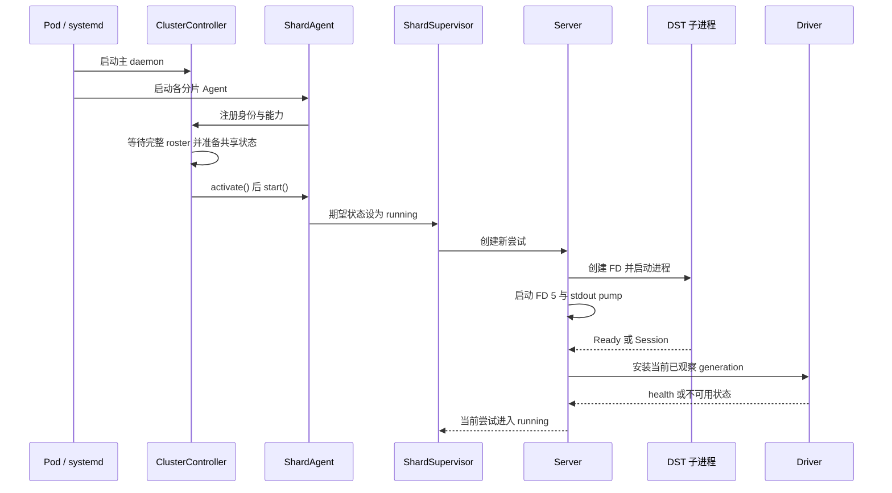

# Python SDK 运行时与遥测时序

本文描述 Podman 部署中集群控制、分片进程、Lua driver 和游戏事件遥测的当前运行方式。
这里只保留跨模块契约，协议 framing 的细节见 [`-cloudserver` 双向通信](cloudserver-ipc.md)。

## 运行时架构

- 主分片容器同时运行 `ClusterController` 和主分片 `ShardAgent`。
- 次分片容器各运行一个 `ShardAgent`，并通过 Pod 内的抽象 Unix socket 注册到主分片。
- 主 daemon 通过 `/cluster/.dst-server.sock` 提供权限为 `0600` 的集群 RPC。
- `ClusterController` 维护完整 roster、集群期望状态、共享准备和 fail-close。
- 每个 `ShardAgent` 独占一个分片的进程监督、日志、生命周期、游戏事件和 OpenTelemetry pipeline。
- `ShardSupervisor` 为每次尝试创建全新的单次使用 `Server`。
- `Server` 管理 DST 子进程、FD 3/4/5、stdout、Lua driver generation 和事件输入队列。

daemon RPC API 是集群级入口，`cluster.shard(name)` 返回指定分片的远程 facade。

## 集群与子进程生命周期

控制器在预期的 Agent 全部注册后自动协调默认的 `running` 期望状态。
共享配置校验、目录准备和 Mod 更新只由主分片控制器执行。
共享准备完成后，每个 Agent 激活自己的分片路径、console FIFO 和 OpenTelemetry pipeline。
控制器随后并发启动所有期望运行的 Agent。

`Server.start()` 的默认 300 秒总期限覆盖进程创建、lifecycle ready 和首次 driver 安装。
首次安装期间如果观察到更高 generation，`Driver` 会丢弃旧结果并追赶最新 generation。
Telemetry Hook 安装失败会提交 `failed` health，但不会让游戏进程启动失败。
Core driver、FD 4 结果或 health envelope 失败会让类型化 SDK 不可用，但在进程和 FD 5 仍存活时游戏继续运行。
进程退出、启动期间的 FD 5 EOF、启动超时或启动清理失败会结束当前 `Server` 尝试。
运行期间 lifecycle drain 意外结束会使 Agent daemon 退出，并由 systemd 和 Podman 恢复容器。
Supervisor 最多连续尝试五次，每次失败后等待一秒。
一次尝试连续稳定运行十分钟后，连续失败计数会清零。
任一分片耗尽预算时，控制器停止所有已注册分片的游戏子进程。
Agent daemon 和公开 RPC 在 fail-close 后保持可用，以便观察状态或显式重新启动。
次分片失去注册连接时会杀死自己的游戏子进程，控制器也会停止仍连接的其他分片。
容器心跳只证明 daemon event loop 持续运行，Podman 健康检查失败后由容器和 systemd 生命周期继续收敛。

## Generation 与管理操作

FD 5 的 `Session` 消息增加 Python generation，并立即使上一代 committed health 失效。
新 generation 会触发一个共享的后台 reinstall task。
同一 Lua module state 的重复 `driver.install()` 只返回当前 health，不改变 options，也不重试 Telemetry Hook。
类型化请求会等待当前已观察 generation 的 driver ready。
请求在写入 FD 3 前发现 generation 失效时可以等待新一代后安全重试。
请求写入后再发现 generation 变化时会抛出 `IndeterminateCommandError`，并且不会自动重放。
`reset()`、`regenerate()`、`regenerate_shard()` 和 `rollback()` 还会等待严格更高 generation 完成安装。
Raw `Server.execute()` 不经过 driver-ready 屏障，是调用方自行处理 reload 时序的逃生口。
Raw、类型化、save 和 reload 操作默认共用一个 30 秒总期限。

## 游戏事件链路

Lua 在权威服务端 Hook 中形成领域事件，并输出带 `DST_OTEL|` 前缀的单行 JSON。
同步命令期间的事件进入 FD 4，异步游戏回调中的事件进入 stdout。
两个来源都进入当前 `Server` 的同一个 `EventStream`。
`EventStream` 使用每次游戏进程尝试唯一的 canonical ULID nonce 验证来源。
Python 以 strict 模式验证事件联合，并拒绝未知字段、错误类型和非有限数值。
encoding、oversized、schema 和 nonce 四类拒绝分别只记录第一次 warning，但计数逐条增加。
合法事件进入容量为 1,024 的队列，队列满时丢弃当前事件而不阻塞日志读取。
Agent 独占消费该队列，并将事件导出为 OpenTelemetry Log Event 或本地结构化日志。
Agent 同时把已消费事件发布给集群 RPC 的 best-effort subscription。
FD 5 lifecycle 观察队列最多保留 64 条，满时丢弃最旧记录而不影响独立控制状态。

## 当前限制

游戏事件的 producer identity 只有进程尝试 nonce 和 Lua module state 内递增的 `seq`。
事件不携带 Session 或 Lua runtime generation，因此 `(nonce, seq)` 不能提供跨 reload 去重或可靠 Session 归属。
Python 不会从可变的 `server.session_id` 推断缺失身份。
Lua Hook 安装不是可回滚事务。
安装前会先验证 options，且只有全部阶段成功后才切换 `telemetry_active=true`。
安装中途失败可能留下 inactive wrapper 或 listener，同一 generation 不会自动重试。
运行期玩家 listener 附着若中途失败，也可能留下 attachment marker 并造成当前 active generation 的事件缺口。

## 故障边界

| 失败位置 | 当前结果 |
| --- | --- |
| Telemetry module、clock 或 Hook 安装 | 提交 `failed` health，游戏继续运行 |
| Core driver 或可恢复 RPC envelope | 记录 `driver_error`，类型化 SDK 不可用 |
| FD 4 EOF 或不完整 frame | Console 进入不可用状态，游戏继续运行 |
| Lua payload、编码或输出 | 增加 Lua `errors` 并丢弃当前事件 |
| Python encoding、大小、schema 或 nonce 校验 | 增加 `invalid` 并丢弃当前事件 |
| Python 事件队列满 | 增加 `dropped` 并丢弃当前事件 |
| OTLP pipeline 初始化或同步 emit 失败 | 当前事件写入本地结构化日志 |
| 异步 exporter 失败 | 由 OpenTelemetry processor/exporter 报告，Agent 不感知单次结果 |
| 当前进程尝试失败 | 清理进程、pipe 和后台 task 后按预算重试 |
| 分片预算耗尽或 Agent 断开 | fail-close 所有分片游戏子进程 |

## 代码入口

| 责任 | 入口 |
| --- | --- |
| roster、共享准备和 fail-close | [`cluster/controller.py`](../src/dst_server/cluster/controller.py) |
| 分片事件与 OTLP 所有权 | [`cluster/agent.py`](../src/dst_server/cluster/agent.py) |
| 子进程重试状态机 | [`cluster/supervisor.py`](../src/dst_server/cluster/supervisor.py) |
| daemon、注册和心跳 | [`cluster/daemon.py`](../src/dst_server/cluster/daemon.py) |
| 进程、FD 和失败清理 | [`runtime/server.py`](../src/dst_server/runtime/server.py) |
| generation 安装屏障 | [`runtime/driver.py`](../src/dst_server/runtime/driver.py) |
| FD 3/4 framing | [`runtime/console.py`](../src/dst_server/runtime/console.py) |
| 游戏事件校验与背压 | [`telemetry/stream.py`](../src/dst_server/telemetry/stream.py) |
