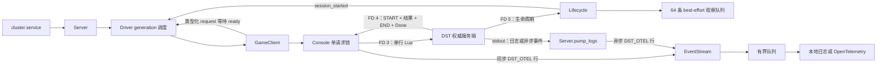
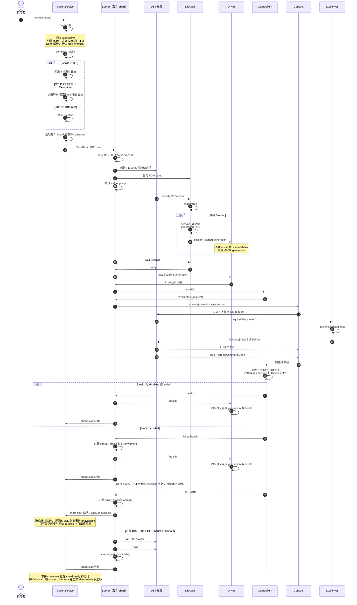
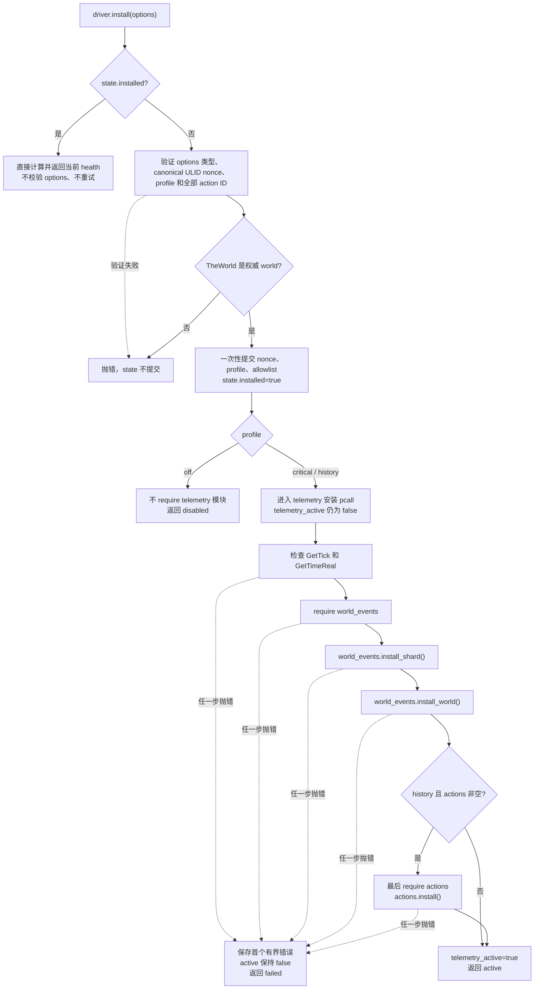
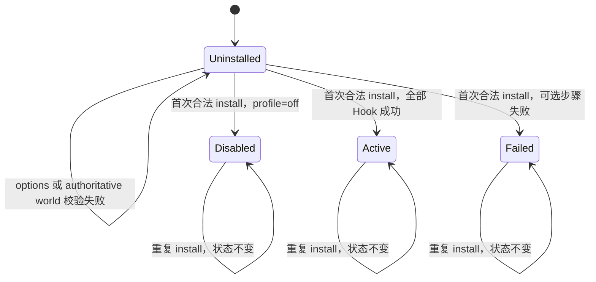
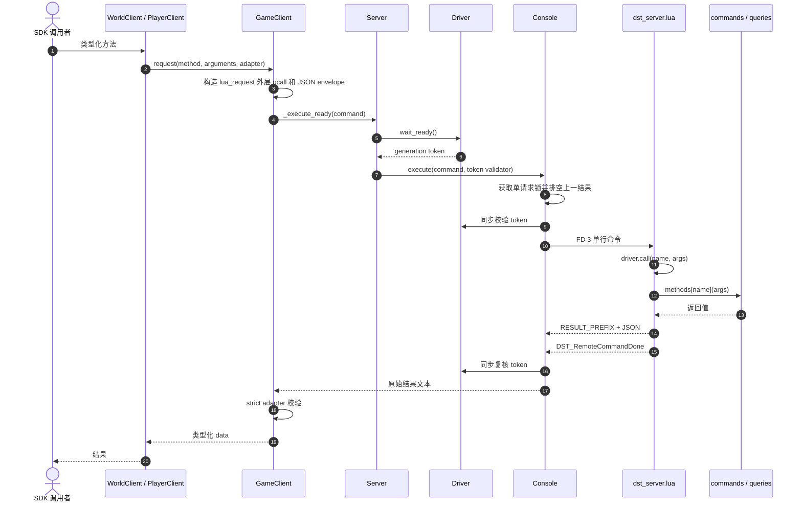
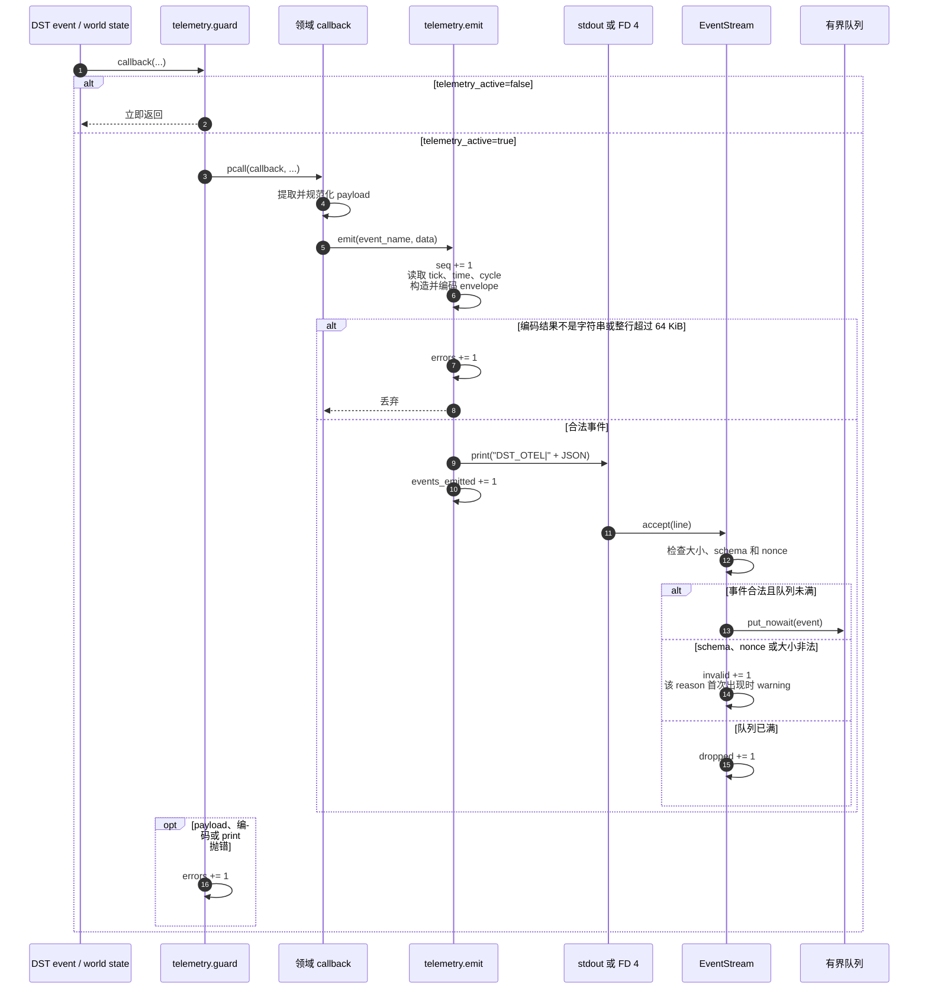
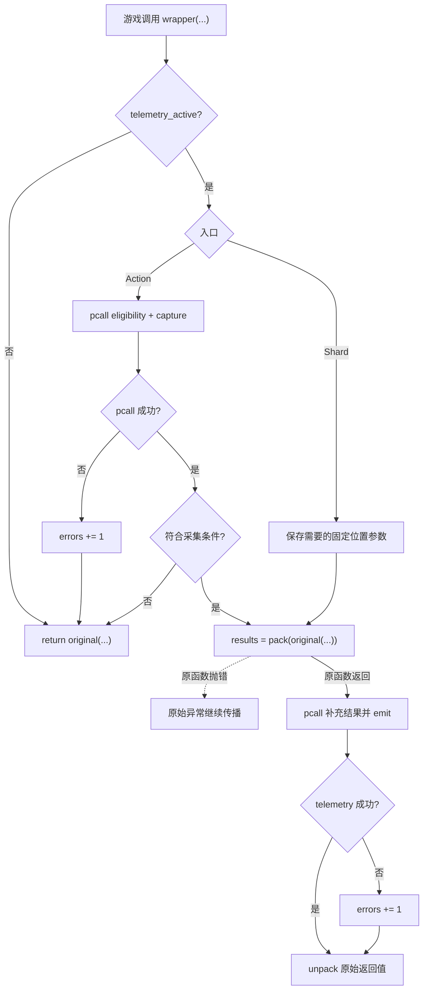
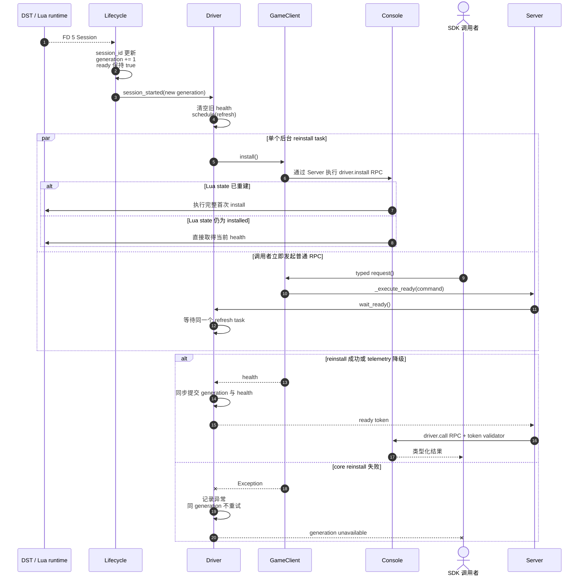

# Python SDK Telemetry Driver 关键时序

本文描述当前 Python supervisor、`-cloudserver` RPC、Lua management driver 和可选 telemetry 的真实调用链。

本文只解释已经实现的行为。

尚未解决的事件 producer 身份和物理 Hook 回滚仍按现状标出。

## 当前边界

- 每个 shard 启动时只执行一次同步 `driver.install(options)` RPC。
- 默认 profile 为 `critical`，安装 management RPC 和关键 Lua 游戏事件。
- `off` 关闭游戏事件，`history` 扩展记录范围。
- 首次 Core、FD4 结果或 health envelope 失败会降级 SDK，游戏继续运行；原始 console 只在帧仍同步时可用。
- 可选 telemetry 安装失败返回 `failed` health，只记录 warning，不阻止 shard ready。
- 同一 Lua generation 的重复 install 只返回当前 health，不改变配置或重试。
- 各 shard 拥有独立的 Lua state、health、nonce 和事件队列。
- `Server.start()` 使用默认 300 秒的单一总 timeout。
- Raw、类型化、save 和 reload 管理操作默认使用 30 秒总 timeout。
- 类型化 RPC 会等待 Python 已观察到的当前 generation 完成 driver install。
- 四个 reload API 还会等待严格更高的 generation 完成 driver install。
- 最终 encoded FD3 line 最多为 65,536 bytes，并包含结尾 LF。
- 一个 FD4 frame 最多包含 65,536 bytes 和 1,024 行 payload，行尾 CRLF 不计入 bytes。
- 每次 FD3 尝试使用独立的 ULID 和 START/END 标记，命令体打印旧 Done 或 Busy 不会改变帧边界。
- 游戏事件不携带 session，Python 也不会从可变 server 状态猜测补写。
- FD5 原始观察队列固定为 64 条，满时丢弃最旧记录。

## 组件与通道

FD 3 和 FD 4 承担串行 management RPC。

FD 5 独立报告 Ready、Session、Saved 和 Stopping 等生命周期消息。

Lua telemetry 在同步命令期间产生的 `print` 进入 FD 4，在游戏异步回调中产生的 `print` 进入 stdout。

`Console.read_result()` 和 `Server.pump_logs()` 因此共用同一个 `EventStream.accept()` 入口。

## 集群启动与首次安装

`Server.start()` 成功表示进程已经报告 lifecycle ready。

首次同步 driver install 成功时提交 health，普通安装错误则记录 `driver_error` 并让 SDK 保持 unavailable。

创建进程、等待 ready 和首次 install 共用同一个默认 300 秒预算，超时会清理进程、pipe 和后台 task。

一个 shard 的 telemetry `failed` 不会让启动 `TaskGroup` 抛错，因此其他 shard 可以保持 `active`。

Ready 可能早于 Session。

首次同步 install 执行期间如果观察到更高 generation，Driver 会丢弃旧代结果并继续安装。

只有最新已观察 generation 提交成功或当前安装明确降级后 `Server.start()` 才返回。

首次 install 返回后到达的新 Session 会调度后台 reinstall。

OTLP 环境变量配置 Python OpenTelemetry pipeline 和事件 consumer，但不会改变传给 Lua 的 profile。

## Lua 首次 Install

所有参数都先写入局部变量，验证完成后才提交到 `state`。

`off` 分支不会加载 `actions`、`world_events`、`player_events` 或 `telemetry`。

`critical` 安装 shard wrapper、核心 world listeners、world-state watchers 和玩家生命周期 listeners。

`history` 在 `critical` 的基础上增加种植事件和更完整的玩家事件。

只有 Action allowlist 非空时才安装全局 Action wrapper，并且该 wrapper 位于安装流程最后。

Telemetry 安装从 `telemetry_active=false` 开始，只有最后一步成功后才切换为 `true`。

后续阶段失败时，已经注册的 wrapper 或 listener 可能物理残留，但所有现有入口都会在 inactive 时立即返回。

安装错误只保留第一条，控制字符会被替换，并按字节截断到 1024。

## Health 如何从 Lua State 得出

`disabled` 由 `requested_profile == "off"` 得出。

`active` 由非 `off` 且 `telemetry_active == true` 得出。

其余已提交的非 `off` 状态为 `failed`。

重复 install 返回重新计算的当前 health，因此运行期计数仍会变化。

运行期错误只增加 `errors`，不会把 `active` 自动切换为 `failed`。

Lua module state 被新 generation 重建后，状态重新从 `Uninstalled` 开始。

## 普通 Management RPC

`driver.call()` 只检查 core driver 是否已经 installed，不检查 telemetry status。

因此 `disabled` 和 `failed` 都可以继续执行 save、查询和其他 management RPC。

`Console.lock` 提供 FD 3/4 串行边界。

普通类型化 RPC 还会在持锁并排空 pending frame 后、每次 FD3 write 前同步校验 generation token。

写入前 token 失效时，`Server` 会等待新代 ready 后安全重试。

普通类型化 RPC 在写入后 token 失效时会抛出公开的 `IndeterminateCommandError`，并且不会自动重放。

`DST_LuaBusy` 会让 `Console` 等待 0.1 秒，但重写前必须再次校验 token。

默认 30 秒总期限覆盖 driver ready、Console lock、pending drain、Busy retry、writer drain 和完整 frame，不会在每个阶段重新计时。

`save(completion_timeout=T)` 让触发 RPC 与后续 FD5 save confirmation 共用同一个绝对 deadline。

每次实际写入具有独立 attempt，`LuaBusy` 重试前的保存不会被重试后的请求冒领。

`Cluster.save()` 先武装全部分片，只向 master 发出一次请求，再分别等待每个分片的 FD5 确认。

最终 encoded FD3 line 包含 LF 且不得超过 65,536 bytes。

FD4 frame payload 超过 65,536 bytes 或 1,024 行时，Console 会排空匹配的 `END` 与 Done 后抛出 `ResponseTooLargeError`。

命令已经被接受且总期限耗尽时无法再证明 frame 边界，Console 会取消结果 reader 并进入不可用状态。

## Listener 和 Watcher 事件

`telemetry.emit()` 本身不检查 active，也不嵌套第二层 `pcall`。

当前所有 listener 和 watcher 都通过 `telemetry.guard()` 调用它，因此 callback、编码和输出异常仍被同一层边界捕获。

Action 和 shard 只会在 active 分支的 telemetry `pcall` 中调用它。

Python 事件队列的容量为 1024。

Oversized、schema 和 nonce 三类拒绝各只记录第一次 warning，但 `invalid` 和指标仍逐条累计。

队列满时丢弃当前事件，不能阻塞日志读取或游戏进程。

`sequence` 在编码前增加，因此编码失败或事件过大时会留下序号间隙。

`events_emitted` 只表示 Lua 的 `print` 已经成功返回，不表示 Python 已经校验、入队或导出。

## Action 和 Shard Wrapper

Action wrapper 在调用原函数前采集输入快照，在原函数返回后补充 success 和 reason。

Shard wrapper 在调用原函数前保存需要的固定位置参数，在原函数返回后形成连接状态事件。

两个 wrapper 都把原函数调用放在 telemetry `pcall` 外，因此不会吞掉或改写游戏原始异常。

## 重复 Install 与 Reload

同一 Lua generation 的重复 install 不重新验证 options，也不重试 telemetry。

Python generation 不会传给 Lua，Lua 只通过当前 `state.lua` 实例的 `installed` 判断是否已经安装。

新的 Session 会使旧 health 失效，并触发后台 `Driver.refresh()`。

类型化 `GameClient.request()` 会等待 `installed_generation == generation`，或者收到该 generation 的稳定失败。

Driver 是 committed health 的唯一所有者，`Server.driver_health` 读取该提交值。

`GameClient.get_health()` 返回调用时快照，但不会替换 committed health。

成功路径中的同一 task 会继续追赶执行期间到达的更新 generation，等待方取消不会取消共享安装。

失败后不为同一 generation 自动 retry，避免重复安装部分 Lua Hook。

失败尝试期间已经到达的更高 generation 会另行调度，不会被前一代失败卡住。

屏障只对 Python 已经从 FD5 观察到的新 Session 生效。

`reset()`、`regenerate()`、`regenerate_shard()` 和 `rollback()` 在触发命令被接受前记录当前 generation。

触发 RPC 成功后，这些方法等待严格更高的 FD5 generation，再等待该代 driver ready。

触发 RPC、generation transition 和 reinstall 共用调用方提供的单一 `completion_timeout`，默认值为 30 秒。

如果新的 Session marker 没有在期限内到达，调用会抛出 `TimeoutError`，并且不会重放已经被接受的命令。

Raw `Server.execute()` 不经过 driver-ready 屏障。

因此通过 raw Lua 或外部 console 触发 reload 时，调用方需要自行等待后续状态；类型化的四个 reload API 才提供上述完整屏障。

`EventStream.nonce` 是 canonical ULID，并在整个 Python `Server` 生命周期内保持不变。

当前事件 envelope 不包含 session 或 Lua generation。

## 故障结果

| 失败位置 | 当前结果 | 是否影响游戏逻辑 |
| --- | --- | --- |
| 首次 Install options、权威 world、core module 或可恢复 RPC envelope | 记录 `driver_error`，类型化 SDK unavailable，原始 console 可用 | 游戏继续运行 |
| FD4 EOF 或其他不可恢复结果通道错误 | 记录 `driver_error`，类型化 SDK 和原始 console unavailable | 游戏继续运行 |
| 可选 module、clock 或 Hook 安装 | `failed` health、warning、shard 继续 ready | 否 |
| Listener payload、JSON 编码或 `print` | `errors += 1`，当前事件丢弃 | 否 |
| Action 或 shard telemetry | `errors += 1`，保留原函数结果 | 否 |
| 原始 Action 或 shard 函数 | 原始异常继续传播 | 与未安装 telemetry 时一致 |
| Python schema、nonce 或事件大小校验 | `invalid += 1`，事件丢弃 | 否 |
| Python 事件队列满 | `dropped += 1`，事件丢弃 | 否 |
| OTLP 初始化 | 回退本地结构化事件日志 | 否 |
| 进程退出、FD5 lifecycle EOF、取消或默认 300 秒启动 timeout | 清理 shard 进程、pipe 和后台 task | 游戏进程被 supervisor 终止 |
| 当前 generation core reinstall | health 已失效，类型化请求稳定报 unavailable，不自动重试 | 游戏继续运行 |
| 普通类型化命令写入后观察到 generation 变化 | 抛出 `IndeterminateCommandError`，不自动重放 | 命令可能已经执行 |
| FD4 超长物理行或 frame payload 超过 64 KiB / 1,024 行 | 排空到匹配 END 和原生 Done 后抛出 `ResponseTooLargeError`；无法对齐时 Console 进入 broken 状态 | 否 |
| 命令已被接受后总期限耗尽 | 取消结果 reader 并把 Console 标为不可用，不发送下一条命令 | 命令可能已经执行 |

## 已知限制

各 SDK 问题的状态和剩余边界统一记录在 [Python SDK 已确认问题](python-sdk-known-issues.md)。

## 代码入口

| 责任 | 入口 |
| --- | --- |
| Cluster 配置、并发启动和事件 consumer | [`cluster/service.py`](../src/dst_server/cluster/service.py) |
| 进程、FD、首次安装和失败清理 | [`runtime/server.py`](../src/dst_server/runtime/server.py) |
| Generation 与后台 reinstall | [`runtime/driver.py`](../src/dst_server/runtime/driver.py) |
| FD 5 lifecycle 状态 | [`runtime/lifecycle.py`](../src/dst_server/runtime/lifecycle.py) |
| FD 3/4 串行命令和 framing | [`runtime/console.py`](../src/dst_server/runtime/console.py) |
| Install 与类型化 RPC | [`game/client.py`](../src/dst_server/game/client.py) |
| Lua envelope 与 health schema | [`game/rpc.py`](../src/dst_server/game/rpc.py) |
| Core driver install、health 和 dispatch | [`lua/dst_server.lua`](../src/dst_server/lua/dst_server.lua) |
| Listener 保护与事件编码 | [`lua/dst_server/telemetry.lua`](../src/dst_server/lua/dst_server/telemetry.lua) |
| Action wrapper | [`lua/dst_server/actions.lua`](../src/dst_server/lua/dst_server/actions.lua) |
| World、player 和 shard Hook | [`lua/dst_server/world_events.lua`](../src/dst_server/lua/dst_server/world_events.lua) |
| Player Hook 附着与事件 | [`lua/dst_server/player_events.lua`](../src/dst_server/lua/dst_server/player_events.lua) |
| Python 事件校验与有界队列 | [`telemetry/stream.py`](../src/dst_server/telemetry/stream.py) |
