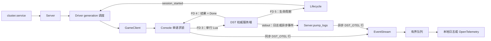
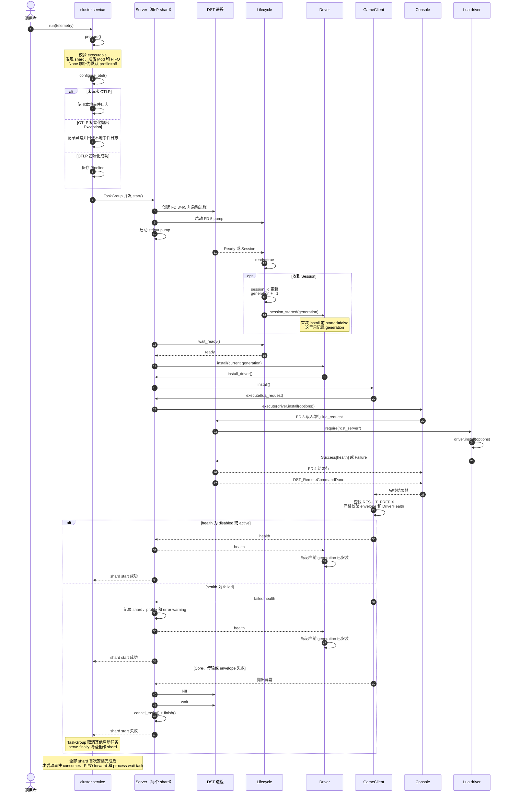
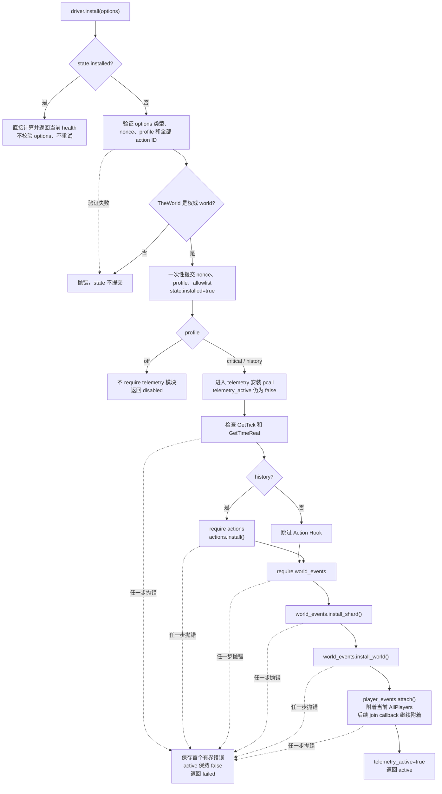
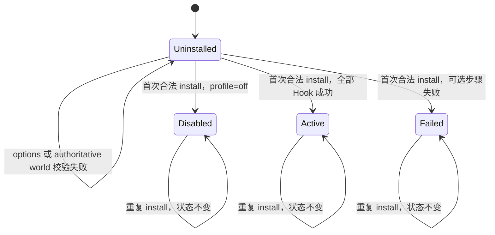
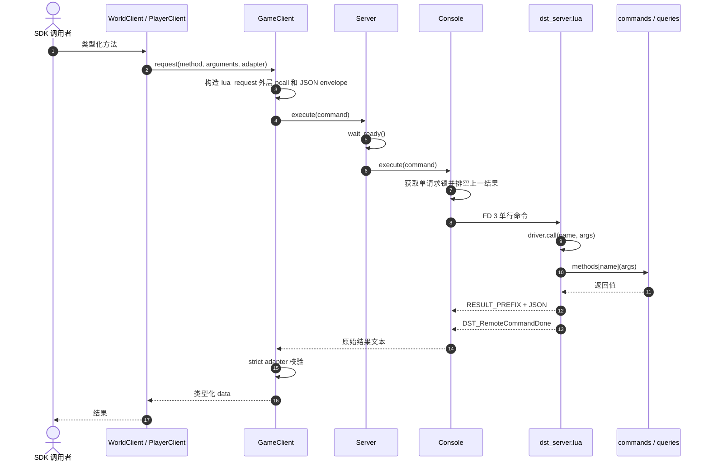
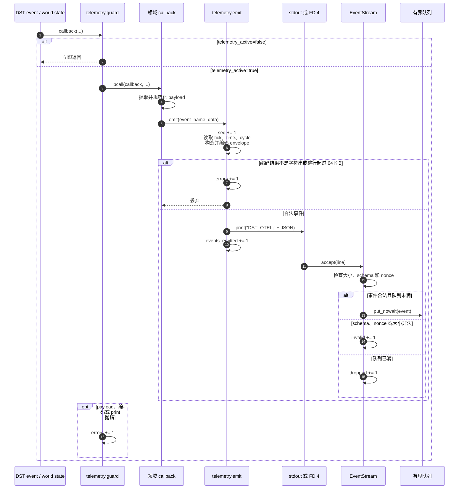
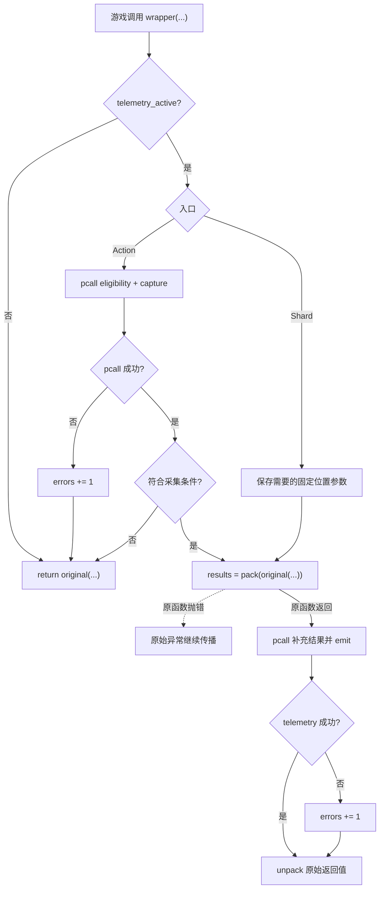

# Python SDK Telemetry Driver 关键时序

本文描述当前 Python supervisor、`-cloudserver` RPC、Lua management driver 和可选 telemetry 的真实调用链。

本文只解释已经实现的行为。

尚未解决的 reload-ready、物理 Hook 回滚、FD4 帧边界和总 deadline 仍按现状标出。

## 当前边界

- 每个 shard 启动时只执行一次同步 `driver.install(options)` RPC。
- 默认 profile 为 `off`，只安装 management RPC。
- `critical` 和 `history` 显式启用 Lua 游戏事件。
- Core、RPC、传输或 health envelope 失败会使首次启动失败并清理进程。
- 可选 telemetry 安装失败返回 `failed` health，只记录 warning，不阻止 shard ready。
- 同一 Lua generation 的重复 install 只返回当前 health，不改变配置或重试。
- 各 shard 拥有独立的 Lua state、health、nonce 和事件队列。

## 组件与通道

FD 3 和 FD 4 承担串行 management RPC。

FD 5 独立报告 Ready、Session、Saved 和 Stopping 等生命周期消息。

Lua telemetry 在同步命令期间产生的 `print` 进入 FD 4，在游戏异步回调中产生的 `print` 进入 stdout。

`Console.read_result()` 和 `Server.pump_logs()` 因此共用同一个 `EventStream.accept()` 入口。

## 集群启动与首次安装

`Server.start()` 成功表示进程已经报告 lifecycle ready，并且首次同步 driver install 已经返回合法 health。

一个 shard 的 telemetry `failed` 不会让启动 `TaskGroup` 抛错，因此其他 shard 可以保持 `active`。

Ready 可能早于 Session。

如果首次安装使用 generation 0，而 Session 稍后到达，`Driver` 会再调度一次后台 install。

OTLP 环境变量配置 Python OpenTelemetry pipeline 和事件 consumer，但不会改变传给 Lua 的 profile。

## Lua 首次 Install

所有参数都先写入局部变量，验证完成后才提交到 `state`。

`off` 分支不会加载 `actions`、`world_events`、`player_events` 或 `telemetry`。

`critical` 安装 shard wrapper、核心 world listeners、world-state watchers 和玩家生命周期 listeners。

`history` 在 `critical` 的基础上增加 Action Hook、种植事件和更完整的玩家事件。

Telemetry 安装从 `telemetry_active=false` 开始，只有最后一步成功后才切换为 `true`。

后续阶段失败时，已经注册的 wrapper 或 listener 可能物理残留，但所有现有入口都会在 inactive 时立即返回。

安装错误只保留第一条，控制字符会被替换，并按字节截断到 1024。

## Health 如何从 Lua State 得出

`disabled` 由 `requested_profile == "off"` 得出。

`active` 由非 `off` 且 `telemetry_active == true` 得出。

其余已提交的非 `off` 状态为 `failed`。

重复 install 返回重新计算的当前 health，因此运行期计数仍会变化。

运行期错误只增加 `errors`，不会把 `active` 自动切换为 `failed`。

Lua module state 被新 generation 重建后，状态重新从 `Uninstalled` 开始。

## 普通 Management RPC

`driver.call()` 只检查 core driver 是否已经 installed，不检查 telemetry status。

因此 `disabled` 和 `failed` 都可以继续执行 save、查询和其他 management RPC。

`Console.lock` 只保证 FD 3/4 的单请求串行，不是 reload 后的 driver-ready 屏障。

`DST_LuaBusy` 会让 `Console` 等待 0.1 秒后重发整条命令。

## Listener 和 Watcher 事件

`telemetry.emit()` 本身不检查 active，也不嵌套第二层 `pcall`。

当前所有 listener 和 watcher 都通过 `telemetry.guard()` 调用它，因此 callback、编码和输出异常仍被同一层边界捕获。

Action 和 shard 只会在 active 分支的 telemetry `pcall` 中调用它。

Python 事件队列的容量为 1024。

队列满时丢弃当前事件，不能阻塞日志读取或游戏进程。

`sequence` 在编码前增加，因此编码失败或事件过大时会留下序号间隙。

`events_emitted` 只表示 Lua 的 `print` 已经成功返回，不表示 Python 已经校验、入队或导出。

## Action 和 Shard Wrapper

Action wrapper 在调用原函数前采集输入快照，在原函数返回后补充 success 和 reason。

Shard wrapper 在调用原函数前保存需要的固定位置参数，在原函数返回后形成连接状态事件。

两个 wrapper 都把原函数调用放在 telemetry `pcall` 外，因此不会吞掉或改写游戏原始异常。

## 重复 Install 与 Reload

```mermaid
sequenceDiagram
    autonumber
    participant Process as DST / Lua runtime
    participant Lifecycle
    participant Driver
    participant Game as GameClient
    participant Server
    participant Console
    actor Caller as SDK 调用者

    Process-->>Lifecycle: FD 5 Session
    Lifecycle->>Lifecycle: session_id 更新<br/>generation += 1<br/>ready 保持 true
    Lifecycle->>Driver: session_started(new generation)
    Driver->>Driver: schedule(refresh)

    par 后台 reinstall
        Driver->>Game: install()
        Game->>Server: execute(lua_request)
        Server->>Console: driver.install RPC
        alt Lua state 已重建
            Console->>Process: 执行完整首次 install
        else Lua state 仍为 installed
            Console->>Process: 直接取得当前 health
        end
    and 调用者立即发起普通 RPC
        Caller->>Game: typed request()
        Game->>Server: execute(lua_request)
        Server->>Lifecycle: wait_ready()
        Lifecycle-->>Server: 旧 ready 立即通过
        Server->>Console: driver.call RPC
    end

    Note over Game,Console: 两条 RPC 仅由 Console.lock 排序<br/>请求路径不等待当前 installed_generation

    alt reinstall 成功或 telemetry 降级
        Game-->>Driver: health
        Driver->>Driver: installed_generation=new generation
    else core reinstall 失败
        Game--xDriver: Exception
        Driver->>Driver: 记录异常并清空 task<br/>不再 schedule
        Note over Driver,Caller: 失败不传播给调用者<br/>旧 health 仍可能可见<br/>在途合并的新 generation 也可能滞留
    end
```

同一 Lua generation 的重复 install 不重新验证 options，也不重试 telemetry。

Python generation 不会传给 Lua，Lua 只通过当前 `state.lua` 实例的 `installed` 判断是否已经安装。

新的 Session 只触发后台 `Driver.refresh()`。

`Lifecycle.ready` 不会在 reload 时清除，普通请求也不等待 `installed_generation == generation`。

因此 Console 单请求锁只能决定 reinstall 与普通 RPC 的先后顺序，不能保证普通 RPC 一定排在 reinstall 后面。

这是仍未解决的 [SDK-004](python-sdk-known-issues.md#sdk-004reload-后没有可靠的-driver-ready-屏障)。

`EventStream.nonce` 在整个 Python `Server` 生命周期内保持不变，当前事件 envelope 也不包含 Lua generation。

Reload 的 core reinstall 失败只记录异常，不会像首次启动失败那样自动回收进程。

如果新的 Session 在失败的 refresh 执行期间到达，`schedule()` 会因旧 task 仍存在而跳过。

失败收尾不会重新调度，因此更新后的 generation 可能一起滞留。

## 故障结果

| 失败位置 | 当前结果 | 是否影响游戏逻辑 |
| --- | --- | --- |
| Install options、权威 world、core module、RPC envelope 或传输 | 首次启动抛错并回收进程 | 游戏进程被 supervisor 终止 |
| 可选 module、clock 或 Hook 安装 | `failed` health、warning、shard 继续 ready | 否 |
| Listener payload、JSON 编码或 `print` | `errors += 1`，当前事件丢弃 | 否 |
| Action 或 shard telemetry | `errors += 1`，保留原函数结果 | 否 |
| 原始 Action 或 shard 函数 | 原始异常继续传播 | 与未安装 telemetry 时一致 |
| Python schema、nonce 或事件大小校验 | `invalid += 1`，事件丢弃 | 否 |
| Python 事件队列满 | `dropped += 1`，事件丢弃 | 否 |
| OTLP 初始化 | 回退本地结构化事件日志 | 否 |

## 仍未解决的相邻边界

- [SDK-002](python-sdk-known-issues.md#sdk-002fd4-超长行会破坏后续-rpc-帧边界) 仍可能让超长 FD4 行破坏后续 RPC 帧归属。
- [SDK-003](python-sdk-known-issues.md#sdk-003游戏事件可能被归入错误-session) 仍在消费时读取可变 session，可能错标异步事件。
- [SDK-004](python-sdk-known-issues.md#sdk-004reload-后没有可靠的-driver-ready-屏障) 仍缺少当前 generation 的 driver-ready 屏障。
- [SDK-005](python-sdk-known-issues.md#sdk-005lua-安装有副作用但不具备可安全重试性) 仍没有物理 Hook 回滚或安全 retry。
- [SDK-008](python-sdk-known-issues.md#sdk-008管理链路缺少总-deadline-和资源上限) 仍缺少启动与 RPC 总 deadline。

## 代码入口

| 责任 | 入口 |
| --- | --- |
| Cluster 配置、并发启动和事件 consumer | [`cluster/service.py`](../src/dst_server/cluster/service.py) |
| 进程、FD、首次安装和失败清理 | [`runtime/server.py`](../src/dst_server/runtime/server.py) |
| Generation 与后台 reinstall | [`runtime/driver.py`](../src/dst_server/runtime/driver.py) |
| FD 5 lifecycle 状态 | [`runtime/lifecycle.py`](../src/dst_server/runtime/lifecycle.py) |
| FD 3/4 串行命令和 framing | [`runtime/console.py`](../src/dst_server/runtime/console.py) |
| Install 与类型化 RPC | [`game/client.py`](../src/dst_server/game/client.py) |
| Lua envelope 与 health schema | [`game/rpc.py`](../src/dst_server/game/rpc.py) |
| Core driver install、health 和 dispatch | [`lua/dst_server.lua`](../src/dst_server/lua/dst_server.lua) |
| Listener 保护与事件编码 | [`lua/dst_server/telemetry.lua`](../src/dst_server/lua/dst_server/telemetry.lua) |
| Action wrapper | [`lua/dst_server/actions.lua`](../src/dst_server/lua/dst_server/actions.lua) |
| World、player 和 shard Hook | [`lua/dst_server/world_events.lua`](../src/dst_server/lua/dst_server/world_events.lua) |
| Player Hook 附着与事件 | [`lua/dst_server/player_events.lua`](../src/dst_server/lua/dst_server/player_events.lua) |
| Python 事件校验与有界队列 | [`telemetry/stream.py`](../src/dst_server/telemetry/stream.py) |
