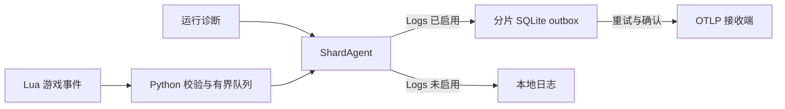

# 遥测与历史日志

DST 服务端 Lua 产生游戏事件，所属分片的 Python Agent 校验后写入本地日志或通过 OTLP/gRPC 导出。
游戏事件与运行诊断使用 OpenTelemetry Logs，管理操作使用 Traces，进程、玩家、动作和事件计数使用 Metrics。
部署入口见 [README](../README.md)，目录与配置见[配置指南](configuration.md)，进程与 RPC 生命周期见[运行时架构](runtime.md)。

## 选择采集范围

CLI 使用 `DST_SERVER_TELEMETRY_PROFILE`，默认值为 `critical`。
SDK 使用 `TelemetrySettings(profile=..., actions=...)`，通过 `ServerConfig.telemetry` 或 Agent 启动参数传入。

| Profile | 游戏事件 |
| --- | --- |
| `off` | 不安装游戏事件 Hook，保留管理 RPC |
| `critical` | 玩家生命周期、实体死亡、分片连接和关键世界状态变化 |
| `history` | 在 `critical` 基础上增加战斗、物品、玩家状态、种植和允许列表中的 Action 结果 |

`history` 的默认 Action 列表见 [config.py](../src/dst_server/telemetry/config.py)。
SDK 可用 `actions=()` 关闭 Action 包装，其他 `history` 事件仍然采集。
Profile 只控制 Lua 游戏事件，不关闭 Python 运行诊断、Metrics 或 Traces。

## 配置导出

容器镜像已包含 OTLP 依赖，独立安装 SDK 时使用 `uv pip install 'dst-server[otel]'`。
Agent 在设置任一 `OTEL_EXPORTER_OTLP_ENDPOINT` 或对应的 `LOGS_ENDPOINT`、`METRICS_ENDPOINT`、`TRACES_ENDPOINT` 后初始化导出。
`OTEL_SDK_DISABLED=true` 阻止 Agent 初始化导出，但不改变游戏事件 Profile。
`OTEL_LOGS_EXPORTER`、`OTEL_METRICS_EXPORTER` 和 `OTEL_TRACES_EXPORTER` 仅接受 `otlp` 或 `none`，未设置时默认为 `otlp`。
Endpoint、headers、证书、压缩和超时由标准 `OTEL_EXPORTER_OTLP_*` 环境变量配置，传输使用 gRPC。

仓库的同机 Netdata 示例仅导出 Logs，对应 Quadlet 的 `[Container]` 配置如下。

```ini
Environment=DST_SERVER_TELEMETRY_PROFILE=history
Environment=OTEL_EXPORTER_OTLP_LOGS_ENDPOINT=http://10.255.255.254:4317
Environment=OTEL_METRICS_EXPORTER=none
Environment=OTEL_TRACES_EXPORTER=none
```

修改生成后的 `.container` 文件，再按 [README](../README.md) 重新加载并重启对应服务。
宿主 shell 中的 `export` 不会覆盖已有容器的环境变量。
`scripts.generate_rooms` 为生成容器配置同机 Netdata endpoint，并按房间类型选择 Profile。
直接使用 `QuadletApplication.for_cluster()` 时，通过 `telemetry_environment` 显式传入环境变量映射。
未配置 OTLP，或将 `OTEL_LOGS_EXPORTER=none` 时，游戏事件仍以 `DST_EVENT|...` 写入本地日志并发布到实时订阅。
显式启用导出后，依赖缺失、初始化失败或持久化写入失败会使 Agent 报错退出，不会自动回退到本地日志。

## 数据与交付边界



游戏事件的字段定义见 [events](../src/dst_server/events)，运行诊断白名单见 [operational.py](../src/dst_server/runtime/operational.py)。
`spawned` 表示新角色生成，此时尚未完成出生定位，位置为 `null`；进入分片另由 `shard_entered` 表达。
`incident` 在玩家进入原版落水或坠落状态时记录，仅保留玩家和事故类型；进食同时覆盖普通食物与 Wortox 灵魂。
运行诊断包括进程与生命周期状态，以及已识别的 Lua、Mod、网络和鉴权故障类别，不直接转发任意 stdout 正文。
Python 严格校验事件类型、字段、UTF-8 和当前进程尝试标识，完整事件行上限为 64 KiB。
合法事件进入容量为 1,024 的队列，队列满时等待空间，关闭时保留已入队记录供消费。
输入取消或关闭前尚未入队的记录计入 `telemetry_dropped`，校验拒绝计入 `telemetry_invalid`。

每个分片的 outbox 位于持久化分片目录，标准容器路径为 `/cluster/<shard>/.telemetry.sqlite3`。
Logs 在 SQLite `synchronous=FULL` 提交后才算持久化；游戏事件随后才发布给实时 RPC 订阅。
Metrics、Traces 和 RPC 实时订阅不经过 outbox，也不提供这项持久交付保证。
临时导出失败独立重试，网络中断期间仍可继续写入 outbox，容器重启后恢复未确认记录。
重放保留原始时间、资源属性和 UID，接收端确认成功后才删除对应记录。
永久错误或部分拒收会隔离整个批次，保留原始内容且不阻塞后续批次；隔离记录不会自动重发。

默认容量为 256 MiB 的 payload，积压与隔离记录共同计入，SQLite 页和 WAL 另占磁盘空间。
容量耗尽会拒绝新写入并导致 Agent 失败，不淘汰未确认历史；数据库损坏或 schema 不匹配也会保留文件并报错。
交付保证从成功提交 outbox 开始，语义为至少一次，提交前的进程崩溃仍可能丢失事件。
接收成功但确认丢失时可能重复交付，游戏事件的 `log.record.uid` 使用 `nonce:generation:seq` 辨认重复，不能假定后端自动去重。
Lua `events_emitted` 是当前 Lua VM 已分配输出序号的高水位，序号在调用原生日志出口前分配。
输出回调失败可能留下缺号；该值不代表 Python 已校验、落盘或送达。

## 混合日志与 Journald

游戏 stdout 与 stderr 在创建子进程时合流，由 Python pipe 读取，并不直接交给 journald。
FD 3 的命令输入、FD 4 的命令响应和 FD 5 的生命周期仍是独立通道。
stdout 中出现这些通道的标记不会完成命令、推进 Session 或确认保存。
合流后无法恢复一行原本来自 stdout 还是 stderr；普通日志统一经 Agent 的日志出口转发。
运行诊断的严重程度来自明确签名和进程退出结果，不根据任意 `ERROR`、`PANIC` 或堆栈文本推断崩溃。

事件识别只接受行首 `DST_OTEL|`，之前可带原生时间戳，随后校验大小、UTF-8、schema 和当前进程 nonce。
聊天、源码位置或错误正文中嵌入该标记仍是普通日志；已识别但不合法的事件只计数并按原因限次警告，不回显 payload。
nonce 用于关联进程尝试，不是对同一 Lua VM 内 Mod 的身份认证。
如果任意输出恰好构成完整合法事件且带有当前 nonce，仅凭这条合流文本无法辨别它的作者。
分块读取不会破坏 UTF-8，但不同写入者把字节交错到同一物理行后，不保证能恢复事件。
已识别的损坏事件行会被拒绝，未识别的片段按普通日志保留，后续完整行继续处理。
底层子进程 reader 的物理行上限为 1 MiB；超过上限会整行丢弃，不进入事件校验，不计入 `telemetry_invalid`。

标准 CLI 将 Agent 日志写入容器 stdout；使用 Podman 的 journald 驱动时，由 conmon 送入 journal。
所以 journal 仍包含普通游戏日志和 Agent 日志，不能视为只有运行状态摘要的输出。

| 输入或配置 | 本地日志 / journald 内容 |
| --- | --- |
| 输入上限以内的普通日志、未知报错、堆栈 | 保留文本；已识别的运行诊断也保留其原始日志 |
| 合法 `DST_OTEL` 事件，OTLP Logs 已启用 | 原始事件行被消费，事件写入 outbox，不再重复写本地事件日志 |
| 合法事件，OTLP Logs 未启用 | 生成 `DST_EVENT\|...` 本地回退日志；高频事件仍会增加 journal 体积 |
| 已识别但校验失败的事件 | 通用拒绝警告，不包含损坏的事件正文 |
| 普通文本中嵌入 `DST_OTEL` | 随普通日志保留，不能仅凭 journal 中出现该字样判断事件泄漏 |
| 原生 `DST_Stats` | 在输入端丢弃 |

[conmon 日志实现][conmon-logging] 按 LF 处理容器输出并调用 `sd_journal_sendv`，长行可能附带部分消息标记。
不能把 systemd 直接收集服务 stdout 时的拆行规则一概套到该路径，也不能从 journal 优先级恢复已合并的游戏 stderr。

## 编码与边界测试

结构化事件和类型化 RPC 对非法 UTF-8 报错，不猜测原始编码；普通日志用 U+FFFD 替换非法字节并继续转发。
损坏编码包括孤立续字节、过长编码、截断序列、代理码点、超出 Unicode 范围的值及混入二进制字节。
合法的组合字符、ZWJ、变体选择符、方向控制符和私用区字符都保留，不做 Unicode 规范化或不可见字符清理。
这一区分符合 [Unicode 对非法序列的说明][unicode-utf8]；字体不能显示某个字符不代表编码无效。

游戏的 [emoji_items.lua](../dst-scripts/scripts/emoji_items.lua) 使用 U+F0001（beefalo）、U+F001C（abigail）等合法私用区字符。
玩家名和完整返回字段按原值传输；显式限制长度的文本字段截取完整 UTF-8 码点，不保证保留完整组合字形。
因此受限文本仍可能截在 ZWJ Emoji 或组合字符之间，显示结果取决于字体与渲染器。
物理行边界只使用 LF；NEL、U+2028、U+2029 不应被 Python 文本拆行误当成多条协议记录。
NUL 在 SDK 普通日志出口保留，实际 journal 工具的转义、字体和终端显示不属于 SDK 字符串保真保证。

[混合流测试](../tests/test_operational.py) 将下列九组语料与三种时间前缀、三种换行结尾、两种读取分块及三种事件损坏方式交叉，共 486 个组合。
每组同时放入正常事件、聊天中的协议标记、非法字节、游戏 Emoji、其他 FD 的标记与统计行，检查原始日志、诊断白名单和后续事件恢复。
SteamCMD 和监督进程的文字只作为相似输出负例，不表示它们实际使用游戏 pipe。

| 语料组 | 来源与分类边界 |
| --- | --- |
| Lua / Mod traceback | [原始报错][lua-error]；只对已知 header 生成诊断，不逐帧重复分类 |
| 缺少可选 Mod 文件 | [mods.lua](../dst-scripts/scripts/mods.lua) 的成功跳过分支，不是加载失败 |
| 游戏 Workshop 超时 | [原始报错][game-workshop]；区别于 SteamCMD 下载进程 |
| SteamCMD 超时 | [原始报错][steamcmd-timeout]；在游戏分类器中保留为普通日志 |
| Worldgen 重试与放弃 | [原始报错][worldgen-error]及 [worldgen_main.lua](../dst-scripts/scripts/worldgen_main.lua)；重试不等于退出 |
| Steam SDK 失败 / 段错误 | [原始报错][native-error]；以进程返回码或信号确认退出 |
| 缺少共享库 | [原始记录][loader-error]；动态加载器在 Lua 启动前产生的 stderr |
| 鉴权与 DNS | [token 报错][token-error]、[DNS 报错][dns-error]；保留旧格式，另按当前原生格式构造 CURL 诊断样例 |
| bind 端口尝试失败 | [原始报错][bind-error]；单次端口失败不证明最终启动失败 |

语料只保留短签名并替换本地 Mod 名，不使用真实玩家数据，历史帖子不用于推断当前版本的根因。
[事件解析测试](../tests/test_stream.py) 另外组合前缀、字节/字符串、schema、nonce、64 KiB 上限及非法编码。
其中 Lua 测试执行游戏原有 `debugprint.lua`、`stacktrace.lua`，交叉 `print` / `nolineprint`、`PRINT_SOURCE` 和日志/错误/事件的六种顺序。
[RPC 测试](../tests/test_rpc.py) 验证玩家名、特殊 Unicode 和每个截断预算；[CLI 测试](../tests/test_telemetry_integration.py) 验证本地日志与 OTLP Logs 分流。
这些测试覆盖 SDK 与 CLI 输出；真实 journald 存储和终端渲染需另做部署环境验证。

[conmon-logging]: https://github.com/containers/conmon/blob/44136f533e0bbb6810f3b5272273e1c932d980f4/src/ctr_logging.c
[unicode-utf8]: https://unicode.org/faq/utf_bom.html
[lua-error]: https://steamcommunity.com/app/322330/discussions/0/610573009235763156/
[game-workshop]: https://steamcommunity.com/workshop/filedetails/discussion/3490072866/599653921546396863/#c599658601187030609
[steamcmd-timeout]: https://discourse.cubecoders.com/t/customization-with-application-deployment-steamcmd-mods-timeout/24828
[worldgen-error]: https://steamcommunity.com/app/322330/discussions/0/2968393780771713862/#c2968393780771779261
[native-error]: https://steamcommunity.com/app/322330/discussions/0/351659808477347616/
[loader-error]: https://prinsss.github.io/deploy-dont-starve-together-dedicated-server/
[token-error]: https://steamcommunity.com/app/322330/discussions/0/3051633726587393889/#c3051633726589638324
[dns-error]: https://forums.kleientertainment.com/forums/topic/72877-curl-error-lobbyckleientertainmentcom-could-not-resolve-host-lobbyckleientertainmentcom-unknown-error/
[bind-error]: https://steamcommunity.com/app/322330/discussions/0/2564160288793879918/#c2564160288793897483

## 同机 Netdata 与查询

仓库的 [otel.yaml](../deploy/netdata/otel.yaml) 将 gRPC listener 绑定到 `10.255.255.254:4317`，日志存储设为 `/srv/otel`。
[networkd 配置](../deploy/networkd/10-netdata-loopback.network) 将专用地址添加到 loopback，[systemd drop-in](../deploy/netdata/netdata.service.d/dependencies.conf) 等待网络与存储挂载。
这些是部署配置文件，需安装到宿主机对应位置并启动 Netdata 后生效。
示例接收端允许九年内的积压日志，保留上限同时受九年、1 TB 和 500,000 个文件约束，不保证每条记录保存九年。
专用地址不提供身份认证；需要跨主机或隔离不可信容器时，应配置 TLS、鉴权和网络访问控制。

宿主机可用 `NetdataLogs` 查询日志，默认执行 `/usr/lib/netdata/plugins.d/otel-plugin` 并读取 `/etc/netdata/otel.yaml`。
查询进程必须有权执行插件、读取 Netdata 配置和日志存储；此接口不属于房间 Cluster RPC。

```python
import asyncio
from datetime import UTC, datetime, timedelta

from dst_server.netdata import NetdataLogQuery, NetdataLogs


async def main():
    result = await NetdataLogs().query(
        NetdataLogQuery(
            since=datetime.now(UTC) - timedelta(minutes=15),
            filters=(("attributes.dst.cluster.name", "dst-000"),),
            limit=100,
        )
    )
    print(result.records)
    print(result.diagnostics)


asyncio.run(main())
```

时间必须带时区，并会规范化为 UTC 整秒；过滤字段使用精确匹配，例如 `body.player.userid`。
结果字段保留为有序键值对以容纳重复字段，`diagnostics` 保留查询警告。
查询仅返回时间窗口内最新的有限条记录，不提供游标分页或完整历史遍历。

## 故障排查

调用 `await cluster.shard(name).status()` 获取分片状态。
其中 `driver_health`、`driver_error` 描述驱动，`telemetry_invalid`、`telemetry_dropped` 和 `telemetry_delivery` 描述事件处理与交付。
`await cluster.shard(name).health()` 主动查询当前 Lua driver；连接示例见 [README](../README.md)。

| 观察结果 | 含义与处理 |
| --- | --- |
| `driver_health.telemetry_status=disabled` | Profile 为 `off`，需要游戏事件时修改配置并重启服务 |
| `active` | Hook 已安装，仅说明采集端状态，继续检查交付状态 |
| `degraded` / `failed` | 回调曾出错 / 安装失败，查看 `last_error` 与 `errors`；同一 Lua module state 安装失败后不会自动重试 |
| `telemetry_invalid` / `telemetry_dropped` 增长 | 查看日志中的编码、大小、schema、nonce 或关闭相关拒绝原因，并核对当前驱动与事件定义 |
| `telemetry_delivery.pending` 增长 | 查看 `last_error`，检查接收端可达性、TLS、凭据和磁盘空间 |
| `telemetry_delivery.quarantined` 非零 | 接收端永久拒绝或部分拒收，先修复接收条件并保留数据库；当前没有隔离记录管理 CLI |
| `storage_*` 错误或 Agent 无法启动 | 检查目录权限、磁盘、容量和数据库占用；单个 outbox 只能有一个写入进程 |

`telemetry_delivery.bytes` 是 payload 用量；`last_error` 使用错误类别，不返回任意接收端错误正文。
`telemetry_delivery=None` 表示未建立 pipeline，已建立但关闭 Logs 的 pipeline 可返回全零状态。
分片 `ready` 与管理 RPC 可用不代表遥测健康，Mod 故障另见 [Mod 管理](mods.md)。

## 数据访问范围

事件可能包含玩家 `userid`、实体信息、坐标、动作与物品历史，本地日志和 outbox 都应按相同敏感程度管理。
采集器不专门采集聊天正文、console 命令、密码或 token，但不会对所有字符串自动脱敏。
例如 `history` 的 Action `reason` 保留动作或 Mod 返回的受限长度文本，可能包含其写入的敏感内容。
关闭 OTLP 不会删除本地事件日志，切换 Profile 也不会删除已持久化的历史。
